### 约公元前 12000 年~ 约公元前 7000 年

- 新石器时代早期，陶器在中国境内出现。
  这一时期的部分遗址中还出现了农作物栽
  培的痕迹。

### 约公元前 7000 年

1. 新石器时代中期，澧阳平原的彭头山文化、东北地区的小河西文化、浦阳江流域的上山文化以及中原地区的贾湖文化相继兴起。

2. 在彭头山文化、上山文化、贾湖文化遗址中，均发现了稻作遗存，其中贾湖文化遗址还出土了带契刻符号的龟甲、骨笛。

### 约公元前 6000 年

1. 东北地区的兴隆洼文化（可能由小河西文
   化发展而来）兴起，其遗址中出土了迄今
   中国最古老的玉器。

2. 继上山文化之后，浙江地区的跨湖桥文化
   兴起，遗址中有迄今中国最古老的独木舟
   遗迹。

3. 渭河流域的大地湾文化、中原地区的裴李
   岗文化（可能由贾湖文化发展而来)兴起
   ，以农业经济为主导的村落社会雏形已经
   形成。

### 约公元前 5300 年

1. 北辛文化兴起，海岱地区的原始农业初具
   规模。
2. 继兴隆洼文化之后，赵宝沟文化在辽西地
   区取得支配地位。

### 约公元前 5000 年

1. 新石器时代晚期，由大地湾文化演变而来
   的仰韶文化半坡类型兴起，彩陶文化圈迅
   速扩张，遍及中原地区。
2. 在长江下游地区，河姆渡文化、马家浜文
   化兴起，骨耜等农具得到广泛应用。

### 约公元前 4300 年

1. 北辛文化演变为大汶口文化。
2. 热河地区的红山文化兴起。
3. 长江中游地区的大溪文化兴起，早期城市
   出现(澧县城头山古城遗址)。

### 约公元前 4000 年

1. 仰韶文化庙底沟类型取代半坡类型。
2. 马家浜文化发展为崧泽文化。

### 约公元前 3800 年

- 仰韶文化向西发展，演变为马家窑文化

### 约公元前 3500 年

1. 仰韶文化后期，进入铜石并用时代。
2. 安徽舍山凌家滩文化遗址发现大型祭坛、
   大型貴族墓葬以及璋、璧、琮、璜等玉礼
   器，早期国家雏形出现。

### 约公元前 3500 年

1. 良渚文化取代崧泽文化。
2. 屈家岭文化兴起，长江中游的稻作农业进
   步繁荣。

### 约公元前 3000 年

1. 屈家岭文化繁荣，出现大规模城址群。
2. 良渚古城宫殿、外围水利工程始建。
3. 红山文化消亡，与之有一定传承关系的小
   河沿文化在西辽河流城兴起。

### 约公元前 2900 年

- 大汶口文化、屈家岭文化对仰韶晚期的影
  响促成了庙底沟二期文化的形成。

### 约公元前 2700 年

- 宝墩文化兴起，成都平原出现城址群。

### 约公元前 2500 年

1. 良渚达到极盛。
2. 屈家岭文化发展为石家河文化。
3. 中原地区进入“龙山时期” 。

### 约公元前 2300 年

1. 良渚文化消亡。
2. 陕西石峁古城始建。

---

# 夏朝

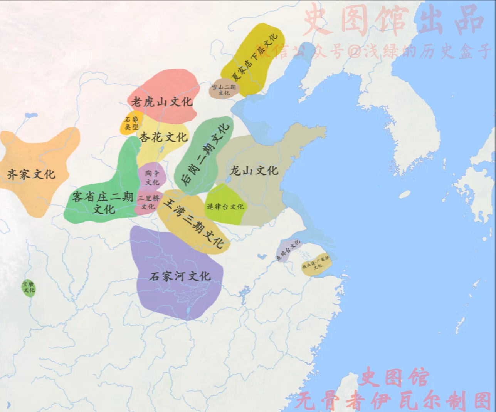

### 约公元前 2070 年

1. 根据《古本竹书纪年》等史书推定的夏代
   起始年。
2. 有观点认为王湾三期文化(河南龙山文化
   )后期即夏代早期文化。也有观点将山西
   陶寺文化后期视为夏代早期文化。

### 约公元前 2000 年

- 石家河文化消亡，长江流城的城邦文明衰
  落。

### 约公元前 1900 年

1. “龙山时期”结束，河南新密新砦古城始
   建。新砦遗址年代介于河南龙山文化和二
   里头文化之间，因此考古学称之为“新砦
   期文化’
2. 有观点将“新砦期文化”视为史书中记载
   的“太康失国”到“少康中兴”期间的夏
   代。

### 约公元前 1800 年

- 石峁古城废弃。

### 约公元前 1750 年

- 二里头文化兴起，偃师二里头遗址被- -部
  分学者视为史书中记载的夏都斟那。

### 约公元前 1680 年

- 二里头文化二期，下七垣文化(先商文化
  )兴起。

### 约公元前 1600 年

- 漳河型下七垣文化(先商文化)南下。

---

# 商

    玄鸟 诗经商颂--天命玄鸟，降而生商，宅殷土茫茫。

### 约公元前 1510 年

- 二里岗文化早期一段，对应史书中商汤灭
  夏之后的商代初期。此阶段早商文化主要
  分布在河南省中西部的郑州、伊洛一线，
  兼及晋西南和陕西的关中东部地区。

### 约公元前 1500 年

- - 早商文化向南扩张，抵达长江流城(黄陂
    盘龙城遗址、岳阳铜鼓山遗址)。

### 约公元前 1465 年

- 二里岗文化早期二段，早商文化达到极盛

### 约公元前 1415 年

- 二里岗文化晚期一段，商文化向外扩张的
  势头有所减弱。史书记载这一时期发生了
  铣人、邳人的叛乱。

### 约公兀前 1350 年

- 考古表明，盘龙城遗址约于此时废弃，商
  文化在长江流域的影响力消退。这或许与
  史书记载的“ 九世之乱”有关。

### 公元前 1300 年--商盘庚元年

- 盘庚迁都于殷。

### 公元前 1228 年--商武丁三十二年

- 武丁伐鬼方。

### 公元前 1201 年--商武丁五十九年

- 武丁中兴。

### 公元前 1189 年--商祖甲元年

- 祖甲改制。

|    公元时间    | 商时           | 周时           |                事件                |
| :------------: | :------------- | :------------- | :--------------------------------: |
| 公元前 1144 年 | 商武乙元年     | 周古公亶父元年 |       古公亶父率领周人迁于岐       |
| 公元前 1121 年 | 商武乙二十四年 | 周王季三年     |             周王季灭程             |
| 公元前 1115 年 | 商武乙三十年   | 周王季九年     |            周王季伐义梁            |
| 公元前 1110 年 | 商武乙三十五年 | 周王季十四年   |   周王季伐西落鬼戎，俘其二十翟王   |
| 公元前 1108 年 | 商文丁二年     | 周王季十六年   |       周王季伐燕京之戎，大败       |
| 公元前 1106 年 | 商文丁四年     | 周王季十八年   | 周王季伐余无之戎，文丁命王季为牧师 |
| 公元前 1103 年 | 商文丁七年     | 周王季二十一年 |          周王季伐始呼之戎          |
| 公元前 1099 年 | 商文丁十一年   | 周王季二十五年 |  周王季伐翳徒之戎，赴殷进献战俘。  |
|                |                |                |             文丁杀王季             |
| 公元前 1095 年 | 商帝乙二年     | 周文王四年     |              周人伐商              |
| 公元前 1087 年 | 商帝乙十年     | 周文王十二年   |             帝乙征盂方             |
| 公元前 1066 年 | 商帝辛十年     | 周文王三十三年 |             帝辛征人方             |
| 公元前 1061 年 | 商帝辛十五年   | 周文王三十八年 |            帝辛再征人方            |
| 公元前 1057 年 | 商帝辛十九年   | 周文王四十二年 |         周文王断虞、芮之讼         |
| 公元前 1056 年 | 商帝辛二十年   | 周文王四十三年 |            周文王伐犬戎            |
| 公元前 1055 年 | 商帝辛二十一年 | 周文王四十四年 |            周文王伐密须            |
| 公元前 1054 年 | 商帝辛二十二年 | 周文王四十五年 |             周文王伐黎             |
| 公元前 1053 年 | 商帝辛二十三年 | 周文王四十六年 |             周文王伐邘             |
| 公元前 1052 年 | 商帝辛二十四年 | 周文王四十七年 |        周文王伐崇。周筑丰邑        |
| 公元前 1050 年 | 商帝辛二十六年 | 周文王四十九年 |           周文王迁都于丰           |

### 公元前 1049 年--商帝辛二十七年/周文王五十年

1. 周文王崩，武王继位。
2. 周武王观兵于盟津。

### 公元前 1046 年--商帝辛三十年/周武王三年

1. 牧野之战，周师克商。
2. 帝辛自焚，商朝灭亡。
3. 周武王封帝辛之子武庚于殷商故地，延续商朝祭祀。

---

---

# 周

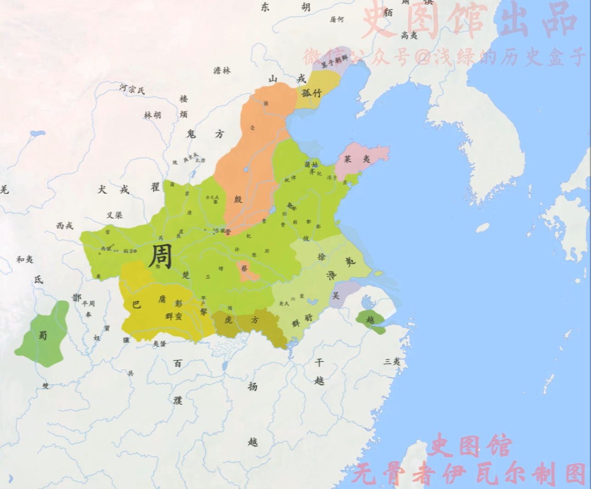

    文王 诗经大雅--文王在上，于昭于天。周虽旧邦，其命维新。

### 公元前 1045 年--周武王四年

1. 殷商贵族箕子被周武王释放后，率领一部
   分殷商遺民向北迁徙，建立箕子朝鲜。
   (注:辽西地区有带“其侯”铭文的青铜
   器出土，早期箕子朝鲜或在辽西大凌河流
   域。)
2. 武王崩，成王年幼，周公摄政。

---

## 周成王

### 宅兹中国

- "宅兹中国"出自西周国宝级青铜器何尊铭文，铭文记述了周成王继承周武王遗志，营建成周(今洛阳)之事。而铭文中的“宅兹中国”是“中国”一词迄今发现的最早来源。
- 中国，3000 年前被镌刻于方寸之间，深埋于地下。3000 年后，埋藏它的泥土和这泥土连接的 1045 万平方公里的土地，都被它命名，叫做：中国。

#### 公元前 1044 年--周成王元年

- 武庚、管叔、蔡叔叛乱。

#### 公元前 1043 年--周成王二年

- 奄人、徐人、淮夷叛乱，周公东征。

#### 公元前 1042 年--周成王三年

1. 周公平定武庚叛乱，诛杀管叔鲜，流放蔡
   叔度。
2. 周灭蒲姑。

#### 公元前 1041 年--周成王四年

- 周公伐淮夷，灭奄。

#### 公元前 1040 年--周成王五年

1. 周公迁殷民于洛邑。
2. 鲁、燕、卫、宋受封。

---

## 周康王

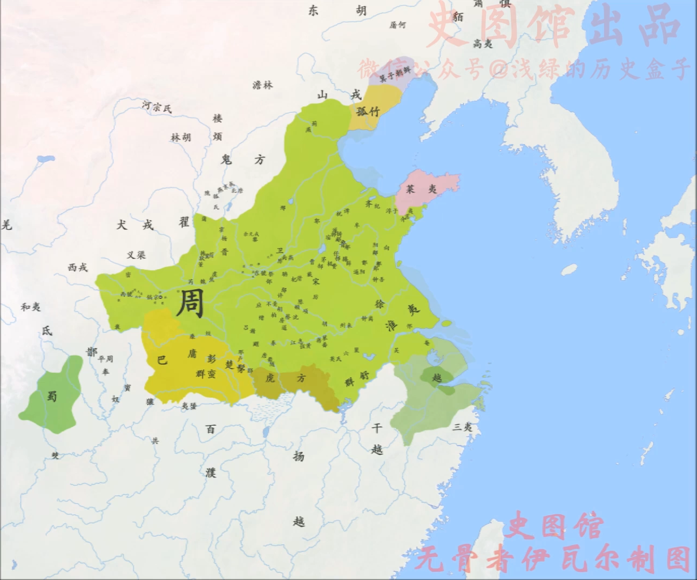

#### 公元前 1007 年--周康王元年

- 成康之治。

#### 公元前 983 年--周康王二十五年

- 周康王伐鬼方。

---

## 周昭王

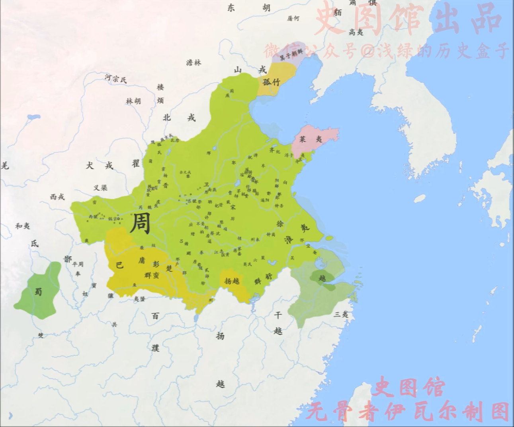

#### 公元前 967 年--周昭王十六年

- 周昭王南征。

#### 公元前 964 年--周昭王十九年

1. 周昭王再次南征。
2. 周昭王溺死于汉水。

---

## 周穆王

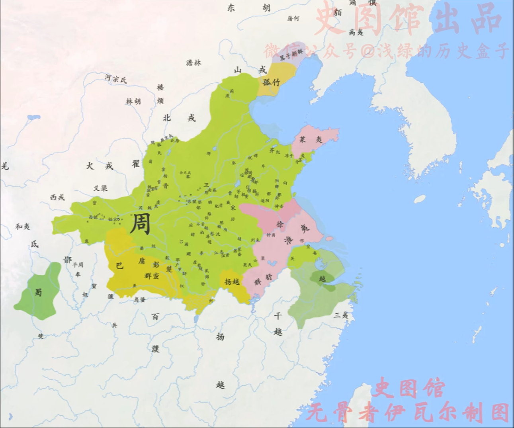

#### 公元前 951 年--周穆王十三年

- 周穆王西征犬戎，徐偃王率淮夷伐周。

#### 公元前 950 年--周穆王十四年

- 周穆王伐徐。

#### 公元前 927 年--周穆王三十七年

- 周穆王伐越，东至九江。

---

## 周共王

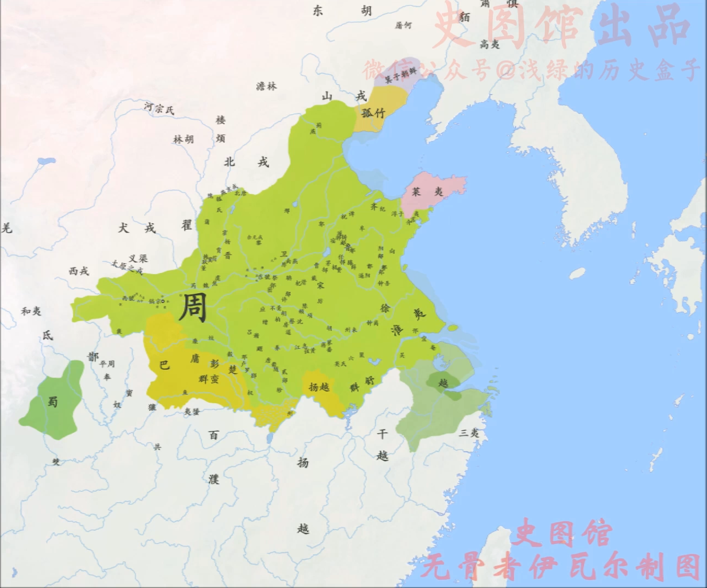

#### 公元前 919 年--周共王四年

- 周共王灭密。

---

## 周懿王

#### 公元前 899 年--周懿王元年

- 周室始衰。

#### 公元前 885 年--周懿王十五年

- 周懿王自宗周迁于犬丘。

#### 公元前 879 年--周懿王二十一年

- 號公北伐犬戎，大败。

---

## 周孝王

#### 公元前 875 年--周孝王元年

1. 周懿王崩，其叔辟方夺位，是为周孝王。
2. 孝王将都城迁回镐京。
3. 申侯伐西戎。
4. 秦非子被封为附庸。

---

## 周夷王

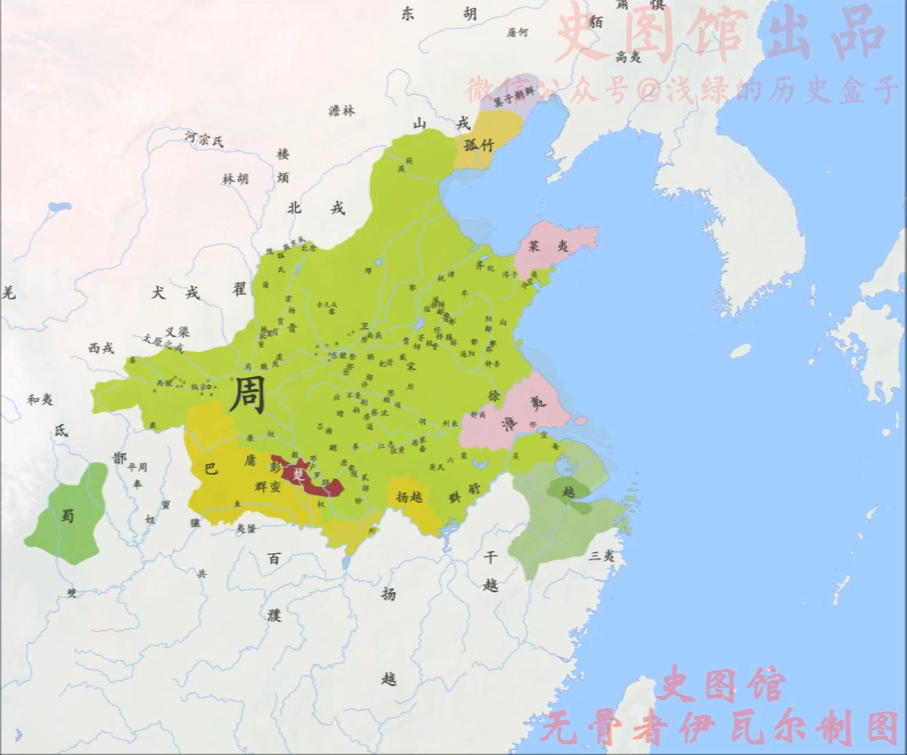

#### 公元前 863 年--周夷王七年

1. 周夷王命虢公伐太原之戎，获马千匹。
2. 楚子熊渠僭号，封其三子为王。楚人西征
   庸国，东伐扬越。

---

## 周厉王

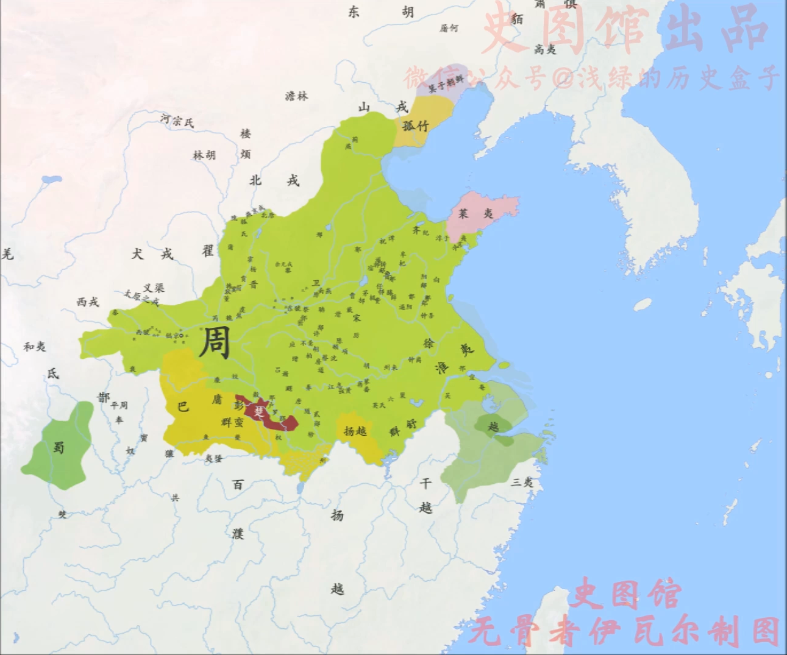

#### 公元前 855 年--周厉王三年

- 周厉王伐淮夷。

---

## 共和

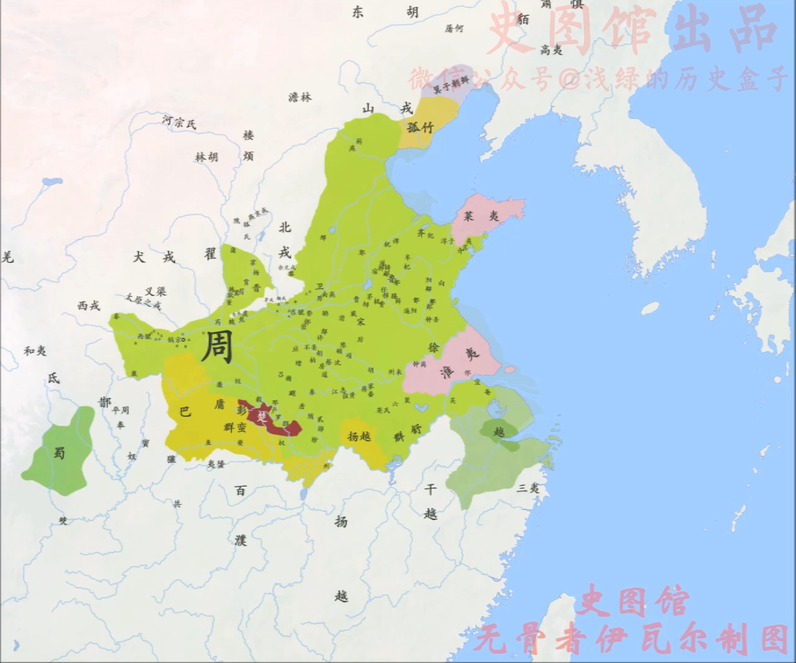

#### 公元前 841 年--共和元年

1. 国人暴动，周厉王出奔彘地。
2. 共伯和(共国国君，名和)代理政事。
   (注:此处依照《清华简.系年》《古本
   竹书纪年》的记载，不采用《史记》。周
   、召二公共和行政”的说法。)
3. 周厉王末年以来，戎狄大规模入侵周朝，
   西犬丘一带的大骆之族被西戎灭亡。

#### 公元前 828 年--共和十四年

- 周厉王在彘地去世，召穆公拥立厉王的太
  子静即位，是为周宣王。共伯和代理政事
  结束。

---

## 周宣王

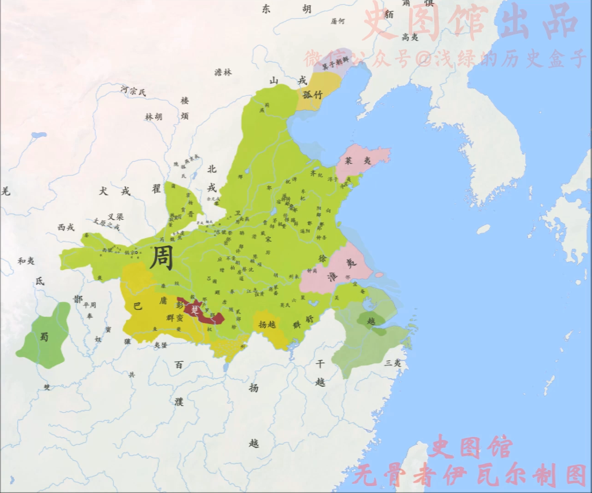

#### 公元前 824 年--周宣王四年

- 秦仲伐西戎。

#### 公元前 823 年--周宣王五年

- 周宣王派遣方叔率军伐楚。

#### 公元前 822 年--周宣王六年

1. 周宣王伐淮夷。
2. 西戎杀秦仲。
3. 楚子熊霜去世，楚国内乱。

#### 公元前 816 年--周宣王十二年

1. 周宣王命虢宣公伐犬戎。
2. 周宣王迫使鲁武公废长立幼。
3. 齐人弑齐厉公。

#### 公元前 802 年--周宣王二十六年

- 晋穆侯伐千亩之戒。

#### 公元前 797 年--周宣王三十一年

- 周宣王伐太原之戎。

#### 公元前 792 年--周宣王三十六年

- 周宣王伐条戎、奔戎，王师大败。

#### 公元前 790 年--周宣王三十八年

- 晋穆侯大破北戎于汾隰，戎人灭姜候之邑

#### 公元前 789 年--周宣王三十九年

- 周宣王伐姜戎，战于千亩，王师大败。

---

## 周幽王

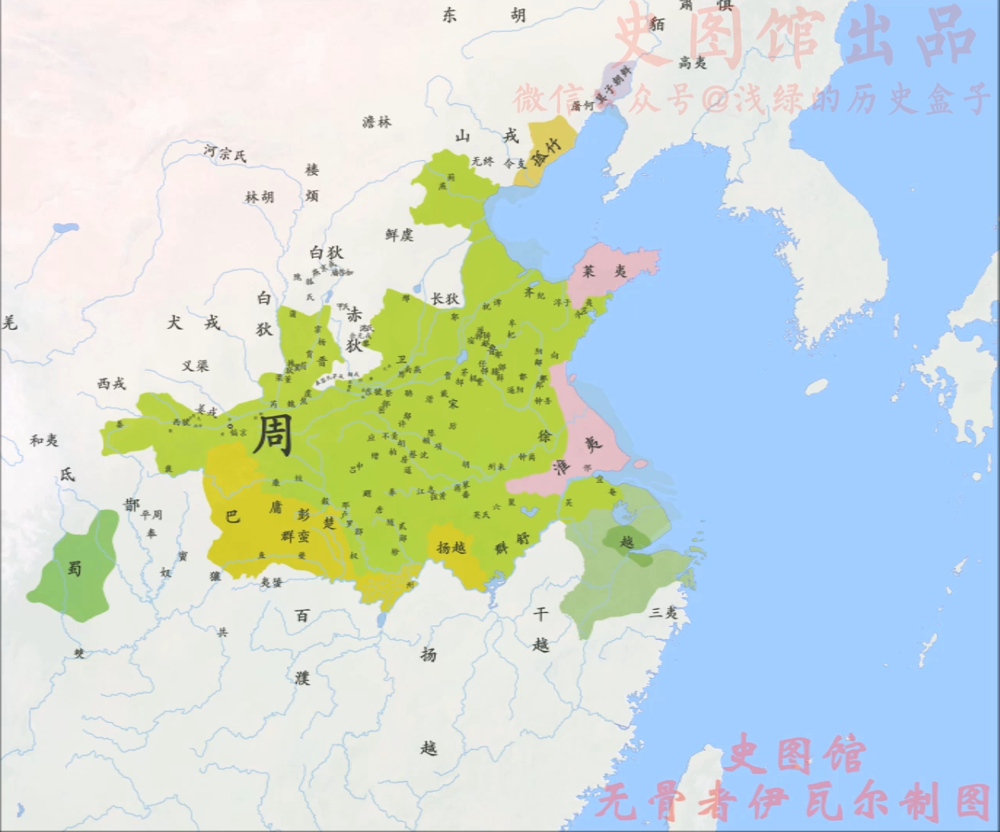

#### 公元前 779 年--周幽王三年

1. 周幽王宠褒奴。
2. 伯士伐六济之戎，大败。

#### 公元前 776 年--周幽王六年

- 西戎围西犬丘，秦襄公迁居汧(qian)。

#### 公元前 774 年--周幽王八年

1. 周幽王废太子宜白，太子宜臼出奔西申。
2. 幽王立伯服(褒奴所生)为太子。
3. 郑桓公东迁。

#### 公元前 772 年--周幽王十年

- 周幽王伐西申。

#### 公元前 771 年--周幽王十一年

- 犬戎攻陷镐京，杀周幽王、太子伯服。

---

---

# 东周-春秋

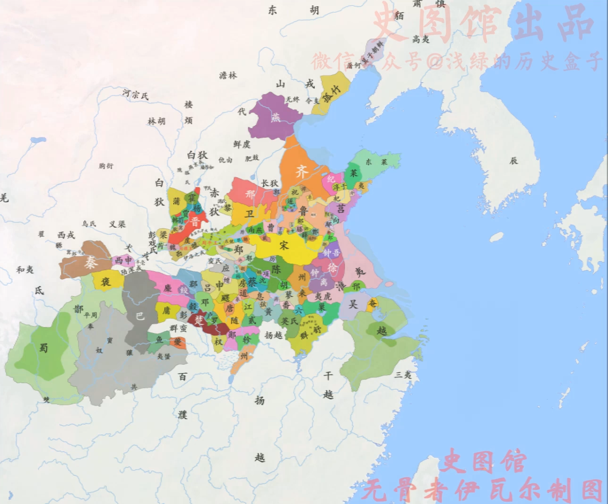

## 周平王

#### 公元前 770 年--周平王元年

    主要诸侯:晋文侯 楚若敖 齐前庄公 秦襄公 宋戴公 鲁孝公 卫武公 郑桓公 陈平公 蔡僖侯 曹惠公 燕项侯

(注:《史记。 郑世家》记载郑桓公死于上一年，有误。 此处据《左传》《公羊传》《韩非子》改正)

- 周幽王被杀后，虢公翰在虢地拥立王子余臣(幽王弟)，是为周携王。周携王与之前申侯(西申)拥立的周平王(幽王子)并立，周王室出现“二王并立”的局面。在晋文侯的主导下，周平王从西申东迁洛邑。秦襄公出兵护送平王东迁，因功由附庸升为诸侯。

#### 公元前 769 年--周平王二年

- 根据《国语》《公羊传》的记载，郐君夫人叔坛被郑桓公买通，因此郑军得以顺利袭取郐国都城，郐国就此灭亡。

#### 公元前 768 年--周平王三年

- 据《竹书纪年》， 齐国于此年攻灭祝国。

#### 公元前 767 年--周平王四年

- 郑桓公攻灭东虢(即“二 年而灭郐，四年
  而灭虢”)。

#### 公元前 766 年--周平王五年

- 秦襄公伐戎，死于岐。

#### 公元前 765 年--周平王六年

- 郑武公(郑桓公之子)被周平王任命为卿士，他继续进行扩张，吞并了邻近的密国。

#### 公元前 760 年--周平王十一年

- 蛮人侵周，晋文侯、蔡共侯率军击破蛮军郑武公又吞并了鄢国与胡国(此为董姓胡国，在今河南郾城，与安徽阜阳的归姓胡国并非一国)。

#### 公元前 757 年--周平王十四年

- 据《竹书纪年》，晋文候于此年灭韩。(注:此韩国是周武王之子的封国，并非战国时期的韩国)

#### 公元前 750 年--周平王二十一年

1. 晋文侯攻杀周携王， “二王并立”的局面结束。
2. 秦文公击败戎人，向东拓土，西申约于此时灭亡。
3. 郑武公继续扩张，先后吞并聃国、胙国、邗国。
4. 楚蚡冒征伐濮人，向南拓土。

#### 公元前 745 年--周平王二十六年

- 晋文侯去世后，其子晋昭侯继位。晋昭侯把叔父成师(晋文侯之弟)封在曲沃，是为曲沃桓叔沃桓叔擅长笼络人心，因此曲沃的影响力迅速超当时的晋都翼城(即蜂城，此时晋候也被称为“翼侯” )

#### 公元前 743 年--周平王二十八年

- 郑武公去世后，其子郑庄公继位。庄公的
  母亲武姜偏爱小儿子段，因此要求庄公把
  段封在京邑。

#### 公元前 739 年--周平王三十二年

- 晋国大夫潘父杀害晋昭候，迎立曲沃桓叔
  结果曲沃桓叔被国人击退。国人拥立晋
  昭候之子晋孝侯，并诛杀潘父。

#### 公元前 729 年--周平王四十二年

- 据《竹书纪年》，此年狄人侵晋。
  郑国的叔段(郑庄公之弟)不断扩大势力
  将郑国西部和北部的边邑据为己有。

#### 公元前 724 年--周平王四十七年

- 曲沃庄伯(曲沃桓叔之子)攻杀晋孝侯，
  晋人立孝侯之弟鄂侯。

#### 公元前 722 年--周平王四十九年

1. 叔段打算突袭郑庄公，结果以失败告终。
   郑庄公派遣公子吕率军进攻京邑，京邑人
   背叛叔段，叔段逃往鄢邑。五月，‘郑 伯
   克段于鄢”。
2. 卫桓公伐郑，攻取廩延。郑庄公以周王室
   卿士的身份征调王师与虢国军队伐卫。

#### 公元前 721 年--周平王五十年

1. 莒国国君娶向国之女向姜为妻，向姜在莒
   国不安心，因此擅自返回向国，莒国以此
   为借口出兵灭向。
2. 鲁国司空无骇率军攻灭极国。

#### 公元前 720 年--周平王五十一年

- 三月，周平王崩，周桓王(平王之孙)继
  位。
- 周桓王准备任命虢公忌父为卿士，郑庄公.
  对此十分不满，派遣祭足率军进入周王畿
  收割温地之麦与成周之禾。
- 楚国攻灭权国，改权为县，任命斗缗为县
  尹。

---

## 周桓王

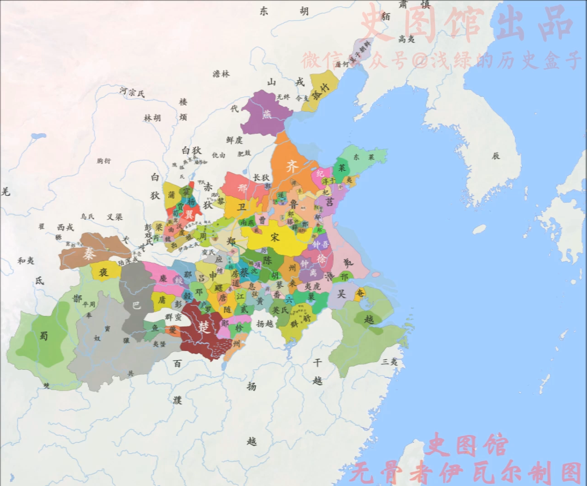

    主要诸侯:晋鄂候(翼)/曲沃庄伯(曲沃) 楚熊通(武王) 齐僖公 秦文公 宋殇公 鲁隐公 卫桓公 郑庄公 陈桓公 蔡宣侯 曹桓公 燕穆侯

#### 公元前 719 年--周桓王元年

- 二月，莒伐杞，取牟娄。
- 卫国的公子州吁杀害卫桓公，自立为君。
  为了分散国内舆论，州吁邀请宋殇公一同
  出兵伐郑。四月，宋、卫、陈、蔡四国联
  军伐郑，进攻郑国都城东门，五天后搬退
  。 秋季，联军再次进攻郑国。
- 九月，卫国大夫石错设计铲除州吁。卫国
  人拥立公子晋(桓公之弟)，是为卫宣公.

#### 公元前 718 年--周桓王二年

- 春，曲沃庄伯进攻翼(绛)城，晋鄂侯被
  迫逃到随地(晋国地名，在今山西介休东
  并非湖北的随国)。周桓王命令虢公忌
  父讨伐曲沃，在翼城拥立晋哀侯(晋鄂侯
  之子)。
- 四月，郑庄公派遗军队入侵卫国。卫宣公
  令南燕国(依附卫国)攻击郑国。六月，
  郑军在北制击溃南燕军。

#### 公元前 717 年--周桓王三年

- 五月，郑庄公率军入侵陈国，大获全胜。
- 七月，宋军占领郑国长葛。

#### 公元前 716 年--周桓王四年

- 七月，郑、宋议和，在宿地结盟。
- 十二月，郑、陈议和。

#### 公元前 715 年--周桓王五年

- 曲沃庄伯去世后，其子称继位，是为曲沃
  武公。芮国乘丧发兵入侵曲沃，依附曲沃
  的董国、荀国也背叛曲沃。不久之后曲沃
  武公进行报复，灭掉董国。
- 夏，周桓王任命虢公忌父为卿士。

#### 公元前 714 年--周桓王六年

- 秦宪公迁都平阳(今陕西岐山县西南) ,
  灭丰戎、伐毫戎。
- 十一月，北戎侵郑，郑庄公歼灭戎军。

#### 公元前 713 年--周桓王七年

- 秦宪公灭亳戎。
- 六月，郑庄公联合齐、鲁伐宋，攻取郜、
  防两城，赠与鲁国。.
- 七月，宋、卫、蔡三国联军伐戴，攻入戴
  国都城。八月，郑庄公率军包围戴城。城
  内的三国联军内讧，戴城因此而失守，三
  国联军被郑军俘获，郑国顺势吞并戴国。
- 十月，郑庄公、齐僖公伐郕。

#### 公元前 712 年--周桓王八年

- 七月，郑庄公联合齐、鲁伐许，攻陷许国
  都城，许庄公出奔卫国。郑庄公拥立许桓
  公，派遣大夫公孙荻监管许国。
- 郑庄公把邬、刘、荔、邗等地献给周桓王
  借此换得溫、原、缔、樊、隰邮、攒茅
  向、盟、州、陉、院、怀等地。
- 十一月，鲁公子晕弑鲁隐公。

#### 公元前 710 年--周桓王十年

- 正月，宋国太宰华督弑宋殇公，拥立宋殇
  公的堂弟宋庄公。华督用宋国的宝器賄赂
  诸侯，借此稳固宋庄公的君位。郑庄公、
  齐售公、鲁桓公、陈桓公都接受了賄赂。
- 九月，鲁桓公伐杞。

#### 公元前 709 年--周桓王十一年

- 春，曲沃武公进攻翼城，在汾隰之战中俘
  获晋哀侯，翼城人拥立哀侯之子小子侯。
- 九月，齐僖公把女儿文姜嫁给鲁桓公。

#### 公元前 708 年--周桓王十二年

- 曲沃武公杀死去年俘获的晋哀侯。
- 秋，秦宪公讨伐芮国，因轻敌而战败。
- 冬，周桓王派遣王师帮助秦国讨伐芮国，
  俘获芮伯万。

#### 公元前 707 年--周桓王十三年

- 正月，陈桓公卒。桓公的太子免被桓公的
  弟弟公子佗杀死，公子佗自立为君。
- 夏，周桓王剥夺了郑庄公的卿士职位，郑
  庄公因此不再朝觀。
- 秋，周桓王率领王师会合卫、陈、蔡三国
  军队，讨伐郑庄公。郑庄公在縭葛之战中
  击败王师，郑将祝聃射中周桓王的肩膀。

#### 公元前 706 年--周桓王十四年

- 春，杞国占领淳于故地，迁于此。
- 夏，北戎侵齐，郑太子忽率军救援齐国，
  大破戎军。
- 秋，蔡人杀陈公子佗，拥立陈厉公(陈桓
  公之子)

#### 公元前 705 年--周桓王十五年

- 夏，盟邑、向邑背叛郑国，依附周桓王。
- 秋，郑庄公派遣军队攻打盟邑、向邑，周
  桓王把盟邑、向邑的百姓迁到郏地。
- 冬，曲沃武公诱杀晋小子侯。

#### 公元前 704 年--周桓王十六年

- 夏，楚伐随，战于速杞，随军大败。
- 秋，楚、随结盟讲和，楚国僭号称王。
- 冬，周桓王命虢公林父伐曲沃，立公子缗
  (晋哀侯之弟)为晋候。

#### 公元前 703 年--周桓王十七年

- 夏，楚、巴联军伐邓，战于郵，邓军大败
- 秋，虢、芮、梁、贾、荀五国伐曲沃。

#### 公元前 702 年--周桓王十八年

- 冬， 齐、郑、卫三国伐鲁。

#### 公元前 701 年--周桓王十九年

- 春，楚、郧战于蒲骚，郧军大败。贰、轸
  两国与楚国结盟。
- 五月，郑庄公去世，太子忽继位，是为郑
  昭公。九月，郑国上卿祭足拥立公子突(
  郑厉公)，郑昭公出奔卫国。

#### 公元前 700 年--周桓王二十年

- 楚武王派遣观丁父率军攻灭州、题。
- 郧、贰、轸等国也相继被楚国灭亡，随、
  唐两国向楚国表示臣服。
- 冬，郑、鲁联军伐宋。
- 楚武王率军伐绞，强迫绞国订立城下之盟
  。

#### 公元前 699 年--周桓王二十一年

- 正月，楚武王派遣屈瑕率军进攻罗国。罗
  卢联军在鄢水大破楚军，屈瑕自杀。
- 二月，郑、鲁、纪三国联军击败齐、宋、
  卫、南燕四国联军。

#### 公元前 698 年--周桓王二十二年

- 秦国大庶长弗忌、威垒、三父等人杀害秦
  出子，拥立秦武公。
- 冬，宋庄公联合齐、卫、陈、蔡等国进攻
  郑国，焚烧郑国都城渠门，攻打东郊，拆
  掉了郑国太庙的椽子。

#### 公元前 697 年--周桓王二十三年

- 三月，周桓王崩。
- 秦武公征伐彭戏氏，抵达华山。
- 五月，祭足驱逐郑厉公，郑厉公出奔蔡国，六月，祭足从卫国迎回郑昭公。
- 许桓公趁郑国内乱而驱逐郑国戍军，许国
  重获独立。
- 九月，郑国标邑背叛郑昭公，郑厉公从蔡
  国进入栎邑。

---

## 周庄王

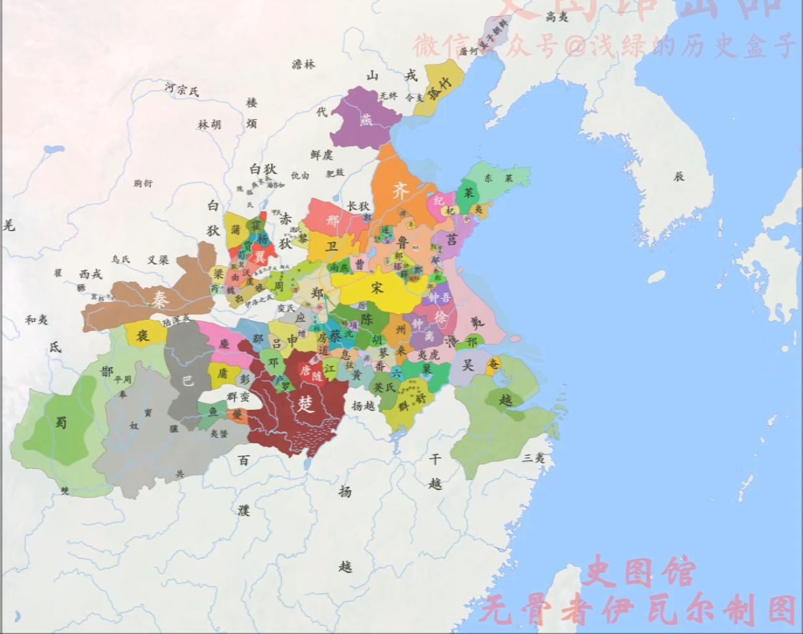

#### 公元前 696 年--周庄王元年

    主要诸侯:晋侯缗(翼)/曲沃武公(曲沃)  楚武王 齐襄公 秦武公 宋庄公 鲁桓公 卫惠公 郑昭公 陈庄公 蔡桓侯 曹庄公 燕桓侯

- 正月，宋、鲁、卫、陈、蔡五国伐郑。
- 十一月，卫国卿大夫驱逐卫惠公，拥立公
- 子黔牟(卫惠公异母兄)，卫惠公出奔齐
  国。

#### 公元前 695 年--周庄王二年

- 五月，齐、鲁两国在奚地发生边境冲突。
- 十月，高渠弥弑郑昭公，拥立公子整(郑
  召公弟)。

#### 公元前 694 年--周庄王三年

- 正月，鲁桓公和夫人文姜前往齐国会见齐
  襄公。文姜与齐襄公私通，被鲁桓公发觉
  因此桓公怒斥文姜。四月，齐襄公设宴
  招待鲁桓公，将他灌醉。随后齐襄公让力
  士公子彭生扶鲁桓公登车，乘机折断桓公
  的肋骨，桓公死于车中。
- 七月，齐襄公在首止之会杀死郑公子壹与
  高渠弥，郑国上卿祭足拥立公子婴。

#### 公元前 693 年--周庄王四年

- 冬，齐襄公伐纪，取邢、錙、郚。

#### 公元前 692 年--周庄王五年

- 夏，鲁公子庆父率军灭於余丘。

#### 公元前 691 年--周庄王六年

秋， 纪季(纪候之弟)以鄱邑归附齐国。

#### 公元前 690 年--周庄王七年

- 三月，随叛楚，楚武王率军伐随，病逝于
  军中。楚国令尹斗祁、莫敖屈重秘不发丧
  ，开通新路奇袭随国。随侯恐惧，向楚军
  求和。屈重以楚王的名义进入随国，与随
  侯结盟。

* 夏，齐襄公灭纪。

#### 公元前 689 年--周庄王八年

- 楚文王迁都纪南城(今湖北荆州市，楚国
  都城皆称“郢”)。
- 随国的彻底归顺，让楚国对汉东地区的统
  治更加稳固。因此楚文王得以继续向鄂东
  南地区扩张，将铜绿山矿产区纳入楚国的
  势力范围。
- 冬，齐襄公联合宋、鲁、陈、蔡四国，出
  兵护送卫惠公回国。

#### 公元前 688 年--周庄王九年

- 六月，在齐国的帮助下，卫惠公返回卫国
  都城朝歌，公子黔牟被驱逐到成周。
- 秦武公灭邽(gui)、冀之戎。
- 楚文王挥师北上，攻灭申、吕、缯。

#### 公元前 687 年--周庄王十年

- 秦武公灭小虢。

#### 公元前 686 年--周庄王十一年

- 四月，齐、鲁联军伐邮。
- 十二月，连称、管至父弑齐襄公，拥立公
  孙无知(襄公堂弟)。

#### 公元前 685 年--周庄王十二年

- 正月，齐大夫雍廪杀公孙无知。
  四月，鲁庄公出兵护送公子纠回齐国即位
  公子小白从莒国抢先回到齐国，是为齐
  桓公。
- 八月，齐桓公在乾时击败鲁军。
- 九月，齐桓公派遣鲍叔牙率军伐鲁,迫使
  鲁庄公杀掉公子纠，并将管仲送回齐国。
  齐桓公重用管仲，使其为政。

#### 公元前 684 年--周庄王十三年

- 正月，齐伐鲁，战于长勺，齐军战败。
- 三月，宋闵公出兵配合齐国，迁走亲附鲁
  国的宿国。
- 六月，鲁军在乘丘击败宋军。
- 十月，齐桓公灭谭。

* 曲沃武公灭荀

#### 公元前 682 年--周庄王十五年

- 八月，南宫长万弑宋闵公，拥立公子游。
- 十月，萧叔大心攻杀公子游，拥立公子御
  说(宋闵公弟)，是为宋桓公。
- 周庄王崩。

---

## 周僖王

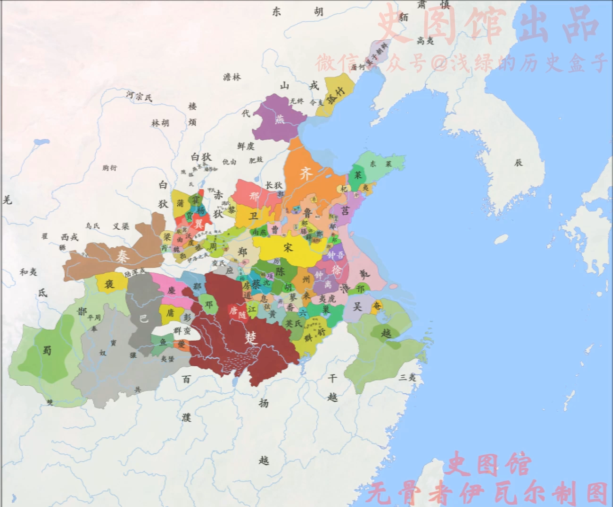

#### 公元前 681 年--周僖王元年

    主要诸侯:晋侯缗(翼)/曲沃武公(曲沃) 楚文王 齐桓公 秦武公 宋桓公 鲁庄公 卫惠公 郑子婴 陈宣公 蔡哀侯 曹庄公 燕庄公

- 春，齐桓公和宋、陈、蔡、邾等国的国君
  在北杏会见。
- 夏，齐桓公灭遂。
- 冬，齐桓公在柯地会见鲁庄公，齐、鲁两
  国结盟讲和。

#### 公元前 680 年--周僖王二年

- 六月，傅瑕杀郑公子婴，郑厉公从栎地返
  回国都。
- 楚文王灭息。
- 奄国(常州淹城遗址)约于此时被吴国灭
  亡。

#### 公元前 679 年--周僖王三年

- 春，齐桓公在鄄地会合诸侯，齐国始霸。
  秋，郑厉公侵宋。
- 曲沃武公灭翼，杀晋侯缗。曲沃武公以宝
  器贿赂周僖王，僖王命曲沃武公为晋侯,
  即晋武公。

#### 公元前 678 年--周僖王四年

- 楚文王灭邓、应。

* 晋武公灭贾、杨。
* 夏，齐、宋、卫三国联军伐郑。
* 秋,楚文王伐郑。

---

## 周惠王

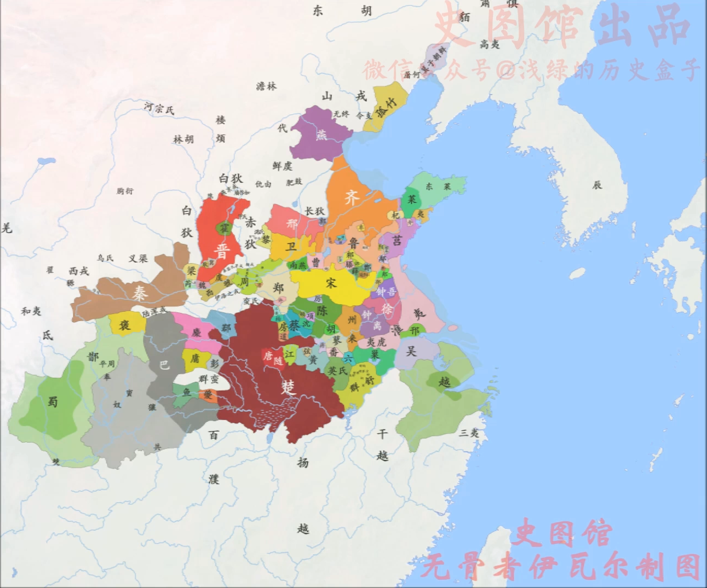

#### 公元前 676 年--周惠王元年

    主要诸侯:晋献公 楚文王 齐桓公 秦德公 宋桓公 鲁庄公 卫惠公 郑厉公 陈宣公 蔡哀侯 曹庄公 燕庄公

- 晋献公即位后，积极对戎狄用兵，狐氏约
  于此时归附晋国。
- 冬，巴国发兵入侵楚国。

#### 公元前 675 年--周惠王二年

- 春，楚文王发兵抵御巴军，在津地被巴军
  打得大败。楚军撤退，看守郢都城门的鬻
  拳认为楚文王无功而返，因此拒绝接纳文
  王。楚文王无可奈何，只得率军袭击黄国
  在错陵击败黄军。
- 夏，楚文王病逝于湫地，鬻拳自杀。
- 冬，卫国、南燕国联合进攻周惠王，试图
  拥立王子颓(周庄王之子，周惠王叔父)

#### 公元前 674 年--周惠王三年

- 春，郑厉公试图调解周惠王与王子颓之间
  的纠纷，没有成功。
- 夏,郑厉公把周惠王带回郑国，安置在栎
  邑。

#### 公元前 673 年--周惠王四年

- 四月，郑厉公、虢公丑诛杀王子颓。
- 五月，郑厉公去世。
- 十月，周惠王返回成周。

#### 公元前 672 年--周惠王五年

- 春，陈宣公杀太子御寇，与太子御寇关系
  亲密的公子完(即田完，陈厉公之子)出
  奔齐国，齐桓公任命田完为工正。
- 晋献公伐骊戎，取骊姬而归。
- 随人袭杀堵敖，拥立楚成王。

#### 公元前 670 年--周惠王七年

秋，鲁庄公娶哀姜为夫人。
冬，戎人伐曹，驱逐太子羁(曹庄公之子
曹庄公于上一年的十一月去世)，拥立
公子赤(太子羁之弟)，是为曹僖公。
齐桓公灭郭。

#### 公元前 668 年--周惠王九年

- 秋， 虢军入侵晋国。
- 冬， 虢军再次入侵晋国。

#### 公元前 666 年--周惠王十一年

- 春，齐桓公伐卫。
- 夏，晋献公命太子申生出居曲沃，公子重
  耳出居蒲地，公子夷吾出居屈地。
- 秋，楚国令尹子元率军伐郑，无功而返。

#### 公元前 665 年--周惠王十二年

- 冬， 樊仲皮背叛周惠王。

#### 公元前 664 年--周惠王十三年

- 春，虢国出兵伐樊，逮捕樊仲皮。
- 秋,楚国申公斗班杀令尹子元，楚成王任
  命斗穀於菟(字子文)为令尹。
- 齐桓公灭鄣。

* 冬，山戎侵燕。

#### 公元前 663 年--周惠王十四年

- 春，齐桓公救燕，北伐山戎。
- 齐桓公灭孤竹、令支，破屠何，以其地予.
  燕。
- 赤狄灭黎。

#### 公元前 662 年--周惠王十五年

- 八月，鲁庄公去世，太子般继位。
- 十月，公子庆父(鲁庄公庶兄)杀害太子
  般，拥立鲁闵公(太子般异母弟)。

#### 公元前 661 年--周惠王十六年

- 正月，狄人侵邢， 齐桓公救邢。
- 冬，晋献公建立二军,吞并耿、魏、霍三
  国。(注:此魏国并非战国时期的魏国。
  )

#### 公元前 660 年--周惠王十七年

- 正月，虢公丑在渭讷击败戎人。
- 八月，庆父弑鲁闵公。鲁人讨伐庆父，庆
  父出奔莒国。季友拥立公子申(鲁庄公庶
  子)，是为鲁僖公。
- 季友贿赂莒国，请求引渡庆父，庆父在押
  送途中自杀。
- 十二月，晋伐赤狄皋落氏。
- 赤狄侵卫，杀卫懿公。

#### 公元前 659 年--周惠王十八年

- 正月，赤狄侵邢，齐桓公率诸侯救邢。
- 六月，邢国迁都夷仪，齐桓公率诸侯帮助
- 邢国筑城。
- 晋献公灭冀。

#### 公元前 658 年--周惠王十九年

- 正月，齐桓公帮助卫国修筑新都楚邱城。
- 五月，晋献公假途伐虢，攻取下阳。
- 十月，楚成王伐郑。

#### 公元前 657 年--周惠王二十年

- 四月，徐国征伐舒国。
- 七月，齐桓公在阳谷会合诸侯，谋划讨伐
  楚国。
- 楚成王再次出兵伐郑。

#### 公元前 656 年--周惠王二十一年

- 正月，齐桓公率领齐、宋、鲁、卫、郑、
  陈、
- 曹、许八国联军南征，攻破蔡国，俘
  获蔡穆侯。联军随即入侵楚国，抵达陉地
  四月，楚成王派遣屈完与诸侯联军讲和
  盟于召陵。联军撤退，蔡穆侯也被释放
  。
- 骊姬陷害晋国太子申生，申生自杀。公子
  重耳出奔。

#### 公元前 655 年--周惠王二十二年

- 八月，齐桓公在首止会盟诸侯，郑文公背
  盟。
- 楚成王灭弦。
- 十二月，晋献公灭虢、虞。

#### 公元前 654 年--周惠王二十三年

- 春，晋献公派遣贾华率军进攻屈地，公子
  夷吾出奔梁国。
- 夏，齐桓公率领诸侯联军讨伐郑国，楚成
  王伐许以救郑。

#### 公元前 653 年--周惠王二十四年

- 正月，齐桓公伐郑。
- 七月，郑文公请和，盟于宁母。

#### 公元前 654 年--周惠王二十五年

- 闰月，周惠王崩。太子郑担心弟弟王子带
  作乱，因此秘不发丧，派人向齐桓公求助
  齐桓公召集诸侯，在洮地举行会盟，帮
  助太子郑顺利即位，是为周襄王。
- 晋军在采桑击败白狄。

---

## 周襄王

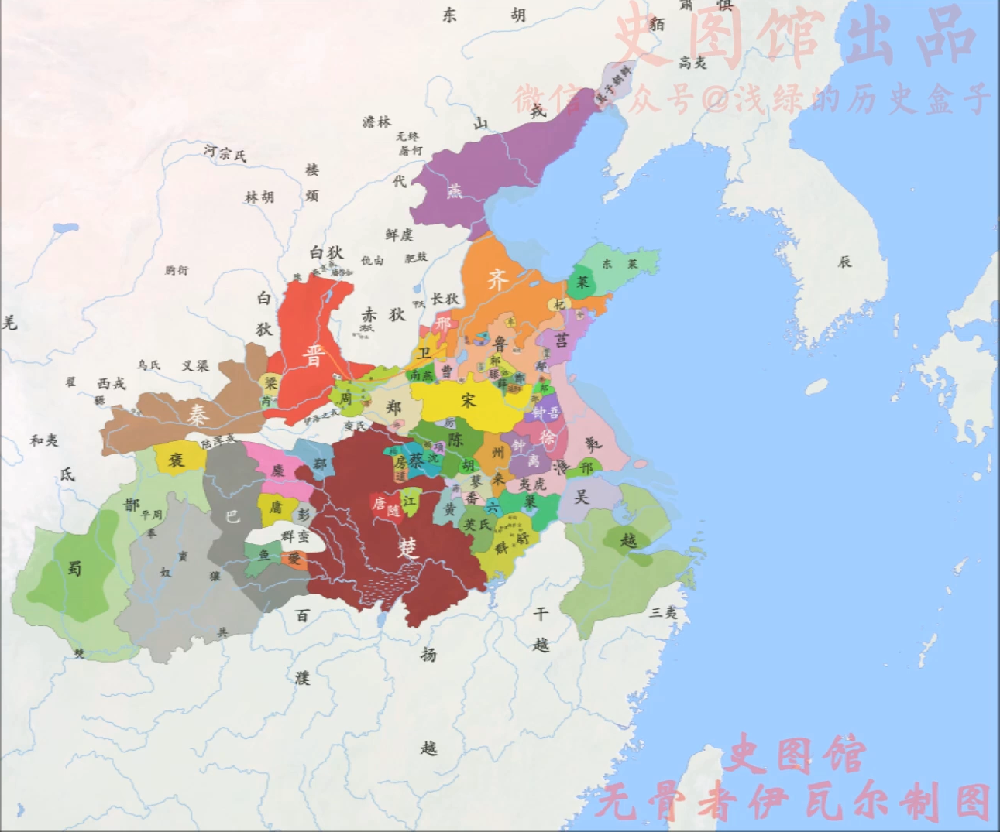

#### 公元前 651 年--周襄王元年

    主要诸侯:晋献公 楚成王 齐桓公 秦穆公 宋襄公 鲁僖公 卫文公 郑文公 陈宣公 蔡穆侯 曹共公 燕襄公

- 夏，齐桓公在葵丘会合诸侯，周襄王派遣
  宰孔把祭肉赐给齐桓公。
- 秋，晋献公去世，太子奚齐(骊姬所生)
  继位。
- 冬，晋卿里克杀奚齐、卓子。
- 秦穆公帮助公子夷吾返回晋国，齐桓公派
  遣隰朋率军会合秦军，顺利拥立公子夷吾
  ，是为晋惠公。

#### 公元前 650 年--周襄王二年

- 正月，赤狄灭温。
- 四月，晋惠公杀里克。
- 十月，晋惠公杀丕郑、祁举、共华、贾华
  叔坚、骓歇、景虎、特宫、山祁。

#### 公元前 649 年--周襄王三年

- 夏，扬拒、泉皋、伊洛之戎进攻成周。秦
  穆公、晋惠公伐戎救周。
- 冬，楚成王伐黄。

#### 公元前 648 年--周襄王四年

- 夏，楚成王灭黄。
- 冬，齐桓公派遣管仲前往成周，让戎人和
  周襄王讲和。

#### 公元前 647 年--周襄王五年

- 晋国发生饥荒，晋惠公派人到秦国求粮，
  秦穆公允诺。

#### 公元前 646 年--周襄王六年

- 春，杞国迁都缘陵，齐桓公召集诸侯，帮
  助杞国筑城。
- 冬，秦国发生饥荒，秦穆公派人前往晋国
  求粮，晋惠公拒绝。
- 楚成王灭英氏。

#### 公元前 645 年--周襄王七年

- 春，管仲去世。
- 楚成王伐徐。
- 九月，秦、晋战于韩原，晋惠公被秦军俘
  获。
- 十月，楚军在娄林击败徐军。
- 十一月，晋国将河西、河东的几座城邑献
  给秦国，秦穆公于是释放了晋惠公。

#### 公元前 644 年--周襄王八年

- 夏，齐桓公伐厉。
- 秋，赤狄侵晋。
- 冬，齐桓公在淮地会合诸侯。

#### 公元前 643 年--周襄王九年

- 春，齐桓公联合徐国伐楚，攻打英氏。
- 夏，晋惠公将太子圉送往秦国做人质，秦
  穆公于是归还晋国的河东地区。
- 秋,齐桓公病重，易牙、竖刁作乱，困桓
  公于寝宫。
- 十月初七日，齐桓公死于饥渴之中。易牙
  竖刁拥立公子无亏(齐桓公庶长子)
  太子昭被迫出奔宋国。

#### 公元前 642 年--周襄王十年

- 正月，宋襄公出兵护送太子昭回国。
- 三月，齐国人杀死公子无亏，接纳太子昭
  。公子潘、公子商人、公子元、公子雍不
  服，再次驱逐太子昭。
- 五月，宋襄公再次出兵伐齐，在顱地把四
  公子的党羽打得大败，顺利在齐国拥立了
  太子昭，是为齐孝公。

#### 公元前 641 年--周襄王十一年

- 夏，宋襄公在曹南会合诸侯。
- 宋襄公拘捕滕宣公、杀鄭子祭神。
- 冬，秦穆公灭梁。

#### 公元前 640 年--周襄王十二年

- 冬，随国试图背叛楚国，楚成王派遣令尹
  子文伐随，随国屈服。
- 由于齐国衰落，楚国势力进一步北扩，吞
  并了原本亲附齐国的柏、房、道三国。
- 秦穆公灭芮。

#### 公元前 639 年--周襄王十三年

- 秋，宋襄公在盂地举行诸侯会盟。楚人劫
  盟，逮捕宋襄公。随后楚军伐宋，未能成
  功。
- 冬，
  楚成王在薄地举行诸侯会盟，释放宋
  襄公。
- 邾文公攻灭须句，须句国君逃往鲁国。

#### 公元前 638 年--周襄王十四年

- 春，鲁僖公伐邾，帮助须句复国。
- 夏，宋襄公伐郑，郑文公向楚国求援。
- 秋，秦、晋两国把陆浑戎迁到伊川。
- 冬，楚成王伐宋以救郑。宋、楚两军战于
  泓水，宋军大败，宋襄公负伤。
- 晋惠公的太子圉(在秦国当人质)从秦国
  逃回晋国，秦、晋关系再度恶化。

#### 公元前 637 年--周襄王十五年

- 正月，齐孝公伐宋，包围缗邑。
- 五月，宋襄公去世，太子王臣继位，是为
  宋成公。
- 七月，楚成王派遣成得臣(字子玉)率军
  伐陈，攻取焦、夷两地。楚国令尹子文告
  老，让位于成得臣。
- 九月，晋惠公去世，太子圉继位，是为晋
  怀公。

#### 公元前 636 年--周襄王十六年

- 正月，秦穆公出兵护送公子重耳返回晋国
- 二月，晋国卿大夫接纳重耳，晋怀公出
  奔高梁，结果被重耳派人杀死。重耳正式
  即位，是为晋文公。
- 秋，王子带(周襄王弟)联合狄人作乱，
  周襄王出奔郑国。

#### 公元前 635 年--周襄王十七年

- 正月，卫文公灭邢。
- 四月，晋文公平定王子带之乱，周襄王返
  回成周。
- 周襄王把阳樊、温、原、攒茅之地赐给晋
  文公。

#### 公元前 634 年--周襄王十八年

- 夏，齐孝公伐鲁。
- 秋，楚成王灭夔。
- 冬，楚、鲁联军伐齐，攻取谷邑。

#### 公元前 633 年--周襄王十九年

- 冬，楚国出兵伐宋，包围宋国都城商丘。
- 宋国大司马公孙固赶赴晋国求援。
- 晋文公建立三军，任命郤觳为元帅。

#### 公元前 632 年--周襄王二十年

> 正月，晋军伐卫，攻取五鹿。二月，晋国
> 元帅卻毂病逝，晋文公任命先轸为元帅。
> 卫国人驱逐卫成公，归顺晋国。三月，晋
> 军攻破曹国都城陶丘，俘获曹共公。楚国
> 令尹成得臣(字子玉)放弃包围宋国，挥
> 师北上，寻求与晋军决战。四月，晋、楚
> 战于城濮，楚军大败，成得臣自杀谢罪。
>
> > 五月，晋文公在践土举行诸侯会盟。

#### 公元前 631 年--周襄王二十一年

- 六月，晋国上卿狐偃在翟泉会合诸侯的卿
  大夫，重温践土之盟。

#### 公元前 630 年--周襄王二十二年

- 九月，晋、秦联军围郑。秦穆公听信郑国
  大夫烛之武的说辞，率军撤退。
- 晋文公要求郑文公立公子兰(郑文公庶子
  )为太子，郑文公允诺，之后晋文公也率
  军撤退。

#### 公元前 629 年--周襄王二十三年

- 春，晋文公割取曹国的土地，分赐诸侯。
- 秋，晋文公在清原检阅军队，建立五军。
- 冬，卫成公迁都帝丘(濮阳)。

#### 公元前 628 年--周襄王二十四年

- 四月，郑文公去世，公子兰继位，是为郑
  穆公。郑穆公奉行亲晋政策，让秦穆公十
  分不满。
- 十二月，晋文公去世，太子欢继位，是为
  晋襄公。
- 秦穆公派遣孟明视、白乙丙、西乞术率军
  东进，计划袭击郑国。

#### 公元前 627 年--周襄王二十五年

- 二月，秦军动向被郑国得知，因此郑国人
  加强戒备。秦军不愿空手而回，于是突袭
  滑国，洗劫其都城后返回。
- 四月，晋襄公采纳元帅先轸的计策，在崤山伏击秦军，将其全歼。孟明视、白乙丙、西乞术被俘
  晋襄公听从文贏之言，释放了孟明视等人。
- 八月，晋军在箕地击败白狄，俘获白.
  狄君长，晋国元帅先轸战死。

#### 公元前 626 年--周襄王二十六年

- 五月，晋襄公派遣元帅先且居(先轸之子
  率军伐卫，攻取匡、戚两地。
- 十月，楚国太子商臣弑楚成王。商臣即位
  是为楚穆王。

#### 公元前 625 年--周襄王二十七年

- 二月，秦、晋战于彭衙，秦军大败。
- 十月，晋国元帅先且居率军伐秦，攻取汪.
  邑、
  彭衙。

#### 公元前 624 年--周襄王二十八年

- 五月，秦穆公伐晉，攻克王官、郊地。随
  后秦军从茅津渡过黄河，埋葬了三年前在
  崤山阵亡士卒的尸骨。

#### 公元前 623 年--周襄王二十九年

- 秋，楚穆王灭江。
- 晋襄公率军伐秦，攻取祁、新城。

#### 公元前 622 年--周襄王三十年

- 夏，秦穆公伐郡。
- 秋,
  楚穆王灭六。
- 冬，楚穆王灭蓼。
- 晋国元帅先且居、中军佐赵衰、下军将栾
  枝、下军佐胥臣都在这一年去世。

#### 公元前 621 年--周襄王三十一年

- 春，晋襄公在夷地检阅军队，撤去两个军
  恢复三军制度。
- 秦穆公去世，太子螢继位，是为秦康公。
  都国在秦、楚之间摇摆不定，因此遭到楚
  国吞并。
- 秋，晋襄公去世。晋国太子夷皋年幼，元
  帅赵盾打算另立襄公的弟弟公子雍(此时
  在秦国)，派士会、先蔑去秦国迎接。

#### 公元前 620 年--周襄王三十二年

- 三月，鲁文公灭须句。
- 晋国元帅赵盾改变主意，打算依旧让襄公
  的太子夷皋即位，然而护送公子雍的秦军
  已经进入晋国境内。
- 四月，赵盾率军突袭驻扎在令狐的秦军，
  秦军大败，逃回秦国。赵盾顺利拥立太子.
  夷皋，是为晋灵公。

#### 公元前 619 年--周襄王三十三年

- 正月，晋国归还卫国的匡地、戚地。
- 四月，秦康公伐晋，攻取武城。
- 八月，周襄王崩。

---

## 周顷王

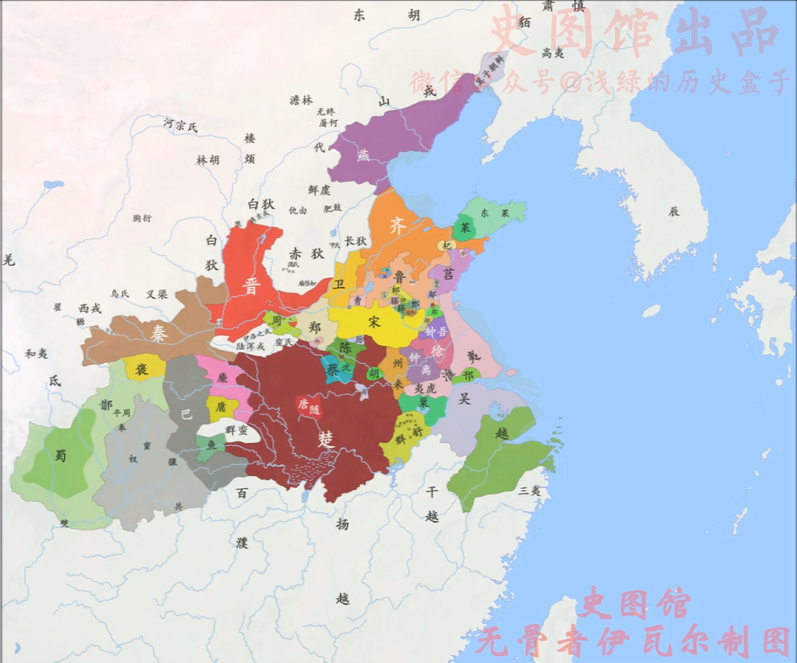

    主要诸侯:晋灵公 楚穆王 齐昭公 秦康公 宋昭公 鲁文公 卫成公 郑穆公 陈共公 蔡庄侯 曹共公 燕襄公

#### 公元前 618 年--周顷王元年

- 正月，晋国发生动乱，中军佐先克遇刺。.
- 晋国元帅赵盾追查凶手，诛杀先都、梁益
  耳。
- 三月，赵盾又诛杀了箕郑父、士穀、蒯得
  D
- 四月，楚穆王伐陈，攻取壶丘。

#### 公元前 617 年--周顷王二年

- 春，晋国元帅赵盾伐秦，攻取少梁。
- 夏，秦康公反击，收复北征。
- 楚穆王灭蒋。

#### 公元前 616 年--周顷王三年

- 春，楚穆王伐麇，楚国令尹成大心在防渚
  打败麇军。
- 秋，鲁军在咸地击败长狄。

#### 公元前 615 年--周顷王四年

- 春,
  楚国令尹成大心去世，楚穆王任命成
  嘉为令尹
  。
- 夏,
  楚国令尹成嘉率军讨伐群舒，灭舒、
  宗。
- 冬，秦、晋战于河曲。

#### 公元前 614 年--周顷王五年

- 春，晋国派遣詹嘉驻守瑕地。
- 夏，士会返回晋国。
- 邾文公迁都到绎地。

#### 公元前 613 年--周顷王六年

- 正月，周顷王崩。
- 五月，齐昭公病逝，太子舍继位。七月，
  公子商人(齐昭公弟)杀太子舍，自立为
  君，是为齐懿公。
- 八月，楚国大夫斗克、公子燮发动叛乱，
  挟持楚庄王。庐戢梨诱杀斗克等人，平定.
  叛乱。

---

## 周匡王

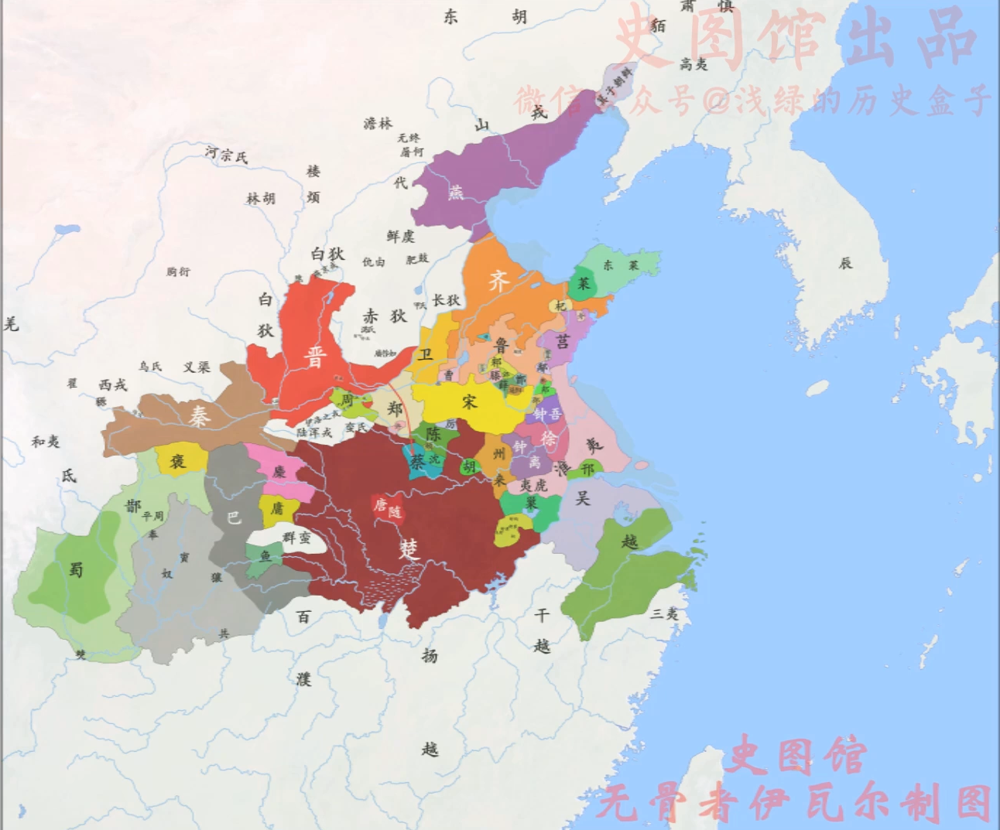

#### 公元前 612 年--周匡王元年

    主要诸侯: 晋灵公 楚庄王 齐懿公 秦康公 宋昭公 鲁文公 卫成公 郑穆公 陈灵公 蔡庄侯 曹文公 燕桓公

- 六月，晋国上军将郤缺率军伐蔡，蔡国向
  晋国屈服，订立城下之盟。

#### 公元前 611 年--周匡王二年

- 秋，楚庄王灭庸、麇。
- 巴国灭鱼。
- 冬，宋人弑宋昭公。

#### 公元前 610 年--周匡王三年

- 9 月，齐懿公侵鲁。
- 六月，齐、鲁两国在毅地结盟讲和。

#### 公元前 609 年--周匡王四年

- 二月，鲁文公病逝，太子恶继位。
- 五月，邴歌、阎职弑齐懿公。
- 十月，东门襄仲弑鲁太子恶，拥立公子佞
  (鲁文公庶长子)，是为鲁宣公。
- 莒太子仆弑莒纪公。

#### 公元前 608 年--周匡王五年

- 六月，鲁宣公将济西之田献给齐国。
- 七月，郑穆公背叛晋国，晋国元帅赵盾率
  军伐郑。楚国司马葛贾率军救郑，在北林
  击败晋军。
- 十月，晋国赵穿率军侵崇。

#### 公元前 607 年--周匡王六年

- 二月，郑、宋战于大棘，宋军大败。
- 秦共公率军伐晋，包围焦地。四月，晋国
  元帅赵盾率军救援焦地，秦军撒退。
- 九月，赵穿(赵盾族弟)杀死晋灵公，赵
  盾拥立公子黑臀(晋灵公叔父)，是为晋
  成公。
- 十月，周匡王崩。
- 齐、卫大破长狄。

---

## 周定王

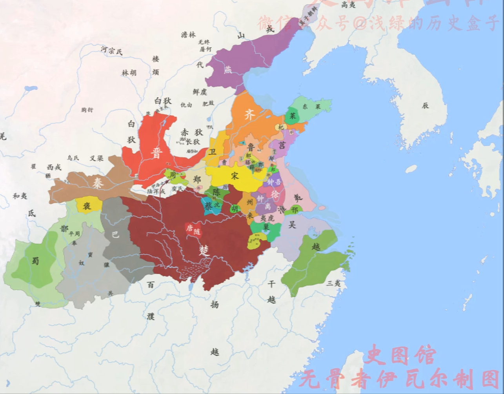
公元前 606 年
周定王元年

    主要诸侯: 晋成公 楚庄王 齐惠公 秦共公 宋文公 鲁宣公 卫成公 郑穆公 陈灵公 蔡文侯 曹文公 燕桓公

- 春，楚庄王北伐陆浑戎，兵临洛水。周定
  王派遣王孙满慰劳楚庄王，楚庄王询问九
  鼎之大小轻重。

#### 公元前 605 年--周定王二年

- 正月，鲁宣公伐莒，攻取向地。
- 六月，郑公子归生弑郑灵公。
- 楚国令尹斗越椒叛乱。
- 七月，楚庄王在皋浒击败斗越椒，平定叛乱。

#### 公元前 604 年--周定王三年

- 冬，楚庄王伐郑，晋国中军佐荀林父伐陈以救郑。

#### 公元前 603 年--周定王四年

- 秋，赤狄侵晋，包围怀、邢丘。
  冬，楚庄王伐郑。

#### 公元前 602 年--周定王五年

- 夏，齐惠公联合鲁国进攻莱国。

#### 公元前 601 年--周定王六年

- 夏，晋国元帅赵盾去世，郤缺继任元帅。
- 楚庄王东征，灭舒蓼，划定群舒疆界。

#### 公元前 600 年--周定王七年

- 七月，鲁宣公灭根牟。
- 九月，晋成公病逝，太子孺继位，是为晋景公。
- 十月，楚庄王伐郑，晋国元帅郤缺救郑，
  晋军在柳棼击败楚军。

#### 公元前 599 年--周定王八年

- 正月，齐惠公归还鲁国济西之田。
- 五月，夏微舒弑陈灵公。
- 七月，鲁卿公孙归父伐邾，攻取绎邑。
- 十月，楚庄王率军伐郑，晋国士会率军救郑，晋军在颍北击败楚军。

#### 公元前 598 年--周定王九年

- 正月，楚庄王伐郑。
- 十月，楚庄王伐陈，攻破其都城，杀死夏.微舒。
- 楚庄王打算就此吞并陈国，大夫申叔时极力劝阻，于是楚庄王复立陈灵公的太子午为陈侯，是为陈成公。

#### 公元前 597 年--周定王十年

- 正月，楚庄王伐郑，包围郑国都城。
- 晋国元帅卻缺去世，荀林父继任元帅。
- 四月，郑襄公对楚国屈服，请求结盟讲和。
- 六月，晋国元帅荀林父率军救郑，晋、楚两军在郯地交战，晋军大败。

#### 公元前 596 年--周定王十一年

- 秋，赤狄侵晋。
- 冬，晋景公诛杀先觳，灭其族。

#### 公元前 595 年--周定王十二年

> 夏，为了确认郑、宋两国是否归顺，楚庄王故意不向两国借道，直接派出使者穿越其国境。宋国人逮捕并处决了楚国使者。
>
> > 秋，楚庄王率军伐宋，包围宋国都城商丘。

#### 公元前 594 年--周定王十三年

- 五月，楚庄王解除对商丘的包围，与宋国结盟讲和。
- 六月，晋国元帅荀林父率军灭赤狄潞氏、长狄郯瞒。
- 七月，秦、晋战于辅氏，秦军大败。

* 鲁国初税亩。

#### 公元前 593 年--周定王十四年

- 春，晋国元帅士会率军攻灭赤狄甲氏、留吁、铎辰部落。
- 三月，晋景公向周定王进献俘虏的狄人。

#### 公元前 592 年--周定王十五年

- 春，晋景公派遣卻克到齐国征召齐顷公参加盟会。卻克跛足，因此遭到齐顷公戏弄。
- 秋，晋国元帅士会告老，邵克继任元帅。

#### 公元前 591 年--周定王十六年

- 春，晋、卫联军伐齐，到达阳谷。
- 秋，楚庄王去世，太子审继位，是为楚共王。

#### 公元前 590 年--周定王十七年

- 春，晋景公派遣瑕嘉调解周王室和茅戎的
  冲突。周朝卿士刘康公无视调解，强行进攻茅戎，结果以失败告终。
- 鲁国为了防备齐国入侵，制定“丘甲”制
  度。

#### 公元前 589 年--周定王十八年

- 正月，齐顷公率军伐鲁。
- 四月，卫军救鲁，被齐军击败。
- 六月，晋景公派遣元帅卻克率军救鲁。晋、齐战于宰地，齐军大败。
- 楚国申公巫臣出奔晋国。
- 十月，楚国令尹公子婴齐率军救齐。
- 十一月，楚国令尹公子婴齐在鲁国的蜀地(今山东泰安，并非蜀国)会盟诸侯。

#### 公元前 588 年--周定王十九年

- 秋，晋国元帅卻克攻灭赤狄廣咎如部落，赤狄彻底灭亡。
- 冬，晋景公建立六军。

#### 公元前 587 年--周定王二十年

- 冬，晋国元帅栾书率军伐郑，攻取汜、祭。楚国司马公子侧率军救郑，晋军撤退。

#### 公元前 586 年--周定王二十一年

- 郑、许两国争夺鉭任、冷敦之田，许灵公请求楚共王做出裁决。楚共王判决许国胜诉，郑悼公对此十分不满。
- 八月，郑悼公背叛楚国，和晋国结盟。
- 十一月，周定王崩。

---

## 周简王

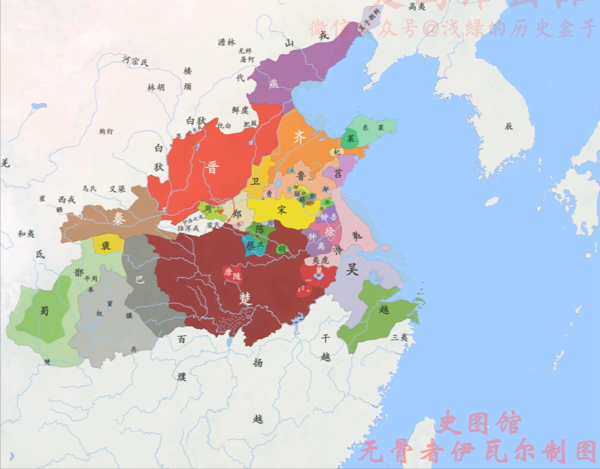

    主要诸侯:晋景公 楚共王 齐顷公 秦桓公 宋共公 鲁成公 卫定公 郑悼公 陈成公 蔡景侯 曹宣公 燕昭公 昊王寿梦

#### 公元前 585 年--周简王元年

- 二月，鲁灭都。.
- 四月，晋景公迁都新田。
- 十月，楚国令尹公子婴齐率军伐郑，晋国
  元帅栾书率军救郑。
- 吴王寿梦即位后，吴国日益强大。.

#### 公元前 584 年--周简王二年

- 七月，楚国令尹公子婴齐率军伐郑，晋国元帅栾书率军救郑。晋军在汜地击败楚军俘获楚国大夫钟仪。
- 八月，吴王寿梦率军伐楚，攻入州来。吴军侵略巢国、徐国。

#### 公元前 583 年--周简王三年

- 春，晋景公命令鲁国把汶阳之田割让给齐国。
- 晋国元帅栾书率军伐蔡，进而侵略楚国本土，击败楚军，俘获楚国大夫申骊。随后晋军侵略沈国，俘获沈国国君。
- 夏，晋景公诛杀赵同、赵括(注:此赵括是赵盾之弟，并非战国时期的赵括)

#### 公元前 582 年--周简王四年

- 春，楚共王用厚礼贿赂郑成公。
- 秋，郑成公去晋国朝拜，晋景公责问郑成公收受楚国贿赂一事，将他扣押。晋国元帅栾书率军伐郑，楚国令尹公子婴齐伐陈以救郑。
- 冬，秦桓公联合白狄伐晋。

#### 公元前 581 年--周简王五年

- 五月，晋国太子州蒲组织诸侯联军伐郑,郑国请和，重新归顺晋国，晋景公于是释放了郑成公。
- 六月，晋景公如厕时“陷而卒”，太子州蒲继位，是为晋厉公。

#### 公元前 580 年--周简王六年

- 宋国右师华元调停晋楚关系。
- 冬，秦、晋结盟讲和。

#### 公元前 579 年--周简王七年

- 夏，晋、楚结盟讲和。
- 秋，秦桓公背弃盟约，怂恿白狄入侵晋国，晋军在交刚击败白狄。

#### 公元前 578 年--周简王八年

- 五月，晋国元帅栾书率军伐秦，战于麻隧，秦军大败。

#### 公元前 577 年--周简王九年

- 八月，郑国上卿公子喜率军伐许。

#### 公元前 576 年--周简王十年

- 夏，楚共王伐郑，到达暴隧。
- 冬，楚共王把许国南迁到叶地。

#### 公元前 575 年--周简王十一年

- 春，楚共王用汝阴之田贿赂郑国，郑成公于是背叛晋国，投靠楚国。
- 夏，晋厉公率军伐郑，楚共王率军救郑。
- 六月，晋、楚战于鄢陵，楚军大败。

#### 公元前 574 年--周简王十二年

- 正月，郑军入侵晋国虚、滑两地。
- 十二月，晋厉公诛杀郤绮、卻攣、卻至。
- 楚共王灭舒庸。

#### 公元前 573 年--周简王十三年

- 正月，晋国元帅栾书弑晋厉公，拥立晋悼公(晋襄公曾孙)。
- 六月，楚共王伐宋，攻取彭城，用来安置宋国叛臣鱼石等人。
- 晋悼公实施新政，栾书告老，韩厥继任元帅。
- 十一月，楚国令尹公子婴齐率军伐宋，晋悼公率军救宋，楚军撤退。

#### 公元前 572 年--周简王十四年

- 正月，晋国率领诸侯帮助宋国收复彭城。
- 五月，晋国元帅韩厥率军伐郑。
- 七月，楚国公子壬夫伐宋以救郑。
- 九月，周简王崩。

---

## 周灵王

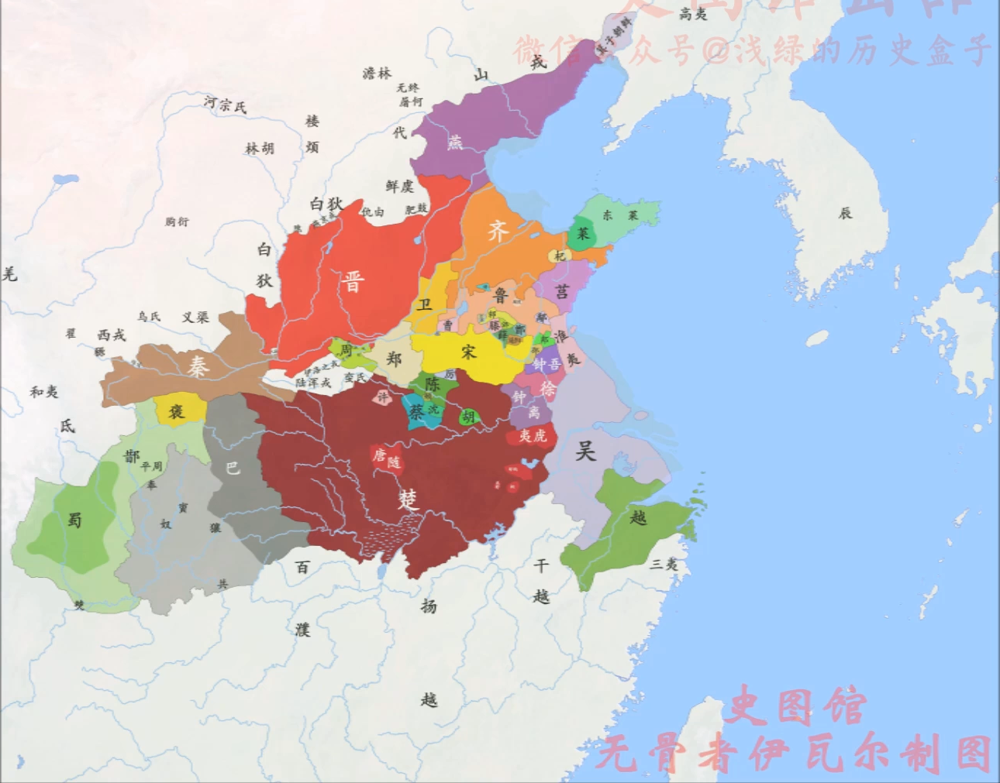

    主要诸侯:晋悼公 楚共王 齐灵公 秦景公 宋平公 鲁襄公 卫献公 郑成公 陈成公 蔡景侯 曹成公 燕武公 吴王寿梦

#### 公元前 571 年--周灵王元年

- 冬，在晋国的号召下，诸侯集结军队在虎牢筑城，借此威逼郑国。

#### 公元前 570 年--周灵王二年

- 春，楚国令尹公子婴齐率军伐吴，战于横.山,楚军大败。吴军反击，攻克楚国驾邑
- 夏，由于郑国归顺，晋悼公在鸡泽举行诸侯会盟。

#### 公元前 569 年--周灵王三年

- 晋悼公采纳魏绛“和戎”之策，争取到了北方戎狄的拥护。与此同时，吴国势力扩张到赣江流域。

#### 公元前 568 年--周灵王四年

- 冬，楚国令尹公子贞率军伐陈，晋悼公率领诸侯联军救陈。

#### 公元前 567 年--周灵王五年

- 七月，莒犁比公灭鄭。
- 十二月，齐灵公灭菜。

#### 公元前 566 年--周灵王六年

- 冬，楚国令尹公子贞率军伐陈。
- 郑国上卿公子雕弑郑僖公。

#### 公元前 565 年--周灵王七年

- 四月，郑侵蔡。
- 十月，楚国令尹公子贞率军伐郑，郑国背叛晋国，归顺楚国。

#### 公元前 564 年--周灵王八年

> 冬，晋国元帅智螢率领诸侯联军伐郑。
>
> > 郑国与晋国结盟讲和。

#### 公元前 563 年--周灵王九年

- 五月，晋率诸侯灭逼阳，晋悼公把逼阳的土地赐给宋国。
- 八月，由于郑国背叛，晋悼公调动诸侯军队讨伐郑国。
- 十一月，楚国令尹公子贞率军救郑。

#### 公元前 562 年--周灵王十年

- 四月，晋悼公调动诸侯联军伐郑。
- 九月，诸侯联军再次伐郑。
- 十二月，郑国归顺晋国，诸侯在萧鱼举行会盟。
- 秦景公派遣庶长鲍、庶长武率军入侵晋国在栎地击败晋军。

#### 公元前 561 年--周灵王十一年

- 冬，楚国令尹公子贞、秦国庶长无地联合率军进攻宋国，抵达扬梁。

#### 公元前 560 年--周灵王十二年

- 夏，鲁灭郝。
- 晋国元帅智萄、新军将士鲂去世。晋悼公在绵上举行阅兵，撒去新军，恢复三军制度，任命中行偃为元帅。
- 秋，楚共王去世，其子楚康王继位。吴王诸樊乘丧伐楚，楚国司马公子午率军抵御，在庸浦大破吴军。

#### 公元前 559 年--周灵王十三年

- 四月，晋国元帅中行偃率领诸侯联军伐秦渡过泾水，到达械林。
- 卫国上卿孙林父驱逐卫献公，卫献公出奔齐国。
- 七月，楚国令尹公子贞率军伐吴，在皋舟险道遭遇吴军截击，楚军战败。

#### 公元前 558 年--周灵王十四年

- 四月，齐灵公率军侵鲁，包围邮地。
- 八月，邾军入侵鲁国南部边境。
- 十一月，晋悼公去世，太子彪继位，是为晋平公。

#### 公元前 557 年--周灵王十五年

- 六月，晋国元帅中行偃率军伐许，之后又攻击楚国，楚国大夫公子格率军抵御。
  - 晋、楚战于湛阪，楚军大败。晋军乘胜追击侵袭方城以北的地区。

#### 公元前 556 年--周灵王十六年

- 夏，卫伐曹，取重丘。
- 秋，齐灵公率军侵略鲁国北部边境。
- 冬，邾国侵略鲁国南部边境。

#### 公元前 555 年--周灵王十七年

- 十月，晋国元帅中行偃率领诸侯联军伐齐 战于平阴，齐军大败。
- 十二月，联军包围临淄，并且分兵推进到潍水、沂水。
- 楚国令尹公子午率军袭击郑国。为了救援郑国，诸侯联军解除对临淄的包围。

#### 公元前 554 年--周灵王十八年

- 二月，晋国元帅中行偃去世，范句继任元帅。
- 五月，晋国元帅范句率军伐齐，到达谷地恰逢齐灵公病逝，于是晋军按照‘ 礼不.伐丧”的原则撤退。

#### 公元前 553 年--周灵王十九年

- 六月，由于齐庄公表示愿意归顺晋国，晋平公在澶渊举行诸侯会盟。

#### 公元前 552 年--周灵王二十年

- 正月，邾国的庶其将漆地和闾丘献给鲁国。
- 七月，晋国元帅范句驱逐栾盈。
- 十月，晋国主持商任之会，要求赴会诸侯不得接纳栾盈。

#### 公元前 551 年--周灵王二十一年

- 七月，齐庄公违抗晋国，接纳栾盈。
- 十月，**孔子出生**。

#### 公元前 550 年--周灵王二十二年

- 四月，栾盈在齐庄公的帮助下返回晋国，召集族人对范氏发难。
  > 七月，齐庄公趁晋国内部动荡，出兵伐晋齐军攻克朝歌，到达荧庭。
  >
  > > 晋国东阳大夫邯郸胜率军攻击齐军，俘获齐国大夫晏鼇。
- 十月，栾盈兵败被杀，晋国内乱平息。

#### 公元前 549 年--周灵王二十三年

- 冬，楚康王率军伐郑，到达棘泽。
- 晋平公率领诸侯联军救郑，楚军撤退。

#### 公元前 548 年--周灵王二十四年

- 五月，崔杼弑齐庄公。
- 晋平公率领诸侯联军伐齐，齐国乞和，盟于重丘。
- 八月，楚国令尹屈建率军攻灭舒鸠。
- 十二月，吴王诸樊率军攻打楚国巢城，中箭身亡。

#### 公元前 547 年--周灵王二十五年

- 二月，宁喜弑卫殇公，卫献公复位，孙林父带着封地投奔晋国。
- 五月，楚康王伐郑，在城麇击败郑军，俘获郑国大夫印堇父和皇颉。
- 十月，楚康王再次伐郑。

#### 公元前 546 年--周灵王二十六年

- 夏，“ 弭兵之会”在宋国召开。诸侯达成一致:晋、楚停止争霸战争，今后晋国的盟国要朝觐楚国，楚国的盟国也要觐晋国，齐、秦两国不必朝觐。
- 九月，齐国权臣庆封诛灭崔氏，独揽大权。

#### 公元前 545 年--周灵王二十七年

- 十一月，齐国栾、高、田、鲍四族共同驱逐庆氏家族。
- 周灵王崩。
- 十二月，楚康王去世，其子熊麇(郏敖)继位。

---

## 周景王

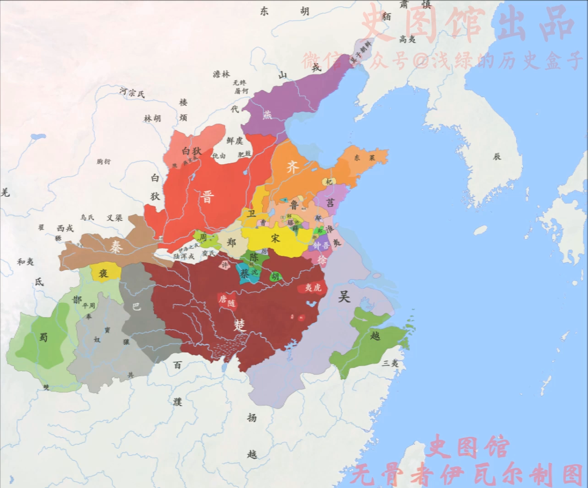

    主要诸侯:晋平公 楚郏敖 齐景公 秦景公 宋平公 鲁襄公 卫献公 郑简公 陈哀公 蔡景侯 曹武公 燕简公 吴王馀祭

#### 公元前 544 年--周景王元年

- 五月，吴王馀祭伐越。
- 吴王馀祭让越国俘虏看守船只，越国俘虏趁吴王视察船只时，将其刺杀。
- 六月，杞文公迁都淳于，晋平公让鲁国归还杞国故土。

#### 公元前 541 年--周景王四年

- 六月，晋国荀吴采纳魏舒的建议，使用步兵方阵，在大原大破群狄。
- 十一月，楚国令尹王子围(即熊围，楚康王之弟)杀害楚王熊麇(郏敖)。王子围自立为王，是为楚灵王。
- 十二月，晋国元帅赵武去世，韩起继任元帅。

#### 公元前 539 年--周景王六年

- 夏，郑简公朝拜晋平公，晋平公把州县赐给郑国。
- 冬，燕国卿大夫驱逐燕简公，燕简公出奔齐国。

#### 公元前 538 年--周景王七年

- 六月，楚灵王在申地会合诸侯。
- 七月，楚灵王率领诸侯联军伐吴，攻克朱方。
- 八月，楚灵王灭厉。
- 九月，鄭人背叛莒国，投靠鲁国。

#### 公元前 537 年--周景王八年

- 夏，莒国的牟娄、防、兹等地归附鲁国。
- 冬，楚灵王率军伐吴，吴军在鹊岸击败楚军先头部队。楚灵王在坻箕山检阅军队，随后率军撤退。.

#### 公元前 536 年--周景王九年

- 秋，吴、楚战于房钟，楚军大败。
- 冬，齐景公伐燕，试图护送燕简公回国。

#### 公元前 535 年--周景王十年

- 春，燕国卿大夫另立燕悼公，同时贿赂齐景公，齐军于是撤退。
- 夏，晋平公划定鲁国与杞国的边界，迫使鲁国把成地割让给杞国。
- 郑国把州县还给晋国。
- 秋，晋平公把戚邑还给卫国。

#### 公元前 534 年--周景王十一年

- 三月，陈国内乱。
- 四月，陈哀公自缢身亡。
- 十月，楚灵王灭陈。

#### 公元前 533 年--周景王十二年

- 二月，楚灵王把许国迁到城父。

#### 公元前 532 年--周景王十三年

- 五月，齐国田、鲍两家攻击栾、高两家，栾施、高疆战败，逃往鲁国。
- 七月，鲁伐莒，取鄄。
- 晋平公去世，太子夷继位，是为晋昭公。

#### 公元前 531 年--周景王十四年

- 三月，楚灵王在申之会上逮捕蔡灵侯。
- 四月，楚灵王杀死蔡灵侯，随后楚国出兵攻打蔡国。
- 十一月，楚灭蔡，同时迁徙许、沈、胡三国，把它们的宗室、国人安置在荆山地区。

#### 公元前 530 年--周景王十五年

- 八月，晋国上军将荀吴率军灭肥。
- 十月，楚灵王率军伐徐，驻扎在乾溪。

#### 公元前 529 年--周景王十六年

- 四月，楚国王子比、王子黑肱、王子弃疾
  (皆为楚灵王之弟)率领陈县、蔡县、不
  羹、叶县的军队南下，进入郢都。王子比
  自立为王，楚灵王众叛亲离、流窜山野。
- 五月，王子弃疾设计铲除王子比、王子黑
  肱，楚灵王亦自缢于申亥家中。王子弃疾
  自立为王，是为楚平王。楚平王让陈、蔡
  胡、沈、许复国。十月，吴军攻取州来

#### 公元前 527 年--周景王十八年

- 秋，晋国上军将荀吴率军伐鲜虞，俘获鼓子鸢緹。

#### 公元前 526 年--周景王十九年

- 二月，齐景公伐徐，到达蒲隧。
- 八月，晋昭公去世，太子去疾继位，是为晋顷公。

#### 公元前 525 年--周景王二十年

- 八月，晋国上军将荀吴率军灭陆浑戎。
- 十月，吴、楚战于长岸。

#### 公元前 524 年--周景王二十一年

- 六月，邾庄公率军突袭鄱国，攻入其都城。
- 十月，楚平王把许国迁移到析地。

#### 公元前 523 年--周景王二十二年

- 春，楚平王娶夫人秦嬴(原本与太子建订婚)。
- 宋元公伐邾，迫使邾庄公释放鄅国的俘虏。
- 夏，楚平王派遣水师南征百濮。
- 秋，齐景公伐莒。
- 楚平王收复州来。

#### 公元前 522 年--周景王二十三年

- 春，楚平王驱逐太子建、杀死太傅伍奢。
- 伍奢之子伍子胥出奔吴国。
- 冬，宋国爆发华、向之乱。

## 周悼王

#### 公元前 520 年--周悼王元年

    主要诸侯:晋顷公 楚平王 齐景公 秦哀公 宋元公 鲁昭公 卫灵公 郑定公 陈惠公 蔡悼侯 曹悼公 燕平公 吴王僚

- 二月，宋国内乱平息。
- 四月，周景王崩。刘盆、单旗拥立王子猛继位，是为周悼王。
- 六月，周景王的长子王子朝不服，发兵攻击周悼王。
- 晋国荀吴率军灭鼓。
- 七月，周悼王逃离京师。十一月，周悼王崩，刘盆、单旗拥立王子句，是为周敬王

---

## 周敬王

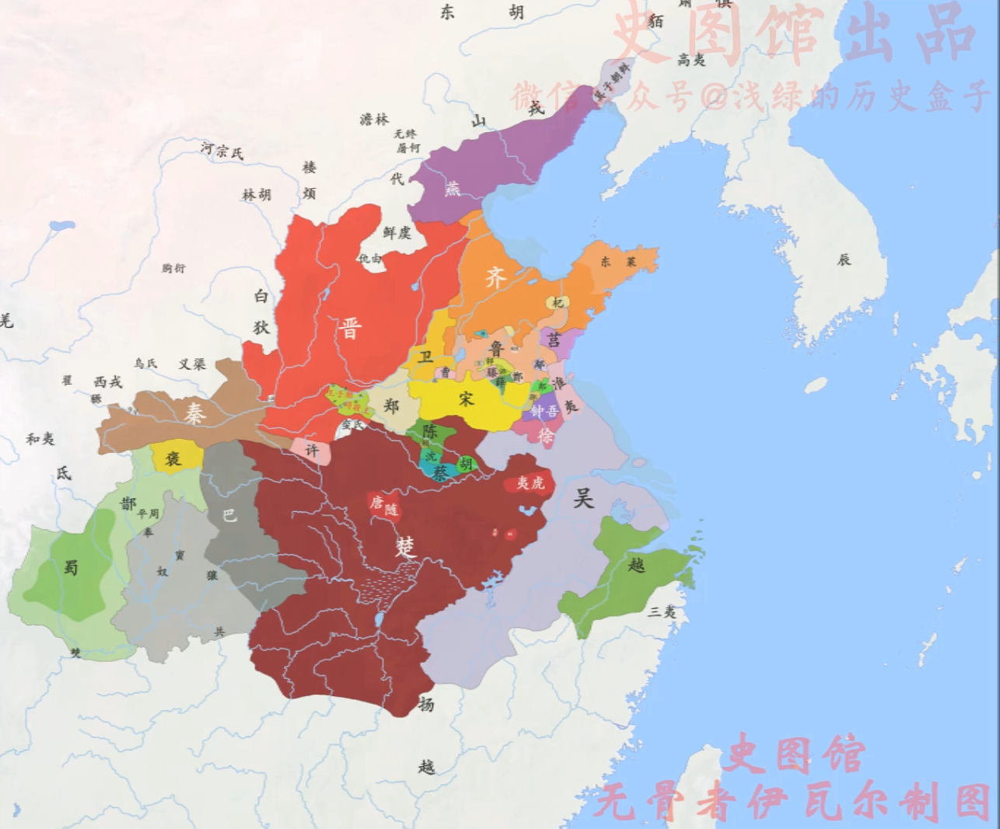

    主要诸侯:晋顷公 楚平王 齐景公 秦哀公 宋元公 鲁昭公 卫灵公 郑定公 陈惠公 蔡悼侯 曹悼公 燕平公 吴王僚

#### 公元前 519 年--周敬王元年

- 七月，吴、楚战于鸡父，楚军大败。
- 吴王僚攻取楚国州来。

- 冬，楚平王派遣水师入侵吴国，与越军在
  豫章之沖会师。
- 吴王僚发兵报复楚国，攻占巢、钟离。

#### 公元前 518 年--周敬王二年

- 冬，楚平王派遣水师入侵吴国，与越军在
  豫章之沖会师。
- 吴王僚发兵报复楚国，攻占巢、钟离。

#### 公元前 517 年--周敬王三年

- 秋，鲁昭公讨伐权臣季孙意如，失败后出奔齐国。
- 冬，齐景公伐鲁，攻取郓地。

#### 公元前 516 年--周敬王四年

- 春，齐景公把鲁昭公安置在郓地。
- 秋，楚平王去世，太子轸继位，是为楚昭王。
- 冬，晋国智跞、赵鞅率军援救周敬王，击败王子朝。王子朝出奔楚国，周王室内乱平息。

#### 公元前 515 年--周敬王五年

- 春，吴王僚派遣公子掩馀、公子烛庸率军
  伐楚，包围潜地。楚国令尹囊瓦率军进抵
  沙讷，左尹伯郤宛、工尹寿率军救援潜地
- 夏，公子光指使专诸刺杀吴王僚。公子光
  自立为王，是为吴王阖闾。

#### 公元前 514 年--周敬王六年

- 六月，晋项公诛杀祁盈、羊舌食我，灭其
  族。
- 七月，晋国元帅韩起去世，魏舒继任元帅
  。

#### 公元前 512 年--周敬王八年

- 六月，晋顷公去世，太子午继位，是为晋
  定公。
- 十二月，吴王阖闾灭徐、钟吾。

#### 公元前 511 年--周敬王九年

- 秋，吴军侵袭楚国潜地、六地，包围弦地。
  楚军救援弦地，到达豫章，吴军撤走。

#### 公元前 510 年--周敬王十年

- 十二月，鲁昭公在乾侯去世。季孙意如拥
  立昭公之弟公子宋，是为鲁定公。

#### 公元前 509 年--周敬王十一年

- 正月，晋国元帅魏舒去世，范鞅继任元帅。
- 诸侯帮助周敬王增修成周的城墙。
- 六月，鲁昭公的灵柩被运回鲁国。

#### 公元前 508 年--周敬王十二年

- 夏，桐叛楚。
- 秋，楚国令尹囊瓦率军伐吴。
- 冬，吴、楚战于豫章，楚军大败，吴军占
  领巢城。

#### 公元前 506 年--周敬王十四年

- 三月，晋国元帅范鞅辅佐晋定公，在召陵 q 会合诸侯，商议帮助蔡国讨伐楚国，未果
- 四月，蔡昭侯灭沈。
- 六月，楚昭王把许国迁到容城。
- 十月，吴王阖闾伐楚，蔡国、唐国响应吴军。
- 十一月，吴、楚战于柏举，楚军大败
  吴军攻入郢都，楚昭王出奔随国。

#### 公元前 505 年--周敬王十五年

- 四月，越王允常偷袭吴国。
- 六月，秦哀公派遣军队救援楚国。
- 七月，秦、楚联军灭唐。
- 九月，吴王阖闾的弟弟夫概发动叛乱，吴
  王阖闾回国平叛。
- 十月，秦、楚联军收复郢都。
  吴军撤离楚国。

#### 公元前 504 年--周敬王十六年

- 正月，郑灭许，俘获许国国君。
- 四月，吴伐楚，取番。
- 儋翩率领王子朝的余党在成周发动叛乱，郑国予以支持，出兵占领负黍等地。

#### 公元前 503 年--周敬王十七年

- 楚昭王恢复许国，此后许国彻底沦为楚国的附庸。
- 齐景公派遣国夏率军伐鲁。

#### 公元前 502 年--周敬王十八年

- 七月，晋国元帅范鞅率军侵卫。
- 十月，鲁国阳虎叛乱。

#### 公元前 501 年--周敬王十九年

- 晋国元帅范鞅去世，智跞继任元帅。
- 六月，阳虎出奔齐国。齐景公听从大夫鲍
  国的劝谏，囚禁阳虎。阳虎越狱逃往晋国
  投靠赵鞅。
- 七月，齐景公、卫灵公联合伐晋。齐军攻
  克夷仪，卫军攻克五氏。晋军在冠氏击败
  齐军，卫军也随即撤退。

#### 公元前 500 年--周敬王二十年

- 春，齐、鲁议和。齐国约于此时彻底控制
  东莱。
- 夏，齐鲁夹谷之会，齐景公归还鲁国的汶
  阳之田。
- 晋国赵鞅率军伐卫。

#### 公元前 499 年--周敬王二十一年

- 春，宋景公的弟弟公子辰、公子地占据萧
  地发动叛乱。

#### 公元前 498 年--周敬王二十二年

- 春，鲁卿叔孙州仇率军拆毁郈邑的城墙。
- 夏，鲁国公山不狃、叔孙辄在费邑叛乱，
  国人击败叛军，拆毁费邑的城墙。
- 冬，拆毁邮邑城墙的行动受阻，孔子的
  堕三都”计划失败。

#### 公元前 497 年--周敬王二十三年

- 晋国爆发内战，中行寅、范吉射占据晋国
  东部地区，对抗智跞、赵鞅、韩不信、魏
  曼多四卿。

#### 公元前 496 年--周敬王二十四年

- 二月，楚昭王灭顿。
- 五月，吴越檎李之战，吴王阖闾负伤去世
  。
- 七月，宋景公攻克萧地，宋国内乱平息。
- 十二月，晋军先后在潞地、百泉击败范氏
  中行氏的军队。

#### 公元前 495 年--周敬王二十五年

- 二月，楚昭王灭胡。
- 五月，郑、宋战于老丘，宋军战败。.

#### 公元前 494 年--周敬王二十六年

- 三月，夫椒之战，吴王夫差大破越军，越王勾践请降。
- 八月，齐、卫伐晋，救援范氏、中行氏。中山伐晋，占领棘蒲。

#### 公元前 493 年--周敬王二十七年

- 八月，晋郑铁之战，晋国赵鞅大破郑军。
- 晋国元帅智跞去世，赵鞅继任元帅。
- 十一月，蔡昭侯迁都州来，依附吴国。

#### 公元前 492 年--周敬王二十八年

- 十月，赵鞅攻取朝歌，中行寅、范吉射逃
  往邯郸。

#### 公元前 491 年--周敬王二十九年

- 二月，公孙翩弑蔡昭侯。
- 楚昭王灭夷虎。
- 四月，楚昭王灭蛮氏。
- 十一月，晋国赵鞅攻克邯郸，中行寅、范
  吉射逃往中山。
- 十二月，齐、卫、中山三国伐晋，救援范
  氏、中行氏，把范吉射、中行寅安置在柏
  人。

#### 公元前 490 年--周敬王三十年

- 正月，晋国赵鞅攻克柏人，中行寅、范吉
  射逃往齐国。
- 四月，赵鞅率军伐卫，攻取中牟。
- 九月，齐景公去世，齐军从晋国境内撤退
- **吴王夫差释放勾践回国。**

#### 公元前 489 年--周敬王三十一年

- 七月，楚昭王去世，太子章继位，是为楚
  惠王。
- 十月，齐国田乞弑安孺子，拥立齐悼公。
  吴王夫差增加越国封地。

#### 公元前 487 年--周敬王三十三年

- 正月，宋景公灭曹，杀曹伯阳。
- 三月，吴王夫差率军伐鲁。

#### 公元前 486 年--周敬王三十四年

- 春，郑军侵宋。二月，宋军在雍丘歼灭郑
  军。
- 秋，吴王夫差下令在邗地筑城，开沟贯通.
  长江、淮水。

#### 公元前 485 年--周敬王三十五年

- 二月，吴、鲁、邾、郯联军伐齐。
- 三月，齐人弑齐悼公。齐国水师在海上击
  败吴国水师，吴王夫差率领联军撤退。
- 四月，晋国赵鞅率军伐齐。

#### 公元前 484 年--周敬王三十六年

- 正月，齐伐鲁，战于曲阜郊外，齐军败退
  。
- 五月，吴王夫差率军北上，会合鲁军讨伐
  齐国，战于艾陵，齐军大败。

#### 公元前 483 年--周敬王三十七年

- 春，鲁用田赋。
- 秋，吴国太宰伯哲在郧地会见鲁哀公、卫
  出公、宋卿皇瑗。

#### 公元前 482 年--周敬王三十八年

> 夏，晋定公、吴王夫差在黄池相会,争夺
> 盟主地位。
>
> > 越王勾践偷袭吴国，攻入其都城。
> >
> > > 冬，吴王夫差率军从北方返回，与越王勾
> > > 践讲和。

#### 公元前 481 年--周敬王三十九年

- 五月，宋国司马桓魑(向魃)叛乱，占据曹地。
- 六月，田恒弑齐简公。
- 宋景公平定叛乱，桓魍出奔齐国
- 七月，晋国赵鞅率军伐卫。

#### 公元前 480 年--周敬王四十年

- 四月，楚国令尹子西、司马子期率军伐吴
  到达桐讷。
- 五月，郑声公伐宋。
- 闰十二月，卫灵公太子蒯聩夺取君位，卫
  出公出奔鲁国。

#### 公元前 479 年--周敬王四十一年

- 四月，孔子去世。
- 七月，楚国白公胜叛乱，杀死令尹子西、
  司马子期。叶公沈诸梁平定叛乱，诛杀白
  公胜。

#### 公元前 478 年--周敬王四十二年

- 三月，吴、越战于笠泽，吴军大败。
- 六月，晋国赵鞅率军伐卫。
- 七月，楚惠王灭陈。
- 十月，晋国赵鞅再次率军伐卫，驱逐卫庄
  公(蒯聩)，拥立公孙般师。
- 十一月，卫庄公夺回君位，不久后被杀,
  公孙般师复位。十二月，齐伐卫，逮捕公
  孙般师，改立公子起为卫侯。

#### 公元前 477 年--周敬王四十三年

- 三月，巴国出兵入侵楚国，楚国令尹公孙
  宁在鄹地击败巴军。
- 四月，卫国上卿石圃驱逐公子起，卫出公
  回国复位。

#### 公元前 476 年--周敬王四十四年

- 春，越侵楚。
- 夏，楚国公子庆、公孙宽率军追击越军,
  到达冥地。
- 秋，楚国沈诸梁率军东征三夷。
- 冬，周敬王崩。

---

## 周元王

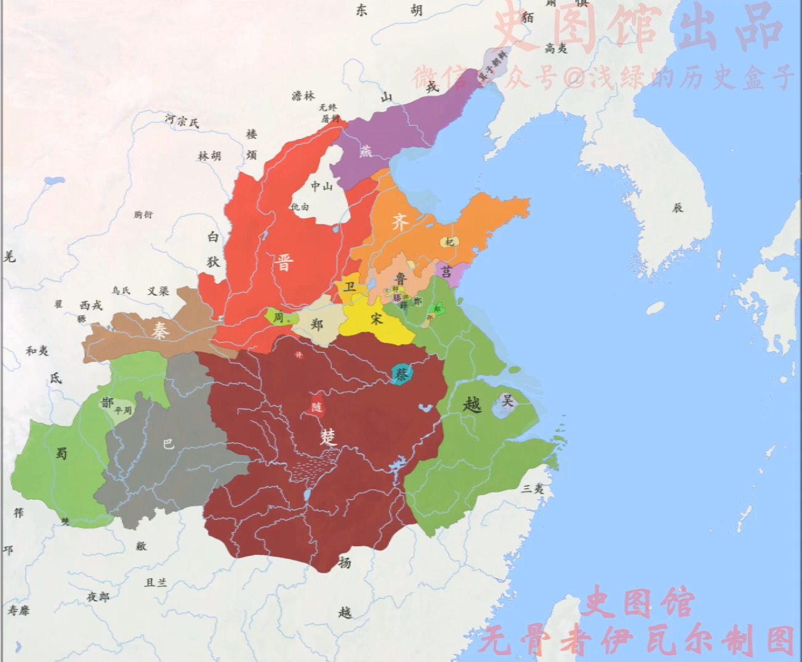

    主要诸侯:晋定公 楚惠王 齐平公 秦厉共公 宋景公 鲁哀公 卫出公 郑声公 蔡成侯 燕孝公 吴王夫 差越王勾践

#### 公元前 475 年--周元王元年

> 赵鞅去世，智瑶继任晋国执政卿。
>
> > 晋定公去世，太子凿继位，是为晋出公。
> >
> > > 晋国赵无恤(赵鞅之子)消灭代国。

- 十一月，越王勾践率军包围吴国都城。

#### 公元前 473 年--周元王三年

- 十一月，越灭吴，吴王夫差自杀。

#### 公元前 472 年--周元王四年

- 六月，晋国智瑶率军伐齐，战于犁丘,齐
  军大败。
- 越王勾践伐莒
  ”
  取琅琊。

#### 公元前 471 年--周元王五年

- 四月，晋、鲁联军伐齐，攻取廩丘。

---

## 周贞定王

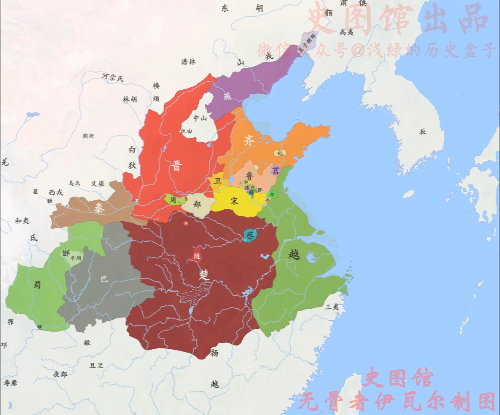

    主要诸侯:晋出公 楚惠王 齐平公 秦厉共公 宋后昭公 鲁哀公 卫悼公 郑声公 蔡声侯 燕孝公 越王勾践

#### 公元前 468 年--周贞定王元年

- 四月，晋国智瑶率军伐郑，齐国田恒率军救郑。
- 鲁哀公计划铲除“三桓” (季氏、孟氏、叔孙氏)，以失败告终。
- 八月，鲁哀公被迫逃往越国。
- 鲁国人迎接哀公回国，哀公死于大夫公孙有山家中。

#### 公元前 464 年--周贞定王五年

- 越王勾践去世，楚惠王夺取泗上诸地。
- 晋国智瑶率军伐郑。

#### 公元前 461 年--周贞定王八年

- 秦厉共公灭大荔。

#### 公元前 458 年--周贞定王十一年

- 晋国智瑶率军灭仇由。

#### 公元前 457 年--周贞定王十二年

- 晋国智瑶伐中山，取穷鱼之丘。
- 秦厉共公伐绵诸。

#### 公元前 456 年--周贞定王十三年

- 晋伐秦，取武城。

#### 公元前 455 年--周贞定王十四年

- 晋国内战爆发，智瑶联合韩虎、魏驹进攻赵无恤，赵无恤退守晋阳。
- 郑人弑郑哀公。

#### 公元前 453 年--周贞定王十六年

> 韩、魏两家反水，与赵家一同进攻智家，智瑶兵败被杀。
>
> > 韩、赵、魏三家瓜分智家封地。.

#### 公元前 452 年--周贞定王十七年

> 韩、赵、魏三家对智氏族人进行清算，晋大夫智开率其邑奔秦，秦国趁乱收取河西地区。
>
> > 晋出公对三家的专横感到十分不满，因此打算向齐、鲁借兵铲除三家，结果事情败露。
> >
> > > 三家联合驱逐晋出公，出公奔楚，死于路途。

#### 公元前 451 年--周贞定王十八年

- 秦伐蜀，修筑南郑城。

#### 公元前 450 年--周贞定王十九年

- 秦伐蜀，修筑南郑城。

#### 公元前 447 年--周贞定王二十二年

- 楚惠王灭蔡。

#### 公元前 445 年--周贞定王二十四年

- 楚惠王灭杞。

#### 公元前 444 年--周贞定王二十五年

- 秦厉共公伐义渠。

---

## 周哀王 周思王

#### 公元前 441 年--周哀王元年

    主要诸侯:晋哀公 楚惠王 齐宣公 秦躁公 宋后昭公 鲁悼公 卫敬公 郑共公 燕成公 越王朱勾

- 秦国南郑反叛，复归蜀。
- 三月，王子叔(哀王之弟)弑**周哀王**。王子叔自立为王，是为**周思王**。
- 八月，王子嵬(哀王、思王之弟)弑**周思王**。王子嵬自立为王，是为**周考王**。

---

## 周考王

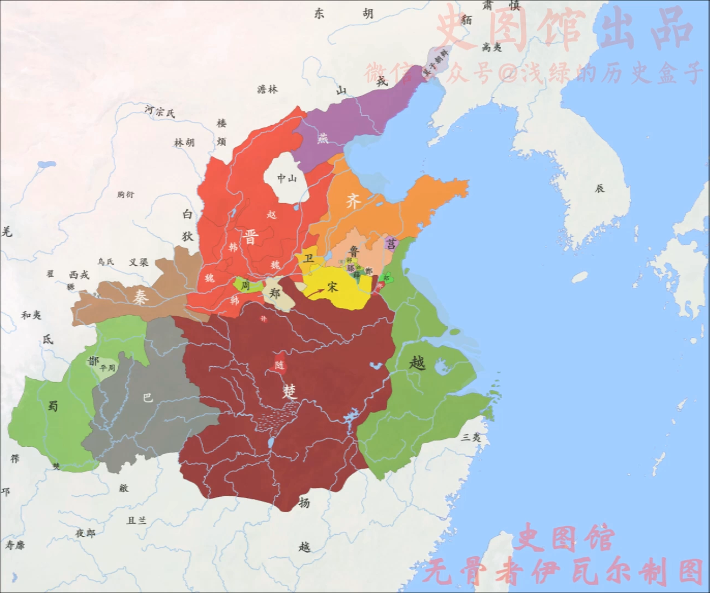

    主要诸侯:晋哀公 楚惠王 齐宣公 秦躁公 宋后昭公 鲁悼公 卫敬公 郑共公 燕成公 越王朱勾

#### 公元前 439 年--周考王二年

- 楚惠王伐宋。

#### 公元前 431 年--周考王十年

- 楚简王灭莒。

#### 公元前 430 年--周考王十一年

- 晋、越伐齐，入齐长城。
- 义渠伐秦，侵至渭阳。

---

## 周威烈王

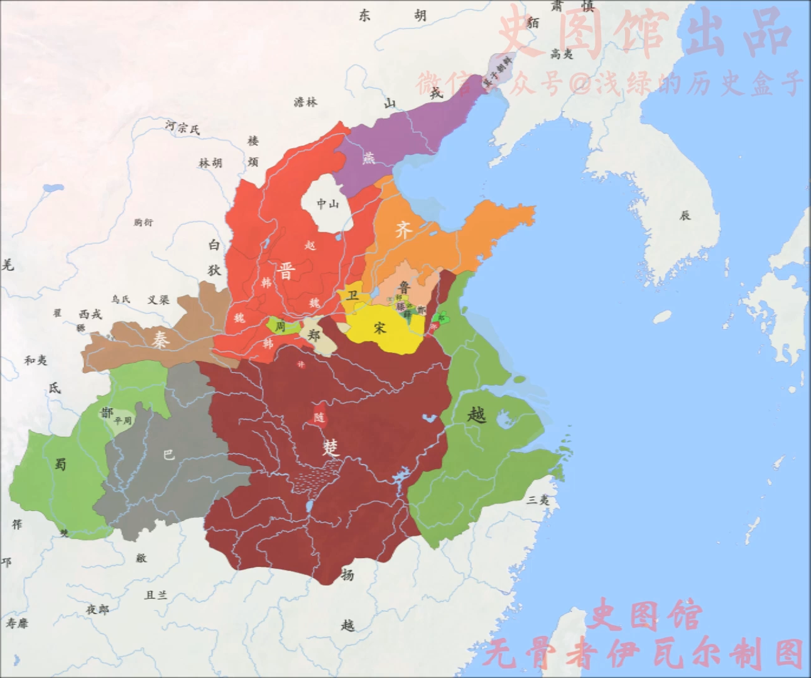

    主要诸侯:晋幽公 楚简王 齐宣公 秦灵公 宋后昭公 鲁元公 卫怀公 郑幽公 燕闵公 越王朱勾

#### 公元前 423 年--周威烈王三年

- 晋国韩启章伐郑，杀郑幽公。

#### 公元前 422 年--周威烈王四年

- 楚简王取雍丘、黄池。
- 晋国魏斯、赵浣、韩启章率军伐楚，包围黄池。

#### 公元前 421 年--周威烈王五年

- 楚国阳为率军侵晋，取宜阳。
- 晋国三家击退楚军。

#### 公元前 419 年--周威烈王七年

- 魏筑城于少梁，秦攻少梁。

#### 公元前 415 年--周威烈王十一年

- 鲁穆公实行新政，打击“三桓” 家族。
- 鲁国季氏占据费、卞等地，建立费国。
- 卫公子颓弑卫怀公。

#### 公元前 414 年--周威烈王十二年

- 越王朱勾灭滕。

#### 公元前 413 年--周威烈王十三年

- 越王朱勾灭郯。
- 齐伐晋，毁黄城，围阳狐。
- 楚伐晋南鄙，到达上洛。
- 晋国魏斯伐秦，在郑地击败秦军。

#### 公元前 412 年--周威烈王十四年

- 魏伐秦，取繁庞。
- 齐国田白伐楚，取莒。

#### 公元前 411 年--周威烈王十五年

- 齐伐鲁，取邰。

#### 公元前 409 年--周威烈王十七年

- 吴起伐秦，取五城。
- 魏筑临晋、元里。

#### 公元前 408 年--周威烈王十八年

- 魏伐秦至郑，筑洛阴、合阳。
- 吴起为河西守。
- 韩虔伐郑，取雍丘。
- 齐伐鲁，取邸。

#### 公元前 407 年--周威烈王十九年

- 郑伐韩，取负黍。
- 魏设上郡。

#### 公元前 406 年--周威烈王二十年

- 魏灭中山。
- 齐伐卫，取母丘。

#### 公元前 405 年--周威烈王二十一年

- 齐国田会于廪丘叛乱。
- 越王翳灭鄭。

#### 公元前 404 年--周威烈王二十二年

- 晋三家伐齐，齐军大败。
- 三晋攻入齐长城。

---

# 东周-战国

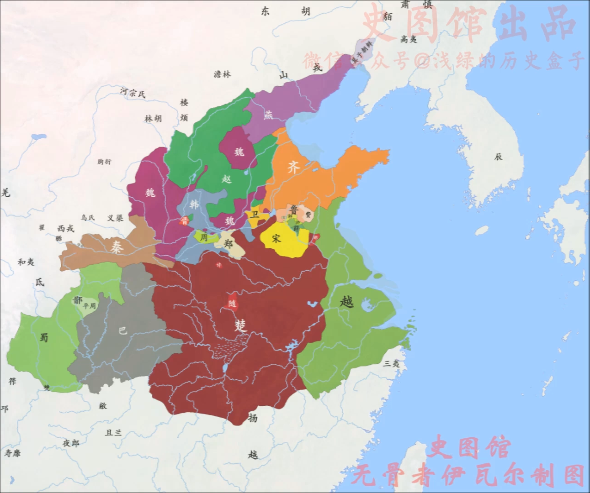

#### 公元前 403 年--周威烈王二十三年

> 周威烈王封韩、赵、魏三家为诸侯。
>
> > 三家分晋。

#### 公元前 402 年--周威烈王二十四年

- 楚声王率军伐宋，包围宋国都城。

---

## 周安王

    主要诸侯: 秦简公 楚声王 齐康公 赵烈侯 魏文侯 韩景侯 燕简公 越王翳 宋休公 鲁穆公 卫慎公 郑繻公 晋烈公

#### 公元前 401 年--周安王元年

- 秦简公伐魏，至阳狐。
- 郑縭公、宋休公朝拜楚声王。
- 楚声王下令增修榆关。

#### 公元前 400 年--周安王二年

- 楚声王遇刺，楚国内乱。
- 三晋伐楚，至乘丘。
- 郑伐韩，围阳翟。

#### 公元前 399 年--周安王三年

- 楚国王子定(楚声王之子，楚悼王之弟)出奔魏国。
- 郑国投靠魏国，出兵夺取楚国榆关。

#### 公元前 398 年--周安王四年

- 楚伐郑，在蔑地包围郑军，郑军投降。
- 郑繻公杀其相驷子阳。

#### 公元前 397 年--周安王五年

- 聂政刺杀韩相侠累。

#### 公元前 396 年--周安王六年

- 魏、韩联军在武阳大破楚军。
- 陈、蔡复国。
- 郑人弑郑繻公。

#### 公元前 395 年--周安王七年

- 秦惠公伐绵诸。

#### 公元前 394 年--周安王八年

- 郑国负黍反叛，归附韩国。
- 齐伐鲁，取最邑。

#### 公元前 393 年--周安王九年

- 楚伐韩，取负黍。

#### 公元前 391 年--周安王十一年

- 三晋伐楚，大破楚军于榆关。
- 魏国攻取楚国大梁。
- 秦救楚，伐韩宜阳。

#### 公元前 390 年--周安王十二年

- 齐伐魏，取襄陵。
- 秦、魏战于武城。
- 鲁军在平陆击败齐军。

#### 公元前 389 年--周安王十三年

- 阴晋之战，魏国吴起大破秦军。

#### 公元前 387 年--周安王十五年

- 秦伐蜀，取南郑。
- 吴起奔楚，楚悼王任用吴起为令尹，吴起在楚国主持变法。

#### 公元前 386 年--周安王十六年

- 田氏代齐，齐相田和(田齐太公)列为诸侯。

#### 公元前 385 年--周安王十七年

- 韩文侯伐郑，取阳城。
- 韩文侯伐宋，至彭城，俘获宋休公。

#### 公元前 384 年--周安王十八年

- 在吴起的经营下，楚国“南平百越，北并陈蔡”。其中陈国沦为楚国的附庸后，留在故地;蔡国则被南迁至高蔡(今湖南常德)。

#### 公元前 383 年--周安王十九年

- 赵伐卫，魏救卫，魏军在兔台击败赵军。

#### 公元前 382 年--周安王二十年

- 齐、魏助卫伐赵，取刚平，围中牟。

#### 公元前 381 年--周安王二十一年

- 楚军救赵伐魏，大破魏军，北进至大河。
- 赵军攻取魏国黄城。
- 楚悼王去世，楚国贵戚杀吴起。

#### 公元前 380 年--周安王二十二年

- 中山桓公复国。
- 齐伐燕，至桑丘。

#### 公元前 378 年--周安王二十四年

- 越王翳迁都吴。
- 韩、赵、魏伐齐至灵丘。

#### 公元前 377 年--周安王二十五年

- 蜀国击破巴国，伐楚至兹方。
- 赵伐中山，战于房子。

#### 公元前 376 年--周安王二十六年

- 楚国侵夺巴地。
- 赵伐中山，战于中人。

---

## 周烈王

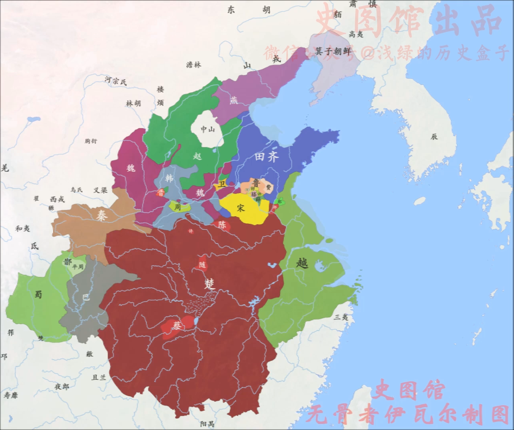

    主要诸侯: 秦献公 楚肃王 齐侯剡 赵敬侯 魏武侯 韩哀侯 燕简公 越王翳 宋桓公 鲁共公 卫声公 中山桓公 晋桓公

#### 公元前 375 年--周烈王元年

- 韩哀侯灭郑。
- 越国内乱，越太子诸咎弑越王翳，越人随后诛杀诸咎，滕、郯趁机复国。
- 魏伐楚，取榆关。

#### 公元前 373 年--周烈王三年

- 魏伐齐，至博陵。
- 鲁伐齐，入阳关。

#### 公元前 372 年--周烈王四年

- 卫伐齐，取薛陵，赵成侯救齐伐卫。

#### 公元前 371 年--周烈王五年

- 魏武侯伐楚，取鲁阳。
- 沦为楚国附庸的许国亦于此时灭亡。(注:魏灭许之事见《韩非子》)

#### 公元前 370 年--周烈王六年

- 赵成侯伐齐，取鄄。
- 魏武侯去世，二子(魏密、魏缓)争位。

#### 公元前 369 年--周烈王七年

- 浊泽之战，
- 韩、赵共伐魏。
- 魏螢击败魏缓，自立为君，是为魏惠王。
- 韩、赵迁晋桓公于屯留。

---

## 周显王

    主要诸侯:秦献公 楚宣王 齐桓公 赵成侯 魏惠王 韩懿侯 燕桓公 越王无余之 宋桓公 鲁共公 卫成侯 中山桓公 晋桓公

#### 公元前 368 年--周显王元年

- 赵侵齐，入齐长城。

#### 公元前 367 年--周显王二年

- 周王畿内分东、西周。

#### 公元前 366 年--周显王三年

- 洛阴之役，秦献公击败韩魏联军。

#### 公元前 365 年--周显王四年

- 魏惠王伐宋，取仪台。

#### 公元前 364 年--周显王五年

- 秦魏石门山之役，魏军大败。

#### 公元前 362 年--周显王七年

- 少梁之役，秦国攻占魏国繁庞。
- 魏惠王伐赵，取列人、肥。

#### 公元前 361 年--周显王八年

- 魏惠王伐赵，取皮牢。秦孝公灭源、翟之戎。
- 魏国用榆次、阳邑、繁阳换取赵国的泫氏中牟。
- 魏惠王迁都大梁。
- 越大夫寺忠弑越王莽安(无余之)o

#### 公元前 359 年--周显王十年

- 韩、赵迁晋桓公于端氏。

#### 公元前 358 年--周显王十一年

- 韩伐赵，取涅、长子。
- 西山之战，秦军击败韩军。

#### 公元前 357 年--周显王十二年

- 宋、魏伐韩，宋取韩黄池，魏取韩朱邑。
- 韩昭侯献轵道于魏。

#### 公元前 356 年--周显王十三年

- 第一次商鞅变法。
- 齐威王、赵成侯、宋桓公会于平陆。

#### 公元前 354 年--周显王十五年

- 魏伐赵，围邯郸。
- 秦大破魏于元里，取少梁。

#### 公元前 353 年--周显王十六年

> 魏国庞涓攻取邯郸，赵成侯逃往信都。
>
> > 齐威王使田忌、孙膑救赵，齐、魏战于桂陵，魏军大败。

- 韩侵周高都。

#### 公元前 352 年--周显王十七年

- 秦伐魏，取安邑。

#### 公元前 351 年--周显王十八年

- 秦伐魏，取固阳。
- 魏国归还赵国邯郸。
- 魏国收复安邑，取濩泽。

#### 公元前 350 年--周显王十九年

- 彤地会盟，魏秦修好。
- 第二次商鞅变法。
- 赵、魏伐燕，取夏屋。

#### 公元前 349 年--周显王二十年

- 韩、赵夺晋端氏，韩记弑晋静公，晋国彻底灭亡。

#### 公元前 344 年--周显王二十五年

- 逢泽之会，魏国称王。
- 赵肃侯攻齐，取高唐、平原。

#### 公元前 343 年--周显王二十六年

- 楚宣王彻底吞并陈、蔡两国。

#### 公元前 342 年--周显王二十七年

> 魏国庞涓、太子申率军伐韩，齐国田忌、孙膑伐魏救韩。
>
> > 齐、魏战于马陵，魏军大败，庞涓自杀，魏太子申被俘。

#### 公元前 341 年--周显王二十八年

- 齐、宋侵魏东鄙，秦国商鞅侵魏西鄙。

#### 公元前 340 年--周显王二十九年

- 吴城之役，商鞅俘获魏公子印
- 魏惠王修筑济阳城。

#### 公元前 339 年--周显王三十年

- 齐威王将邳国北迁，把下邳封给邹忌。

* 根据曾姬无卸壶铭文以及擂鼓墩二号墓年代分析，随国(曾国)直到楚威王时期才彻底被楚国吞并。

#### 公元前 338 年--周显王三十一年

- 秦魏岸门之战。
- 秦孝公去世，惠文王即位，车裂商鞅。

#### 公元前 335 年--周显王三十四年

- 楚威王攻韩、魏，取阳翟、鲁阳。

#### 公元前 334 年--周显王三十五年

- 齐威王、魏惠王会于徐州，互相承认对方
  为王。
- 楚威王击败越国。(注:根据鄂君启节铭文可知，楚怀王初年楚国已夺取越国在皖、赣一带的领土。据《吴越史新探》，楚国夺取这些领土极有可能在威王时。)

#### 公元前 333 年--周显王三十六年

- 楚伐齐，围徐州，郫国于此时被楚国灭亡。

#### 公元前 332 年--周显王三十七年

- 秦攻魏雕阴，魏割让阴晋求和。

#### 公元前 331 年--周显王三十八年

- 秦国全歼魏军于雕阴，魏国割让河西地。
- 卫国贬号称君，仅剩濮阳(帝丘)一地。

#### 公元前 329 年--周显王四十年

- 秦攻魏，取汾阴、皮氏、焦。

#### 公元前 328 年--周显王四十一年

- 魏国向秦国割让，上郡。

* 秦攻赵，取蔺、离石。

#### 公元前 327 年--周显王四十二年

- 秦国归还魏国河东失地。
- 赵国收复蔺、离石。

#### 公元前 325 年--周显王四十四年

- 齐威王伐赵，取平邑。
- 秦国称王，秦惠文王灭乌氏。

#### 公元前 323 年--周显王四十六年

- 楚怀王伐魏，取襄陵。
- 韩、赵、魏、燕、中山五国相互承认为王

#### 公元前 322 年--周显王四十七年

- 秦攻魏，取曲沃、平周。

---

## 周慎靓王

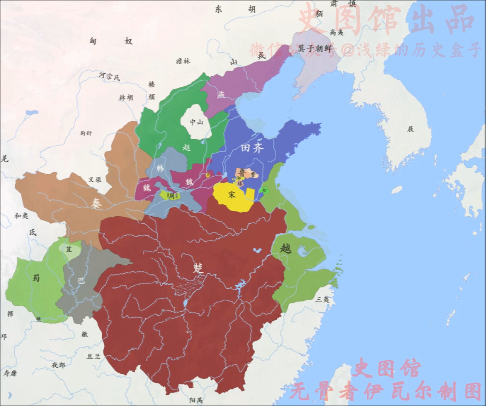

    主要诸侯:秦惠文王 楚怀王 齐宣王 赵武灵王 魏襄王 韩宣惠王 燕王哙 越王无疆 宋康王 鲁平公 卫嗣君 中山王厝

#### 公元前 318 年--周慎靓王三年

- 函谷关之战，五国共击秦，不胜而还。
- 宋国称王。

#### 公元前 316 年--周慎靓王五年

- 秦灭巴、蜀，巴国残余势力退往枳地。
- 秦攻赵，取中阳。
- 燕王哙禅位于相国子之。
- 楚怀王伐韩，置新城郡。

#### 公元前 315 年--周慎靓王六年

- 韩献阳、向于魏。

---

## 周赧王

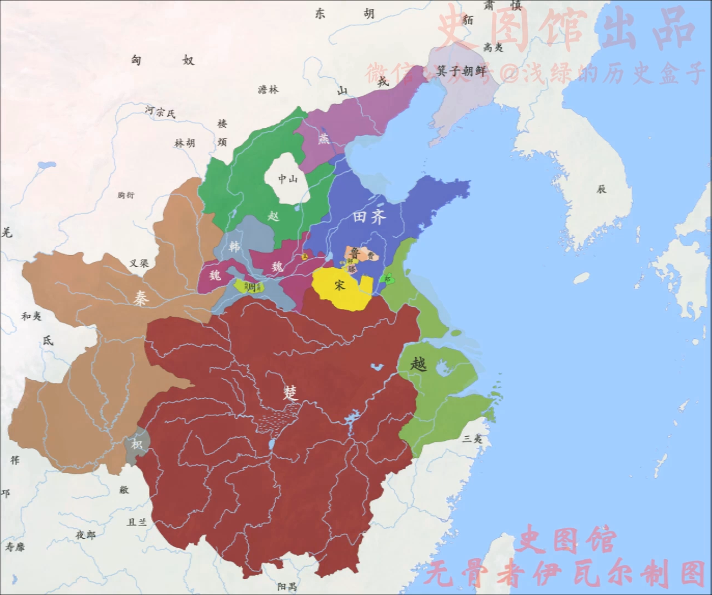

    主要诸侯:秦惠文王 楚怀王 齐宣王 赵武灵王 魏襄王 韩宣惠王 燕王子之 越王无疆 宋康王 鲁平公 卫嗣君 中山王厝

#### 公元前 314 年--周赧王元年

> 齐宣王派遣匡章伐燕，杀子之、燕王哙。
>
> > 赵武灵王派军护送公子职(燕王哙之子)入燕。

- 秦攻魏，取焦。
- 秦攻义渠，得二十五城。

#### 公元前 313 年--周赧王二年

- 燕人拥立公子职，是为燕昭王。
- 秦国樗里疾攻赵，取蔺。

#### 公元前 312 年--周赧王三年

- 楚攻韩，围雍氏，韩国归还周高都。
- 楚攻秦，战于丹阳、蓝田，秦军大破楚军。
- 韩、魏攻楚，到达邓地。
- 秦军反攻，夺取楚国汉中、上庸之地。

#### 公元前 308 年--周赧王七年

- 秦国甘茂、向寿伐韩。

#### 公元前 307 年--周赧王八年

- 赵武灵王“ 胡服骑射”，伐中山，北破楼烦、澹林。
- 秦军攻克韩国宜阳。
- 秦武王举鼎而死。

#### 公元前 306 年--周赧王九年

- 秦国宣太后主政。

> 赵武灵王伐林胡，至榆中。
> 赵武灵王伐中山，至宁葭。

> 楚攻越，杀越王无疆，拓境至浙江。
>
> > 越国残余势力四分五裂，一部分盘踞在琅琊、会稽等地，另一部分南下建立瓯越、闽越诸国。

#### 公元前 305 年--周赧王十年

- 赵武灵王伐中山，取十城，中山献四邑求和。

#### 公元前 304 年--周赧王十一年

- 秦国归还楚国上庸之地。

#### 公元前 303 年--周赧王十二年

- 赵武灵王攻中山。

> 秦攻魏，取蒲阪、阳晋、封陵。
> 秦攻韩，取武遂。

#### 公元前 302 年--周赧王十三年

- 秦国归还魏国蒲坂。
- 赵武灵王攻取河宗氏、休溷诸貉地。

#### 公元前 301 年--周赧王十四年

- 齐、韩、魏攻楚方城，战于垂沙，楚军大败。
- 秦攻楚，取穰城。
- 宋康王攻楚，取淮北地。
- 赵武灵王攻中山，中山王奔齐。

#### 公元前 300 年--周赧王十五年

- 秦攻楚，取新城。
- 赵武灵王攻中山，取扶柳。

#### 公元前 299 年--周赧王十六年

- 楚怀王赴秦，秦国扣押楚怀王。
- 赵武灵王攻中山。

#### 公元前 298 年--周赧王十七年

- 秦攻楚，取析。
- 齐、韩、魏攻秦，至函谷，韩国攻取秦国新城。
- 赵武灵王传位于太子何(赵惠文王)，赵武灵王自称“主父”

#### 公元前 297 年--周赧王十八年

- 宋康王灭滕。

#### 公元前 296 年--周赧王十九年

- 赵灭中山。
- 齐、韩、魏联军攻破函谷，秦国求和。
- 韩取武遂，魏取河外、封陵。
- 楚怀王死于秦。

#### 公元前 294 年--周赧王二十一年

- 秦国白起攻韩，取新城。
- 赵国归还燕国鄭、易。

#### 公元前 293 年--周赧王二十二年

- 伊阙之战，白起大破韩魏联军。

#### 公元前 291 年--周赧王二十四年

- 秦攻韩，取宛城。

#### 公元前 290 年--周赧王二十五年

- 魏国向秦国割让河东四百里。
- 韩国向秦国割让武遂二百里。

#### 公元前 289 年--周赧王二十六年

- 秦攻魏，至轵。

#### 公元前 288 年--周赧王二十七年

- 秦攻赵，取梗阳。

> 齐秦互帝，秦昭襄王称“ 西帝”，齐湣王称“东帝”。
>
> > 齐湣王称帝两天后取消帝号
> > 秦昭襄王随后也放弃称帝。

#### 公元前 287 年--周赧王二十八年

- 秦攻魏，取新垣、曲阳。

#### 公元前 286 年--周赧王二十九年

- 宋国内乱，齐潘王灭宋，宋康王奔魏，死于温地。
- 魏向秦割让安邑及河内。.

#### 公元前 285 年--周赧王三十年

- 楚国吞并枳地(巴国残余)

#### 公元前 284 年--周赧王三十一年

- 燕昭王命乐毅击齐。

* 燕、秦、韩、赵、魏五国联军伐齐，在济西大破齐军。
* 燕军连破齐国七十余城，齐湣王逃往莒城 最终被楚将淖齿杀死。
* 楚国夺取淮北之地。

#### 公元前 283 年--周赧王三十二年

- 秦攻魏，取安城，燕昭王、赵惠文王出兵救魏。
- 蔺相如完璧归赵。
- 燕将秦开击破东胡，开拓辽西之地。
  - (注:关于秦开击破东胡的年代，历来说法不一，此处依照《中国东北史》的观点）

#### 公元前 282 年--周赧王三十三年

- 秦攻赵，取蔺、祁。

#### 公元前 281 年--周赧王三十四年

- 秦攻赵，取离石。

#### 公元前 280 年--周赧王三十五年

- 秦国司马错伐楚，楚国割让上庸、汉北。
- 燕将秦开击破箕子朝鲜，拓地二千里，至满番汗为界(此处年代依照《中国东北史》)

#### 公元前 279 年--周赧王三十六年

- 燕昭王去世，乐毅奔赵。
- 秦昭襄王、赵惠文王会于渑池。
- 楚将庄蹯率军开拓黔中以西。
- 齐国田单大破燕军，齐国复国。
- 秦国白起攻楚，鄢郢之战，楚军大败。

#### 公元前 278 年--周赧王三十七年

- 秦军攻占郢都，楚顷襄王迁都陈，**屈原自沉**。
- 由于秦军截断归路，开拓西南的楚将庄蹯无法返回，于是率领部下占据滇池一带,建立滇国。

#### 公元前 277 年--周赧王三十八年

- 秦军攻占楚国的巫、黔中，白起被封为武安君。

#### 公元前 276 年--周赧王三十九年

- 赵国廉颇攻魏，取几。
- 楚国收复江南地。

#### 公元前 275 年--周赧王四十年

- 赵国廉颇攻魏，取防陵、安阳
- 秦国穰侯攻魏，魏献温邑求和

#### 公元前 274 年--周赧王四十一年

- 赵攻齐，取昌城、高唐。

#### 公元前 273 年--周赧王四十二年

- 华阳之战，白起大破魏赵联军。

#### 公元前 272 年--周赧王四十三年

- 秦灭义渠。
- 公孙操弑燕惠王。

#### 公元前 270 年--周赧王四十五年

- 秦攻齐，取刚、寿。

#### 公元前 269 年--周赧王四十六年

- 阏与之战，赵奢大破秦军。

#### 公元前 268 年--周赧王四十七年

- 秦攻魏，取怀。

#### 公元前 266 年--周赧王四十九年

- 秦攻魏，取邢丘。

#### 公元前 265 年--周赧王五十年

- 赵国归还齐国平原、高唐。
- 赵攻燕，取中阳。
- 赵国李牧北破澹林、匈奴。
- 秦攻韩，取少曲、高平。

#### 公元前 264 年--周赧王五十一年

- 秦攻韩，取陉城。

#### 公元前 262 年--周赧王五十三年

- 楚献州于秦。
- 秦攻韩，取野王，韩国上党归附赵国。

#### 公元前 261 年--周赧王五十四年

- 秦攻韩，取缑氏、纶。
- 楚攻鲁，取徐州。

#### 公元前 260 年--周赧王五十五年

- 长平之战，白起歼灭赵军，坑杀降卒。

#### 公元前 259 年--周赧王五十六年

- 秦军攻取赵国武安、太原，包围邯郸。

#### 公元前 257 年--周赧王五十八年

- 信陵君窃符救赵，邯郸解围。
- 秦昭襄王赐白起自尽。

#### 公元前 256 年--周赧王五十九年

- 秦攻韩，取阳城、负黍。
- 秦攻周，周赧王、西周公投降，周朝灭亡。
  - 周赧王被迁往梁城居住，不久后病逝。
- 楚灭鲁，楚军席卷泗水流域，吞并泗上诸小国。
- 韩、赵、魏、楚攻秦，韩国收复上党，魏国收复河东，赵国收复太原。
- 燕孝王攻赵，取昌城。

# 战国

## 秦昭襄王

    主要诸侯:秦昭襄王 楚考烈王 齐王建 赵孝成王 魏安僖王 韩桓惠王 燕孝王 卫怀君

#### 公元前 255 年--秦昭襄王五十二年

- 韩攻秦，取汝南。
- 秦取湔氐道。

#### 公元前 254 年--秦昭襄王五十三年

- 秦攻魏，取河东。
- 魏攻秦，取陶郡。

#### 公元前 251 年--秦昭襄王五十六年

- 燕赵部代之战，廉颇大破燕军。

## 秦孝文王

#### 公元前 250 年--秦孝文王元年

    主要诸侯:秦孝文王 楚考烈王 齐王建 赵孝成王 魏安僖王 韩桓惠王 燕王喜 卫元君

- 楚考烈王夺取越君亲占据的琅琊(事见《吴越春秋》)。
- 燕攻齐聊城。

## 秦庄襄王

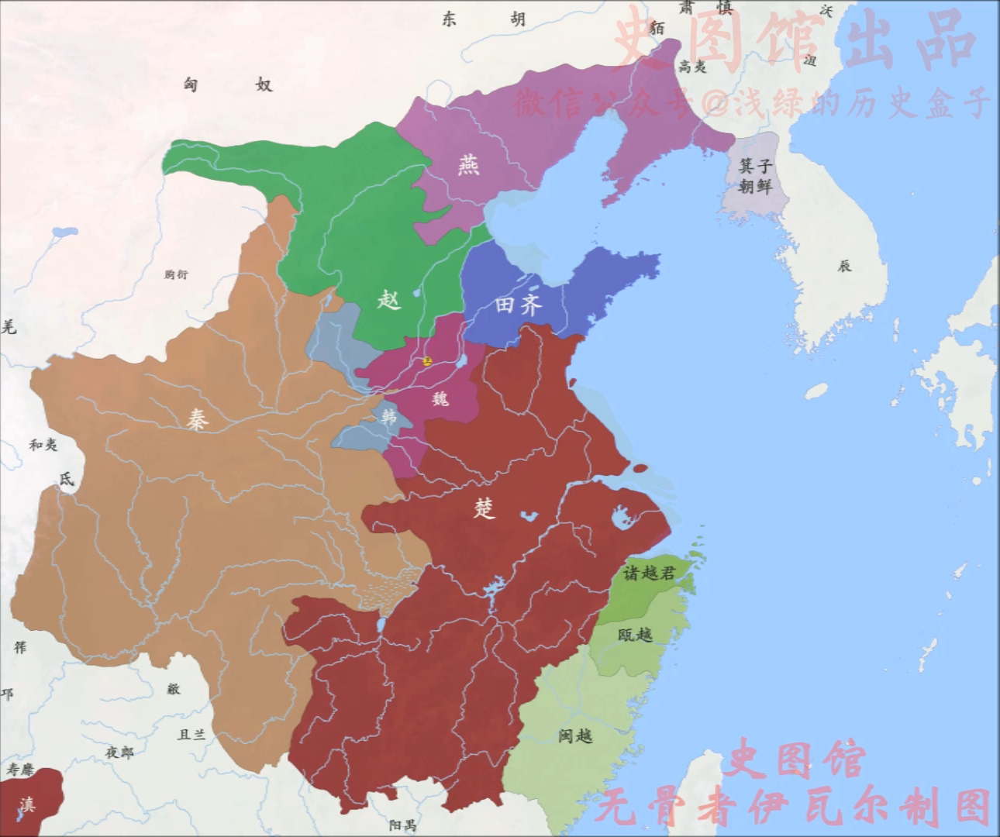

    主要诸侯:秦孝文王 楚考烈王 齐王建 赵孝成王 魏安僖王 韩桓惠王 燕王喜 卫元君

#### 公元前 249 年--秦庄襄王元年

- 秦灭东周国，迁东周君于阳人聚。
- 秦攻韩，取成皋、荥阳。
- 魏攻齐，取平陆。

#### 公元前 248 年--秦庄襄王二年

- 秦国蒙骜攻赵，取榆次、新城、狼孟。

#### 公元前 248 年--秦庄襄王三年

- 秦攻魏，取高都。
- 秦攻韩，取上党。
- 五国攻秦之战，信陵君击败秦军。
- 燕、赵互换土地。

## 秦王政

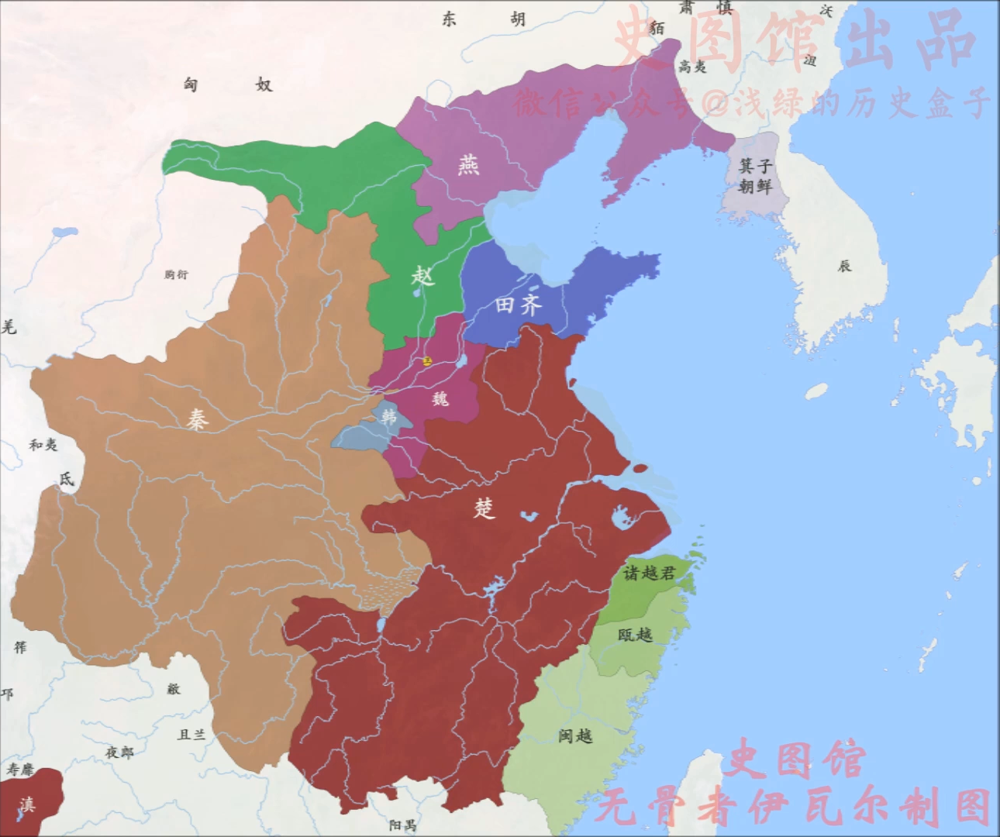
公元前 246 年
秦王政元年

    主要诸侯:秦王政 楚考烈王 齐王建 赵孝成王 魏安僖王 韩桓惠王 燕王喜 卫元君

#### 公元前 246 年--秦王政元年

- 秦攻赵，取晋阳。

#### 公元前 245 年--秦王政二年

- 秦攻魏，取卷。
- 赵国廉颇攻魏，取繁阳。

#### 公元前 243 年--秦王政四年

- 赵国李牧攻燕，取武遂、方城。

#### 公元前 242 年--秦王政五年

- 秦攻魏，取二十城，置东郡。

#### 公元前 241 年--秦王政六年

- 四国攻秦不胜。
- 楚考烈王迁都寿春。
- 赵攻齐，取饶安。
- 秦攻魏，取朝歌。
- 秦迁卫君于野王。

#### 公元前 240 年--秦王政七年

- 秦攻魏，取汲。

#### 公元前 239 年--秦王政八年

- 魏献邺城于赵。

#### 公元前 238 年--秦王政九年

- 秦攻魏，取首垣、蒲、衍。
- 楚国李园杀春申君。

#### 公元前 236 年--秦王政十一年

- 赵国李牧攻燕，取狸、阳城。
- 秦国王翦攻赵，取邺、阏与。

#### 公元前 234 年--秦王政十三年

- 秦攻赵，取雁门、云中。

#### 公元前 233 年--秦王政十四年

- 秦国桓骑攻赵，取平阳、武城。
- 秦王杀韩非。

#### 公元前 232 年--秦王政十五年

- 番吾之战，赵国李牧击败秦军。.
- 赵攻燕，取上谷。

#### 公元前 231 年--秦王政十六年

- 韩献南阳地。

| 时间                          |                               事件                               |        地图         |
| ----------------------------- | :--------------------------------------------------------------: | :-----------------: |
| 公元前 230 年--秦王政十七年   |                              秦灭韩                              | 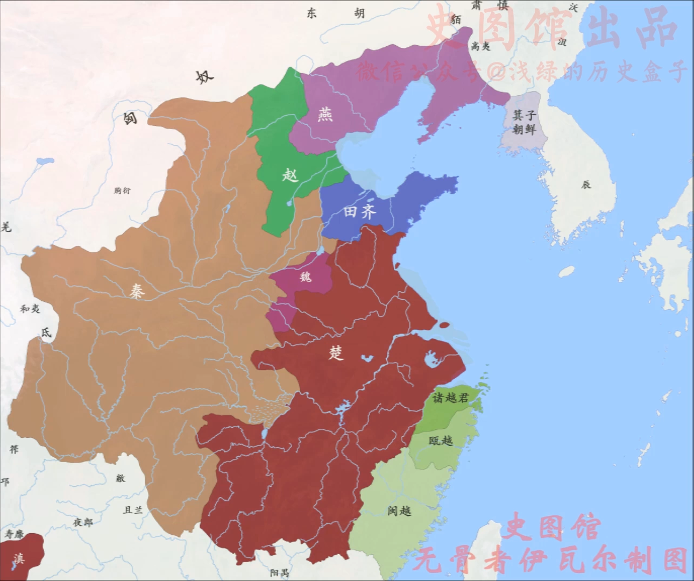 |
| 公元前 228 年--秦王政十九年   |          赵幽缪王杀李牧。 秦灭赵，赵公子嘉自立为代王。           |  |
| 公元前 227 年--秦王政二十年   |                    荆轲刺秦王。秦国王翦攻燕。                    |  |
| 公元前 226 年--秦王政二十一年 |                  王翦攻克蓟城，燕王喜东奔辽东。                  | 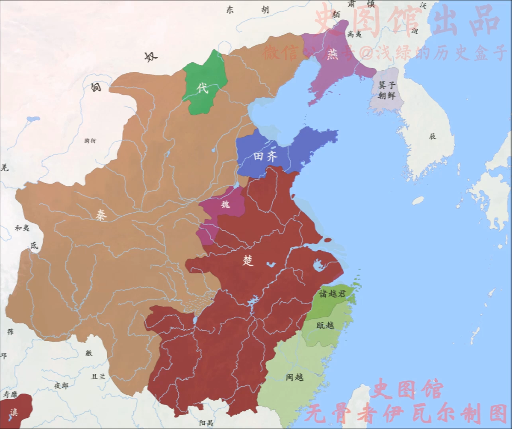 |
| 公元前 225 年--秦王政二十二年 |       王贲水淹大梁，秦灭魏。秦国李信攻楚，被楚将项燕击败。       | 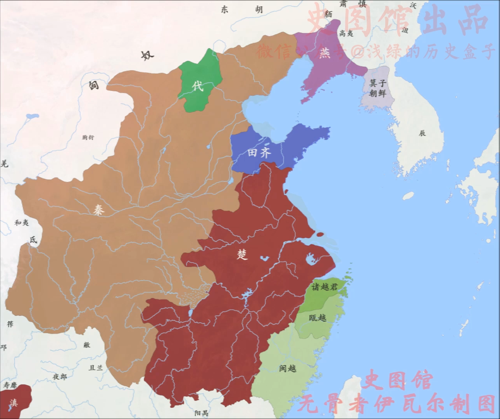 |
| 公元前 224 年--秦王政二十三年 |  秦国王翦击败楚军，取郢陈，俘获楚王负刍。项燕拥立昌平君为楚王。  | 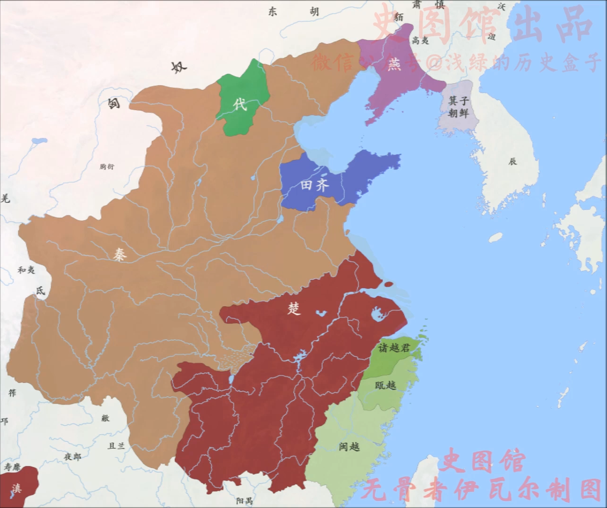 |
| 公元前 223 年--秦王政二十四年 |                  昌平君战死，项燕自杀，秦灭楚。                  | 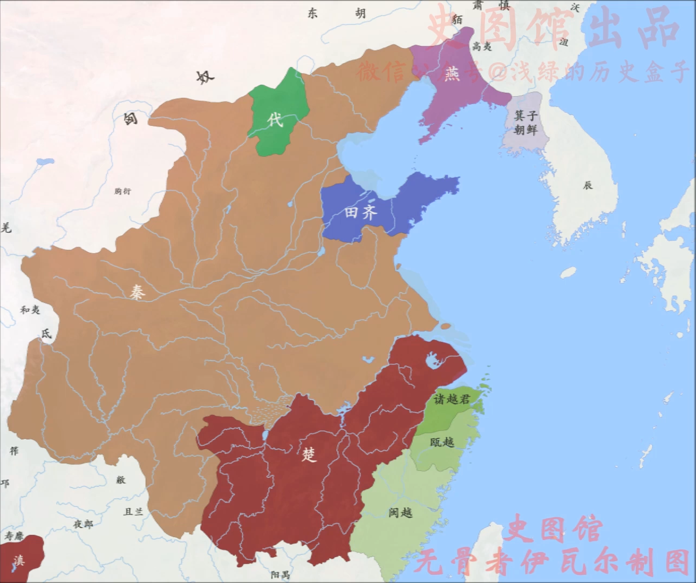 |
| 公元前 222 年--秦王政二十五年 | 王贲攻燕、代，燕王喜、代王嘉被俘。王翦平定楚国江南地，越君降秦。 | 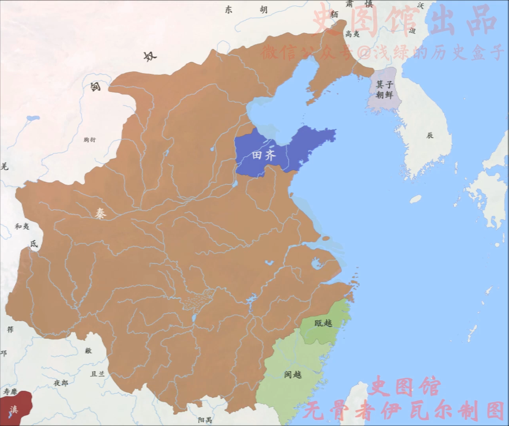 |

#### 公元前 221 年--秦始皇二十六年

- 王贲灭齐。
- 秦王政称始皇帝。

# 秦

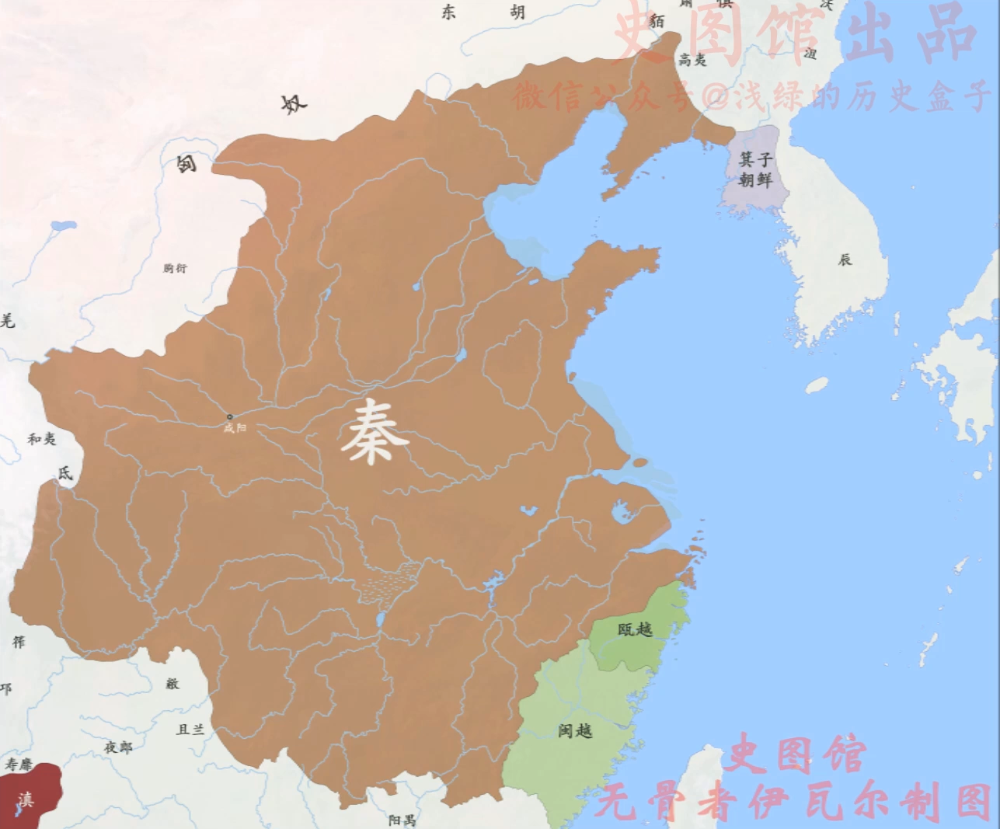

#### 公元前 220 年--秦始皇二十七年

- 车同轨书同文
- 始皇巡陇西
- 筑驰道

#### 公元前 219 年--秦始皇二十八年

- 始皇封禅
- 徐福出海

#### 公元前 218 年--秦始皇二十九年

- 博浪沙行刺
- 秦始皇东游

#### 公元前 215 年--秦始皇三十二年

- 蒙恬北伐匈奴

#### 公元前 214 年--秦始皇三十三年

- 任嚣赵佗南征百越
- 修筑长城
- 蒙恬夺河套
- 修成灵渠

#### 公元前 213 年--秦始皇三十四年

- 焚书

#### 公元前 212 年--秦始皇三十五年

- 始建阿房宫
- 坑儒

#### 公元前 210 年--秦始皇三十七年

- 沙丘之变
- 徐福东渡

## 秦二世

#### 公元前 209 年 7 月--秦二世元年

- 大泽乡起义
- 秦二世废卫君角
  00331006
