历史简述

### 约公元前 12000 年~ 约公元前 7000 年

- 新石器时代早期，陶器在中国境内出现。这一时期的部分遗址中还出现了农作物栽培的痕迹。

### 约公元前 7000 年

1. 新石器时代中期，澧阳平原的彭头山文化、东北地区的小河西文化、浦阳江流域的上山文化以及中原地区的贾湖文化相继兴起。

2. 在彭头山文化、上山文化、贾湖文化遗址中，均发现了稻作遗存，其中贾湖文化遗址还出土了带契刻符号的龟甲、骨笛。

### 约公元前 6000 年

1. 东北地区的兴隆洼文化（可能由小河西文化发展而来）兴起，其遗址中出土了迄今中国最古老的玉器。
2. 继上山文化之后，浙江地区的跨湖桥文化兴起，遗址中有迄今中国最古老的独木舟遗迹。
3. 渭河流域的大地湾文化、中原地区的裴李岗文化（可能由贾湖文化发展而来)兴起，以农业经济为主导的村落社会雏形已经形成。

### 约公元前 5300 年

1. 北辛文化兴起，海岱地区的原始农业初具规模。
2. 继兴隆洼文化之后，赵宝沟文化在辽西地区取得支配地位。

### 约公元前 5000 年

1. 新石器时代晚期，由大地湾文化演变而来的仰韶文化半坡类型兴起，彩陶文化圈迅速扩张，遍及中原地区。
2. 在长江下游地区，河姆渡文化、马家浜文化兴起，骨耜等农具得到广泛应用。

### 约公元前 4300 年

1. 北辛文化演变为大汶口文化。
2. 热河地区的红山文化兴起。
3. 长江中游地区的大溪文化兴起，早期城市出现(澧县城头山古城遗址)。

### 约公元前 4000 年

1. 仰韶文化庙底沟类型取代半坡类型。
2. 马家浜文化发展为崧泽文化。

### 约公元前 3800 年

- 仰韶文化向西发展，演变为马家窑文化

### 约公元前 3500 年

1. 仰韶文化后期，进入铜石并用时代。
2. 安徽舍山凌家滩文化遗址发现大型祭坛、大型貴族墓葬以及璋、璧、琮、璜等玉礼器，早期国家雏形出现。

### 约公元前 3500 年

1. 良渚文化取代崧泽文化。
2. 屈家岭文化兴起，长江中游的稻作农业进步繁荣。

### 约公元前 3000 年

1. 屈家岭文化繁荣，出现大规模城址群。
2. 良渚古城宫殿、外围水利工程始建。
3. 红山文化消亡，与之有一定传承关系的小河沿文化在西辽河流城兴起。

### 约公元前 2900 年

- 大汶口文化、屈家岭文化对仰韶晚期的影
  响促成了庙底沟二期文化的形成。

### 约公元前 2700 年

- **汉字出现** _汉字六书:象形、指事、形声、会意、转注、假借_
- 宝墩文化兴起，成都平原出现城址群。

### 公元前 2697 年

- 皇帝纪元元年

### 约公元前 2500 年

- 逐鹿之战-传说轩辕与蚩尤战于逐鹿

1. 良渚达到极盛。
2. 屈家岭文化发展为石家河文化。
3. 中原地区进入“龙山时期” 。

### 约公元前 2300 年

1. 良渚文化消亡。
2. 陕西石峁古城始建。

---

# 夏朝（约公元前 2070—1600）[470]

**定都安邑，华夏族，创建者禹**

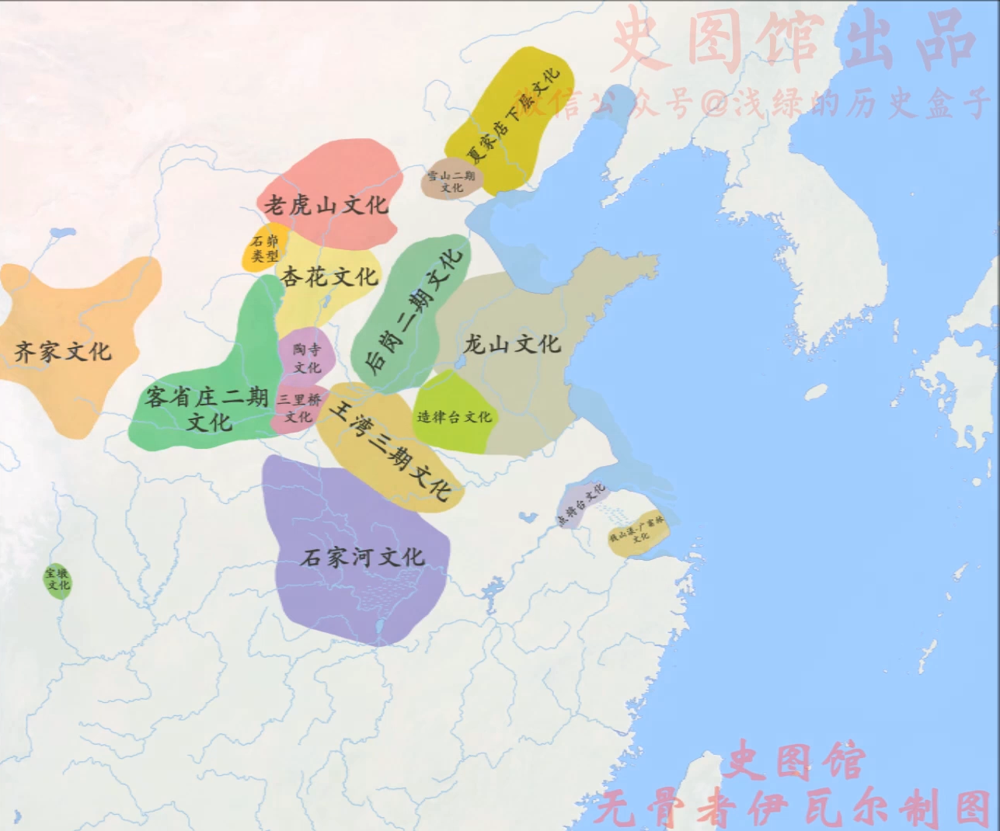

```
      卿云歌
卿云烂兮，糺缦缦兮。日月光华，旦复旦兮。
明明上天，烂然星陈。日月光华，弘于一人。
日月有常，星辰有行。四时从经，万姓允诚。
与予论乐，配天之灵。迁于圣贤，莫不咸听。
鼚乎鼓之，轩乎舞之。菁华已竭，褰裳去之。
```

### 约公元前 2070 年

1. 根据《古本竹书纪年》等史书推定的夏代起始年。
2. 有观点认为王湾三期文化(河南龙山文化)后期即夏代早期文化。也有观点将山西陶寺文化后期视为夏代早期文化。

### 约公元前 2000 年

- 石家河文化消亡，长江流城的城邦文明衰落。

### 约公元前 1900 年

1. “龙山时期”结束，河南新密新砦古城始建。新砦遗址年代介于河南龙山文化和二里头文化之间，因此考古学称之“新砦期文化“。
2. 有观点将“新砦期文化”视为史书中记载的“太康失国”到“少康中兴”期间的夏代。太康失国，后羿代夏。

### 约公元前 1800 年

- 石峁古城废弃。

### 约公元前 1750 年

- 二里头文化兴起，偃师二里头遗址被- -部分学者视为史书中记载的夏都斟那。

### 约公元前 1680 年

- 二里头文化二期，下七垣文化(先商文化)兴起。

### 约公元前 1600 年

- 漳河型下七垣文化(先商文化)南下。

### 约公元前 1559 年

- 鸣条之战-商汤打败夏桀 夏朝灭亡

---

# 商（约公元前 1675-1029）[554]

**亳，华夏族，汤**

    玄鸟 诗经商颂--天命玄鸟，降而生商，宅殷土茫茫。


### 约公元前 1510 年

- 二里岗文化早期一段，对应史书中商汤灭夏之后的商代初期。此阶段早商文化主要分布在河南省中西部的郑州、伊洛一线，兼及晋西南和陕西的关中东部地区。

### 约公元前 1500 年


- 早商文化向南扩张，抵达长江流城(黄陂盘龙城遗址、岳阳铜鼓山遗址)。

### 约公元前 1465 年

- 二里岗文化早期二段，早商文化达到极盛

### 约公元前 1415 年

- 二里岗文化晚期一段，商文化向外扩张的势头有所减弱。史书记载这一时期发生了铣人、邳人的叛乱。

### 约公兀前 1350 年

- 考古表明，盘龙城遗址约于此时废弃，商文化在长江流域的影响力消退。这或许与史书记载的“ 九世之乱”有关。

### 公元前 1300 年--商盘庚元年

- 甲骨文已是成熟文字
- 盘庚迁都于殷，**作《尚书·盘庚》，记言文之祖**

### 公元前 1228 年--商武丁三十二年


- 武丁伐鬼方。

### 公元前 1201 年--商武丁五十九年

- 武丁中兴。

### 公元前 1189 年--商祖甲元年

- 祖甲改制。

|    公元时间    | 商时           | 周时           |                    事件                    |
| :------------: | :------------- | :------------- | :----------------------------------------: |
| 公元前 1144 年 | 商武乙元年     | 周古公亶父元年 |           古公亶父率领周人迁于岐           |
| 公元前 1121 年 | 商武乙二十四年 | 周王季三年     |                 周王季灭程                 |
| 公元前 1115 年 | 商武乙三十年   | 周王季九年     |                周王季伐义梁                |
| 公元前 1110 年 | 商武乙三十五年 | 周王季十四年   |       周王季伐西落鬼戎，俘其二十翟王       |
| 公元前 1108 年 | 商文丁二年     | 周王季十六年   |           周王季伐燕京之戎，大败           |
| 公元前 1106 年 | 商文丁四年     | 周王季十八年   |     周王季伐余无之戎，文丁命王季为牧师     |
| 公元前 1103 年 | 商文丁七年     | 周王季二十一年 |              周王季伐始呼之戎              |
| 公元前 1099 年 | 商文丁十一年   | 周王季二十五年 | 周王季伐翳徒之戎，赴殷进献战俘。文丁杀王季 |
| 公元前 1095 年 | 商帝乙二年     | 周文王四年     |                  周人伐商                  |
| 公元前 1087 年 | 商帝乙十年     | 周文王十二年   |                 帝乙征盂方                 |
| 公元前 1066 年 | 商帝辛十年     | 周文王三十三年 |                 帝辛征人方                 |
| 公元前 1061 年 | 商帝辛十五年   | 周文王三十八年 |                帝辛再征人方                |
| 公元前 1057 年 | 商帝辛十九年   | 周文王四十二年 |             周文王断虞、芮之讼             |
| 公元前 1056 年 | 商帝辛二十年   | 周文王四十三年 |                周文王伐犬戎                |
| 公元前 1055 年 | 商帝辛二十一年 | 周文王四十四年 |                周文王伐密须                |
| 公元前 1054 年 | 商帝辛二十二年 | 周文王四十五年 |                 周文王伐黎                 |
| 公元前 1053 年 | 商帝辛二十三年 | 周文王四十六年 |                 周文王伐邘                 |
| 公元前 1052 年 | 商帝辛二十四年 | 周文王四十七年 |            周文王伐崇。周筑丰邑            |
| 公元前 1050 年 | 商帝辛二十六年 | 周文王四十九年 |               周文王迁都于丰               |

### 公元前 11 世纪

- **周文王被囚于羑里，演《易》八卦为六十四卦** _《易经》包括《连山）、《归藏》、《周易》三部，今仅存《周易》_

### 公元前 1049 年--商帝辛二十七年/周文王五十年

1. 周文王崩，武王继位。
2. 周武王观兵于盟津。

### 公元前 1046 年--商帝辛三十年/周武王三年

1. 牧野之战，周师克商。
2. 帝辛自焚，商朝灭亡。
3. 周武王封帝辛之子武庚于殷商故地，延续商朝祭祀。

---

---

# 周（约公元前 1029-771）[275]

**镐京，华夏族，姬昌**


    文王 诗经大雅--文王在上，于昭于天。周虽旧邦，其命维新。

### 公元前 1045 年--周武王四年

1. 殷商贵族箕子被周武王释放后，率领一部
   分殷商遺民向北迁徙，建立箕子朝鲜。
   (注:辽西地区有带“其侯”铭文的青铜
   器出土，早期箕子朝鲜或在辽西大凌河流
   域。)
2. 武王崩，成王年幼，周公摄政。

---

## 周成王

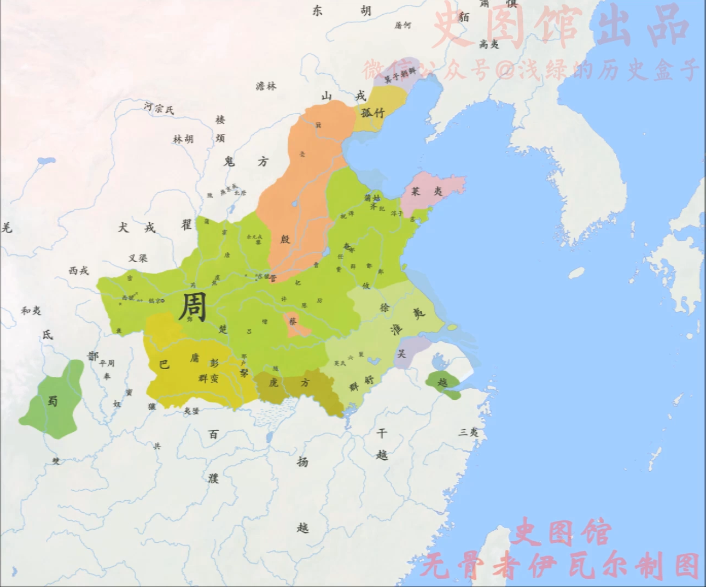

### 宅兹中国


- "宅兹中国"出自西周国宝级青铜器何尊铭文，铭文记述了周成王继承周武王遗志，营建成周(今洛阳)之事。而铭文中的“宅兹中国”是“中国”一词迄今发现的最早来源。
- 中国，3000 年前被镌刻于方寸之间，深埋于地下。3000 年后，埋藏它的泥土和这泥土连接的 1045 万平方公里的土地，都被它命名，叫做：中国。

#### 公元前 1044 年--周成王元年

- 武庚、管叔、蔡叔叛乱。

#### 公元前 1043 年--周成王二年

- 奄人、徐人、淮夷叛乱，周公东征。

#### 公元前 1042 年--周成王三年

1. 周公平定武庚叛乱，诛杀管叔鲜，流放蔡
   叔度。
2. 周灭蒲姑。

#### 公元前 1041 年--周成王四年

- 周公伐淮夷，灭奄。

#### 公元前 1040 年--周成王五年

1. 周公迁殷民于洛邑。
2. 鲁、燕、卫、宋受封。

---

## 周康王

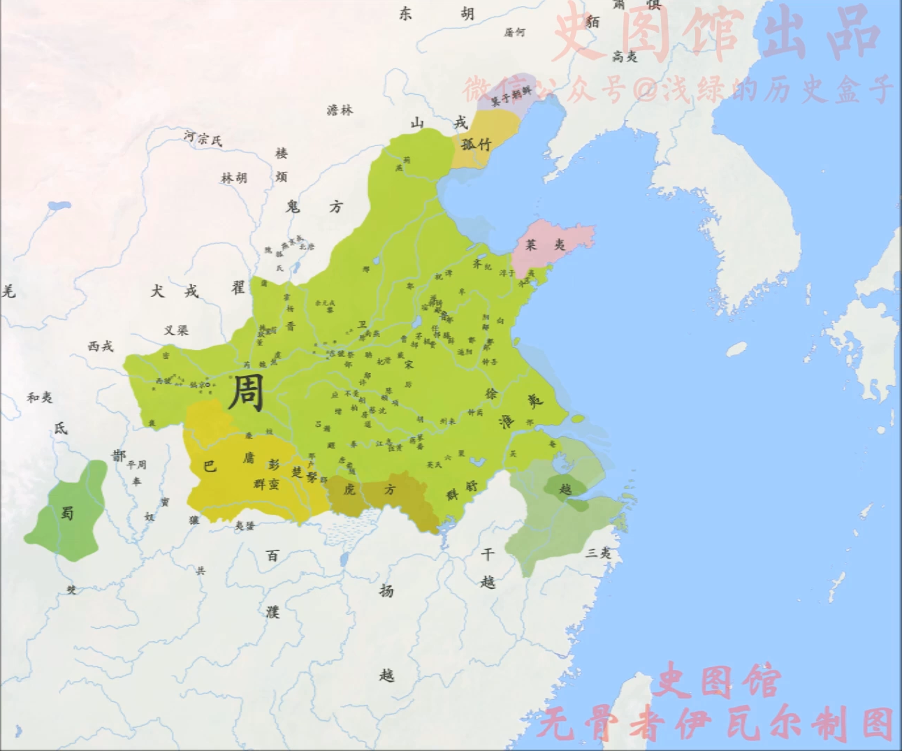

#### 公元前 1007 年--周康王元年

- 成康之治。

#### 公元前 983 年--周康王二十五年

- 周康王伐鬼方。

---

## 周昭王


#### 公元前 967 年--周昭王十六年

- 周昭王南征。

#### 公元前 964 年--周昭王十九年

1. 周昭王再次南征。
2. 周昭王溺死于汉水。

---

## 周穆王

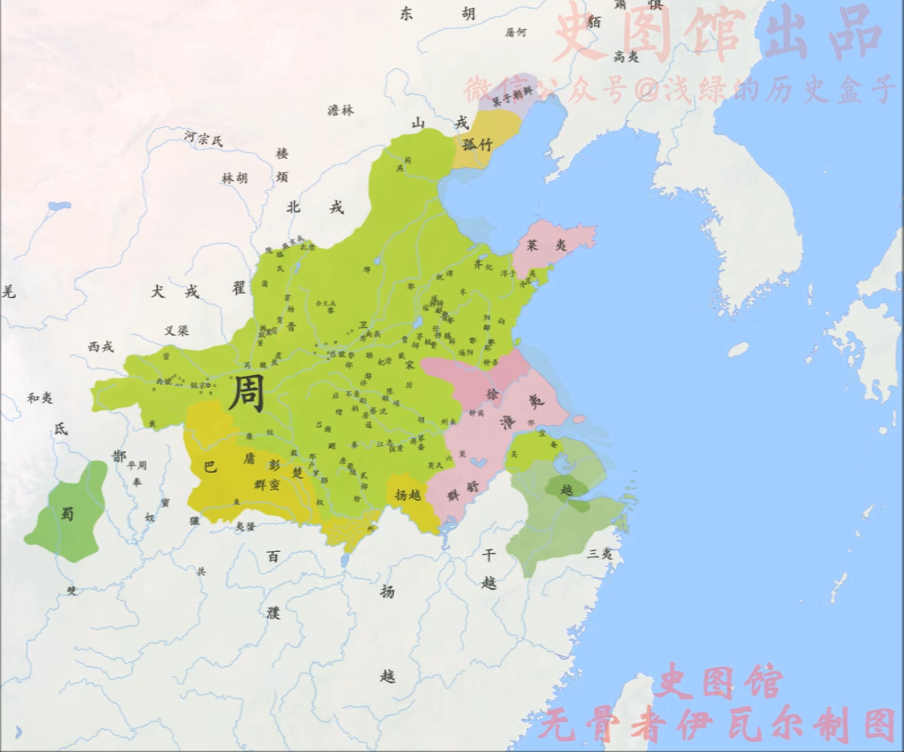

#### 公元前 951 年--周穆王十三年

- 周穆王西征犬戎，徐偃王率淮夷伐周。

#### 公元前 950 年--周穆王十四年

- 周穆王伐徐。

#### 公元前 927 年--周穆王三十七年

- 周穆王伐越，东至九江。

---

## 周共王

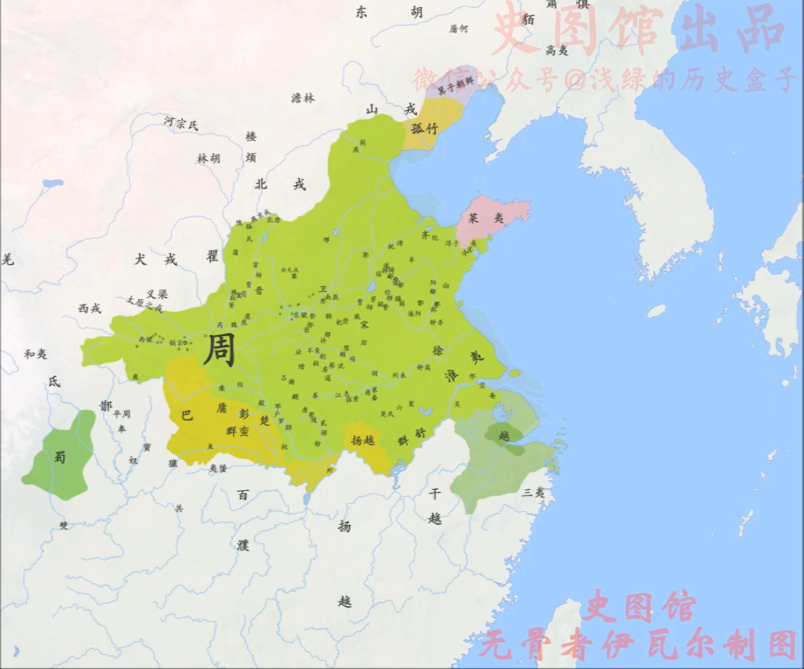

#### 公元前 919 年--周共王四年

- 周共王灭密。

---

## 周懿王


#### 公元前 899 年--周懿王元年

- 周室始衰。

#### 公元前 885 年--周懿王十五年

- 周懿王自宗周迁于犬丘。

#### 公元前 879 年--周懿王二十一年

- 號公北伐犬戎，大败。

---

## 周孝王


#### 公元前 875 年--周孝王元年

1. 周懿王崩，其叔辟方夺位，是为周孝王。
2. 孝王将都城迁回镐京。
3. 申侯伐西戎。
4. 秦非子被封为附庸。

---

## 周夷王

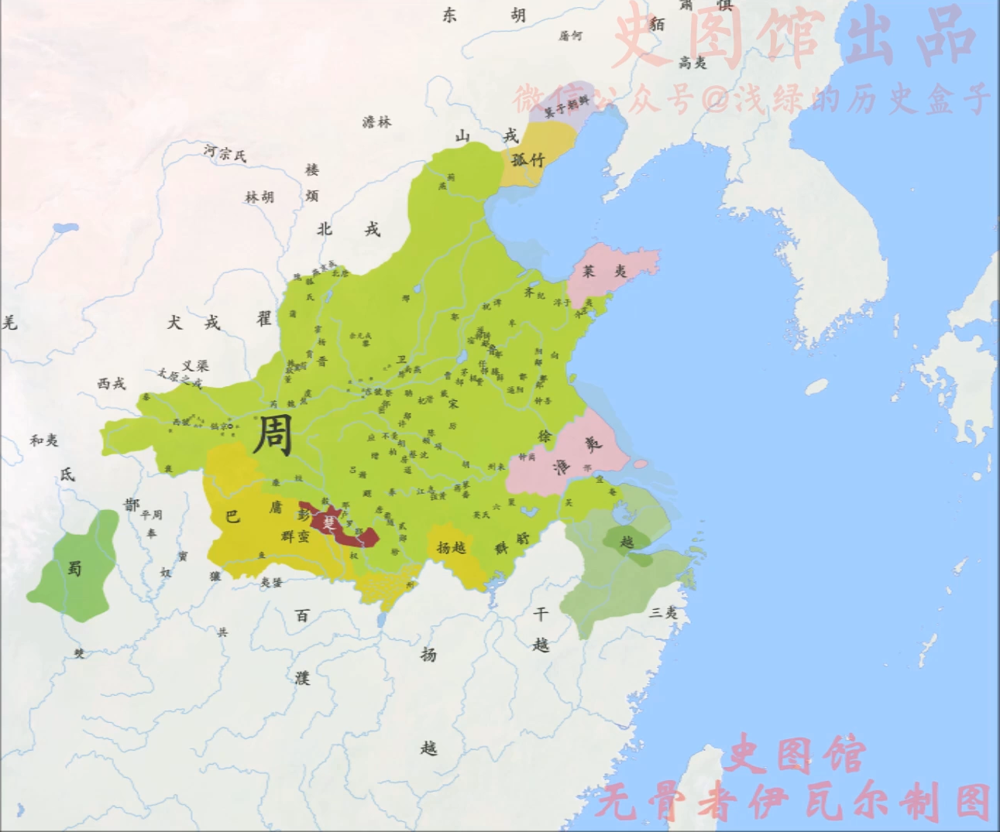

#### 公元前 863 年--周夷王七年

1. 周夷王命虢公伐太原之戎，获马千匹。
2. 楚子熊渠僭号，封其三子为王。楚人西征
   庸国，东伐扬越。

---

## 周厉王


#### 公元前 855 年--周厉王三年

- 周厉王伐淮夷。

---

## 共和

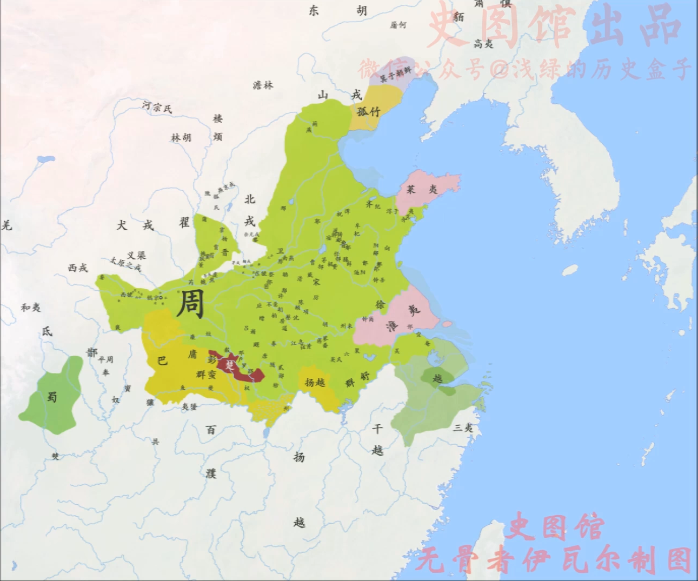

#### 公元前 841 年--共和元年

1. 国人暴动，周厉王出奔彘地。
2. 共伯和(共国国君，名和)代理政事。
   (注:此处依照《清华简.系年》《古本
   竹书纪年》的记载，不采用《史记》。周
   、召二公共和行政”的说法。)
3. 周厉王末年以来，戎狄大规模入侵周朝，
   西犬丘一带的大骆之族被西戎灭亡。

#### 公元前 828 年--共和十四年

- 周厉王在彘地去世，召穆公拥立厉王的太
  子静即位，是为周宣王。共伯和代理政事
  结束。

---

## 周宣王

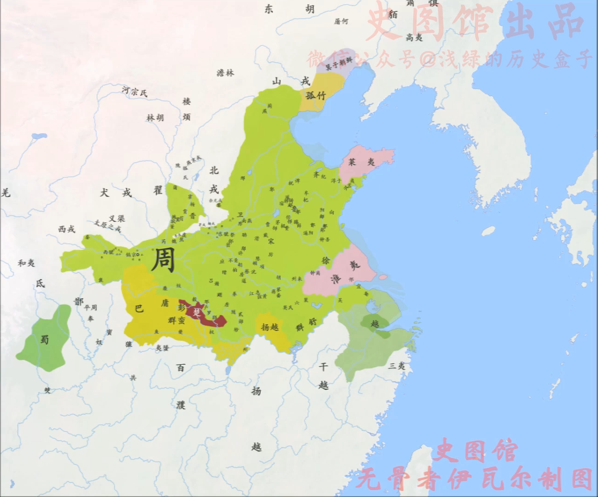

#### 公元前 824 年--周宣王四年

- 秦仲伐西戎。

#### 公元前 823 年--周宣王五年

- 周宣王派遣方叔率军伐楚。

#### 公元前 822 年--周宣王六年

1. 周宣王伐淮夷。
2. 西戎杀秦仲。
3. 楚子熊霜去世，楚国内乱。

#### 公元前 816 年--周宣王十二年

1. 周宣王命虢宣公伐犬戎。
2. 周宣王迫使鲁武公废长立幼。
3. 齐人弑齐厉公。

#### 公元前 802 年--周宣王二十六年

- 晋穆侯伐千亩之戒。

#### 公元前 797 年--周宣王三十一年

- 周宣王伐太原之戎。

#### 公元前 792 年--周宣王三十六年

- 周宣王伐条戎、奔戎，王师大败。

#### 公元前 790 年--周宣王三十八年

- 晋穆侯大破北戎于汾隰，戎人灭姜候之邑

#### 公元前 789 年--周宣王三十九年

- 周宣王伐姜戎，战于千亩，王师大败。

---

## 周幽王


#### 公元前 779 年--周幽王三年

1. 周幽王宠褒奴。
2. 伯士伐六济之戎，大败。

#### 公元前 776 年--周幽王六年

- 西戎围西犬丘，秦襄公迁居汧(qian)。

#### 公元前 774 年--周幽王八年

1. 周幽王废太子宜白，太子宜臼出奔西申。
2. 幽王立伯服(褒奴所生)为太子。
3. 郑桓公东迁。

#### 公元前 772 年--周幽王十年

- 周幽王伐西申。

#### 公元前 771 年--周幽王十一年

- 犬戎攻陷镐京，杀周幽王、太子伯服。

---

---

# 东周-春秋（公元前 770-476）


## 周平王

#### 公元前 770 年--周平王元年

    主要诸侯:晋文侯 楚若敖 齐前庄公 秦襄公 宋戴公 鲁孝公 卫武公 郑桓公 陈平公 蔡僖侯 曹惠公 燕项侯

(注:《史记。 郑世家》记载郑桓公死于上一年，有误。 此处据《左传》《公羊传》《韩非子》改正)

- 周幽王被杀后，虢公翰在虢地拥立王子余臣(幽王弟)，是为周携王。周携王与之前申侯(西申)拥立的周平王(幽王子)并立，周王室出现“二王并立”的局面。在晋文侯的主导下，周平王从西申东迁洛邑。秦襄公出兵护送平王东迁，因功由附庸升为诸侯。

#### 公元前 769 年--周平王二年

- 根据《国语》《公羊传》的记载，郐君夫人叔坛被郑桓公买通，因此郑军得以顺利袭取郐国都城，郐国就此灭亡。

#### 公元前 768 年--周平王三年

- 据《竹书纪年》， 齐国于此年攻灭祝国。

#### 公元前 767 年--周平王四年

- 郑桓公攻灭东虢(即“二 年而灭郐，四年
  而灭虢”)。

#### 公元前 766 年--周平王五年

- 秦襄公伐戎，死于岐。

#### 公元前 765 年--周平王六年

- 郑武公(郑桓公之子)被周平王任命为卿士，他继续进行扩张，吞并了邻近的密国。

#### 公元前 760 年--周平王十一年

- 蛮人侵周，晋文侯、蔡共侯率军击破蛮军郑武公又吞并了鄢国与胡国(此为董姓胡国，在今河南郾城，与安徽阜阳的归姓胡国并非一国)。

#### 公元前 757 年--周平王十四年

- 据《竹书纪年》，晋文候于此年灭韩。(注:此韩国是周武王之子的封国，并非战国时期的韩国)

#### 公元前 750 年--周平王二十一年

1. 晋文侯攻杀周携王， “二王并立”的局面结束。
2. 秦文公击败戎人，向东拓土，西申约于此时灭亡。
3. 郑武公继续扩张，先后吞并聃国、胙国、邗国。
4. 楚蚡冒征伐濮人，向南拓土。

#### 公元前 745 年--周平王二十六年

- 晋文侯去世后，其子晋昭侯继位。晋昭侯把叔父成师(晋文侯之弟)封在曲沃，是为曲沃桓叔沃桓叔擅长笼络人心，因此曲沃的影响力迅速超当时的晋都翼城(即蜂城，此时晋候也被称为“翼侯” )

#### 公元前 743 年--周平王二十八年

- 郑武公去世后，其子郑庄公继位。庄公的母亲武姜偏爱小儿子段，因此要求庄公把段封在京邑。

#### 公元前 739 年--周平王三十二年

- 晋国大夫潘父杀害晋昭候，迎立曲沃桓叔
  结果曲沃桓叔被国人击退。国人拥立晋
  昭候之子晋孝侯，并诛杀潘父。

#### 公元前 729 年--周平王四十二年

- 据《竹书纪年》，此年狄人侵晋。
- 郑国的叔段(郑庄公之弟)不断扩大势力将郑国西部和北部的边邑据为己有。

#### 公元前 724 年--周平王四十七年

- 曲沃庄伯(曲沃桓叔之子)攻杀晋孝侯，
  晋人立孝侯之弟鄂侯。

#### 公元前 722 年--周平王四十九年

- **《春秋》记事始年，一字寓褒贬，微言大义**

1. 叔段打算突袭郑庄公，结果以失败告终。郑庄公派遣公子吕率军进攻京邑，京邑人背叛叔段，叔段逃往鄢邑。五月，郑伯克段于鄢。
2. 卫桓公伐郑，攻取廩延。郑庄公以周王室
   卿士的身份征调王师与虢国军队伐卫。

#### 公元前 721 年--周平王五十年

1. 莒国国君娶向国之女向姜为妻，向姜在莒国不安心，因此擅自返回向国，莒国以此为借口出兵灭向。
2. 鲁国司空无骇率军攻灭极国。

#### 公元前 720 年--周平王五十一年

- 三月，周平王崩，周桓王(平王之孙)继
  位。
- 周桓王准备任命虢公忌父为卿士，郑庄公.
  对此十分不满，派遣祭足率军进入周王畿
  收割温地之麦与成周之禾。
- 楚国攻灭权国，改权为县，任命斗缗为县
  尹。

---

## 周桓王

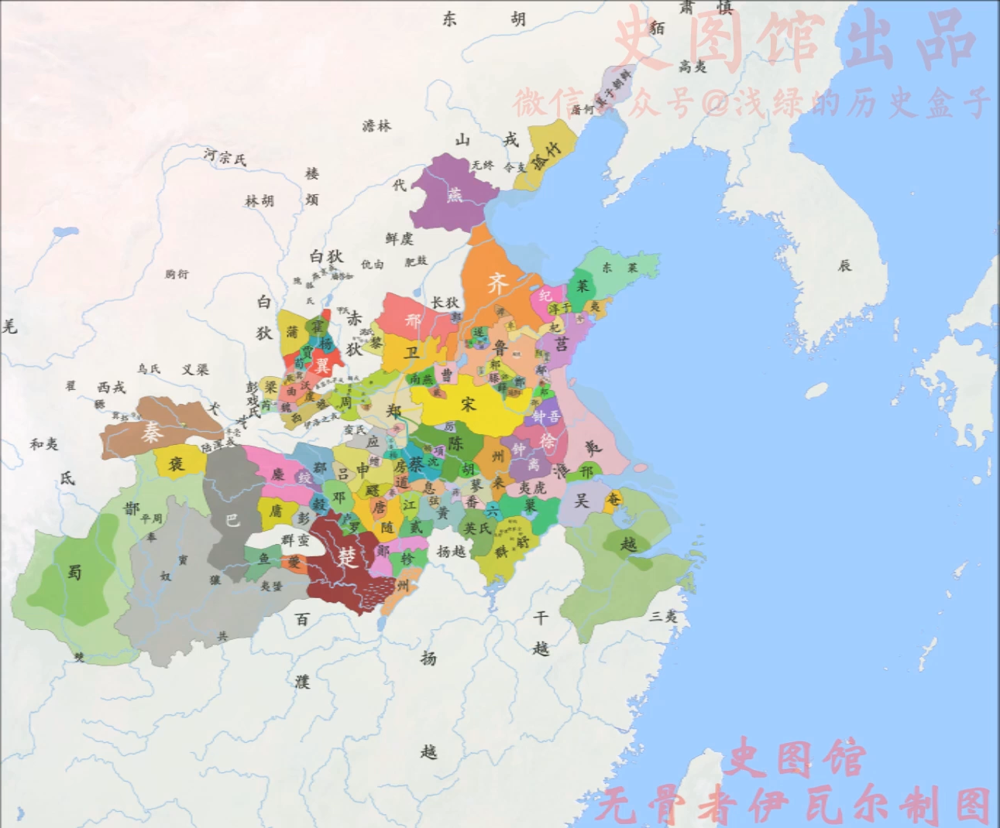

    主要诸侯:晋鄂候(翼)/曲沃庄伯(曲沃) 楚熊通(武王) 齐僖公 秦文公 宋殇公 鲁隐公 卫桓公 郑庄公 陈桓公 蔡宣侯 曹桓公 燕穆侯

#### 公元前 719 年--周桓王元年

- 二月，莒伐杞，取牟娄。
- 卫国的公子州吁杀害卫桓公，自立为君。
  为了分散国内舆论，州吁邀请宋殇公一同
  出兵伐郑。四月，宋、卫、陈、蔡四国联
  军伐郑，进攻郑国都城东门，五天后搬退
  。 秋季，联军再次进攻郑国。
- 九月，卫国大夫石错设计铲除州吁。卫国
  人拥立公子晋(桓公之弟)，是为卫宣公.

#### 公元前 718 年--周桓王二年

- 春，曲沃庄伯进攻翼(绛)城，晋鄂侯被迫逃到随地(晋国地名，在今山西介休东并非湖北的随国)。周桓王命令虢公忌父讨伐曲沃，在翼城拥立晋哀侯(晋鄂侯之子)。
- 四月，郑庄公派遗军队入侵卫国。卫宣公令南燕国(依附卫国)攻击郑国。六月，郑军在北制击溃南燕军。

#### 公元前 717 年--周桓王三年

- 五月，郑庄公率军入侵陈国，大获全胜。
- 七月，宋军占领郑国长葛。

#### 公元前 716 年--周桓王四年

- 七月，郑、宋议和，在宿地结盟。
- 十二月，郑、陈议和。

#### 公元前 715 年--周桓王五年

- 曲沃庄伯去世后，其子称继位，是为曲沃武公。芮国乘丧发兵入侵曲沃，依附曲沃的董国、荀国也背叛曲沃。不久之后曲沃武公进行报复，灭掉董国。
- 夏，周桓王任命虢公忌父为卿士。

#### 公元前 714 年--周桓王六年

- 秦宪公迁都平阳(今陕西岐山县西南) ,灭丰戎、伐毫戎。
- 十一月，北戎侵郑，郑庄公歼灭戎军。

#### 公元前 713 年--周桓王七年

- 秦宪公灭亳戎。
- 六月，郑庄公联合齐、鲁伐宋，攻取郜、防两城，赠与鲁国。.
- 七月，宋、卫、蔡三国联军伐戴，攻入戴 国都城。八月，郑庄公率军包围戴城。城内的三国联军内讧，戴城因此而失守，三国联军被郑军俘获，郑国顺势吞并戴国。
- 十月，郑庄公、齐僖公伐郕。

#### 公元前 712 年--周桓王八年

- 七月，郑庄公联合齐、鲁伐许，攻陷许国
  都城，许庄公出奔卫国。郑庄公拥立许桓
  公，派遣大夫公孙荻监管许国。
- 郑庄公把邬、刘、荔、邗等地献给周桓王
  借此换得溫、原、缔、樊、隰邮、攒茅
  向、盟、州、陉、院、怀等地。
- 十一月，鲁公子晕弑鲁隐公。

#### 公元前 710 年--周桓王十年

- 正月，宋国太宰华督弑宋殇公，拥立宋殇公的堂弟宋庄公。华督用宋国的宝器賄赂诸侯，借此稳固宋庄公的君位。郑庄公、齐售公、鲁桓公、陈桓公都接受了賄赂。
- 九月，鲁桓公伐杞。

#### 公元前 709 年--周桓王十一年

- 春，曲沃武公进攻翼城，在汾隰之战中俘
  获晋哀侯，翼城人拥立哀侯之子小子侯。
- 九月，齐僖公把女儿文姜嫁给鲁桓公。

#### 公元前 708 年--周桓王十二年

- 曲沃武公杀死去年俘获的晋哀侯。
- 秋，秦宪公讨伐芮国，因轻敌而战败。
- 冬，周桓王派遣王师帮助秦国讨伐芮国，
  俘获芮伯万。

#### 公元前 707 年--周桓王十三年

- 正月，陈桓公卒。桓公的太子免被桓公的
  弟弟公子佗杀死，公子佗自立为君。
- 夏，周桓王剥夺了郑庄公的卿士职位，郑
  庄公因此不再朝觀。
- 秋，周桓王率领王师会合卫、陈、蔡三国
  军队，讨伐郑庄公。郑庄公在縭葛之战中
  击败王师，郑将祝聃射中周桓王的肩膀。

#### 公元前 706 年--周桓王十四年

- 春，杞国占领淳于故地，迁于此。
- 夏，北戎侵齐，郑太子忽率军救援齐国，
  大破戎军。
- 秋，蔡人杀陈公子佗，拥立陈厉公(陈桓
  公之子)

#### 公元前 705 年--周桓王十五年

- 夏，盟邑、向邑背叛郑国，依附周桓王。
- 秋，郑庄公派遣军队攻打盟邑、向邑，周
  桓王把盟邑、向邑的百姓迁到郏地。
- 冬，曲沃武公诱杀晋小子侯。

#### 公元前 704 年--周桓王十六年

- 夏，楚伐随，战于速杞，随军大败。
- 秋，楚、随结盟讲和，楚国僭号称王。
- 冬，周桓王命虢公林父伐曲沃，立公子缗
  (晋哀侯之弟)为晋候。

#### 公元前 703 年--周桓王十七年

- 夏，楚、巴联军伐邓，战于郵，邓军大败
- 秋，虢、芮、梁、贾、荀五国伐曲沃。

#### 公元前 702 年--周桓王十八年

- 冬， 齐、郑、卫三国伐鲁。

#### 公元前 701 年--周桓王十九年

- 春，楚、郧战于蒲骚，郧军大败。贰、轸
  两国与楚国结盟。
- 五月，郑庄公去世，太子忽继位，是为郑
  昭公。九月，郑国上卿祭足拥立公子突(
  郑厉公)，郑昭公出奔卫国。

#### 公元前 700 年--周桓王二十年

- 楚武王派遣观丁父率军攻灭州、题。
- 郧、贰、轸等国也相继被楚国灭亡，随、
  唐两国向楚国表示臣服。
- 冬，郑、鲁联军伐宋。
- 楚武王率军伐绞，强迫绞国订立城下之盟
  。

#### 公元前 699 年--周桓王二十一年

- 正月，楚武王派遣屈瑕率军进攻罗国。罗
  卢联军在鄢水大破楚军，屈瑕自杀。
- 二月，郑、鲁、纪三国联军击败齐、宋、
  卫、南燕四国联军。

#### 公元前 698 年--周桓王二十二年

- 秦国大庶长弗忌、威垒、三父等人杀害秦
  出子，拥立秦武公。
- 冬，宋庄公联合齐、卫、陈、蔡等国进攻
  郑国，焚烧郑国都城渠门，攻打东郊，拆
  掉了郑国太庙的椽子。

#### 公元前 697 年--周桓王二十三年

- 三月，周桓王崩。
- 秦武公征伐彭戏氏，抵达华山。
- 五月，祭足驱逐郑厉公，郑厉公出奔蔡国，六月，祭足从卫国迎回郑昭公。
- 许桓公趁郑国内乱而驱逐郑国戍军，许国
  重获独立。
- 九月，郑国标邑背叛郑昭公，郑厉公从蔡
  国进入栎邑。

---

## 周庄王

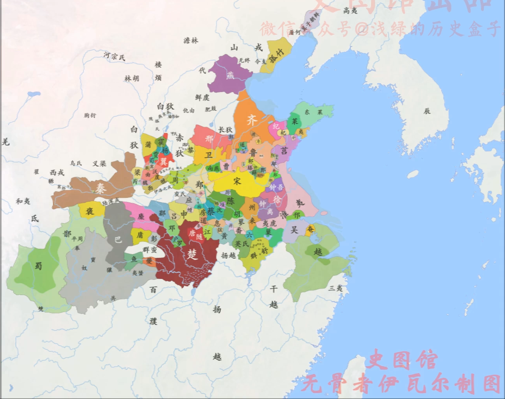

#### 公元前 696 年--周庄王元年

    主要诸侯:晋侯缗(翼)/曲沃武公(曲沃)  楚武王 齐襄公 秦武公 宋庄公 鲁桓公 卫惠公 郑昭公 陈庄公 蔡桓侯 曹庄公 燕桓侯

- 正月，宋、鲁、卫、陈、蔡五国伐郑。
- 十一月，卫国卿大夫驱逐卫惠公，拥立公
- 子黔牟(卫惠公异母兄)，卫惠公出奔齐
  国。

#### 公元前 695 年--周庄王二年

- 五月，齐、鲁两国在奚地发生边境冲突。
- 十月，高渠弥弑郑昭公，拥立公子整(郑 召公弟)。

#### 公元前 694 年--周庄王三年

- 正月，鲁桓公和夫人文姜前往齐国会见齐襄公。文姜与齐襄公私通，被鲁桓公发觉因此桓公怒斥文姜。
- 四月，齐襄公设宴招待鲁桓公，将他灌醉。随后齐襄公让力士公子彭生扶鲁桓公登车，乘机折断桓公的肋骨，桓公死于车中。
- 七月，齐襄公在首止之会杀死郑公子壹与
  高渠弥，郑国上卿祭足拥立公子婴。

#### 公元前 693 年--周庄王四年

- 冬，齐襄公伐纪，取邢、錙、郚。

#### 公元前 692 年--周庄王五年

- 夏，鲁公子庆父率军灭於余丘。

#### 公元前 691 年--周庄王六年

秋， 纪季(纪候之弟)以鄱邑归附齐国。

#### 公元前 690 年--周庄王七年

- 三月，随叛楚，楚武王率军伐随，病逝于
  军中。楚国令尹斗祁、莫敖屈重秘不发丧
  ，开通新路奇袭随国。随侯恐惧，向楚军
  求和。屈重以楚王的名义进入随国，与随
  侯结盟。
- 夏，齐襄公灭纪。

#### 公元前 689 年--周庄王八年

- 楚文王迁都纪南城(今湖北荆州市，楚国城皆称“郢”)。
- 随国的彻底归顺，让楚国对汉东地区的统治更加稳固。因此楚文王得以继续向鄂东南地区扩张，将铜绿山矿产区纳入楚国的势力范围。
- 冬，齐襄公联合宋、鲁、陈、蔡四国，出兵护送卫惠公回国。

#### 公元前 688 年--周庄王九年

- 六月，在齐国的帮助下，卫惠公返回卫国都城朝歌，公子黔牟被驱逐到成周。
- 秦武公灭邽(gui)、冀之戎。
- 楚文王挥师北上，攻灭申、吕、缯。

#### 公元前 687 年--周庄王十年

- 秦武公灭小虢。

#### 公元前 686 年--周庄王十一年

- 四月，齐、鲁联军伐邮。
- 十二月，连称、管至父弑齐襄公，拥立公孙无知(襄公堂弟)。

#### 公元前 685 年--周庄王十二年

- 正月，齐大夫雍廪杀公孙无知。四月，鲁庄公出兵护送公子纠回齐国即位公子小白从莒国抢先回到齐国，是为齐桓公。
- 八月，齐桓公在乾时击败鲁军。
- 九月，齐桓公派遣鲍叔牙率军伐鲁,迫使鲁庄公杀掉公子纠，并将管仲送回齐国。齐桓公重用管仲，使其为政。

#### 公元前 684 年--周庄王十三年

- 正月，齐伐鲁，战于长勺，齐军战败。
- 三月，宋闵公出兵配合齐国，迁走亲附鲁国的宿国。
- 六月，鲁军在乘丘击败宋军。
- 十月，齐桓公灭谭。
- 曲沃武公灭荀

#### 公元前 682 年--周庄王十五年

- 八月，南宫长万弑宋闵公，拥立公子游。
- 十月，萧叔大心攻杀公子游，拥立公子御说(宋闵公弟)，是为宋桓公。
- 周庄王崩。

---

## 周僖王

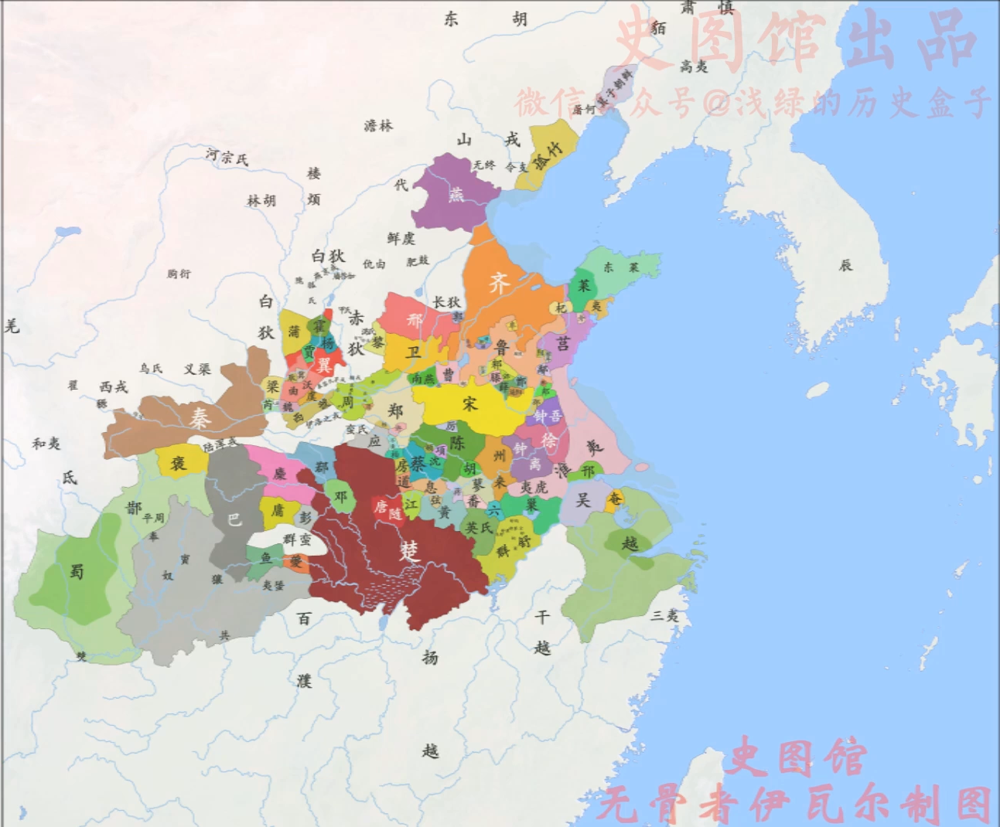

#### 公元前 681 年--周僖王元年

    主要诸侯:晋侯缗(翼)/曲沃武公(曲沃) 楚文王 齐桓公 秦武公 宋桓公 鲁庄公 卫惠公 郑子婴 陈宣公 蔡哀侯 曹庄公 燕庄公

- 春，齐桓公和宋、陈、蔡、邾等国的国君 在北杏会见。
- 夏，齐桓公灭遂。
- 冬，齐桓公在柯地会见鲁庄公，齐、鲁两 国结盟讲和。

#### 公元前 680 年--周僖王二年

- 六月，傅瑕杀郑公子婴，郑厉公从栎地返 回国都。
- 楚文王灭息。
- 奄国(常州淹城遗址)约于此时被吴国灭 亡。

#### 公元前 679 年--周僖王三年

- 春，齐桓公在鄄地会合诸侯，齐国始霸。
- 秋，郑厉公侵宋。
- 曲沃武公灭翼，杀晋侯缗。曲沃武公以宝 器贿赂周僖王，僖王命曲沃武公为晋侯, 即晋武公。

#### 公元前 678 年--周僖王四年

- 楚文王灭邓、应。
- 晋武公灭贾、杨。
- 夏，齐、宋、卫三国联军伐郑。
- 秋,楚文王伐郑。

---

## 周惠王


#### 公元前 676 年--周惠王元年

    主要诸侯:晋献公 楚文王 齐桓公 秦德公 宋桓公 鲁庄公 卫惠公 郑厉公 陈宣公 蔡哀侯 曹庄公 燕庄公

- 晋献公即位后，积极对戎狄用兵，狐氏约 于此时归附晋国。
- 冬，巴国发兵入侵楚国。

#### 公元前 675 年--周惠王二年

- 春，楚文王发兵抵御巴军，在津地被巴军 打得大败。楚军撤退，看守郢都城门的鬻 拳认为楚文王无功而返，因此拒绝接纳文 王。楚文王无可奈何，只得率军袭击黄国 在错陵击败黄军。
- 夏，楚文王病逝于湫地，鬻拳自杀。
- 冬，卫国、南燕国联合进攻周惠王，试图 拥立王子颓(周庄王之子，周惠王叔父)

#### 公元前 674 年--周惠王三年

- 春，郑厉公试图调解周惠王与王子颓之间 的纠纷，没有成功。
- 夏,郑厉公把周惠王带回郑国，安置在栎 邑。

#### 公元前 673 年--周惠王四年

- 四月，郑厉公、虢公丑诛杀王子颓。
- 五月，郑厉公去世。
- 十月，周惠王返回成周。

#### 公元前 672 年--周惠王五年

- 春，陈宣公杀太子御寇，与太子御寇关系亲密的公子完(即田完，陈厉公之子)出 奔齐国，齐桓公任命田完为工正。
- 晋献公伐骊戎，取骊姬而归。
- 随人袭杀堵敖，拥立楚成王。

#### 公元前 670 年--周惠王七年

- 秋，鲁庄公娶哀姜为夫人。
- 冬，戎人伐曹，驱逐太子羁(曹庄公之子曹庄公于上一年的十一月去世)，拥立公子赤(太子羁之弟)，是为曹僖公。
- 齐桓公灭郭。

#### 公元前 668 年--周惠王九年

- 秋， 虢军入侵晋国。
- 冬， 虢军再次入侵晋国。

#### 公元前 666 年--周惠王十一年

- 春，齐桓公伐卫。
- 夏，晋献公命太子申生出居曲沃，公子重 耳出居蒲地，公子夷吾出居屈地。
- 秋，楚国令尹子元率军伐郑，无功而返。

#### 公元前 665 年--周惠王十二年

- 冬， 樊仲皮背叛周惠王。

#### 公元前 664 年--周惠王十三年

- 春，虢国出兵伐樊，逮捕樊仲皮。
- 秋,楚国申公斗班杀令尹子元，楚成王任 命斗穀於菟(字子文)为令尹。
- 齐桓公灭鄣。

* 冬，山戎侵燕。

#### 公元前 663 年--周惠王十四年

- 春，齐桓公救燕，北伐山戎。
- 齐桓公灭孤竹、令支，破屠何，以其地予 燕。
- 赤狄灭黎。

#### 公元前 662 年--周惠王十五年

- 八月，鲁庄公去世，太子般继位。
- 十月，公子庆父(鲁庄公庶兄)杀害太子 般，拥立鲁闵公(太子般异母弟)。

#### 公元前 661 年--周惠王十六年

- 正月，狄人侵邢， 齐桓公救邢。
- 冬，晋献公建立二军,吞并耿、魏、霍三 国。(注:此魏国并非战国时期的魏国。
  )

#### 公元前 660 年--周惠王十七年

- 正月，虢公丑在渭讷击败戎人。
- 八月，庆父弑鲁闵公。鲁人讨伐庆父，庆 父出奔莒国。季友拥立公子申(鲁庄公庶 子)，是为鲁僖公。
- 季友贿赂莒国，请求引渡庆父，庆父在押 送途中自杀。
- 十二月，晋伐赤狄皋落氏。
- 赤狄侵卫，杀卫懿公。

#### 公元前 659 年--周惠王十八年

- 正月，赤狄侵邢，齐桓公率诸侯救邢。
- 六月，邢国迁都夷仪，齐桓公率诸侯帮助
- 邢国筑城。
- 晋献公灭冀。

#### 公元前 658 年--周惠王十九年

- 正月，齐桓公帮助卫国修筑新都楚邱城。
- 五月，晋献公假途伐虢，攻取下阳。
- 十月，楚成王伐郑。

#### 公元前 657 年--周惠王二十年

- 四月，徐国征伐舒国。
- 七月，齐桓公在阳谷会合诸侯，谋划讨伐 楚国。
- 楚成王再次出兵伐郑。

#### 公元前 656 年--周惠王二十一年

- 正月，齐桓公率领齐、宋、鲁、卫、郑、
  陈、
- 曹、许八国联军南征，攻破蔡国，俘 获蔡穆侯。联军随即入侵楚国，抵达陉地
- 四月，楚成王派遣屈完与诸侯联军讲和 盟于召陵。联军撤退，蔡穆侯也被释放 。
- 骊姬陷害晋国太子申生，申生自杀。公子 重耳出奔。

#### 公元前 655 年--周惠王二十二年

- 八月，齐桓公在首止会盟诸侯，郑文公背 盟。
- 楚成王灭弦。
- 十二月，晋献公灭虢、虞。

#### 公元前 654 年--周惠王二十三年

- 春，晋献公派遣贾华率军进攻屈地，公子 夷吾出奔梁国。
- 夏，齐桓公率领诸侯联军讨伐郑国，楚成 王伐许以救郑。

#### 公元前 653 年--周惠王二十四年

- 正月，齐桓公伐郑。
- 七月，郑文公请和，盟于宁母。

#### 公元前 654 年--周惠王二十五年

- 闰月，周惠王崩。太子郑担心弟弟王子带 作乱，因此秘不发丧，派人向齐桓公求助 齐桓公召集诸侯，在洮地举行会盟，帮 助太子郑顺利即位，是为周襄王。
- 晋军在采桑击败白狄。

---

## 周襄王

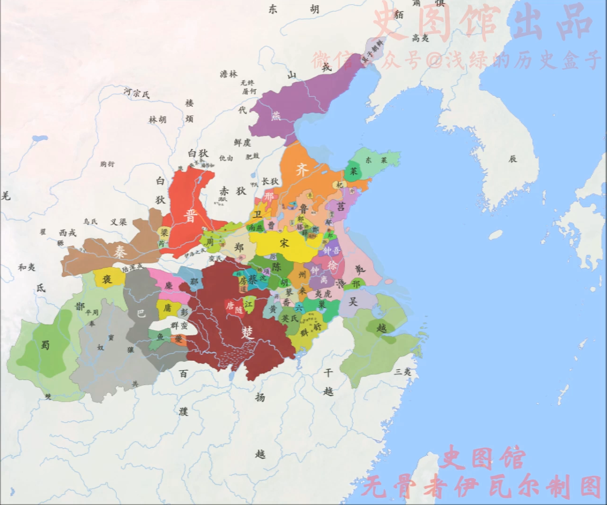

#### 公元前 651 年--周襄王元年

    主要诸侯:晋献公 楚成王 齐桓公 秦穆公 宋襄公 鲁僖公 卫文公 郑文公 陈宣公 蔡穆侯 曹共公 燕襄公

- 夏，齐桓公在葵丘会合诸侯，周襄王派遣 宰孔把祭肉赐给齐桓公。
- 秋，晋献公去世，太子奚齐(骊姬所生) 继位。
- 冬，晋卿里克杀奚齐、卓子。
- 秦穆公帮助公子夷吾返回晋国，齐桓公派 遣隰朋率军会合秦军，顺利拥立公子夷吾 ，是为晋惠公。

#### 公元前 650 年--周襄王二年

- 正月，赤狄灭温。
- 四月，晋惠公杀里克。
- 十月，晋惠公杀丕郑、祁举、共华、贾华 叔坚、骓歇、景虎、特宫、山祁。

#### 公元前 649 年--周襄王三年

- 夏，扬拒、泉皋、伊洛之戎进攻成周。秦 穆公、晋惠公伐戎救周。
- 冬，楚成王伐黄。

#### 公元前 648 年--周襄王四年

- 夏，楚成王灭黄。
- 冬，齐桓公派遣管仲前往成周，让戎人和 周襄王讲和。

#### 公元前 647 年--周襄王五年

- 晋国发生饥荒，晋惠公派人到秦国求粮，秦穆公允诺。

#### 公元前 646 年--周襄王六年

- 春，杞国迁都缘陵，齐桓公召集诸侯，帮助杞国筑城。
- 冬，秦国发生饥荒，秦穆公派人前往晋国求粮，晋惠公拒绝。
- 楚成王灭英氏。

#### 公元前 645 年--周襄王七年

- 春，管仲去世。
- 楚成王伐徐。
- 九月，秦、晋战于韩原，晋惠公被秦军俘 获。
- 十月，楚军在娄林击败徐军。
- 十一月，晋国将河西、河东的几座城邑献 给秦国，秦穆公于是释放了晋惠公。

#### 公元前 644 年--周襄王八年

- 夏，齐桓公伐厉。
- 秋，赤狄侵晋。
- 冬，齐桓公在淮地会合诸侯。

#### 公元前 643 年--周襄王九年

- 春，齐桓公联合徐国伐楚，攻打英氏。
- 夏，晋惠公将太子圉送往秦国做人质，秦 穆公于是归还晋国的河东地区。
- 秋,齐桓公病重，易牙、竖刁作乱，困桓 公于寝宫。
- 十月初七日，齐桓公死于饥渴之中。易牙 竖刁拥立公子无亏(齐桓公庶长子) 太子昭被迫出奔宋国。

#### 公元前 642 年--周襄王十年

- 正月，宋襄公出兵护送太子昭回国。
- 三月，齐国人杀死公子无亏，接纳太子昭 。公子潘、公子商人、公子元、公子雍不 服，再次驱逐太子昭。
- 五月，宋襄公再次出兵伐齐，在顱地把四 公子的党羽打得大败，顺利在齐国拥立了 太子昭，是为齐孝公。

#### 公元前 641 年--周襄王十一年

- 夏，宋襄公在曹南会合诸侯。
- 宋襄公拘捕滕宣公、杀鄭子祭神。
- 冬，秦穆公灭梁。

#### 公元前 640 年--周襄王十二年

- 冬，随国试图背叛楚国，楚成王派遣令尹 子文伐随，随国屈服。
- 由于齐国衰落，楚国势力进一步北扩，吞 并了原本亲附齐国的柏、房、道三国。
- 秦穆公灭芮。

#### 公元前 639 年--周襄王十三年

- 秋，宋襄公在盂地举行诸侯会盟。楚人劫 盟，逮捕宋襄公。随后楚军伐宋，未能成 功。
- 冬，楚成王在薄地举行诸侯会盟，释放宋 襄公。
- 邾文公攻灭须句，须句国君逃往鲁国。

#### 公元前 638 年--周襄王十四年

- 春，鲁僖公伐邾，帮助须句复国。
- 夏，宋襄公伐郑，郑文公向楚国求援。
- 秋，秦、晋两国把陆浑戎迁到伊川。
- 冬，楚成王伐宋以救郑。宋、楚两军战于 泓水，宋军大败，宋襄公负伤。
- 晋惠公的太子圉(在秦国当人质)从秦国 逃回晋国，秦、晋关系再度恶化。

#### 公元前 637 年--周襄王十五年

- 正月，齐孝公伐宋，包围缗邑。
- 五月，宋襄公去世，太子王臣继位，是为 宋成公。
- 七月，楚成王派遣成得臣(字子玉)率军 伐陈，攻取焦、夷两地。楚国令尹子文告 老，让位于成得臣。
- 九月，晋惠公去世，太子圉继位，是为晋 怀公。

#### 公元前 636 年--周襄王十六年

- 正月，秦穆公出兵护送公子重耳返回晋国
- 二月，晋国卿大夫接纳重耳，晋怀公出 奔高梁，结果被重耳派人杀死。重耳正式 即位，是为晋文公。
- 秋，王子带(周襄王弟)联合狄人作乱， 周襄王出奔郑国。

#### 公元前 635 年--周襄王十七年

- 正月，卫文公灭邢。
- 四月，晋文公平定王子带之乱，周襄王返 回成周。
- 周襄王把阳樊、温、原、攒茅之地赐给晋 文公。

#### 公元前 634 年--周襄王十八年

- 夏，齐孝公伐鲁。
- 秋，楚成王灭夔。
- 冬，楚、鲁联军伐齐，攻取谷邑。

#### 公元前 633 年--周襄王十九年

- 冬，楚国出兵伐宋，包围宋国都城商丘。
- 宋国大司马公孙固赶赴晋国求援。
- 晋文公建立三军，任命郤觳为元帅。

#### 公元前 632 年--周襄王二十年

- 正月，晋军伐卫，攻取五鹿。
- 二月，晋国元帅卻毂病逝，晋文公任命先轸为元帅。卫国人驱逐卫成公，归顺晋国。
- 三月，晋军攻破曹国都城陶丘，俘获曹共公。楚国令尹成得臣(字子玉)放弃包围宋国，挥师北上，寻求与晋军决战。
- 四月，晋、楚战于城濮，楚军大败，成得臣自杀谢罪。
- 五月，晋文公在践土举行诸侯会盟。

#### 公元前 631 年--周襄王二十一年

- 六月，晋国上卿狐偃在翟泉会合诸侯的卿
  大夫，重温践土之盟。

#### 公元前 630 年--周襄王二十二年

- 九月，晋、秦联军围郑。秦穆公听信郑国 大夫烛之武的说辞，率军撤退。
- 晋文公要求郑文公立公子兰(郑文公庶子 )为太子，郑文公允诺，之后晋文公也率 军撤退。

#### 公元前 629 年--周襄王二十三年

- 春，晋文公割取曹国的土地，分赐诸侯。
- 秋，晋文公在清原检阅军队，建立五军。
- 冬，卫成公迁都帝丘(濮阳)。

#### 公元前 628 年--周襄王二十四年

- 四月，郑文公去世，公子兰继位，是为郑 穆公。郑穆公奉行亲晋政策，让秦穆公十 分不满。
- 十二月，晋文公去世，太子欢继位，是为 晋襄公。
- 秦穆公派遣孟明视、白乙丙、西乞术率军
  东进，计划袭击郑国。

#### 公元前 627 年--周襄王二十五年

- 二月，秦军动向被郑国得知，因此郑国人 加强戒备。秦军不愿空手而回，于是突袭 滑国，洗劫其都城后返回。
- 四月，晋襄公采纳元帅先轸的计策，在崤山伏击秦军，将其全歼。孟明视、白乙丙、西乞术被俘晋襄公听从文贏之言，释放了孟明视等人。
- 八月，晋军在箕地击败白狄，俘获白 狄君长，晋国元帅先轸战死。

#### 公元前 626 年--周襄王二十六年

- 五月，晋襄公派遣元帅先且居(先轸之子 率军伐卫，攻取匡、戚两地。
- 十月，楚国太子商臣弑楚成王。商臣即位 是为楚穆王。

#### 公元前 625 年--周襄王二十七年

- 二月，秦、晋战于彭衙，秦军大败。
- 十月，晋国元帅先且居率军伐秦，攻取汪邑、 彭衙。

#### 公元前 624 年--周襄王二十八年

- 五月，秦穆公伐晋，攻克王官、郊地。随后秦军从茅津渡过黄河，埋葬了三年前在 崤山阵亡士卒的尸骨。

#### 公元前 623 年--周襄王二十九年

- 秋，楚穆王灭江。
- 晋襄公率军伐秦，攻取祁、新城。

#### 公元前 622 年--周襄王三十年

- 夏，秦穆公伐郡。
- 秋, 楚穆王灭六。
- 冬，楚穆王灭蓼。
- 晋国元帅先且居、中军佐赵衰、下军将栾 枝、下军佐胥臣都在这一年去世。

#### 公元前 621 年--周襄王三十一年

- 春，晋襄公在夷地检阅军队，撤去两个军 恢复三军制度。
- 秦穆公去世，太子螢继位，是为秦康公。 都国在秦、楚之间摇摆不定，因此遭到楚 国吞并。
- 秋，晋襄公去世。晋国太子夷皋年幼，元 帅赵盾打算另立襄公的弟弟公子雍(此时 在秦国)，派士会、先蔑去秦国迎接。

#### 公元前 620 年--周襄王三十二年

- 三月，鲁文公灭须句。
- 晋国元帅赵盾改变主意，打算依旧让襄公 的太子夷皋即位，然而护送公子雍的秦军 已经进入晋国境内。
- 四月，赵盾率军突袭驻扎在令狐的秦军<br/> 秦军大败，逃回秦国。赵盾顺利拥立太子 夷皋，是为晋灵公。

#### 公元前 619 年--周襄王三十三年

- 正月，晋国归还卫国的匡地、戚地。
- 四月，秦康公伐晋，攻取武城。
- 八月，周襄王崩。

---

## 周顷王


    主要诸侯:晋灵公 楚穆王 齐昭公 秦康公 宋昭公 鲁文公 卫成公 郑穆公 陈共公 蔡庄侯 曹共公 燕襄公

#### 公元前 618 年--周顷王元年

- 正月，晋国发生动乱，中军佐先克遇刺。.
- 晋国元帅赵盾追查凶手，诛杀先都、梁益 耳。
- 三月，赵盾又诛杀了箕郑父、士穀、蒯得。
- 四月，楚穆王伐陈，攻取壶丘。

#### 公元前 617 年--周顷王二年

- 春，晋国元帅赵盾伐秦，攻取少梁。
- 夏，秦康公反击，收复北征。
- 楚穆王灭蒋。

#### 公元前 616 年--周顷王三年

- 春，楚穆王伐麇，楚国令尹成大心在防渚 打败麇军。
- 秋，鲁军在咸地击败长狄。

#### 公元前 615 年--周顷王四年

- 春, 楚国令尹成大心去世，楚穆王任命成 嘉为令尹 。
- 夏, 楚国令尹成嘉率军讨伐群舒，灭舒、 宗。
- 冬，秦、晋战于河曲。

#### 公元前 614 年--周顷王五年

- 春，晋国派遣詹嘉驻守瑕地。
- 夏，士会返回晋国。
- 邾文公迁都到绎地。

#### 公元前 613 年--周顷王六年

- 正月，周顷王崩。
- 五月，齐昭公病逝，太子舍继位。七月， 公子商人(齐昭公弟)杀太子舍，自立为 君，是为齐懿公。
- 八月，楚国大夫斗克、公子燮发动叛乱。 挟持楚庄王。庐戢梨诱杀斗克等人，平定 叛乱。

---

## 周匡王


#### 公元前 612 年--周匡王元年

    主要诸侯: 晋灵公 楚庄王 齐懿公 秦康公 宋昭公 鲁文公 卫成公 郑穆公 陈灵公 蔡庄侯 曹文公 燕桓公

- 六月，晋国上军将郤缺率军伐蔡，蔡国向 晋国屈服，订立城下之盟。

#### 公元前 611 年--周匡王二年

- 秋，楚庄王灭庸、麇。
- 巴国灭鱼。
- 冬，宋人弑宋昭公。

#### 公元前 610 年--周匡王三年

- 九月，齐懿公侵鲁。
- 六月，齐、鲁两国在毅地结盟讲和。

#### 公元前 609 年--周匡王四年

- 二月，鲁文公病逝，太子恶继位。
- 五月，邴歌、阎职弑齐懿公。
- 十月，东门襄仲弑鲁太子恶，拥立公子佞 (鲁文公庶长子)，是为鲁宣公。
- 莒太子仆弑莒纪公。

#### 公元前 608 年--周匡王五年

- 六月，鲁宣公将济西之田献给齐国。
- 七月，郑穆公背叛晋国，晋国元帅赵盾率 军伐郑。楚国司马葛贾率军救郑，在北林 击败晋军。
- 十月，晋国赵穿率军侵崇。

#### 公元前 607 年--周匡王六年

- 二月，郑、宋战于大棘，宋军大败。
- 秦共公率军伐晋，包围焦地。四月，晋国 元帅赵盾率军救援焦地，秦军撒退。
- 九月，赵穿(赵盾族弟)杀死晋灵公，赵 盾拥立公子黑臀(晋灵公叔父)，是为晋 成公。
- 十月，周匡王崩。
- 齐、卫大破长狄。

---

## 周定王


公元前 606 年
周定王元年

    主要诸侯: 晋成公 楚庄王 齐惠公 秦共公 宋文公 鲁宣公 卫成公 郑穆公 陈灵公 蔡文侯 曹文公 燕桓公

- 春，楚庄王北伐陆浑戎，兵临洛水。周定 王派遣王孙满慰劳楚庄王，楚庄王询问九 鼎之大小轻重。

#### 公元前 605 年--周定王二年

- 正月，鲁宣公伐莒，攻取向地。
- 六月，郑公子归生弑郑灵公。
- 楚国令尹斗越椒叛乱。
- 七月，楚庄王在皋浒击败斗越椒，平定叛乱。

#### 公元前 604 年--周定王三年

- 冬，楚庄王伐郑，晋国中军佐荀林父伐陈以救郑。

#### 公元前 603 年--周定王四年

- 秋，赤狄侵晋，包围怀、邢丘。
- 冬，楚庄王伐郑。

#### 公元前 602 年--周定王五年

- 夏，齐惠公联合鲁国进攻莱国。

#### 公元前 601 年--周定王六年

- 夏，晋国元帅赵盾去世，郤缺继任元帅。
- 楚庄王东征，灭舒蓼，划定群舒疆界。

#### 公元前 600 年--周定王七年

- 七月，鲁宣公灭根牟。
- 九月，晋成公病逝，太子孺继位，是为晋景公。
- 十月，楚庄王伐郑，晋国元帅郤缺救郑，
  晋军在柳棼击败楚军。

#### 公元前 599 年--周定王八年

- 正月，齐惠公归还鲁国济西之田。
- 五月，夏微舒弑陈灵公。
- 七月，鲁卿公孙归父伐邾，攻取绎邑。
- 十月，楚庄王率军伐郑，晋国士会率军救郑，晋军在颍北击败楚军。

#### 公元前 598 年--周定王九年

- 正月，楚庄王伐郑。
- 十月，楚庄王伐陈，攻破其都城，杀死夏.微舒。
- 楚庄王打算就此吞并陈国，大夫申叔时极力劝阻，于是楚庄王复立陈灵公的太子午为陈侯，是为陈成公。

#### 公元前 597 年--周定王十年

- 正月，楚庄王伐郑，包围郑国都城。
- 晋国元帅卻缺去世，荀林父继任元帅。
- 四月，郑襄公对楚国屈服，请求结盟讲和。
- 六月，晋国元帅荀林父率军救郑，晋、楚两军在郯地交战，晋军大败。

#### 公元前 596 年--周定王十一年

- 秋，赤狄侵晋。
- 冬，晋景公诛杀先觳，灭其族。

#### 公元前 595 年--周定王十二年

> 夏，为了确认郑、宋两国是否归顺，楚庄王故意不向两国借道，直接派出使者穿越其国境。宋国人逮捕并处决了楚国使者。
>
> > 秋，楚庄王率军伐宋，包围宋国都城商丘。

#### 公元前 594 年--周定王十三年

- 五月，楚庄王解除对商丘的包围，与宋国结盟讲和。
- 六月，晋国元帅荀林父率军灭赤狄潞氏、长狄郯瞒。
- 七月，秦、晋战于辅氏，秦军大败。
- 鲁国初税亩。

#### 公元前 593 年--周定王十四年

- 春，晋国元帅士会率军攻灭赤狄甲氏、留吁、铎辰部落。
- 三月，晋景公向周定王进献俘虏的狄人。

#### 公元前 592 年--周定王十五年

- 春，晋景公派遣卻克到齐国征召齐顷公参加盟会。卻克跛足，因此遭到齐顷公戏弄。
- 秋，晋国元帅士会告老，邵克继任元帅。

#### 公元前 591 年--周定王十六年

- 春，晋、卫联军伐齐，到达阳谷。
- 秋，楚庄王去世，太子审继位，是为楚共王。

#### 公元前 590 年--周定王十七年

- 春，晋景公派遣瑕嘉调解周王室和茅戎的 冲突。周朝卿士刘康公无视调解，强行进攻茅戎，结果以失败告终。
- 鲁国为了防备齐国入侵，制定“丘甲”制 度。

#### 公元前 589 年--周定王十八年

- 正月，齐顷公率军伐鲁。
- 四月，卫军救鲁，被齐军击败。
- 六月，晋景公派遣元帅卻克率军救鲁。晋、齐战于宰地，齐军大败。
- 楚国申公巫臣出奔晋国。
- 十月，楚国令尹公子婴齐率军救齐。
- 十一月，楚国令尹公子婴齐在鲁国的蜀地(今山东泰安，并非蜀国)会盟诸侯。

#### 公元前 588 年--周定王十九年

- 秋，晋国元帅卻克攻灭赤狄廣咎如部落，赤狄彻底灭亡。
- 冬，晋景公建立六军。

#### 公元前 587 年--周定王二十年

- 冬，晋国元帅栾书率军伐郑，攻取汜、祭。楚国司马公子侧率军救郑，晋军撤退。

#### 公元前 586 年--周定王二十一年

- 郑、许两国争夺鉭任、冷敦之田，许灵公请求楚共王做出裁决。楚共王判决许国胜诉，郑悼公对此十分不满。
- 八月，郑悼公背叛楚国，和晋国结盟。
- 十一月，周定王崩。

---

## 周简王


    主要诸侯:晋景公 楚共王 齐顷公 秦桓公 宋共公 鲁成公 卫定公 郑悼公 陈成公 蔡景侯 曹宣公 燕昭公 昊王寿梦

#### 公元前 585 年--周简王元年

- 二月，鲁灭都。.
- 四月，晋景公迁都新田。
- 十月，楚国令尹公子婴齐率军伐郑，晋国 元帅栾书率军救郑。
- 吴王寿梦即位后，吴国日益强大。

#### 公元前 584 年--周简王二年

- 七月，楚国令尹公子婴齐率军伐郑，晋国元帅栾书率军救郑。晋军在汜地击败楚军俘获楚国大夫钟仪。
- 八月，吴王寿梦率军伐楚，攻入州来。吴军侵略巢国、徐国。

#### 公元前 583 年--周简王三年

- 春，晋景公命令鲁国把汶阳之田割让给齐国。
- 晋国元帅栾书率军伐蔡，进而侵略楚国本土，击败楚军，俘获楚国大夫申骊。随后晋军侵略沈国，俘获沈国国君。
- 夏，晋景公诛杀赵同、赵括(注:此赵括是赵盾之弟，并非战国时期的赵括)

#### 公元前 582 年--周简王四年

- 春，楚共王用厚礼贿赂郑成公。
- 秋，郑成公去晋国朝拜，晋景公责问郑成公收受楚国贿赂一事，将他扣押。晋国元帅栾书率军伐郑，楚国令尹公子婴齐伐陈以救郑。
- 冬，秦桓公联合白狄伐晋。

#### 公元前 581 年--周简王五年

- 五月，晋国太子州蒲组织诸侯联军伐郑,郑国请和，重新归顺晋国，晋景公于是释放了郑成公。
- 六月，晋景公如厕时“陷而卒”，太子州蒲继位，是为晋厉公。

#### 公元前 580 年--周简王六年

- 宋国右师华元调停晋楚关系。
- 冬，秦、晋结盟讲和。

#### 公元前 579 年--周简王七年

- 夏，晋、楚结盟讲和。
- 秋，秦桓公背弃盟约，怂恿白狄入侵晋国，晋军在交刚击败白狄。

#### 公元前 578 年--周简王八年

- 五月，晋国元帅栾书率军伐秦，战于麻隧，秦军大败。

#### 公元前 577 年--周简王九年

- 八月，郑国上卿公子喜率军伐许。

#### 公元前 576 年--周简王十年

- 夏，楚共王伐郑，到达暴隧。
- 冬，楚共王把许国南迁到叶地。

#### 公元前 575 年--周简王十一年

- 春，楚共王用汝阴之田贿赂郑国，郑成公于是背叛晋国，投靠楚国。
- 夏，晋厉公率军伐郑，楚共王率军救郑。
- 六月，晋、楚战于鄢陵，楚军大败。

#### 公元前 574 年--周简王十二年

- 正月，郑军入侵晋国虚、滑两地。
- 十二月，晋厉公诛杀郤绮、卻攣、卻至。
- 楚共王灭舒庸。

#### 公元前 573 年--周简王十三年

- 正月，晋国元帅栾书弑晋厉公，拥立晋悼公(晋襄公曾孙)。
- 六月，楚共王伐宋，攻取彭城，用来安置宋国叛臣鱼石等人。
- 晋悼公实施新政，栾书告老，韩厥继任元帅。
- 十一月，楚国令尹公子婴齐率军伐宋，晋悼公率军救宋，楚军撤退。

#### 公元前 572 年--周简王十四年

- 正月，晋国率领诸侯帮助宋国收复彭城。
- 五月，晋国元帅韩厥率军伐郑。
- 七月，楚国公子壬夫伐宋以救郑。
- 九月，周简王崩。

---

## 周灵王


    主要诸侯:晋悼公 楚共王 齐灵公 秦景公 宋平公 鲁襄公 卫献公 郑成公 陈成公 蔡景侯 曹成公 燕武公 吴王寿梦

#### 公元前 571 年--周灵王元年

- 冬，在晋国的号召下，诸侯集结军队在虎牢筑城，借此威逼郑国。

#### 公元前 570 年--周灵王二年

- 春，楚国令尹公子婴齐率军伐吴，战于横.山,楚军大败。吴军反击，攻克楚国驾邑
- 夏，由于郑国归顺，晋悼公在鸡泽举行诸侯会盟。

#### 公元前 569 年--周灵王三年

- 晋悼公采纳魏绛“和戎”之策，争取到了北方戎狄的拥护。与此同时，吴国势力扩张到赣江流域。

#### 公元前 568 年--周灵王四年

- 冬，楚国令尹公子贞率军伐陈，晋悼公率领诸侯联军救陈。

#### 公元前 567 年--周灵王五年

- 七月，莒犁比公灭鄭。
- 十二月，齐灵公灭菜。

#### 公元前 566 年--周灵王六年

- 冬，楚国令尹公子贞率军伐陈。
- 郑国上卿公子雕弑郑僖公。

#### 公元前 565 年--周灵王七年

- 四月，郑侵蔡。
- 十月，楚国令尹公子贞率军伐郑，郑国背叛晋国，归顺楚国。

#### 公元前 564 年--周灵王八年

> 冬，晋国元帅智螢率领诸侯联军伐郑。
>
> > 郑国与晋国结盟讲和。

#### 公元前 563 年--周灵王九年

- 五月，晋率诸侯灭逼阳，晋悼公把逼阳的土地赐给宋国。
- 八月，由于郑国背叛，晋悼公调动诸侯军队讨伐郑国。
- 十一月，楚国令尹公子贞率军救郑。

#### 公元前 562 年--周灵王十年

- 四月，晋悼公调动诸侯联军伐郑。
- 九月，诸侯联军再次伐郑。
- 十二月，郑国归顺晋国，诸侯在萧鱼举行会盟。
- 秦景公派遣庶长鲍、庶长武率军入侵晋国在栎地击败晋军。

#### 公元前 561 年--周灵王十一年

- 冬，楚国令尹公子贞、秦国庶长无地联合率军进攻宋国，抵达扬梁。

#### 公元前 560 年--周灵王十二年

- 夏，鲁灭郝。
- 晋国元帅智萄、新军将士鲂去世。晋悼公在绵上举行阅兵，撒去新军，恢复三军制度，任命中行偃为元帅。
- 秋，楚共王去世，其子楚康王继位。吴王诸樊乘丧伐楚，楚国司马公子午率军抵御，在庸浦大破吴军。

#### 公元前 559 年--周灵王十三年

- 四月，晋国元帅中行偃率领诸侯联军伐秦渡过泾水，到达械林。
- 卫国上卿孙林父驱逐卫献公，卫献公出奔齐国。
- 七月，楚国令尹公子贞率军伐吴，在皋舟险道遭遇吴军截击，楚军战败。

#### 公元前 558 年--周灵王十四年

- 四月，齐灵公率军侵鲁，包围邮地。
- 八月，邾军入侵鲁国南部边境。
- 十一月，晋悼公去世，太子彪继位，是为晋平公。

#### 公元前 557 年--周灵王十五年

- 六月，晋国元帅中行偃率军伐许，之后又攻击楚国，楚国大夫公子格率军抵御。
  - 晋、楚战于湛阪，楚军大败。晋军乘胜追击侵袭方城以北的地区。

#### 公元前 556 年--周灵王十六年

- 夏，卫伐曹，取重丘。
- 秋，齐灵公率军侵略鲁国北部边境。
- 冬，邾国侵略鲁国南部边境。

#### 公元前 555 年--周灵王十七年

- 十月，晋国元帅中行偃率领诸侯联军伐齐 战于平阴，齐军大败。
- 十二月，联军包围临淄，并且分兵推进到潍水、沂水。
- 楚国令尹公子午率军袭击郑国。为了救援郑国，诸侯联军解除对临淄的包围。

#### 公元前 554 年--周灵王十八年

- 二月，晋国元帅中行偃去世，范句继任元帅。
- 五月，晋国元帅范句率军伐齐，到达谷地恰逢齐灵公病逝，于是晋军按照‘ 礼不.伐丧”的原则撤退。

#### 公元前 553 年--周灵王十九年

- 六月，由于齐庄公表示愿意归顺晋国，晋平公在澶渊举行诸侯会盟。

#### 公元前 552 年--周灵王二十年

- 正月，邾国的庶其将漆地和闾丘献给鲁国。
- 七月，晋国元帅范句驱逐栾盈。
- 十月，晋国主持商任之会，要求赴会诸侯不得接纳栾盈。

#### 公元前 551 年--周灵王二十一年

- 七月，齐庄公违抗晋国，接纳栾盈。
- 十月，**孔子出生**。

#### 公元前 550 年--周灵王二十二年

- 四月，栾盈在齐庄公的帮助下返回晋国，召集族人对范氏发难。

  > 七月，齐庄公趁晋国内部动荡，出兵伐晋齐军攻克朝歌，到达荧庭。
  >
  > > 晋国东阳大夫邯郸胜率军攻击齐军，俘获齐国大夫晏鼇。

- 十月，栾盈兵败被杀，晋国内乱平息。

#### 公元前 549 年--周灵王二十三年

- 冬，楚康王率军伐郑，到达棘泽。
- 晋平公率领诸侯联军救郑，楚军撤退。

#### 公元前 548 年--周灵王二十四年

- 五月，崔杼弑齐庄公。
- 晋平公率领诸侯联军伐齐，齐国乞和，盟于重丘。
- 八月，楚国令尹屈建率军攻灭舒鸠。
- 十二月，吴王诸樊率军攻打楚国巢城，中箭身亡。

#### 公元前 547 年--周灵王二十五年

- 二月，宁喜弑卫殇公，卫献公复位，孙林父带着封地投奔晋国。
- 五月，楚康王伐郑，在城麇击败郑军，俘获郑国大夫印堇父和皇颉。
- 十月，楚康王再次伐郑。

#### 公元前 546 年--周灵王二十六年

- 夏，“ 弭兵之会”在宋国召开。诸侯达成一致:晋、楚停止争霸战争，今后晋国的盟国要朝觐楚国，楚国的盟国也要觐晋国，齐、秦两国不必朝觐。
- 九月，齐国权臣庆封诛灭崔氏，独揽大权。

#### 公元前 545 年--周灵王二十七年

- 十一月，齐国栾、高、田、鲍四族共同驱逐庆氏家族。
- 周灵王崩。
- 十二月，楚康王去世，其子熊麇(郏敖)继位。

---

## 公元前 6 世纪中叶

- **《诗经》被编订成书** _“《诗》三百，一言以蔽之。日:思无邪。”_

## 周景王

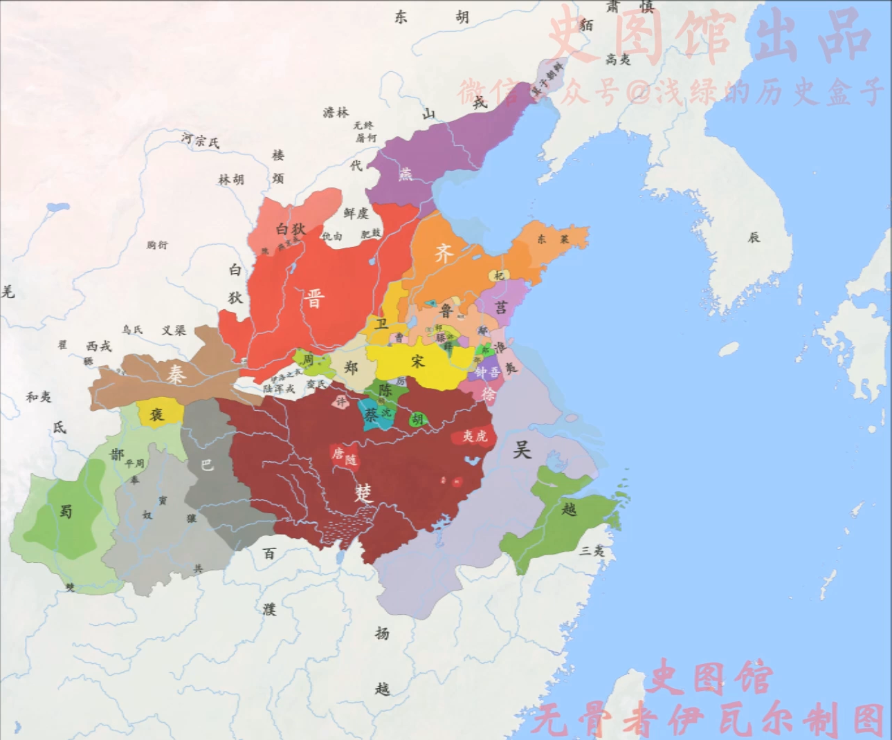

    主要诸侯:晋平公 楚郏敖 齐景公 秦景公 宋平公 鲁襄公 卫献公 郑简公 陈哀公 蔡景侯 曹武公 燕简公 吴王馀祭

#### 公元前 544 年--周景王元年

- 五月，吴王馀祭伐越。
- 吴王馀祭让越国俘虏看守船只，越国俘虏趁吴王视察船只时，将其刺杀。
- 六月，杞文公迁都淳于，晋平公让鲁国归还杞国故土。

#### 公元前 541 年--周景王四年

- 六月，晋国荀吴采纳魏舒的建议，使用步兵方阵，在大原大破群狄。
- 十一月，楚国令尹王子围(即熊围，楚康王之弟)杀害楚王熊麇(郏敖)。王子围自立为王，是为楚灵王。
- 十二月，晋国元帅赵武去世，韩起继任元帅。

#### 公元前 539 年--周景王六年

- 夏，郑简公朝拜晋平公，晋平公把州县赐给郑国。
- 冬，燕国卿大夫驱逐燕简公，燕简公出奔齐国。

#### 公元前 538 年--周景王七年

- 六月，楚灵王在申地会合诸侯。
- 七月，楚灵王率领诸侯联军伐吴，攻克朱方。
- 八月，楚灵王灭厉。
- 九月，鄭人背叛莒国，投靠鲁国。

#### 公元前 537 年--周景王八年

- 夏，莒国的牟娄、防、兹等地归附鲁国。
- 冬，楚灵王率军伐吴，吴军在鹊岸击败楚军先头部队。楚灵王在坻箕山检阅军队，随后率军撤退。.

#### 公元前 536 年--周景王九年

- 秋，吴、楚战于房钟，楚军大败。
- 冬，齐景公伐燕，试图护送燕简公回国。

#### 公元前 535 年--周景王十年

- 春，燕国卿大夫另立燕悼公，同时贿赂齐景公，齐军于是撤退。
- 夏，晋平公划定鲁国与杞国的边界，迫使鲁国把成地割让给杞国。
- 郑国把州县还给晋国。
- 秋，晋平公把戚邑还给卫国。

#### 公元前 534 年--周景王十一年

- 三月，陈国内乱。
- 四月，陈哀公自缢身亡。
- 十月，楚灵王灭陈。

#### 公元前 533 年--周景王十二年

- 二月，楚灵王把许国迁到城父。

#### 公元前 532 年--周景王十三年

- 五月，齐国田、鲍两家攻击栾、高两家，栾施、高疆战败，逃往鲁国。
- 七月，鲁伐莒，取鄄。
- 晋平公去世，太子夷继位，是为晋昭公。

#### 公元前 531 年--周景王十四年

- 三月，楚灵王在申之会上逮捕蔡灵侯。
- 四月，楚灵王杀死蔡灵侯，随后楚国出兵攻打蔡国。
- 十一月，楚灭蔡，同时迁徙许、沈、胡三国，把它们的宗室、国人安置在荆山地区。

#### 公元前 530 年--周景王十五年

- 八月，晋国上军将荀吴率军灭肥。
- 十月，楚灵王率军伐徐，驻扎在乾溪。

#### 公元前 529 年--周景王十六年

- 四月，楚国王子比、王子黑肱、王子弃疾(皆为楚灵王之弟)率领陈县、蔡县、不 羹、叶县的军队南下，进入郢都。王子比 自立为王，楚灵王众叛亲离、流窜山野。
- 五月，王子弃疾设计铲除王子比、王子黑 肱，楚灵王亦自缢于申亥家中。王子弃疾自立为王，是为楚平王。楚平王让陈、蔡胡、沈、许复国。十月，吴军攻取州来

#### 公元前 527 年--周景王十八年

- 秋，晋国上军将荀吴率军伐鲜虞，俘获鼓子鸢緹。

#### 公元前 526 年--周景王十九年

- 二月，齐景公伐徐，到达蒲隧。
- 八月，晋昭公去世，太子去疾继位，是为晋顷公。

#### 公元前 525 年--周景王二十年

- 八月，晋国上军将荀吴率军灭陆浑戎。
- 十月，吴、楚战于长岸。

#### 公元前 524 年--周景王二十一年

- 六月，邾庄公率军突袭鄱国，攻入其都城。
- 十月，楚平王把许国迁移到析地。

#### 公元前 523 年--周景王二十二年

- 春，楚平王娶夫人秦嬴(原本与太子建订婚)。
- 宋元公伐邾，迫使邾庄公释放鄅国的俘虏。
- 夏，楚平王派遣水师南征百濮。
- 秋，齐景公伐莒。
- 楚平王收复州来。

#### 公元前 522 年--周景王二十三年

- 春，楚平王驱逐太子建、杀死太傅伍奢。
- 伍奢之子伍子胥出奔吴国。
- 冬，宋国爆发华、向之乱。

## 周悼王

#### 公元前 520 年--周悼王元年

    主要诸侯:晋顷公 楚平王 齐景公 秦哀公 宋元公 鲁昭公 卫灵公 郑定公 陈惠公 蔡悼侯 曹悼公 燕平公 吴王僚

- 二月，宋国内乱平息。
- 四月，周景王崩。刘盆、单旗拥立王子猛继位，是为周悼王。
- 六月，周景王的长子王子朝不服，发兵攻击周悼王。
- 晋国荀吴率军灭鼓。
- 七月，周悼王逃离京师。十一月，周悼王崩，刘盆、单旗拥立王子句，是为周敬王

---

## 周敬王

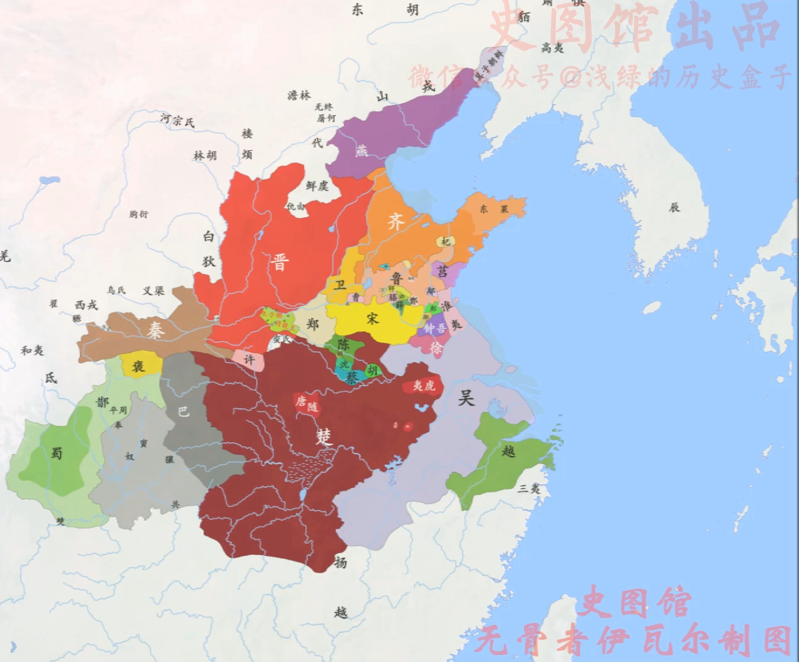

    主要诸侯:晋顷公 楚平王 齐景公 秦哀公 宋元公 鲁昭公 卫灵公 郑定公 陈惠公 蔡悼侯 曹悼公 燕平公 吴王僚

#### 公元前 519 年--周敬王元年

- 七月，吴、楚战于鸡父，楚军大败。
- 吴王僚攻取楚国州来。
- 冬，楚平王派遣水师入侵吴国，与越军在 豫章之沖会师。
- 吴王僚发兵报复楚国，攻占巢、钟离。

#### 公元前 518 年--周敬王二年

- 冬，楚平王派遣水师入侵吴国，与越军在 豫章之沖会师。
- 吴王僚发兵报复楚国，攻占巢、钟离。

#### 公元前 517 年--周敬王三年

- 秋，鲁昭公讨伐权臣季孙意如，失败后出奔齐国。
- 冬，齐景公伐鲁，攻取郓地。

#### 公元前 516 年--周敬王四年

- 春，齐景公把鲁昭公安置在郓地。
- 秋，楚平王去世，太子轸继位，是为楚昭王。
- 冬，晋国智跞、赵鞅率军援救周敬王，击败王子朝。王子朝出奔楚国，周王室内乱平息。

#### 公元前 515 年--周敬王五年

- **孙武著称《孙子兵法》** _世界上最早的兵书之一_
- 春，吴王僚派遣公子掩馀、公子烛庸率军伐楚，包围潜地。楚国令尹囊瓦率军进抵沙讷，左尹伯郤宛、工尹寿率军救援潜地
- 夏，公子光指使专诸刺杀吴王僚。公子光自立为王，是为吴王阖闾。

#### 公元前 514 年--周敬王六年

- 六月，晋项公诛杀祁盈、羊舌食我，灭其 族。
- 七月，晋国元帅韩起去世，魏舒继任元帅。

#### 公元前 512 年--周敬王八年

- 六月，晋顷公去世，太子午继位，是为晋定公。
- 十二月，吴王阖闾灭徐、钟吾。

#### 公元前 511 年--周敬王九年

- 秋，吴军侵袭楚国潜地、六地，包围弦地。楚军救援弦地，到达豫章，吴军撤走。

#### 公元前 510 年--周敬王十年

- 十二月，鲁昭公在乾侯去世。季孙意如拥立昭公之弟公子宋，是为鲁定公。

#### 公元前 509 年--周敬王十一年

- 正月，晋国元帅魏舒去世，范鞅继任元帅。
- 诸侯帮助周敬王增修成周的城墙。
- 六月，鲁昭公的灵柩被运回鲁国。

#### 公元前 508 年--周敬王十二年

- 夏，桐叛楚。
- 秋，楚国令尹囊瓦率军伐吴。
- 冬，吴、楚战于豫章，楚军大败，吴军占领巢城。

#### 公元前 506 年--周敬王十四年

- 三月，晋国元帅范鞅辅佐晋定公，在召陵 q 会合诸侯，商议帮助蔡国讨伐楚国，未果
- 四月，蔡昭侯灭沈。
- 六月，楚昭王把许国迁到容城。
- 十月，吴王阖闾伐楚，蔡国、唐国响应吴军。
- 十一月，吴、楚战于柏举，楚军大败 吴军攻入郢都，楚昭王出奔随国。

#### 公元前 505 年--周敬王十五年

- 四月，越王允常偷袭吴国。
- 六月，秦哀公派遣军队救援楚国。
- 七月，秦、楚联军灭唐。
- 九月，吴王阖闾的弟弟夫概发动叛乱，吴王阖闾回国平叛。
- 十月，秦、楚联军收复郢都。
- 吴军撤离楚国。

#### 公元前 504 年--周敬王十六年

- 正月，郑灭许，俘获许国国君。
- 四月，吴伐楚，取番。
- 儋翩率领王子朝的余党在成周发动叛乱，郑国予以支持，出兵占领负黍等地。

#### 公元前 503 年--周敬王十七年

- 楚昭王恢复许国，此后许国彻底沦为楚国的附庸。
- 齐景公派遣国夏率军伐鲁。

#### 公元前 502 年--周敬王十八年

- 七月，晋国元帅范鞅率军侵卫。
- 十月，鲁国阳虎叛乱。

#### 公元前 501 年--周敬王十九年

- 晋国元帅范鞅去世，智跞继任元帅。
- 六月，阳虎出奔齐国。齐景公听从大夫鲍国的劝谏，囚禁阳虎。阳虎越狱逃往晋国投靠赵鞅。
- 七月，齐景公、卫灵公联合伐晋。齐军攻克夷仪，卫军攻克五氏。晋军在冠氏击败齐军，卫军也随即撤退。

#### 公元前 500 年--周敬王二十年

- 春，齐、鲁议和。齐国约于此时彻底控制东莱。
- 夏，齐鲁夹谷之会，齐景公归还鲁国的汶阳之田。
- 晋国赵鞅率军伐卫。

#### 公元前 499 年--周敬王二十一年

- 春，宋景公的弟弟公子辰、公子地占据萧地发动叛乱。

#### 公元前 498 年--周敬王二十二年

- 春，鲁卿叔孙州仇率军拆毁郈邑的城墙。
- 夏，鲁国公山不狃、叔孙辄在费邑叛乱，国人击败叛军，拆毁费邑的城墙。
- 冬，拆毁邮邑城墙的行动受阻，孔子的堕三都”计划失败。

#### 公元前 497 年--周敬王二十三年

- 晋国爆发内战，中行寅、范吉射占据晋国东部地区，对抗智跞、赵鞅、韩不信、魏曼多四卿。

#### 公元前 496 年--周敬王二十四年

- 二月，楚昭王灭顿。
- 五月，吴越檎李之战，吴王阖闾负伤去世 。
- 七月，宋景公攻克萧地，宋国内乱平息。
- 十二月，晋军先后在潞地、百泉击败范氏
  中行氏的军队。

#### 公元前 495 年--周敬王二十五年

- 二月，楚昭王灭胡。
- 五月，郑、宋战于老丘，宋军战败。.

#### 公元前 494 年--周敬王二十六年

- 三月，夫椒之战，吴王夫差大破越军，越王勾践请降。
- 八月，齐、卫伐晋，救援范氏、中行氏。中山伐晋，占领棘蒲。

#### 公元前 493 年--周敬王二十七年

- 八月，晋郑铁之战，晋国赵鞅大破郑军。
- 晋国元帅智跞去世，赵鞅继任元帅。
- 十一月，蔡昭侯迁都州来，依附吴国。

#### 公元前 492 年--周敬王二十八年

- 十月，赵鞅攻取朝歌，中行寅、范吉射逃
  往邯郸。

#### 公元前 491 年--周敬王二十九年

- 二月，公孙翩弑蔡昭侯。
- 楚昭王灭夷虎。
- 四月，楚昭王灭蛮氏。
- 十一月，晋国赵鞅攻克邯郸，中行寅、范吉射逃往中山。
- 十二月，齐、卫、中山三国伐晋，救援范氏、中行氏，把范吉射、中行寅安置在柏人。

#### 公元前 490 年--周敬王三十年

- 正月，晋国赵鞅攻克柏人，中行寅、范吉射逃往齐国。
- 四月，赵鞅率军伐卫，攻取中牟。
- 九月，齐景公去世，齐军从晋国境内撤退
- **吴王夫差释放勾践回国。**

#### 公元前 489 年--周敬王三十一年

- 七月，楚昭王去世，太子章继位，是为楚惠王。
- 十月，齐国田乞弑安孺子，拥立齐悼公。吴王夫差增加越国封地。

#### 公元前 487 年--周敬王三十三年

- 正月，宋景公灭曹，杀曹伯阳。
- 三月，吴王夫差率军伐鲁。

#### 公元前 486 年--周敬王三十四年

- 春，郑军侵宋。二月，宋军在雍丘歼灭郑军。
- 秋，吴王夫差下令在邗地筑城，开沟贯通.长江、淮水。

#### 公元前 485 年--周敬王三十五年

- 老子出函谷关，著《道德经》
- 二月，吴、鲁、邾、郯联军伐齐。
- 三月，齐人弑齐悼公。齐国水师在海上击败吴国水师，吴王夫差率领联军撤退。
- 四月，晋国赵鞅率军伐齐。

#### 公元前 484 年--周敬王三十六年

- **孔子回鲁** _整理《诗》、《书》、《礼》、《乐》《春秋》以授弟子_
- 正月，齐伐鲁，战于曲阜郊外，齐军败退。
- 五月，吴王夫差率军北上，会合鲁军讨伐齐国，战于艾陵，齐军大败。

#### 公元前 483 年--周敬王三十七年

- 春，鲁用田赋。
- 秋，吴国太宰伯哲在郧地会见鲁哀公、卫出公、宋卿皇瑗。

#### 公元前 482 年--周敬王三十八年

> 夏，晋定公、吴王夫差在黄池相会,争夺
> 盟主地位。
>
> > 越王勾践偷袭吴国，攻入其都城。
> >
> > > 冬，吴王夫差率军从北方返回，与越王勾
> > > 践讲和。

#### 公元前 481 年--周敬王三十九年

- 五月，宋国司马桓魑(向魃)叛乱，占据曹地。
- 六月，田恒弑齐简公。
- 宋景公平定叛乱，桓魍出奔齐国
- 七月，晋国赵鞅率军伐卫。

#### 公元前 480 年--周敬王四十年

- 四月，楚国令尹子西、司马子期率军伐吴到达桐讷。
- 五月，郑声公伐宋。
- 闰十二月，卫灵公太子蒯聩夺取君位，卫出公出奔鲁国。

#### 公元前 479 年--周敬王四十一年

- 四月，**孔子去世** _他的言行被弟子编为《论语》_
- 七月，楚国白公胜叛乱，杀死令尹子西、司马子期。叶公沈诸梁平定叛乱，诛杀白公胜。

#### 公元前 478 年--周敬王四十二年

- 三月，吴、越战于笠泽，吴军大败。
- 六月，晋国赵鞅率军伐卫。
- 七月，楚惠王灭陈。
- 十月，晋国赵鞅再次率军伐卫，驱逐卫庄公(蒯聩)，拥立公孙般师。
- 十一月，卫庄公夺回君位，不久后被杀,公孙般师复位。十二月，齐伐卫，逮捕公孙般师，改立公子起为卫侯。

#### 公元前 477 年--周敬王四十三年

- 三月，巴国出兵入侵楚国，楚国令尹公孙宁在鄹地击败巴军。
- 四月，卫国上卿石圃驱逐公子起，卫出公回国复位。

#### 公元前 476 年--周敬王四十四年

- 春，越侵楚。
- 夏，楚国公子庆、公孙宽率军追击越军,到达冥地。
- 秋，楚国沈诸梁率军东征三夷。
- 冬，周敬王崩。

---

## 周元王

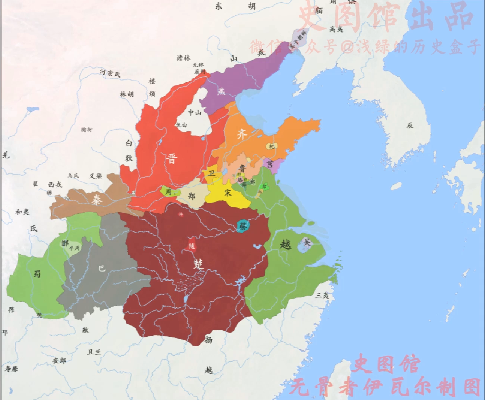

    主要诸侯:晋定公 楚惠王 齐平公 秦厉共公 宋景公 鲁哀公 卫出公 郑声公 蔡成侯 燕孝公 吴王夫 差越王勾践

#### 公元前 475 年--周元王元年

> 赵鞅去世，智瑶继任晋国执政卿。
>
> > 晋定公去世，太子凿继位，是为晋出公。
> >
> > > 晋国赵无恤(赵鞅之子)消灭代国。

- 十一月，越王勾践率军包围吴国都城。

#### 公元前 473 年--周元王三年

- 十一月，越灭吴，吴王夫差自杀。

#### 公元前 472 年--周元王四年

- 六月，晋国智瑶率军伐齐，战于犁丘,齐军大败。
- 越王勾践伐莒，取琅琊。

#### 公元前 471 年--周元王五年

- 四月，晋、鲁联军伐齐，攻取廩丘。

---

## 周贞定王

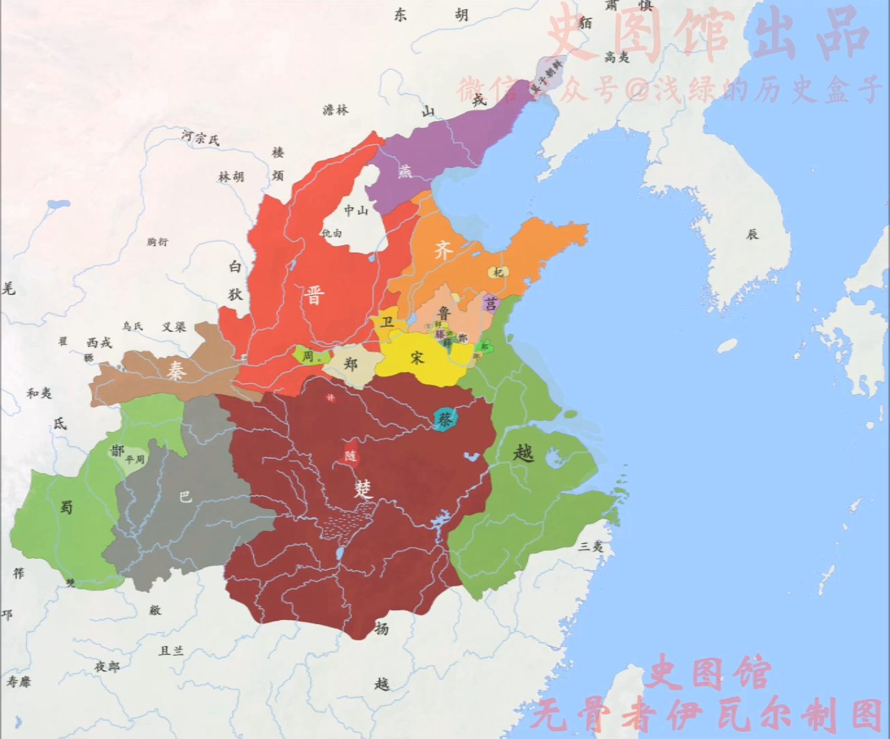

    主要诸侯:晋出公 楚惠王 齐平公 秦厉共公 宋后昭公 鲁哀公 卫悼公 郑声公 蔡声侯 燕孝公 越王勾践

#### 公元前 468 年--周贞定王元年

- **《左传》记事止手此年** _左丘明著，杰出的文学和历史著作_

- 四月，晋国智瑶率军伐郑，齐国田恒率军救郑。
- 鲁哀公计划铲除“三桓” (季氏、孟氏、叔孙氏)，以失败告终。
- 八月，鲁哀公被迫逃往越国。
- 鲁国人迎接哀公回国，哀公死于大夫公孙有山家中。

#### 公元前 464 年--周贞定王五年

- 越王勾践去世，楚惠王夺取泗上诸地。
- 晋国智瑶率军伐郑。

#### 公元前 461 年--周贞定王八年

- 秦厉共公灭大荔。

#### 公元前 458 年--周贞定王十一年

- 晋国智瑶率军灭仇由。

#### 公元前 457 年--周贞定王十二年

- 晋国智瑶伐中山，取穷鱼之丘。
- 秦厉共公伐绵诸。

#### 公元前 456 年--周贞定王十三年

- 晋伐秦，取武城。

#### 公元前 455 年--周贞定王十四年

- 晋国内战爆发，智瑶联合韩虎、魏驹进攻赵无恤，赵无恤退守晋阳。
- 郑人弑郑哀公。

#### 公元前 453 年--周贞定王十六年

> 韩、魏两家反水，与赵家一同进攻智家，智瑶兵败被杀。
>
> > 韩、赵、魏三家瓜分智家封地。.

#### 公元前 452 年--周贞定王十七年

> 韩、赵、魏三家对智氏族人进行清算，晋大夫智开率其邑奔秦，秦国趁乱收取河西地区。
>
> > 晋出公对三家的专横感到十分不满，因此打算向齐、鲁借兵铲除三家，结果事情败露。
> >
> > > 三家联合驱逐晋出公，出公奔楚，死于路途。

#### 公元前 451 年--周贞定王十八年

- 秦伐蜀，修筑南郑城。

#### 公元前 450 年--周贞定王十九年

- 秦伐蜀，修筑南郑城。

#### 公元前 447 年--周贞定王二十二年

- 楚惠王灭蔡。

#### 公元前 445 年--周贞定王二十四年

- 楚惠王灭杞。

#### 公元前 444 年--周贞定王二十五年

- 秦厉共公伐义渠。

---

## 周哀王 周思王

#### 公元前 441 年--周哀王元年

    主要诸侯:晋哀公 楚惠王 齐宣公 秦躁公 宋后昭公 鲁悼公 卫敬公 郑共公 燕成公 越王朱勾

- 秦国南郑反叛，复归蜀。
- 三月，王子叔(哀王之弟)弑**周哀王**。王子叔自立为王，是为**周思王**。
- 八月，王子嵬(哀王、思王之弟)弑**周思王**。王子嵬自立为王，是为**周考王**。

---

## 周考王

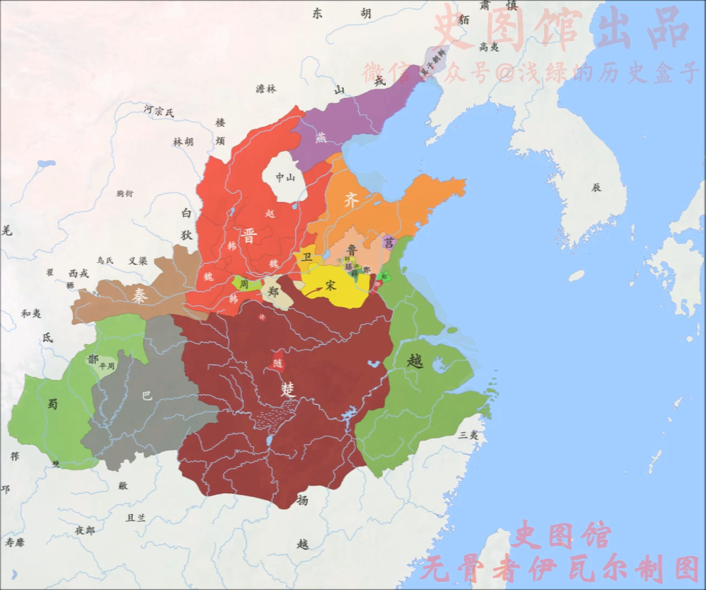

    主要诸侯:晋哀公 楚惠王 齐宣公 秦躁公 宋后昭公 鲁悼公 卫敬公 郑共公 燕成公 越王朱勾

#### 公元前 439 年--周考王二年

- 楚惠王伐宋。

#### 公元前 431 年--周考王十年

- 楚简王灭莒。

#### 公元前 430 年--周考王十一年

- 晋、越伐齐，入齐长城。
- 义渠伐秦，侵至渭阳。

---

## 周威烈王

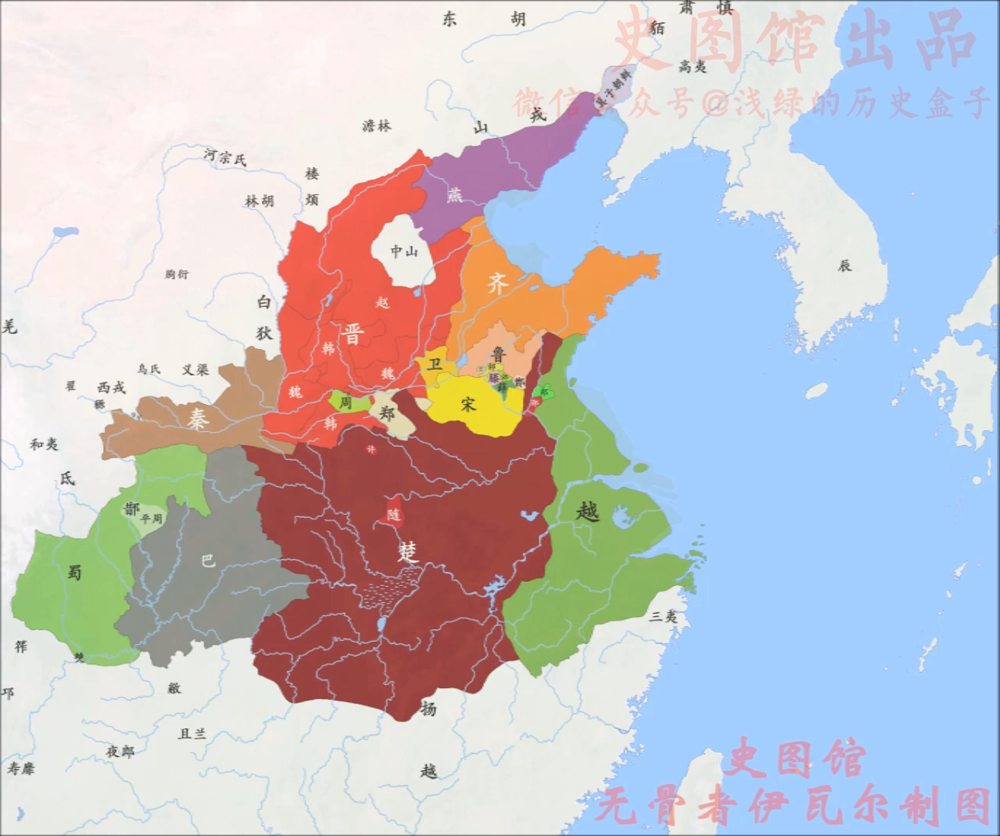

    主要诸侯:晋幽公 楚简王 齐宣公 秦灵公 宋后昭公 鲁元公 卫怀公 郑幽公 燕闵公 越王朱勾

#### 公元前 423 年--周威烈王三年

- 晋国韩启章伐郑，杀郑幽公。

#### 公元前 422 年--周威烈王四年

- 楚简王取雍丘、黄池。
- 晋国魏斯、赵浣、韩启章率军伐楚，包围黄池。

#### 公元前 421 年--周威烈王五年

- 楚国阳为率军侵晋，取宜阳。
- 晋国三家击退楚军。

#### 公元前 419 年--周威烈王七年

- 魏筑城于少梁，秦攻少梁。

#### 公元前 415 年--周威烈王十一年

- 鲁穆公实行新政，打击“三桓” 家族。
- 鲁国季氏占据费、卞等地，建立费国。
- 卫公子颓弑卫怀公。

#### 公元前 414 年--周威烈王十二年

- 越王朱勾灭滕。

#### 公元前 413 年--周威烈王十三年

- 越王朱勾灭郯。
- 齐伐晋，毁黄城，围阳狐。
- 楚伐晋南鄙，到达上洛。
- 晋国魏斯伐秦，在郑地击败秦军。

#### 公元前 412 年--周威烈王十四年

- 魏伐秦，取繁庞。
- 齐国田白伐楚，取莒。

#### 公元前 411 年--周威烈王十五年

- 齐伐鲁，取邰。

#### 公元前 409 年--周威烈王十七年

- 吴起伐秦，取五城。
- 魏筑临晋、元里。

#### 公元前 408 年--周威烈王十八年

- 魏伐秦至郑，筑洛阴、合阳。
- 吴起为河西守。
- 韩虔伐郑，取雍丘。
- 齐伐鲁，取邸。

#### 公元前 407 年--周威烈王十九年

- 郑伐韩，取负黍。
- 魏设上郡。

#### 公元前 406 年--周威烈王二十年

- 魏灭中山。
- 齐伐卫，取母丘。

#### 公元前 405 年--周威烈王二十一年

- 齐国田会于廪丘叛乱。
- 越王翳灭鄭。

#### 公元前 404 年--周威烈王二十二年

- **先秦诸子 百家争鸣**
- 晋三家伐齐，齐军大败。
- 三晋攻入齐长城。

---

## 约公元前 5 世纪末

- **《国语》成书** _相传为左丘明作，第一部国别体史书_

# 东周-战国（前 475-221）

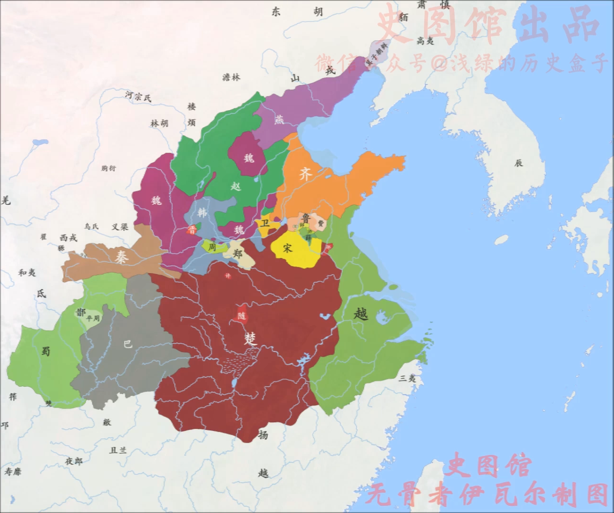

#### 公元前 403 年--周威烈王二十三年

> 周威烈王封韩、赵、魏三家为诸侯。
>
> > 三家分晋。

#### 公元前 402 年--周威烈王二十四年

- 楚声王率军伐宋，包围宋国都城。

---

## 周安王


    主要诸侯: 秦简公 楚声王 齐康公 赵烈侯 魏文侯 韩景侯 燕简公 越王翳 宋休公 鲁穆公 卫慎公 郑繻公 晋烈公

#### 公元前 401 年--周安王元年

- 秦简公伐魏，至阳狐。
- 郑縭公、宋休公朝拜楚声王。
- 楚声王下令增修榆关。

#### 公元前 400 年--周安王二年

- 楚声王遇刺，楚国内乱。
- 三晋伐楚，至乘丘。
- 郑伐韩，围阳翟。

#### 公元前 399 年--周安王三年

- 楚国王子定(楚声王之子，楚悼王之弟)出奔魏国。
- 郑国投靠魏国，出兵夺取楚国榆关。

#### 公元前 398 年--周安王四年

- 楚伐郑，在蔑地包围郑军，郑军投降。
- 郑繻公杀其相驷子阳。

#### 公元前 397 年--周安王五年

- 聂政刺杀韩相侠累。

#### 公元前 396 年--周安王六年

- 魏、韩联军在武阳大破楚军。
- 陈、蔡复国。
- 郑人弑郑繻公。

#### 公元前 395 年--周安王七年

- 秦惠公伐绵诸。

#### 公元前 394 年--周安王八年

- 郑国负黍反叛，归附韩国。
- 齐伐鲁，取最邑。

#### 公元前 393 年--周安王九年

- 楚伐韩，取负黍。

#### 公元前 391 年--周安王十一年

- 三晋伐楚，大破楚军于榆关。
- 魏国攻取楚国大梁。
- 秦救楚，伐韩宜阳。

#### 公元前 390 年--周安王十二年

- 齐伐魏，取襄陵。
- 秦、魏战于武城。
- 鲁军在平陆击败齐军。

#### 公元前 389 年--周安王十三年

- 阴晋之战，魏国吴起大破秦军。

#### 公元前 387 年--周安王十五年

- 秦伐蜀，取南郑。
- 吴起奔楚，楚悼王任用吴起为令尹，吴起在楚国主持变法。

#### 公元前 386 年--周安王十六年

- 田氏代齐，齐相田和(田齐太公)列为诸侯。

#### 公元前 385 年--周安王十七年

- 韩文侯伐郑，取阳城。
- 韩文侯伐宋，至彭城，俘获宋休公。

#### 公元前 384 年--周安王十八年

- 在吴起的经营下，楚国“南平百越，北并陈蔡”。其中陈国沦为楚国的附庸后，留在故地;蔡国则被南迁至高蔡(今湖南常德)。

#### 公元前 383 年--周安王十九年

- 赵伐卫，魏救卫，魏军在兔台击败赵军。

#### 公元前 382 年--周安王二十年

- 齐、魏助卫伐赵，取刚平，围中牟。

#### 公元前 381 年--周安王二十一年

- 楚军救赵伐魏，大破魏军，北进至大河。
- 赵军攻取魏国黄城。
- 楚悼王去世，楚国贵戚杀吴起。

#### 公元前 380 年--周安王二十二年

- 中山桓公复国。
- 齐伐燕，至桑丘。

#### 公元前 378 年--周安王二十四年

- **墨子逝世** _他的弟子搜其语录，编《墨子》一书传世_

- 越王翳迁都吴。
- 韩、赵、魏伐齐至灵丘。

#### 公元前 377 年--周安王二十五年

- 蜀国击破巴国，伐楚至兹方。
- 赵伐中山，战于房子。

#### 公元前 376 年--周安王二十六年

- 楚国侵夺巴地。
- 赵伐中山，战于中人。

---

## 周烈王


    主要诸侯: 秦献公 楚肃王 齐侯剡 赵敬侯 魏武侯 韩哀侯 燕简公 越王翳 宋桓公 鲁共公 卫声公 中山桓公 晋桓公

#### 公元前 375 年--周烈王元年

- **庄子生** _道家学派代表人物，著有《庄子》一书_

- 韩哀侯灭郑。
- 越国内乱，越太子诸咎弑越王翳，越人随后诛杀诸咎，滕、郯趁机复国。
- 魏伐楚，取榆关。

#### 公元前 373 年--周烈王三年

- 魏伐齐，至博陵。
- 鲁伐齐，入阳关。

#### 公元前 372 年--周烈王四年

- 卫伐齐，取薛陵，赵成侯救齐伐卫。

#### 公元前 371 年--周烈王五年

- 魏武侯伐楚，取鲁阳。
- 沦为楚国附庸的许国亦于此时灭亡。(注:魏灭许之事见《韩非子》)

#### 公元前 370 年--周烈王六年

- 赵成侯伐齐，取鄄。
- 魏武侯去世，二子(魏密、魏缓)争位。

#### 公元前 369 年--周烈王七年

- 浊泽之战，
- 韩、赵共伐魏。
- 魏螢击败魏缓，自立为君，是为魏惠王。
- 韩、赵迁晋桓公于屯留。

---

## 周显王


    主要诸侯:秦献公 楚宣王 齐桓公 赵成侯 魏惠王 韩懿侯 燕桓公 越王无余之 宋桓公 鲁共公 卫成侯 中山桓公 晋桓公

#### 公元前 368 年--周显王元年

- 赵侵齐，入齐长城。

#### 公元前 367 年--周显王二年

- 周王畿内分东、西周。

#### 公元前 366 年--周显王三年

- 洛阴之役，秦献公击败韩魏联军。

#### 公元前 365 年--周显王四年

- 魏惠王伐宋，取仪台。

#### 公元前 364 年--周显王五年

- 秦魏石门山之役，魏军大败。

#### 公元前 362 年--周显王七年

- 少梁之役，秦国攻占魏国繁庞。
- 魏惠王伐赵，取列人、肥。

#### 公元前 361 年--周显王八年

- 魏惠王伐赵，取皮牢。秦孝公灭源、翟之戎。
- 魏国用榆次、阳邑、繁阳换取赵国的泫氏中牟。
- 魏惠王迁都大梁。
- 越大夫寺忠弑越王莽安(无余之)o

#### 公元前 359 年--周显王十年

- 韩、赵迁晋桓公于端氏。

#### 公元前 358 年--周显王十一年

- 韩伐赵，取涅、长子。
- 西山之战，秦军击败韩军。

#### 公元前 357 年--周显王十二年

- 宋、魏伐韩，宋取韩黄池，魏取韩朱邑。
- 韩昭侯献轵道于魏。

#### 公元前 356 年--周显王十三年

- 第一次商鞅变法。
- 齐威王、赵成侯、宋桓公会于平陆。

#### 公元前 354 年--周显王十五年

- 魏伐赵，围邯郸。
- 秦大破魏于元里，取少梁。

#### 公元前 353 年--周显王十六年

> 魏国庞涓攻取邯郸，赵成侯逃往信都。
>
> > 齐威王使田忌、孙膑救赵，齐、魏战于桂陵，魏军大败。

- 韩侵周高都。

#### 公元前 352 年--周显王十七年

- 秦伐魏，取安邑。

#### 公元前 351 年--周显王十八年

- 秦伐魏，取固阳。
- 魏国归还赵国邯郸。
- 魏国收复安邑，取濩泽。

#### 公元前 350 年--周显王十九年

- 秦人修建咸阳，由大良造商鞅主持在昔日西周王朝的都城故地一带，位于九嵕山之南，渭水之北，山水俱阳。高台基建筑方式。
- 彤地会盟，魏秦修好
- 第二次商鞅变法，商鞅宣布迁都咸阳,民田宅制
- 赵、魏伐燕，取夏屋

#### 公元前 349 年--周显王二十年

- 韩、赵夺晋端氏，韩记弑晋静公，晋国彻底灭亡。
- 秦国下诏书：凡是各诸侯国来归附的人，立刻免除三代的徭役赋税，秦国四界之内岭坡、土山、沼泽，十年不收任何赋税。《商君书》记载：当时有上百万人来到秦国
- 秦推行二十等爵位

#### 公元前 348 年--周显王二十一年

- 秦国县制，全境建县 31 个

#### 公元前 344 年--周显王二十五年

- 商鞅造标准量器
- 逢泽之会，魏国称王
- 赵肃侯攻齐，取高唐、平原

#### 公元前 343 年--周显王二十六年

- 楚宣王彻底吞并陈、蔡两国

#### 公元前 342 年--周显王二十七年

> 魏国庞涓、太子申率军伐韩，齐国田忌、孙膑伐魏救韩。
>
> > 齐、魏战于马陵，魏军大败，庞涓自杀，魏太子申被俘。

#### 公元前 341 年--周显王二十八年

- 齐、宋侵魏东鄙，秦国商鞅侵魏西鄙

#### 公元前 340 年--周显王二十九年

- 吴城之役，商鞅俘获魏公子印
- 魏惠王修筑济阳城

#### 公元前 339 年--周显王三十年

- 齐威王将邳国北迁，把下邳封给邹忌
- 根据曾姬无卸壶铭文以及擂鼓墩二号墓年代分析，随国(曾国)直到楚威王时期才彻底被楚国吞并

#### 公元前 338 年--周显王三十一年

- 秦魏岸门之战
- 秦孝公去世，惠文王即位，车裂商鞅

#### 公元前 335 年--周显王三十四年

- 楚威王攻韩、魏，取阳翟、鲁阳。

#### 公元前 334 年--周显王三十五年

- 齐威王、魏惠王会于徐州，互相承认对方为王。
- 楚威王击败越国。(注:根据鄂君启节铭文可知，楚怀王初年楚国已夺取越国在皖、赣一带的领土。据《吴越史新探》，楚国夺取这些领土极有可能在威王时。)

#### 公元前 333 年--周显王三十六年

- 楚伐齐，围徐州，郫国于此时被楚国灭亡。

#### 公元前 332 年--周显王三十七年

- 秦攻魏雕阴，魏割让阴晋求和。

#### 公元前 331 年--周显王三十八年

- 秦国全歼魏军于雕阴，魏国割让河西地。
- 卫国贬号称君，仅剩濮阳(帝丘)一地。

#### 公元前 329 年--周显王四十年

- 秦攻魏，取汾阴、皮氏、焦。

#### 公元前 328 年--周显王四十一年

- 魏国向秦国割让，上郡。
- 秦攻赵，取蔺、离石。

#### 公元前 327 年--周显王四十二年

- 秦国归还魏国河东失地。
- 赵国收复蔺、离石。

#### 公元前 325 年--周显王四十四年

- 齐威王伐赵，取平邑。
- 秦国称王，秦惠文王灭乌氏。

#### 公元前 323 年--周显王四十六年

- 楚怀王伐魏，取襄陵。
- 韩、赵、魏、燕、中山五国相互承认为王

#### 公元前 322 年--周显王四十七年

- 秦攻魏，取曲沃、平周。

---

## 周慎靓王


    主要诸侯:秦惠文王 楚怀王 齐宣王 赵武灵王 魏襄王 韩宣惠王 燕王哙 越王无疆 宋康王 鲁平公 卫嗣君 中山王厝

#### 公元前 318 年--周慎靓王三年

- 函谷关之战，五国共击秦，不胜而还。
- 宋国称王。

#### 公元前 316 年--周慎靓王五年

- 秦灭巴、蜀，巴国残余势力退往枳地。
- 秦攻赵，取中阳。
- 燕王哙禅位于相国子之。
- 楚怀王伐韩，置新城郡。

#### 公元前 315 年--周慎靓王六年

- 韩献阳、向于魏。

---

## 周赧王

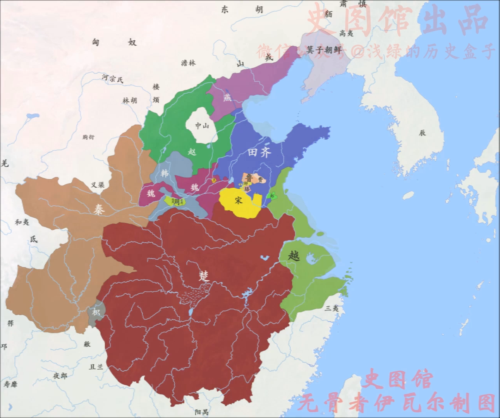

    主要诸侯:秦惠文王 楚怀王 齐宣王 赵武灵王 魏襄王 韩宣惠王 燕王子之 越王无疆 宋康王 鲁平公 卫嗣君 中山王厝

#### 公元前 314 年--周赧王元年

> 齐宣王派遣匡章伐燕，杀子之、燕王哙。
>
> > 赵武灵王派军护送公子职(燕王哙之子)入燕。

- 秦攻魏，取焦。
- 秦攻义渠，得二十五城。

#### 公元前 313 年--周赧王二年

- 燕人拥立公子职，是为燕昭王。
- 秦国樗里疾攻赵，取蔺。

#### 公元前 312 年--周赧王三年

- 楚攻韩，围雍氏，韩国归还周高都。
- 楚攻秦，战于丹阳、蓝田，秦军大破楚军。
- 韩、魏攻楚，到达邓地。
- 秦军反攻，夺取楚国汉中、上庸之地。

#### 公元前 308 年--周赧王七年

- 秦国甘茂、向寿伐韩。

#### 公元前 307 年--周赧王八年

- 赵武灵王“ 胡服骑射”，伐中山，北破楼烦、澹林。
- 秦军攻克韩国宜阳。
- 秦武王举鼎而死。

#### 公元前 306 年--周赧王九年

- 秦国宣太后主政。

> 赵武灵王伐林胡，至榆中。
> 赵武灵王伐中山，至宁葭。

> 楚攻越，杀越王无疆，拓境至浙江。
>
> > 越国残余势力四分五裂，一部分盘踞在琅琊、会稽等地，另一部分南下建立瓯越、闽越诸国。

#### 公元前 305 年--周赧王十年

- 赵武灵王伐中山，取十城，中山献四邑求和。

#### 公元前 304 年--周赧王十一年

- **屈原离开郢都赴汉北，做[《离骚》](https://baike.baidu.com/item/%E7%A6%BB%E9%AA%9A/1045?fr=aladdin)**
- 秦国归还楚国上庸之地。

#### 公元前 303 年--周赧王十二年

- 赵武灵王攻中山。

> 秦攻魏，取蒲阪、阳晋、封陵。
> 秦攻韩，取武遂。

#### 公元前 302 年--周赧王十三年

- 秦国归还魏国蒲坂。
- 赵武灵王攻取河宗氏、休溷诸貉地。

#### 公元前 301 年--周赧王十四年

- 齐、韩、魏攻楚方城，战于垂沙，楚军大败。
- 秦攻楚，取穰城。
- 宋康王攻楚，取淮北地。
- 赵武灵王攻中山，中山王奔齐。

#### 公元前 300 年--周赧王十五年

- 秦攻楚，取新城。
- 赵武灵王攻中山，取扶柳。

#### 公元前 299 年--周赧王十六年

- 楚怀王赴秦，秦国扣押楚怀王。
- 赵武灵王攻中山。

#### 公元前 298 年--周赧王十七年

- **荀子生** _战国后期儒家学派代表人物，今存《苟子》三十二篇_
- 秦攻楚，取析。
- 齐、韩、魏攻秦，至函谷，韩国攻取秦国新城。
- 赵武灵王传位于太子何(赵惠文王)，赵武灵王自称“主父”

#### 公元前 297 年--周赧王十八年

- 宋康王灭滕。

#### 公元前 296 年--周赧王十九年

- 赵灭中山。
- 齐、韩、魏联军攻破函谷，秦国求和。
- 韩取武遂，魏取河外、封陵。
- 楚怀王死于秦。

#### 公元前 294 年--周赧王二十一年

- 秦国白起攻韩，取新城。
- 赵国归还燕国鄭、易。

#### 公元前 293 年--周赧王二十二年

- 伊阙之战，白起大破韩魏联军。

#### 公元前 291 年--周赧王二十四年

- 秦攻韩，取宛城。

#### 公元前 290 年--周赧王二十五年

- 魏国向秦国割让河东四百里。
- 韩国向秦国割让武遂二百里。

#### 公元前 289 年--周赧王二十六年

- **孟子逝世** _孟子及其弟子共著《孟子》一书_
- 秦攻魏，至轵。

#### 公元前 288 年--周赧王二十七年

- 秦攻赵，取梗阳。

> 齐秦互帝，秦昭襄王称“ 西帝”，齐湣王称“东帝”。
>
> > 齐湣王称帝两天后取消帝号
> > 秦昭襄王随后也放弃称帝。

#### 公元前 287 年--周赧王二十八年

- 秦攻魏，取新垣、曲阳。

#### 公元前 286 年--周赧王二十九年

- 宋国内乱，齐潘王灭宋，宋康王奔魏，死于温地。
- 魏向秦割让安邑及河内。.

#### 公元前 285 年--周赧王三十年

- 楚国吞并枳地(巴国残余)

#### 公元前 284 年--周赧王三十一年

- 燕昭王命乐毅击齐。

* 燕、秦、韩、赵、魏五国联军伐齐，在济西大破齐军。
* 燕军连破齐国七十余城，齐湣王逃往莒城 最终被楚将淖齿杀死。
* 楚国夺取淮北之地。

#### 公元前 283 年--周赧王三十二年

- 秦攻魏，取安城，燕昭王、赵惠文王出兵救魏。
- 蔺相如完璧归赵。
- 燕将秦开击破东胡，开拓辽西之地。
  - (注:关于秦开击破东胡的年代，历来说法不一，此处依照《中国东北史》的观点）

#### 公元前 282 年--周赧王三十三年

- 秦攻赵，取蔺、祁。

#### 公元前 281 年--周赧王三十四年

- 秦攻赵，取离石。

#### 公元前 280 年--周赧王三十五年

- 秦国司马错伐楚，楚国割让上庸、汉北。
- 燕将秦开击破箕子朝鲜，拓地二千里，至满番汗为界(此处年代依照《中国东北史》)

#### 公元前 279 年--周赧王三十六年

- 燕昭王去世，乐毅奔赵。
- 秦昭襄王、赵惠文王会于渑池。
- 楚将庄蹯率军开拓黔中以西。
- 齐国田单大破燕军，齐国复国。
- 秦国白起攻楚，鄢郢之战，楚军大败。

#### 公元前 278 年--周赧王三十七年

- 秦军攻占郢都，楚顷襄王迁都陈，**屈原自沉**。
- 由于秦军截断归路，开拓西南的楚将庄蹯无法返回，于是率领部下占据滇池一带,建立滇国。

#### 公元前 277 年--周赧王三十八年

- 秦军攻占楚国的巫、黔中，白起被封为武安君。

#### 公元前 276 年--周赧王三十九年

- 赵国廉颇攻魏，取几。
- 楚国收复江南地。

#### 公元前 275 年--周赧王四十年

- 赵国廉颇攻魏，取防陵、安阳
- 秦国穰侯攻魏，魏献温邑求和

#### 公元前 274 年--周赧王四十一年

- 赵攻齐，取昌城、高唐。

#### 公元前 273 年--周赧王四十二年

- 华阳之战，白起大破魏赵联军。

#### 公元前 272 年--周赧王四十三年

- 秦灭义渠。
- 公孙操弑燕惠王。

#### 公元前 270 年--周赧王四十五年

- 秦攻齐，取刚、寿。

#### 公元前 269 年--周赧王四十六年

- 阏与之战，赵奢大破秦军。

#### 公元前 268 年--周赧王四十七年

- 秦攻魏，取怀。

#### 公元前 266 年--周赧王四十九年

- 秦攻魏，取邢丘。

#### 公元前 265 年--周赧王五十年

- 赵国归还齐国平原、高唐。
- 赵攻燕，取中阳。
- 赵国李牧北破澹林、匈奴。
- 秦攻韩，取少曲、高平。

#### 公元前 264 年--周赧王五十一年

- 秦攻韩，取陉城。

#### 公元前 262 年--周赧王五十三年

- 楚献州于秦。
- 秦攻韩，取野王，韩国上党归附赵国。

#### 公元前 261 年--周赧王五十四年

- 秦攻韩，取缑氏、纶。
- 楚攻鲁，取徐州。

#### 公元前 260 年--周赧王五十五年

- 长平之战，白起歼灭赵军，坑杀降卒。

#### 公元前 259 年--周赧王五十六年

- 秦军攻取赵国武安、太原，包围邯郸。

#### 公元前 257 年--周赧王五十八年

- 信陵君窃符救赵，邯郸解围。
- 秦昭襄王赐白起自尽。

#### 公元前 256 年--周赧王五十九年

- 秦攻韩，取阳城、负黍。
- 秦攻周，周赧王、西周公投降，周朝灭亡。
- 周赧王被迁往梁城居住，不久后病逝。
- 楚灭鲁，楚军席卷泗水流域，吞并泗上诸小国。
- 韩、赵、魏、楚攻秦，韩国收复上党，魏国收复河东，赵国收复太原。
- 燕孝王攻赵，取昌城。

# 战国（前 475—前 221）

## 秦昭襄王


    主要诸侯:秦昭襄王 楚考烈王 齐王建 赵孝成王 魏安僖王 韩桓惠王 燕孝王 卫怀君

#### 公元前 255 年--秦昭襄王五十二年

- 韩攻秦，取汝南。
- 秦取湔氐道。

#### 公元前 254 年--秦昭襄王五十三年

- 秦攻魏，取河东。
- 魏攻秦，取陶郡。

#### 公元前 251 年--秦昭襄王五十六年

- 燕赵部代之战，廉颇大破燕军。

## 秦孝文王


#### 公元前 250 年--秦孝文王元年

    主要诸侯:秦孝文王 楚考烈王 齐王建 赵孝成王 魏安僖王 韩桓惠王 燕王喜 卫元君

- 楚考烈王夺取越君亲占据的琅琊(事见《吴越春秋》)。
- 燕攻齐聊城。

## 秦庄襄王

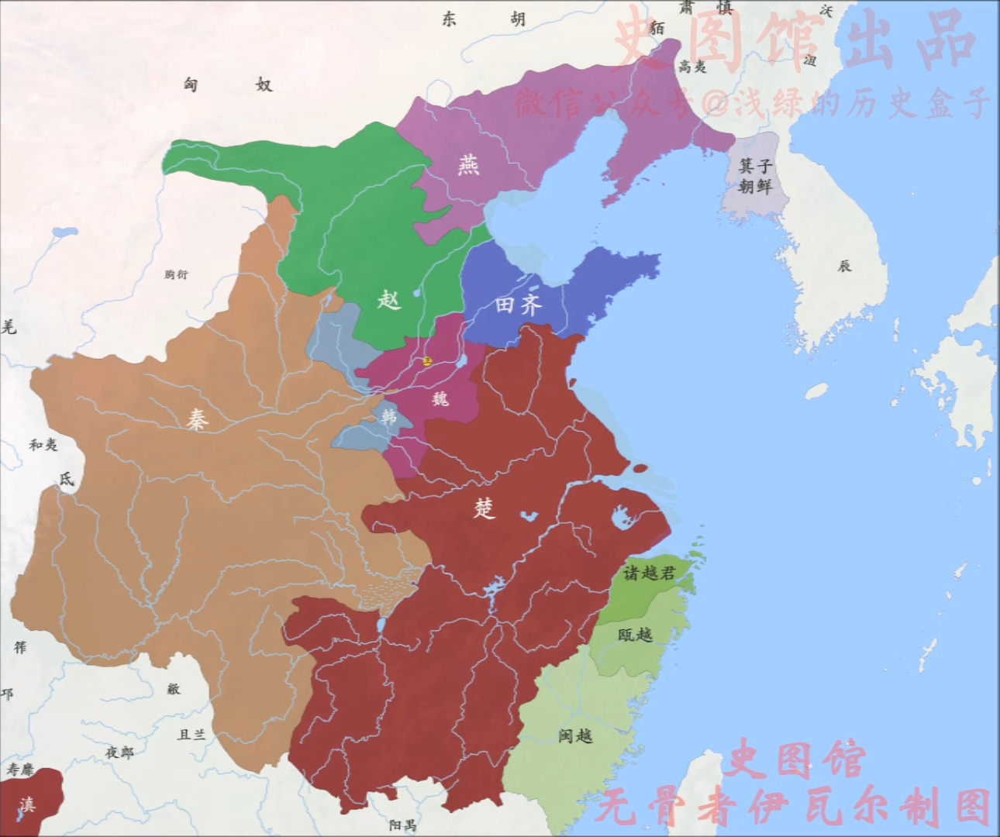

    主要诸侯:秦孝文王 楚考烈王 齐王建 赵孝成王 魏安僖王 韩桓惠王 燕王喜 卫元君

#### 公元前 249 年--秦庄襄王元年

- **宋玉作《九辩》** _《楚辞》名篇，传闻师从屈原_
- 秦灭东周国，迁东周君于阳人聚。
- 秦攻韩，取成皋、荥阳。
- 魏攻齐，取平陆。

#### 公元前 248 年--秦庄襄王二年

- 秦国蒙骜攻赵，取榆次、新城、狼孟。

#### 公元前 248 年--秦庄襄王三年

- 秦攻魏，取高都。
- 秦攻韩，取上党。
- 五国攻秦之战，信陵君击败秦军。
- 燕、赵互换土地。

#### 公元前 249 年--秦庄襄王四年

- **秦相吕不韦命宾客编《吕氏春秋》** _战国末期杂家的代表作_

## 约公元前 5-前 2 世纪

- **《山海经》成书** _主要记载神话传说和地理知识_

## 秦王政

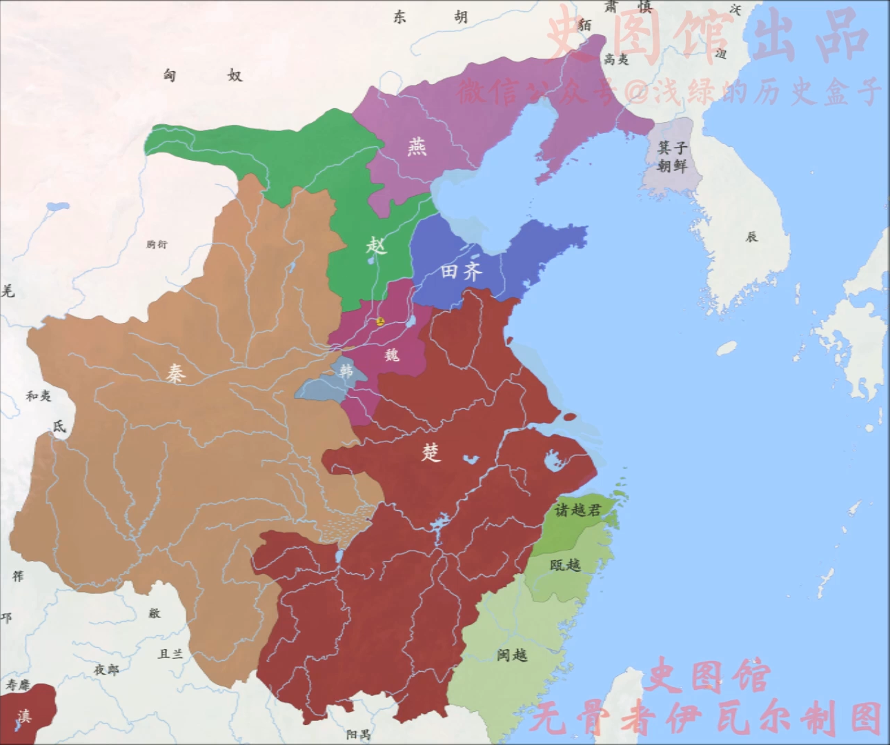
公元前 246 年
秦王政元年

    主要诸侯:秦王政 楚考烈王 齐王建 赵孝成王 魏安僖王 韩桓惠王 燕王喜 卫元君

#### 公元前 246 年--秦王政元年

- 秦攻赵，取晋阳。

#### 公元前 245 年--秦王政二年

- 秦攻魏，取卷。
- 赵国廉颇攻魏，取繁阳。

#### 公元前 243 年--秦王政四年

- 赵国李牧攻燕，取武遂、方城。

#### 公元前 242 年--秦王政五年

- 秦攻魏，取二十城，置东郡。

#### 公元前 241 年--秦王政六年

- 四国攻秦不胜。
- 楚考烈王迁都寿春。
- 赵攻齐，取饶安。
- 秦攻魏，取朝歌。
- 秦迁卫君于野王。

#### 公元前 240 年--秦王政七年

- 秦攻魏，取汲。

#### 公元前 239 年--秦王政八年

- 魏献邺城于赵。

#### 公元前 238 年--秦王政九年

- 秦攻魏，取首垣、蒲、衍。
- 楚国李园杀春申君。

#### 公元前 236 年--秦王政十一年

- 赵国李牧攻燕，取狸、阳城。
- 秦国王翦攻赵，取邺、阏与。

#### 公元前 234 年--秦王政十三年

- 秦攻赵，取雁门、云中。

#### 公元前 233 年--秦王政十四年

- **韩非入秦** _入狱被害，著有《韩非子》_
- 秦国桓骑攻赵，取平阳、武城。
- 秦王杀韩非。

#### 公元前 232 年--秦王政十五年

- 番吾之战，赵国李牧击败秦军。.
- 赵攻燕，取上谷。

#### 公元前 231 年--秦王政十六年

- 韩献南阳地。

| 时间                          |                               事件                               |        地图         |
| :---------------------------- | :--------------------------------------------------------------: | :-----------------: |
| 公元前 230 年--秦王政十七年   |                              秦灭韩                              |  |
| 公元前 228 年--秦王政十九年   |        赵幽缪王杀李牧<br/>秦灭赵<br/>赵公子嘉自立为代王。        | 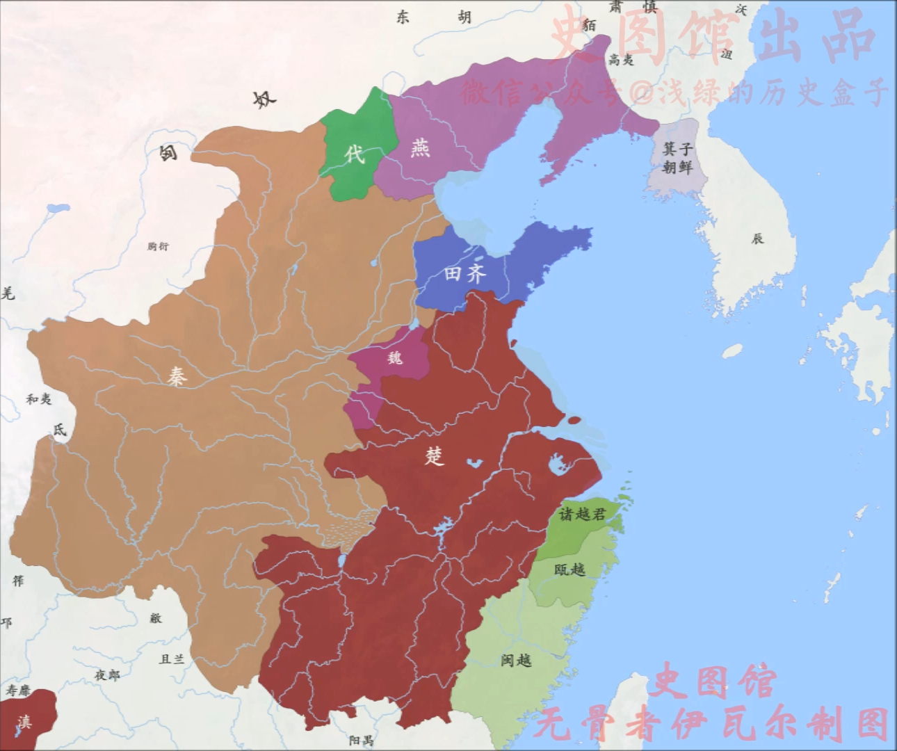 |
| 公元前 227 年--秦王政二十年   |                    荆轲刺秦王。秦国王翦攻燕。                    |  |
| 公元前 226 年--秦王政二十一年 |                  王翦攻克蓟城，燕王喜东奔辽东。                  |  |
| 公元前 225 年--秦王政二十二年 |       王贲水淹大梁，秦灭魏。秦国李信攻楚，被楚将项燕击败。       | 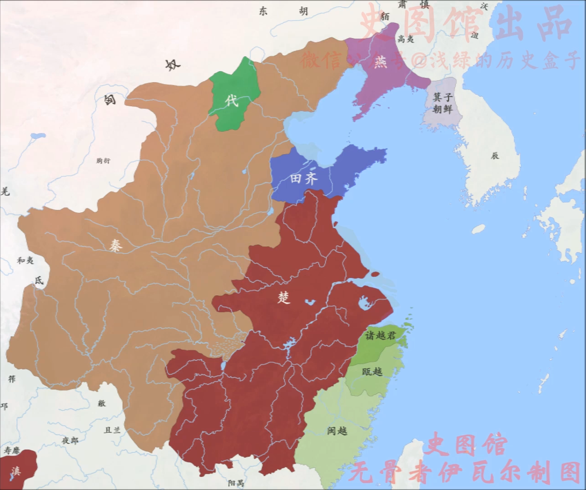 |
| 公元前 224 年--秦王政二十三年 |  秦国王翦击败楚军，取郢陈，俘获楚王负刍。项燕拥立昌平君为楚王。  |  |
| 公元前 223 年--秦王政二十四年 |                  昌平君战死，项燕自杀，秦灭楚。                  | 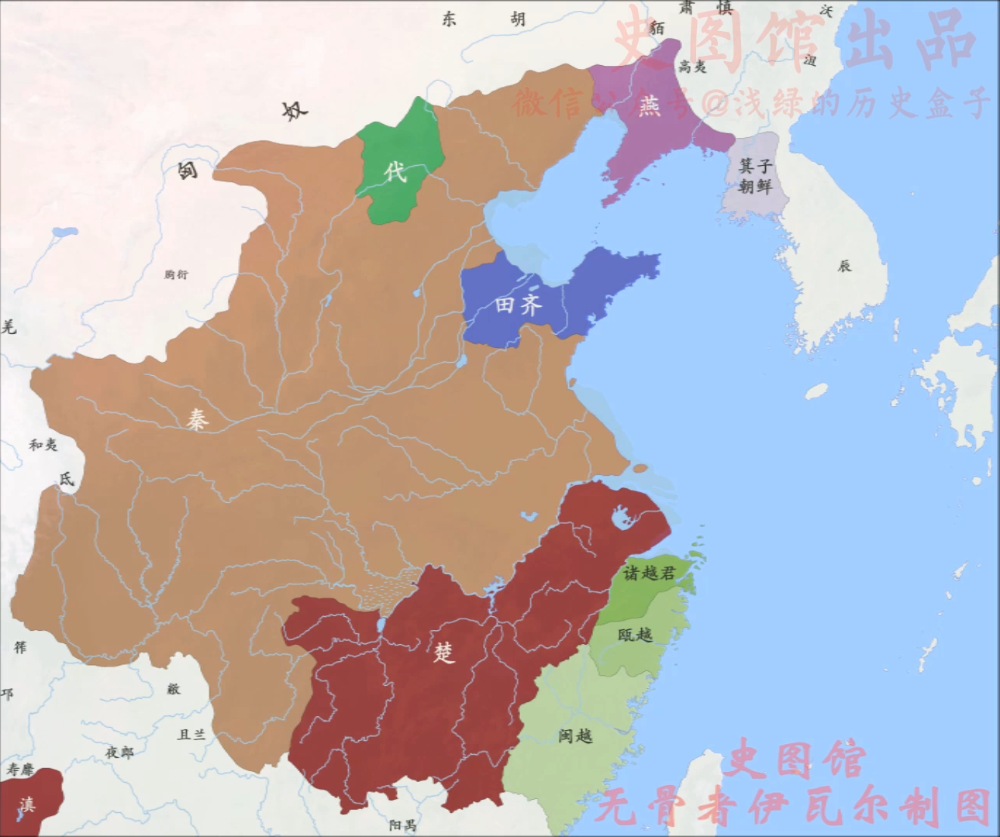 |
| 公元前 222 年--秦王政二十五年 | 王贲攻燕、代，燕王喜、代王嘉被俘。王翦平定楚国江南地，越君降秦。 |  |

# **秦**（前 221-207）[15]

**咸阳，华夏族，嬴政**


#### 公元前 221 年--秦始皇二十六年

- 齐国不战而降
- 秦王政称始皇帝
- 屠睢南征百越
- 置三十六郡
- 统一度量衡
- 三公九卿制度（三公：丞相，太尉，御史大夫）

#### 公元前 220 年--秦始皇二十七年

- 书同文、车同轨
- 始皇巡陇西
- 筑驰道、直道

#### 公元前 219 年--秦始皇二十八年

- 始皇封禅
- 徐福出海

#### 公元前 218 年--秦始皇二十九年

- 百越反秦，杀屠睢
- 博浪沙行刺
- 秦始皇东游

#### 公元前 217 年--秦始皇三十年

- 开五尺道

#### 公元前 216 年--秦始皇三十一年

- 更名民曰黔首

#### 公元前 215 年--秦始皇三十二年

- 蒙恬北伐匈奴

#### 公元前 214 年--秦始皇三十三年

- 任嚣、赵佗南征百越
- 修筑长城
- 蒙恬收复河套
- 修成灵渠

#### 公元前 213 年--秦始皇三十四年

- 焚书

#### 公元前 212 年--秦始皇三十五年

- 始建阿房宫
- 坑儒

#### 公元前 211 年--秦始皇三十六年

- 始皇再东巡

#### 公元前 210 年--秦始皇三十七年

- 沙丘之变
- 徐福东渡

## 秦二世

#### 公元前 209 年--秦二世元年

- **李斯逝世** _有《谏逐客书》一文传世_

| 时间                      | 事件                                                                                               |          地图           |
| ------------------------- | -------------------------------------------------------------------------------------------------- | :---------------------: |
| 公元前 209 年 7 月        | 赵高擅权<br/>大泽乡起义<br/>秦二世废卫君角<br/>冒顿鸣镝弑父自立为单于                              |       |
| 公元前 209 年 8 月        | 武臣自立为赵王                                                                                     |       |
| 公元前 209 年 9 月        | 刘邦、项梁起兵<br/>韩广自立为燕王<br/>田儋自立为齐王<br/>周市立魏咎为魏王<br/>无诸、驺摇、任囂割据 |       |
| 公元前 209 年 11 月       | 章邯连破义军<br/>秦嘉、朱鸡石起兵                                                                  |      |
| 公元前 209 年 12 月       | 陈胜兵败                                                                                           |      |
| 公元前 208 年 正 月       | 张耳、陈馀立赵歇为赵王<br/>东阳宁君、秦嘉立景驹为楚王<br/>番阳令吴芮起兵                           |       |
| 公元前 208 年 2 月        | 刘邦拔砀                                                                                           |       |
| 公元前 208 年 夏          | 项梁渡江<br/>陈婴归附项梁<br/>项梁破秦嘉 <br/>项梁立楚怀王                                         |     |
| 公元前 208 年 6 月        | 定陶之战<br/>章邯破齐、楚军，魏王咎降秦                                                            |       |
| 公元前 208 年 7 月        | 楚军破章邯军于东阿、濮阳东                                                                         |       |
| 公元前 208 年 9 月        | 九月，章邯、王离攻赵，<br/>夷邯郸，围巨鹿<br/>怀王遣刘邦西攻秦                                     |       |
| 公元前 208 年 12 月       | 巨鹿之战                                                                                           |      |
| 公元前 207 年 2 月        | 刘邦攻下陈留                                                                                       |       |
| 公元前 207 年 3 月        | 刘邦大破秦将杨熊于白马、曲遇东。                                                                   |       |
| 公元前 207 年 4 月        | 四月，刘邦攻下颍川。                                                                               |       |
| 公元前 207 年 6,7 月      | 六月，刘邦与南阳守騎战犨东，破之，略南阳郡。七月，南阳守齬以宛城降<br/>析、郦皆降。                |      |
| 公元前 207 年 8,9 月      | 八月，指鹿为马<br/>望夷宫之变<br/>宛城降刘邦<br/>章邯降项羽<br/>刘邦破武关。九月，刘邦军至蓝田。   |      |
| 公元前 207 年 10,11,12 月 | 十月，秦王子婴降刘邦,约法三章。十一月，新安杀降。十二月，鸿门宴。                                  |  |

# 西楚

## 西楚霸王项羽—**楚汉战争**

| 时间                  | 事件                                                                                                   | 地图                      |
| --------------------- | ------------------------------------------------------------------------------------------------------ | ------------------------- |
| 公元前 206 年 2 月    | 项羽分封诸侯<br/>冒顿单于击东湖                                                                        |   |
| 公元前 206 年 5，6 月 | 田荣击走齐王田都<br/>田荣截杀田市，自立为齐王<br/>项羽废韩王成                                         |  |
| 公元前 206 年 7 月    | 七月，田荣攻并济北王田安。                                                                             |   |
| 公元前 206 年 8 月    | 八月，刘邦暗度陈仓定三秦。王陵附汉。项羽封郑昌为韩王。燕王臧荼攻并辽东王韩广                           |   |
| 公元前 206 年 10 月   | 十月，陈馀联合齐兵击走常山王张耳，迎代王赵歇为赵王。赵王歇以陈馀为代王。河南王中阳降汉。韩王郑昌降汉。 |  |
| 公元前 206 年 11 月   | 汉军拔陇西                                                                                             |  |
| 公元前 205 年 正 月   | 项羽伐齐，汉拔北地                                                                                     |   |
| 公元前 205 年 3 月    | 项羽立田假为齐王<br/>殷王司马卬、西魏王魏豹降汉<br/>田荤弟横起兵于城阳，立田荣子广为齐王。             |   |
| 公元前 205 年 4 月    | 彭城之战                                                                                               |   |
| 公元前 205 年 5 月    | 五月，汉军败撤。西魏王魏豹叛汉归楚。田横击走田假，复齐失地                                             |   |
| 公元前 205 年 6 月    | 汉军破废丘。                                                                                           |   |
| 公元前 205 年 9 月    | 九月，安邑之战，韩信虏西魏王魏豹。阏与之战，韩信擒代相夏说。                                           |   |
| 公元前 205 年 10 月   | 十月，韩信、张耳攻赵。井陉之战，汉灭赵。                                                               |  |
| 公元前 205 年 11 月   | 九江王英布赴汉                                                                                         |  |
| 公元前 204 年 4 月    | 荥阳相持                                                                                               |   |
| 公元前 204 年 5 月    | 五月，荥阳之战。楚军围荥阳、拔成皋。彭越攻楚，破下郅。刘邦复成皋。                                     |   |
| 公元前 204 年 6 月    | 六月，楚军拔荥阳、复拔成皋，欲西，汉使兵距之巩。刘邦夺张耳、韩信军。                                   |   |
| 公元前 204 年 8 月    | 彭越扰楚                                                                                               |   |
| 公元前 204 年 10 月   | 十月，韩信攻齐，袭破历下军，入临淄。汉军复取成皋，军广武。项羽复梁地十余城。                           |  |
| 公元前 204 年 11 月   | 潍水之战                                                                                               |  |
| 公元前 203 年 8 月    | 赵佗并桂林郡、象郡，自称南越武王。八月，灌婴南下攻楚。楚汉议和，以鸿沟为界。                           |   |
| 公元前 203 年 10 月   | 齐地尽归汉王<br/>阳夏固陵之战<br/>项羽南逃至陈                                                         |  |
| 公元前 203 年 11 月   | 十一月，汉破项羽于陈下项羽逃往垓下。周殷叛楚降汉。                                                     |  |
| 公元前 203 年 12 月   | 垓下之战<br/>项羽自刎<br/>汉破临江国                                                                   |       |

# 西汉（前 206-+8）

**长安，汉族，刘邦**

    陈汤--明犯强汉者，虽远必诛


## 公元前 202 年--汉高祖五年

- 汉王刘邦称帝。
- 徙衡山王至长沙。
- 五月，迁都长安。
- 七月，燕王藏荼反汉。
- 九月，臧荼兵败。
- 立太尉卢绾为燕王。

## 公元前 201 年--汉高祖六年

- 十月，废楚王韩信为淮阴侯。
- 正月，韩王信迁至马邑。
- 九月，韩王信降匈奴。
- 匈奴南下晋阳。

#### 公元前 200 年--汉高祖七年

- 十月，韩王信逃入匈奴
- 白登之围
- 二月，始建未央宫
- 和亲匈奴
- 冬，惯高谋刺刘邦。

#### 公元前 199 年--汉高祖八年

- 匈奴扰汉北边。

#### 公元前 198 年--汉高祖九年

- 贯高谋剌事泄。
- 赵王张敖废为宣平侯。

#### 公元前 197 年--汉高祖十年

- 五月，太上皇崩于栎阳宫
- 九月，代相陈豨反，自立为代王，劫略赵、代
- 十二月，刘邦亲征大破陈豨。
- 太尉周勃入定代地。

#### 公元前 196 年--汉高祖十一年

- 白马之盟
- 淮阴侯韩信谋反被诛。
- 柴武斩韩王信于参合。
- 三月，梁王彭越被夷三族
- 五月，陆贾使南越国。
- 七月，淮南王英布反，东并荆、北击楚。
- 十月，刘邦亲征与英布军战于蕲西。布败走江南。
- 平定陈豨。

#### 公元前 195 年--汉高祖十二年

- 卢绾叛乱，后亡入匈奴
- 四月，汉高祖崩，惠帝立
- 吕后掌权
- 修天禄阁

## 汉惠帝


#### 公元前 194 年--汉惠帝元年

- 卫满代箕氏朝鲜

#### 公元前 193 年--汉惠帝二年

- 萧规曹迪

#### 公元前 192 年--汉惠帝三年

- 匈奴辱吕后

#### 公元前 191 年--汉惠帝四年

- 卫满朝鲜北扩

#### 公元前 190 年--汉惠帝五年

- 长安城墙建成

#### 公元前 190 年--汉惠帝五年

- 起长安西市，修敖仓

#### 公元前 188 年--汉惠帝七年

- 惠帝崩，前少帝立。
- 吕后称制

## 汉高后


#### 公元前 187 年--汉高后元年

- 吕后废三族罪、妖言令。

#### 公元前 186 年--汉高后二年

- 行八铢钱
- 诸侯来朝

#### 公元前 185 年--汉高后三年

- 河水满溢，流民众多

#### 公元前 184 年--汉高后四年

- 吕后杀前少帝，立后少帝

#### 公元前 185 年--汉高后五年

- 赵佗称帝

#### 公元前 182 年--汉高后六年

- 太后废吕王嘉，以吕产代之
- 行五分钱
- 匈奴攻狄道、阿阳

#### 公元前 181 年--汉高后七年

- 匈奴侵犯狄道
- 南越人侵长沙

#### 公元前 180 年--汉高后八年

- 吕太后逝

- 诸吕之乱，周勃、陈平夺军权
- 后少帝被废杀，文帝立

## 汉文帝


#### 公元前 179 年--汉文帝前元元年

- **贾谊作[《过秦论》](https://baike.baidu.com/item/%E8%BF%87%E7%A7%A6%E8%AE%BA/335641?fr=aladdin)** _著名政论散文_

- 陆贾使南越国
- 卫氏朝鲜扩张
- 文景之治

#### 公元前 178 年--汉文帝前元二年

- 丞相陈平卒，以周勃为相

#### 公元前 177 年--汉文帝前元三年

- 匈奴侵北地、河南

#### 公元前 176 年--汉文帝前元四年

- 出为长沙太傅，过湘水，作[《吊屈原赋》](https://baike.baidu.com/item/%E5%90%8A%E5%B1%88%E5%8E%9F%E8%B5%8B/573271?fr=aladdin) _开汉赋之先声_
- 丞相灌婴卒
- 匈奴退兵

#### 公元前 175 年--汉文帝前元五年

- 撤消盗铸钱令，铸四铢钱

#### 公元前 174 年--汉文帝前元六年

- 匈奴迁单于庭至龙城
- 淮南厉王刘长谋反

#### 公元前 173 年--汉文帝前元七年

- 未央宫东阙罘患灾

#### 公元前 172 年--汉文帝前元八年

- 封淮南厉王长子四人为侯

#### 公元前 170 年--汉文帝前元十年

- 文帝幸甘泉
- 将军薄昭卒

#### 公元前 169 年--汉文帝前元十一年

- 文帝幸代
- 匈奴侵犯狄道

#### 公元前 168 年--汉文帝前元十二年

- 黄河决于东郡
- 文帝除田租税之半

#### 公元前 167 年--汉文帝前元十三年

- 缇萦救父，撤肉刑法
- 文帝免除田租

#### 公元前 166 年--汉文帝前元十四年

- 匈奴扰北地

#### 公元前 165 年--汉文帝前元十五年

- 文帝郊祀上帝诸神于雍

#### 公元前 164 年--汉文帝前元十六年

- 文帝郊祀五帝于渭阳
- 文帝得玉杯，令明年改元

#### 公元前 162 年--汉文帝后元二年

- 和亲匈奴
- 匈奴退兵
- 张苍罢相

#### 公元前 160 年--汉文帝后元四年

- 匈奴迁单于庭
- 南越南扩

#### 公元前 158 年--汉文帝后元六年

- 匈奴入上郡、云中

#### 公元前 156 年--汉景帝前元元年

- **枚乘作[《七发》](https://hanyu.baidu.com/shici/detail?pid=49df3fa4680642d79c94f265453755e1&from=kg0)** _西汉著名辞赋家，开创“七休”_

- 汉文帝崩
- 长沙王吴差无后，国除
- 约法省禁
- 三十税一

#### 公元前 155 年--汉景帝前元二年

- 立诸皇子为王

#### 公元前 154 年--汉景帝前元三年

- 推削藩策
- 七国之乱
- 周亚夫平乱

#### 公元前 153 年--汉景帝前元四年

- 立太子
- 皇子彻为胶东王
- 废赵为郡

#### 公元前 150 年--汉景帝前元七年

- 废太子刘荣为临江王
- 周亚夫为相

#### 公元前 148 年--汉景帝中元二年

- 改车裂为弃市
- 匈奴入燕

#### 公元前 147 年--汉景帝中元三年

- 匈奴王来降
- 禁酤酒

#### 公元前 144 年--汉景帝中元六年

- 上郡之战
- 匈奴入武泉、上郡
- 梁孝王武薨

#### 公元前 145 年--汉景帝中元七年

- **司马相如作[《子虚赋》](https://baike.baidu.com/item/%E5%AD%90%E8%99%9A%E8%B5%8B/574083?fr=aladdin)** _汉赋代表作家，被称为“赋圣”_

#### 公元前 143 年--汉景帝后元元年

- 民得酤酒
- 周亚夫死于狱中

#### 公元前 142 年--汉景帝后元二年

- 匈奴入雁门

#### 公元前 141 年--汉景帝后元三年

- 景帝崩，武帝即位
- 封皇太后弟田酚、田胜为侯

## 汉武帝

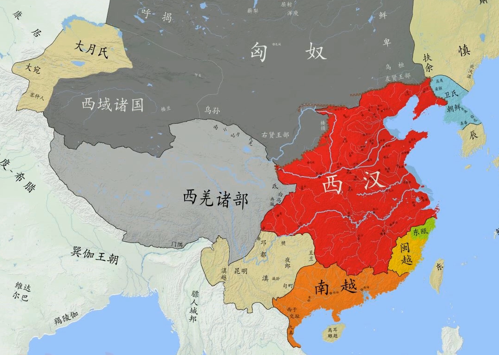

#### 公元前 140 年--汉武帝建元元年

- 武帝建元
- 币制改革
- 第一次货币改革，行三铢钱
- 董仲舒为江都相
- 汉武盛世

#### 公元前 139 年--汉武帝建元二年

- 窦太后反对尊儒
- 淮南子成书
- 张骞使西域
- 以许昌为丞相

#### 公元前 138 年--汉武帝建元三年

- 闽越围东瓯，东瓯内迁
- 汉武帝微行

#### 公元前 137 年--汉武帝建元四年

- 南越武王赵佗卒，其孙文王昧立

#### 公元前 136 年--汉武帝建元五年

- 置五经博士
- 二次币制改革，罢三铢钱，行半两钱

#### 公元前 135 年--汉武帝建元六年

- 夜郎自大
- 闽越王郢攻南越国
- 许昌免官
- 窦太后逝
- 罢黜百家

#### 公元前 134 年--汉武帝元光元年

- **董仲舒上《举贤良对策》** _提出“罢黜百家，表彰六经”的主张_
- 独尊儒术
- 设察举制
- 李广屯云中，程不识屯雁门

#### 公元前 133 年--汉武帝元光二年

- 马邑之战

#### 公元前 132 年--汉武帝元光三年

- 黄河改道
- 黄河决濮阳

#### 公元前 131 年--汉武帝元光四年

- 魏其侯窦婴被诛
- 以中尉张欧为御史大夫

#### 公元前 130 年--汉武帝元光五年

- 陈皇后巫蛊，被废
- 唐蒙、司马相如通西南夷

#### 公元前 129 年--汉武帝元光六年


- 匈奴入上谷，汉分道攻匈奴、卫青袭破龙城
- 匈奴犯渔阳，韩安国屯渔阳

#### 公元前 128 年--汉武帝元朔元年

- **《汉赋》兴盛** _代表人物：司马相如[**《子虚赋》**](https://baike.baidu.com/item/%E5%AD%90%E8%99%9A%E8%B5%8B/574083?fr=aladdin) 东方朔]《答客难》](https://baike.baidu.com/item/%E7%AD%94%E5%AE%A2%E9%9A%BE/4516697?fr=aladdin)_
- 匈奴入渔阳、雁门
- 卫青出雁门,李息出代
- 东夷减君南闾降，置苍海郡

#### 公元前 127 年--汉武帝元朔二年

- 下推恩令
- 匈奴入上谷、渔阳,卫青夺河套
- 徙民朔方、茂陵

#### 公元前 126 年--汉武帝元朔三年

- 张骞通西域,张骞回国
- 苏建筑长城
- 匈奴入代、雁门
- 罢苍海郡
- 罢西夷，独置南夷、夜郎两县

#### 公元前 125 年--汉武帝元朔四年


- 李息、张次公、卫青反击匈奴
- 匈奴入代郡、定襄、上郡

#### 公元前 124 年--汉武帝元朔五年

- 匈奴侵朔方、入代
- 薛泽免官
- 雷被告刘安谋反
- 卫青出朔方、高阙
- 长安设太学

#### 公元前 123 年--汉武帝元朔六年

- 卫青出定襄攻匈奴

#### 公元前 122 年--汉武帝元狩元年

- 张骞派使者访身毒
- 淮南王安谋反，后自杀
- 匈奴入上谷

#### 公元前 121 年--汉武帝元狩二年


霍去病出陇西

- 汉设武威、酒泉郡
- 匈奴浑邪王降
- 建河西长城

#### 公元前 120 年--汉武帝元狩三年

- 匈奴入右北平、定襄
- 汉讨昆明

#### 公元前 119 年--汉武帝元狩四年


- 盐铁国营
- 漠北之战，卫青、霍去病出定襄、代
- 张骞二次出使，出乌孙
- 第三次币制改革，销半两钱，更铸三铢钱
- 封狼居胥山

#### 公元前 118 年--汉武帝元狩五年

- 罢三铢钱,发行五铢钱
- 丞相李蔡坐法死

#### 公元前 117 年--汉武帝元狩六年

- 霍去病逝
- 钱币改革失败

#### 公元前 116 年--汉武帝元鼎元年

- 废济东王彭离，国除，为大河郡

#### 公元前 115 年--汉武帝元鼎二年

- 张骞自乌孙还，开丝绸之路
- 御史大夫张汤有罪自杀

#### 公元前 114 年--汉武帝元鼎三年

- 徙函谷关于新安
- 陇西郡西界扩展
- 置弘农、安定、天水郡
- 常山王舜薨，徙其子平为真定王

#### 公元前 112 年--汉武帝元鼎五年

- **武帝设汉乐府** _“感于哀乐，缘事而发”_

- 南越国吕嘉叛乱，武帝遣路博德、杨仆等击南越，遣军下牂柯江，伐番禺
- 且兰君反汉阻道
- 酎金失侯
- 西羌攻故安、袍罕，匈奴入五原

#### 公元前 111 年--汉武帝元鼎六年


- 汉平南越
- 夜郎等西南夷附汉
- 武帝北巡
- 东越之乱，闽越余善反
- 平西羌之乱
- 从武威、酒泉划出张掖、敦煌郡，为河西四郡

#### 公元前 110 年--汉武帝元封元年

- 汉平东越之战、徒民至江淮一带
- 置均输官、平准官
- 武帝封禅泰山
- 武帝北巡
- 并珠崖洲，建儋耳、珠崖郡

#### 公元前 109 年--汉武帝元封二年

- 攻卫满朝鲜之战，杨仆、苟彘攻朝鲜
- 武帝封泰山、祠明堂
- 汉兵击劳浸、靡末，滇越附汉
- 填黄河之决

#### 公元前 108 年--汉武帝元封三年


- 汉灭卫满朝鲜，置乐浪、临屯、玄菟、真番四郡
- 赵破奴击车师，虏楼兰王武都氐人反

#### 公元前 107 年--汉武帝元封四年

- 匈奴寇朔方
- 遣使说降匈奴

#### 公元前 106 年--汉武帝元封五年

- 武帝封禅泰山
- 置十三刺史
- 卫青逝

#### 公元前 105 年--汉武帝元封六年

- 益州、昆明反
- 汉使西逾葱岭，抵安息
- 汉使乌孙未果

#### 公元前 104 年--汉武帝太初元年

- **司马迁开始撰写《史记》** _“史家之绝唱，无韵之离骚”_
- 武帝封泰山、禅蒿里山
- 李广利征大宛
- 公孙敖筑塞外受降城

#### 公元前 103 年--汉武帝太初二年

- 浚稽山之战
- 李广利败还敦煌
- 赵破奴降于匈奴

#### 公元前 102 年--汉武帝太初三年

- 李广利再征大宛，大宛附汉
- 武帝封泰山、禅石闾山
- 徐自为筑五原塞外列城
- 路博德筑居延塞

#### 公元前 100 年--汉武帝太汉元年

- 苏武牧羊
- 赵破奴自匈奴归

#### 公元前 99 年--汉武帝太汉二年

- 李广利攻匈奴右贤王，败还
- 李陵攻匈奴兵败
- 司马迁被下腐刑
- 因杅将军敖出西河，与路博德会涿涂山，无果
- 汉击车师，匈奴救之

#### 公元前 98 年--汉武帝太汉三年

- 匈奴入雁门
- 初榷酒酤
- 武帝封泰山、祠明堂

#### 公元前 97 年--汉武帝太汉四年

- 西汉三道击匈奴
- 李陵被俘

#### 公元前 96 年--汉武帝太始元年

- 公孙敖为巫蛊死
- 徙郡国豪桀于茂陵、云陵

#### 公元前 94 年--汉武帝太始三年

- 赵太子丹通鑫，被废
- 令天下大酺五日

#### 公元前 92 年--汉武帝征和元年

- 巫蛊案起
- 丞相公孙贺下狱

#### 公元前 91 年--汉武帝征和二年

- **司马迁作[《报任安书》](https://hanyu.baidu.com/shici/detail?pid=d5295825db3a441e8e09a3d7bd9e5d05&from=kg0)** _“人固有一死，或重于泰山，或轻于鸿毛”_
- **《史记》成书** _史家之绝唱，无韵之离骚_
- 巫蛊之祸，太子发兵诛江充，兵败自杀
- 公孙贺死
- 匈奴入上谷、五原
- 诸邑公主、阳石公主及长平侯坐巫蛊诛

#### 公元前 90 年--汉武帝征和三年

- 匈奴入五原、酒泉，李广利降匈奴
- 巫蛊案水落石出
- 公孙勇谋反，田广明捕斩之
- 楼兰附匈奴

#### 公元前 89 年--汉武帝征和四年

- 轮台罪己
- 武帝封泰山、禅蒿里山
- 李广利为卫律杀

#### 公元前 87 年--汉武帝后元二年

- 汉武帝崩
- 霍光辅政
- 匈奴入朔方，发军屯西河

## 汉昭帝


#### 公元前 86 年--汉昭帝始元元年

- 益州夷皆反
- 吕破胡讨西南夷
- 刘旦、刘泽反
- 扶余分裂
- 昭宣之治

#### 公元前 85 年--汉昭帝始元二年

- 汉统治闽越伊始
- 霍光、上官桀获封侯
- 遣军朔方，调将屯张掖
- 匈奴单于威信渐失

#### 公元前 83 年--汉昭帝始元四年

- 西南夷姑缯、叶榆复反
- 田广明击益州
- 廷尉李种坐故纵弃市

#### 公元前 82 年--汉昭帝始元五年

- 罢儋耳郡并属珠崖
- 罢真番郡，余县并入乐浪
- 田广明、王平击益州

#### 公元前 81 年--汉昭帝始元六年

- 盐铁论
- 苏武回汉
- 罢榷酤官

#### 公元前 80 年--汉昭帝元凤元年

- 武都氐人反，马适建、韩增、田广明击之
- 匈奴四队寇边
- 刘旦、上官桀、桑弘羊谋反，伏诛

#### 公元前 79 年--汉昭帝元凤二年

- 免马口钱
- 匈奴遣兵屯受

#### 公元前 78 年--汉昭帝元凤三年

- 徐仁、王平、贾胜胡皆坐纵反者
- 辽东乌桓反，范明友击之
- 匈奴单于窥边，击酒泉、张掖
- 傅介子使大宛

#### 公元前 77 年--汉昭帝元凤四年

- 汉破楼兰
- 田千秋薨，霍光独揽大政

#### 公元前 76 年--汉昭帝元凤五年

- 西域南道畅通
- 罢象郡，分属郁林、牂柯

#### 公元前 75 年--汉昭帝元凤六年

- 徒民筑辽东、玄菟城
- 乌桓犯塞，范明友击之

#### 公元前 74 年--汉昭帝元凤七年

- 汉昭帝崩
- 伊霍废立
- 匈奴与车师合兵犯乌孙

## 汉宣帝


#### 公元前 73 年--汉宣帝本始元年

- 徙民于平陵
- 莎车、于阗附汉
- 霍光严行武帝之法

#### 公元前 72 年--汉宣帝本始二年

- 匈奴侵边，西伐乌孙
- 田广明六路击匈奴
- 田延年有罪自杀

#### 公元前 71 年--汉宣帝本始三年

- 汉援乌孙击匈奴
- 恭哀许皇后崩
- 匈奴单于击乌孙，丁零、乌桓、乌孙攻匈奴
- 郄善以西诸国叛汉

#### 公元前 70 年--汉宣帝本始四年

- 广川王吉谋反，自杀
- 立霍光女为皇后
- 车师附匈奴

#### 公元前 68 年--汉宣帝地节二年

- 霍光薨
- 宣帝亲政
- 匈奴前所得西呼居左地者南降汉
- 郑吉破车师交河城

#### 公元前 67 年--汉宣帝地节三年

- 立皇太子，大赦天下
- 车师之战，郑吉击匈奴

#### 公元前 66 年--汉宣帝地节四年

- 霍禹谋划废帝事败
- 刘牛有菲，废迁房陵
- 乌孙公主为龟兹王绛宾夫人

#### 公元前 65 年--汉宣帝元康元年

- 龟兹王来朝、归汉
- 西域南道重新畅通
- 置建章卫尉
- 赵广汉被斩

#### 公元前 64 年--汉宣帝元康二年

- 匈奴击车师，郑吉救之

#### 公元前 62 年--汉宣帝元康四年

- 西羌反，遣赵充国、许延寿击西羌

#### 公元前 61 年--汉宣帝神爵元年

- **戴圣编辑《礼记》成** _记载先秦礼制，儒家“五经”之一_
- 西羌降服，置金城属国以处降羌
- 圣主得贤臣颂

#### 公元前 60 年--汉宣帝神爵二年


- 设西域都护府
- 闰振单于自立
- 匈奴日逐王降汉
- 盖宽饶有罪，自杀

#### 公元前 59 年--汉宣帝神爵三年

- 匈奴平闰振单于
- 珠崖三县反
- 魏相逝

#### 公元前 58 年--汉宣帝神爵四年

- 河南太守严延年有罪，弃市
- 匈奴呼留若王来朝
- 握衍朐鞮单于自杀

#### 公元前 57 年--汉宣帝五凤元年

- 匈奴五单于争立

#### 公元前 56 年--汉宣帝五凤二年

- 匈奴呼韩邪破屠耆单于，车犁、屠耆单于降
- 韩增逝

#### 公元前 55 年--汉宣帝五凤三年

- 置西河、北地属国安置匈奴降军
- 闰振单于、郅支单于立
- 黄霸为丞相

#### 公元前 54 年--汉宣帝五凤四年

- 广陵王胥有罪，自杀
- 匈奴单于称臣
- 闰振单于东击郅支单于，败死，郅支都单于庭

#### 公元前 53 年--汉宣帝甘露元年

- 乌孙附汉
- 统一西域
- 匈奴呼韩邪单于、郅支单于遣子入侍
- 分置大小昆弥
- 珠崖九县反

#### 公元前 52 年--汉宣帝甘露二年

- 遣兵击珠崖
- 匈奴单于款五原塞

#### 公元前 51 年--汉宣帝甘露三年

- 呼韩邪单于朝汉
- 汉匈大战结束
- 乌孙大昆弥葬汉地

#### 公元前 49 年--汉宣帝黄龙元年

- 宣帝崩，元帝立
- 伊利目单于自立，郅支单于杀之
- 郅支单于击乌揭、坚昆、丁零、并三国

## 汉元帝


#### 公元前 48 年--汉元帝初元元年

- 平伊利目单于
- 珠崖再反
- 上郡胡人逃入匈奴
- 关东郡国大水
- 置戊己校尉，屯车师

#### 公元前 47 年--汉元帝初元二年

- 立刘骜为皇太子
- 关东饥，齐人相食
- 萧望之遭诬告下狱，自杀，弘恭卒，石显为中书令

#### 公元前 46 年--汉元帝初元三年

- 珠崖郡山南县反，汉弃珠崖
- 郅支单于向西域发展
- 升周堪为光禄勋

#### 公元前 44 年--汉元帝初元五年

- 贡禹卒
- 谷吉使匈奴，被扣留
- 郅支击乌孙，入谷城

#### 公元前 41 年--汉元帝永光元年

- 呼韩邪北归单于庭
- 赦云阳徒

#### 公元前 42 年--汉元帝永光二年

- 西羌反，遣冯奉世击之

#### 公元前 41 年--汉元帝永光三年

- 平定西羌
- 复盐铁官

#### 公元前 37 年--汉元帝建昭二年

- 太皇太后上官氏崩
- 齐楚地震
- 高朱蒙建高句丽
- 石显威权日盛

#### 公元前 36 年--汉元帝建昭三年

- 郅支之战、甘延寿、陈汤破郅支城
- 匡衡为丞相

#### 公元前 35 年--汉元帝建昭四年

- 中山王竟薨
- 郅支首送至长安

#### 公元前 33 年--汉元帝竟宁元年

- 呼韩邪单于朝汉，昭君出塞
- 元帝卒，成帝立
- 外戚干政，王凤专权
- 李延寿卒

## 汉成帝


#### 公元前 32 年--汉成帝建始元年

- 姚尹等使匈奴还
- 罢上林诏狱
- 石显失权

#### 公元前 30 年--汉成帝建始三年

- 关内水灾
- 地震未央宫殿中
- 越嶲山崩
- 汉立安日为乌孙小昆弥，
- 乌孙小昆弥拊离被其弟日贰所杀

#### 公元前 29 年--汉成帝建始四年

- 陈临杀辕丰于殿中
- 河决东郡金堤
- 尹忠以河决不忧职，自杀
- 汉立安曰为乌孙小昆弥，日贰北附康居，后被安日贵人姑莫匿刺杀

#### 公元前 27 年--汉成帝河平元年

- 罢典属国并大鸿胪
- 匈奴单于遣右皋林王奉献

#### 公元前 27 年--汉成帝河平二年

- 成帝封王氏五侯
- 夜郎反汉

#### 公元前 26 年--汉成帝河平三年

- 长陵临泾岸崩
- 刘向奏《洪范五行传论》

#### 公元前 25 年--汉成帝河平四年

- 正月，匈奴单于来朝
- 二月，匈奴单于归国
- 夏六月，楚王嚣薨

#### 公元前 22 年--汉成帝阳朔三年

- 王凤卒，王音专权
- 申屠圣起事

#### 公元前 21 年--汉成帝阳朔四年

- 秋，东平王宇薨
- 平申屠圣
- 乌孙小昆弥乌就屠死

#### 公元前 18 年--汉成帝鸿嘉三年

- 广汉郡郑躬起事
- 成帝宠赵飞燕
- 十一月，成帝废许皇后
- 小昆弥安日被杀，汉立末振将接任，末振将派人刺杀大昆弥雌栗靡

#### 公元前 17 年--汉成帝鸿嘉四年

- 黄河外溢
- 平定郑躬

#### 公元前 16 年--汉成帝永始元年

- 五月，封王莽为新都侯
- 六月，立赵飞燕为皇后
- 八月，太皇太后王氏崩

#### 公元前 15 年--汉成帝永始二年

- 王音卒，王商专权
- 御史大夫王骏卒

#### 公元前 14 年--汉成帝永始三年

- 奘并谋反，杀陈留太守，
- 徒李谭平叛
- 山阳铁官徒苏令起义，经郡国十九，杀东郡太守及汝南都尉

#### 公元前 13 年--汉成帝永始四年

- 平定苏令
- 霸陵园门阙灾
- 王商病免

#### 公元前 12 年--汉成帝元延元年

- 王商薨，王根专权
- 燕啄皇孙

#### 公元前 11 年--汉成帝元延二年

- 末振将被大昆弥伊秩靡的翕侯难栖所杀，其弟卑爰霆叛逃康居

#### 公元前 10 年--汉成帝元延三年

- **扬雄作[《长杨赋》](https://baike.baidu.com/item/%E9%95%BF%E6%9D%A8%E8%B5%8B/10069110?fr=aladdin)** _“汉赋四大家”之一_
- 蜀郡岷山崩
- 封侍中卫尉淳于长为定陵侯

#### 公元前 9 年--汉成帝元延四年

- 罢司隶校尉官
- 王莽任大司马

#### 公元前 8 年--汉成帝绥和元年

- **刘向逝世**,生前编订《楚辞》、《战国策》等典籍
- 以王根为大司马
- 定陵侯淳于长下狱死

#### 公元前 7 年--汉成帝绥和二年

- 成帝崩，哀帝立
- 傅太后掌权
- 王根、王况获罪，免为庶人
- 赵昭仪自杀

## 汉哀帝


#### 公元前 6 年--汉哀帝建平元年

- 赵钦、赵欣获罪，徙辽西
- 中山孝王太后媛及其弟冯参有罪，自杀
- 罢州牧，复刺史
- 帝太后丁氏崩

#### 公元前 5 年--汉哀帝建平二年

- 丞相博、御史大夫玄、孔乡侯晏获罪
- 卑爰宓侵匈奴右地，单于遣兵击之
- 《七略》成书

#### 公元前 3 年--汉哀帝建平四年

- 董贤、息夫躬、孙宠封列侯
- 匈奴单于上书愿朝五年

#### 公元前 2 年--汉哀帝元寿元年

- 皇太太后傅氏崩
- 阳安侯丁明为大司马，后被免

#### 公元前 2 年--汉哀帝元寿二年

- 匈奴单于、乌孙大昆弥来朝
- 哀帝崩，平帝立
- 太皇太后王政君临朝
- 王莽复为大司马

## 汉平帝

#### 公元 1 年--汉平帝元始元年

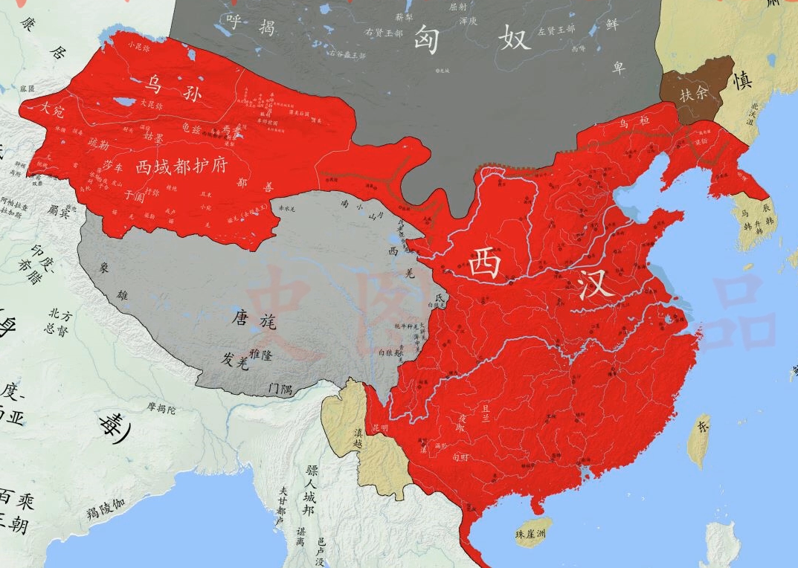

- 王莽加爵安汉公
- 置羲和官

#### 公元 3 年--汉平帝元始三年

- 立王莽之女为后
- 阳陵任横叛，自称将军
- 王莽子王宇因吕宽之狱，被王莽所杀

#### 公元 4 年--汉平帝元始四年

- 置西海郡
- 梁王刘立有罪，自杀

#### 公元 5 年--汉平帝元始五年

- 王莽弑君
- 谢嚣得白石，上有刻文曰:“告安汉公莽为皇帝”
- 太仆王恽等人获封为候
- 王莽称假皇帝

## 汉孺子婴

#### 公元 6 年--汉孺子婴居摄元年

- 王莽立孺子婴
- 安众候刘崇起兵反王莽，事败

- 西羌攻西海

#### 公元 7 年--汉孺子婴居摄 2 年

- 第一次币制改革
- 窦况击破西羌，复西海郡翟义立刘信为帝，兵败被杀

#### 公元 8 年--汉孺子婴居摄 3 年

- 张充谋立楚王，事败被诛
- 三辅起兵，赵朋、霍鸿等攻长安，王莽镇压
- 十二月，王莽篡汉

# 新（9-23）[14]

**常安，汉族，王莽**


#### 公元 9 年--新王莽始建国元年

- 废孺子婴，封为定安公
- 改百官官名
- 行王田制，禁奴婢买卖
- 第二次币制改革
- 降诸夷王为侯
- 句町王叛
- 封上古先皇后人
- 刘快起兵，攻即墨

#### 公元 10 年--新王莽始建国二年

- 第三次币制改革
- 设五均六莞
- 更名匈奴单于为降奴服于匈奴寇边
- 甄丰求黄皇室主，被杀匈奴寇乌桓
- 车师后王企图出逃匈奴，被杀
- 狐兰支率车师后国投匈奴

#### 公元 11 年--新王莽始建国三年

- 赵并屯田五原
- 招诱单于弟子入塞
- 太师王舜病死
- 河决魏郡，黄河改道
- 发三十万大军伐匈奴
- 乌桓脱新

#### 公元 12 年--新王莽始建国四年

- 以洛阳为东都，长安为匹都
- 废王田私属制
- 斩匈奴单于之子登
- 高句丽独立

#### 公元 13 年--新王莽始建国五年

- 皇太后王政君崩
- 乌孙大小昆弥遣使贡献
- 焉耆叛新，杀西域都护但钦

#### 公元 14 年--新王莽天凤元年

- 王莽再改官制
- 新朝大饥荒
- 益州蛮夷反，杀大尹程隆，遣马茂击之
- 四次币制改革
- 下书改郡县名

#### 公元 15 年--新王莽天凤二年

#### 公元 16 年--新王莽天凤三年

- 光禄四行
- 冯茂击句町，无果
- 王骏、李崇、郭钦出西域不胜，西域断绝
- 李崇收余士退保龟兹
- 郭钦退守车师
- 越巂蛮夷任贵杀太守枚根，自立为邛谷王

#### 公元 17 年--新王莽天凤四年

- 王匡、王凤绿林军起事
- 南郡张霸、江夏羊牧起事
- 瓜田仪、吕母起事
- 复明六莞之令

#### 公元 18 年--新王莽天凤五年

- 赤眉军樊崇起义于莒
- 吕宽暗与王宗交往，王宗自杀
- 东海刁子都起兵击徐、兖樊崇同逢安、东海徐宣、谢禄、杨音起兵，共还攻、莒，不能下，转掠青、徐间
- 匈奴再寇北边

#### 公元 19 年--新王莽天凤六年

- 赤眉军扩张势力
- 廉丹伐益州未果
- 益州夷栋蚕、若豆、越巂
- 夷人大牟叛
- 王莽命庄尤、廉丹伐匈奴，无果
- 刁子都集众数万

#### 公元 20 年--新王莽地皇元年

- 王莽诅咒起义军
- 钜鹿马适求起兵，被诛
- 罢大小钱，行货布

#### 公元 21 年--新王莽地皇二年

- 荆州牧发兵攻绿林兵，大败
- 郭兴击句町
- 瓜田仪归附，未及出身死
- 南郡秦丰起事
- 平原迟昭平起事

#### 公元 22 年--新王莽地皇三年

- 公元 24 年，**《九章算术》出现** _现存最早的中国古代数学著作_

| 时间              | 事件                                                                                                                                                                                                 |       地图        |
| ----------------- | :--------------------------------------------------------------------------------------------------------------------------------------------------------------------------------------------------- | :---------------: |
| 公元 22 年 2-4 月 | 二月，赤眉杀太师牺仲景尚<br/>四月，绿林军分兵，王常、成丹入南郡为下江兵，王凤、王匡、张卬北入南阳为新市兵，平林人陈牧、廖湛起义平林兵<br/>王莽遣王匡、廉丹东征                                       |   |
| 公元 22 年        | 刘縯、刘秀起兵，与新市、平林兵会合成昌之战，王匡击赤眉梁郡，兵败<br/>无盐城降赤眉军，廉丹、王匡攻拔之<br/>庄尤、陈茂败下江兵，成丹、王常逃入南阳郡<br/>刘縯袭取蓝乡                                  |    |
| 公元 23 年 1 月   | 正月，汉兵破甄阜、梁丘赐，乘胜围宛城                                                                                                                                                                 |   |
| 公元 23 年 2-3 月 | 二月，刘玄称帝隗嚣出逃<br/>三月，刘秀、王常攻颍川，陷昆阳、郾、定陵王邑与王寻发兵伐山东，南出颖川，与庄尤、陈茂合                                                                                    |   |
|                   | **新王莽地皇四年**                                                                                                                                                                                   |                   |
| 公元 23 年 6-9 月 | 六月，昆阳之战，新军大败<br/>董忠谋反，事败被诛<br/>秋，平襄隗嚣、汝南刘望及成都公孙述割据<br/>南乡邓华、于匡起兵，元虎伐之<br/>邓晔开武关迎汉军<br/>王莽行哭天大祭                                  |   |
| 公元 23 年 10 月  | 十月，绿林军入长安，王莽被杀<br/>各郡皆附汉<br/>刘信击杀刘望于汝南，并诛庄尤、陈茂，郡县皆降颖川李宪、梁王刘永、邯郸王郎、扶风窦融割据                                                               |  |
|                   | **王莽无了**                                                                                                                                                                                         |                   |
| 公元 24 年 春     | 信都、和戎郡归附刘秀，刘秀击降堂阳、贳县，昌城、下曲阳、真定归附<br/>刘秀拔卢奴、元氏、房子，击斩王郎将李恽于部，至柏人复破王郎将李育。南郑人延岑起兵据汉中，汉中王嘉击降之                          |   |
| 公元 24 年 ?      | 渔阳彭宠归附刘秀，南攻蓟，杀王郎大将赵闳<br/>刘秀军略定涿郡、中山、巨鹿、清河、河间凡二十二县                                                                                                        |   |
| 公元 24 年 5 月   | 刘秀破邯郸，平王郎<br/>更始帝立刘秀为萧王，遣苗曾为幽州牧，韦顺为上谷太守，蔡充为渔阳太守                                                                                                            |   |
| 公元 24 年 秋     | 吴汉斩苗曾﹔耿奔到上谷亦收韦顺、蔡充斩之。铜马军降刘秀<br/>河内太守韩歆降刘秀<br/>刘秀诱杀谢躬                                                                                                       |  |
| 公元 24 年 冬     | 更始帝遣李宝、张忠入蜀、汉，公孙述遣其弟破之，后自立为蜀王<br/>赤眉军自颖川西进，崇、安自武关，宣等从陆浑关，两道俱入                                                                                |  |
| 公元 24 年        | 隗崔、隗义谋叛，隗嚣恐并及祸，乃告之。更始诛崔、义，以嚣为御史大夫<br/>梁王永据国起兵，攻下济阴、山阳、沛、楚、淮阳、汝南，拜琅邪贼帅张步为辅汉大将军，东海贼帅董宪为翼汉大将军<br/>汝南田戎攻陷夷陵 |  |
| 公元 25 年 正月   | 赤眉军进至弘农，破苏茂、蓦乡李松军，转至湖<br/>邓禹至箕关，击破河东都尉，进围安邑                                                                                                                    |  |
| 公元 25 年 四月   | 公孙述称帝<br/>越巂任贵据郡降公孙述<br/>刘秀北击尤来、大枪、五播于元氏，追至北平，连破之<br/>冯异北攻天井关，拔上党两城，又南下河南成皋以东十三县<br/>邓禹略定河东                                   |   |

# 东汉（25-220）[195]

**洛阳，汉族，刘秀**

## 汉光武帝

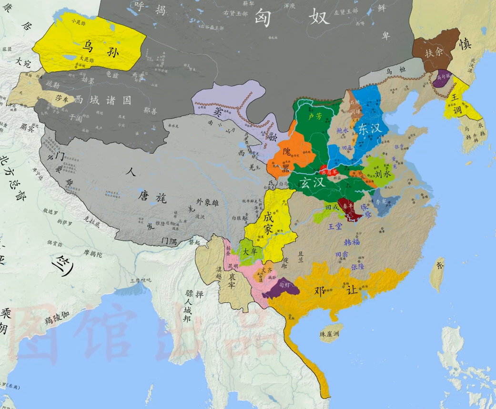

| 时间                | 事件                                                                                                                                                                                      | 地图                  |
| ------------------- | ----------------------------------------------------------------------------------------------------------------------------------------------------------------------------------------- | --------------------- |
| 公元 25 年 6-7 月   | 六月，刘秀即帝位<br/>赤眉军迫近长安<br/>赤眉军立刘盆子为帝<br/>七月，邓禹入夏阳<br/>刘茂下颖川、汝南，后降汉                                                                              | 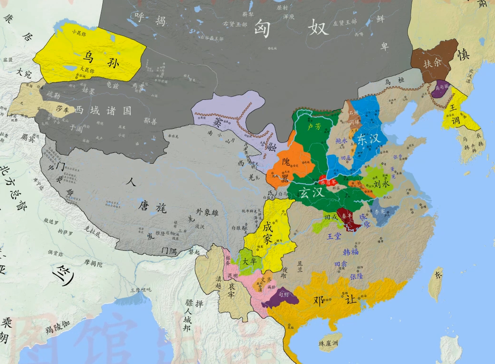   |
| 公元 25 年 8-9 月   | 八月，汉军围朱鲔于洛阳<br/>九月，赤眉军入长安<br/>朱鲔降，光武帝入洛阳，定都                                                                                                              | 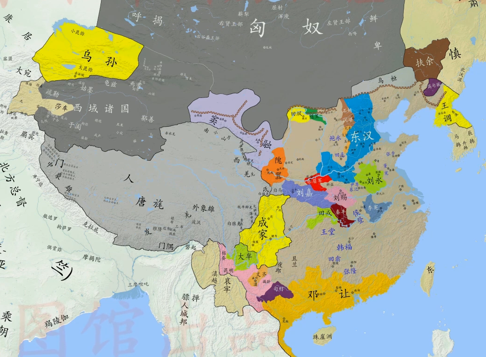   |
| 公元 25 年 10-11 月 | 十月，更始帝降赤眉军<br/>邓禹北至枸邑，所到郡邑皆附<br/>刘秀遣岑彭击荆州群贼，下犨、叶等十余城<br/>十一月，梁王永称帝于睢阳                                                               |  |
| 公元 25 年 12 月    | 十二月，刘秀遣刘延攻田邑之天井关，邑闻更始败，请降，拜为上党太守<br/>张步陷泰山、东菜、城阳、胶东、北海、济南、齐郡                                                                       | 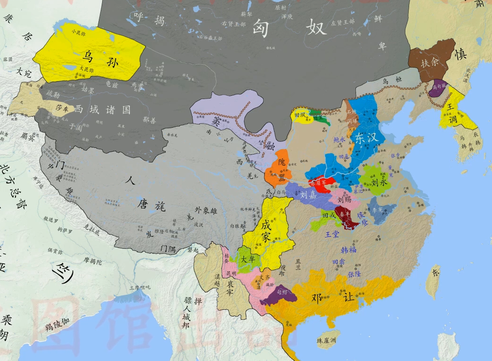   |
| 公元 26 年 正月     | 刁子都余党寇魏郡、清河、东郡，光武帝伐之，战于漳水，大破之，十馀万众皆降<br/>遣王梁、杜茂将兵安辑魏郡、清河、东郡，悉平诸营保<br/>赤眉尽掠珍宝，引兵撤离长安，西入安定、北地              | 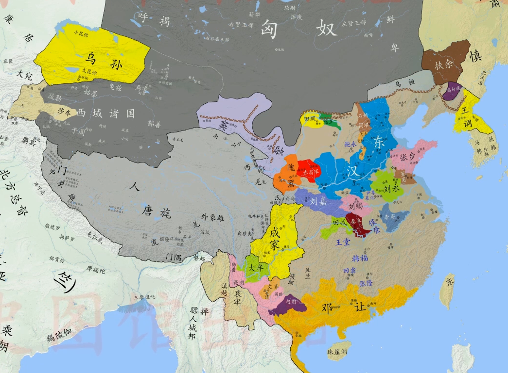    |
| 公元 26 年 2 月     | 鲍永、冯衍归附彭宠据渔阳叛<br/>延岑复反，围南郑，汉中王嘉兵败走，岑进兵武都为李宝所破，岑走天水<br/>公孙述遣侯丹取南郑<br/>刘嘉复与延岑连战，岑引北，入散关，至陈仓<br/>嘉追击，破之      | 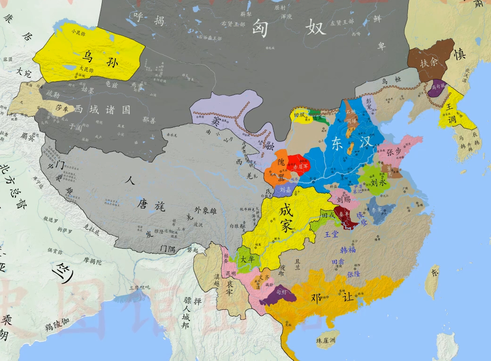    |
| 公元 26 年 3-4 月   | 三月，贾复击降郾王尹尊、淮阳太守暴汜<br/>四月，盖延击刘永，围睢阳，苏茂反，据广乐臣于永<br/>吴汉击宛，宛王赐降<br/>邓王王常降                                                             | 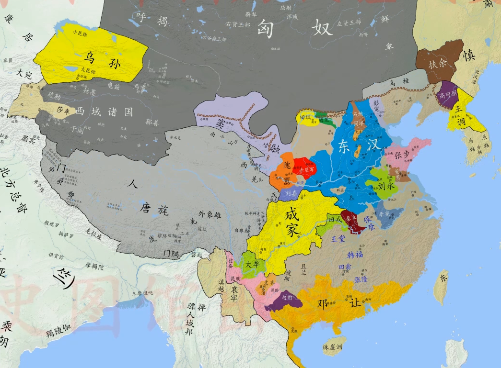   |
| 公元 26 年 8 月     | 八月，光武帝亲征大破五校，降其众五万人<br/>盖延克睢阳，刘永逃至虞、谯，退守湖陵，盖延略定沛、楚、临淮<br/>青、徐群盗请降，张步献阈鱼堵乡董诉反宛城，坚谭复宛<br/>邓奉反汉，屯据流阳       |     |
| 公元 26 年 9 月     | 九月，陕贼苏况破弘农<br/>祭遵击弘农、粕华、蛮中贼，平之<br/>赤眉欲西上陇，后复入长安，禹袭长安败，延今击长安，大破之<br/>赤眉攻汉中王嘉，兵败<br/>刘嘉诣邓禹降                            | 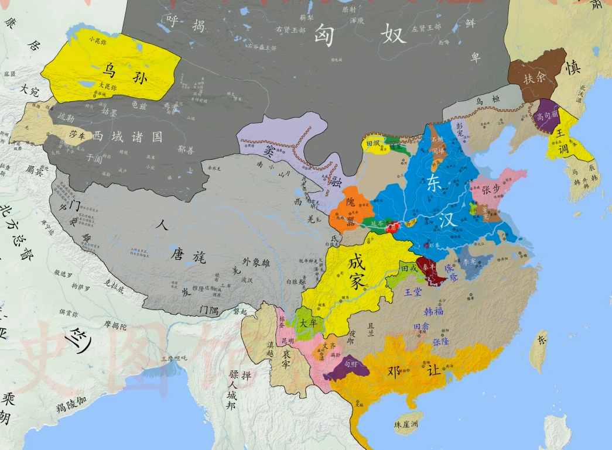    |
| 公元 26 年 11-12 月 | 十一月，东汉讨邓奉、董诉，击堵乡<br/>铜马、青犊、尤来余贼立孙登为天子，乐玄杀登降汉<br/>十二月，赤眉军弃长安东归，冯异与赤眉战于华阴                                                      | 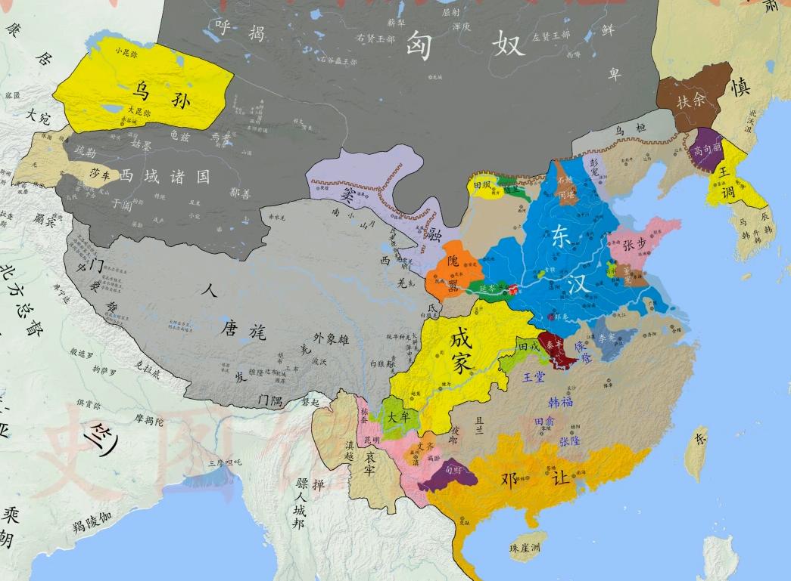 |
| 公元 27 年 1-2 月   | 正月，邓禹、冯异与赤眉军在回溪交战，败冯异与赤眉战于峭底，大破之<br/>赤眉军降东汉<br/>二月，吴汉在轵西击降青犊军                                                                          | 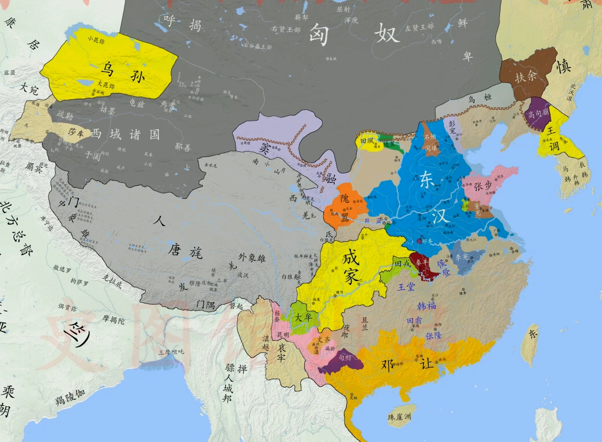  |
| 公元 27 年 3 月     | 三月，涿郡太守张丰反，与彭宠连兵<br/>蓟城降于彭宠<br/>彭宠自称燕王，攻拔右北平、上谷数县                                                                                                  | 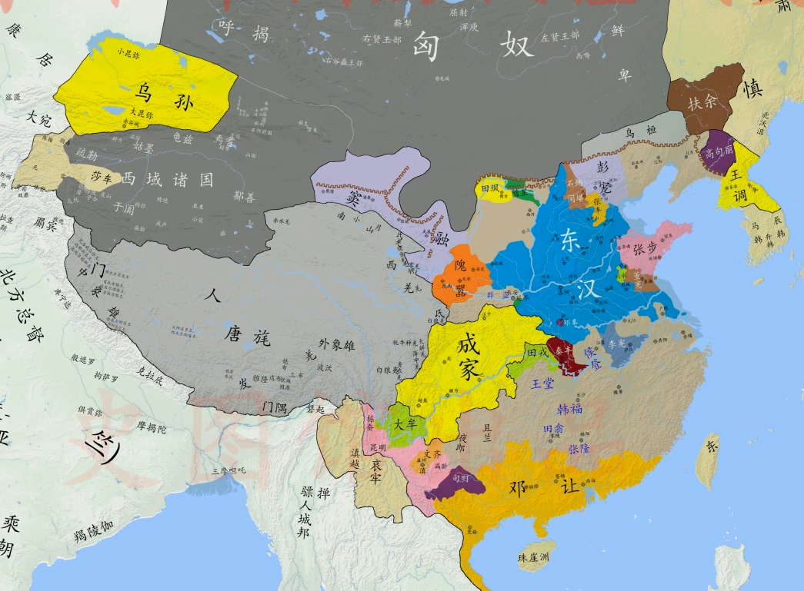    |
| 公元 27 年 4 月     | 四月，光武帝亲征破邓奉于小长安，斩之<br/>冯异与延岑战于上林，破之，岑自武关走南阳<br/>关中诸营渠帅降汉<br/>吴汉与刘永将苏茂战于广乐，大败苏茂<br/>睢阳人反城迎刘永，盖延围睢阳            | 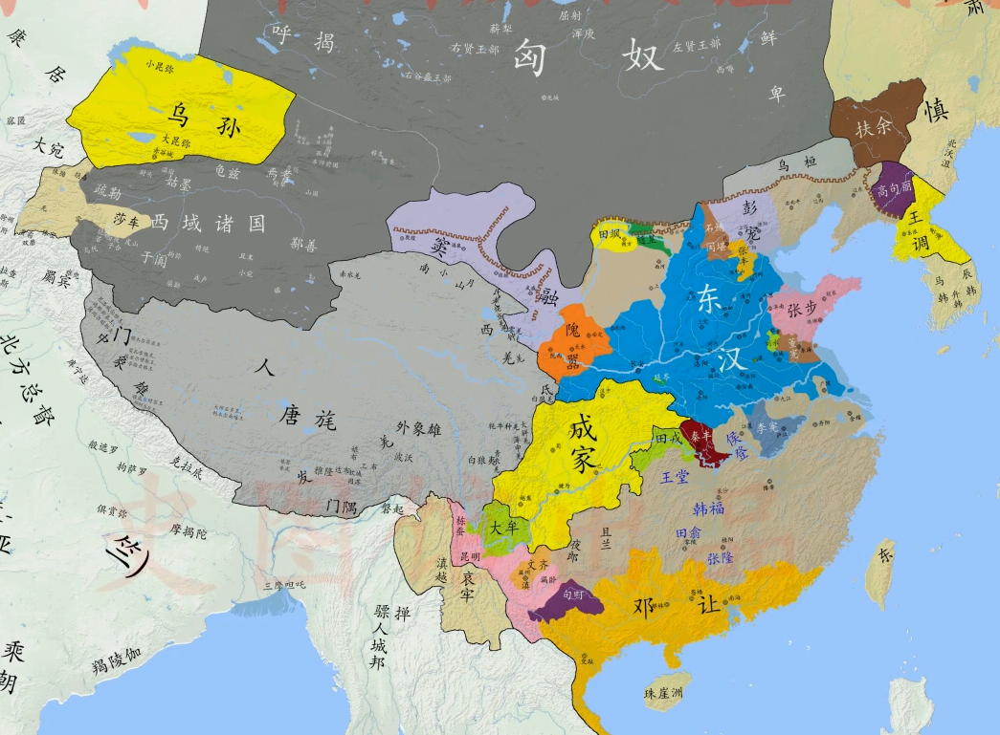    |
| 公元 27 年 6-7 月   | 六月，耿弁与延岑斐于穰城，破之<br/>延岑与秦丰合<br/>七月，岑彭伐秦丰，战于黎丘，破之，围丰于黎丘傅俊略定扬州<br/>盖延克睢阳，俘刘永<br/>苏茂、周建奔垂惠，立永子纡为梁王<br/>佼强奔保西防 | 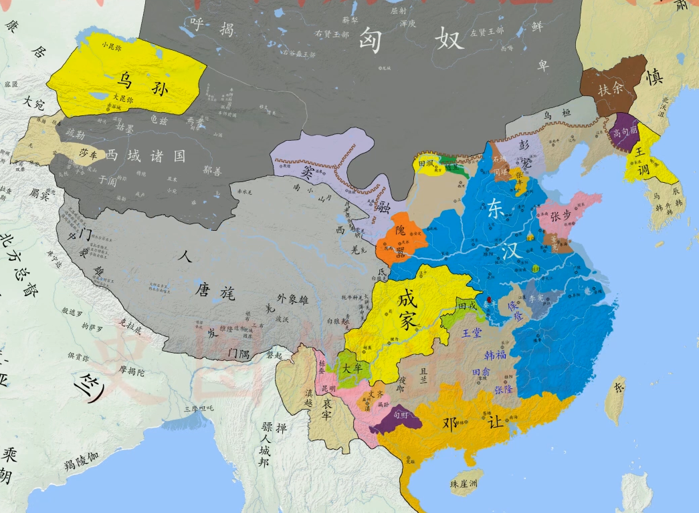   |
| 公元 28 年 2-5 月   | 二月，邓禹与延岑战于武当，破之，延岑奔汉中<br/>四月，吴汉击五校贼于箕山，破之<br/>五月，祭遵讨张丰于涿郡，斩丰                                                                            | 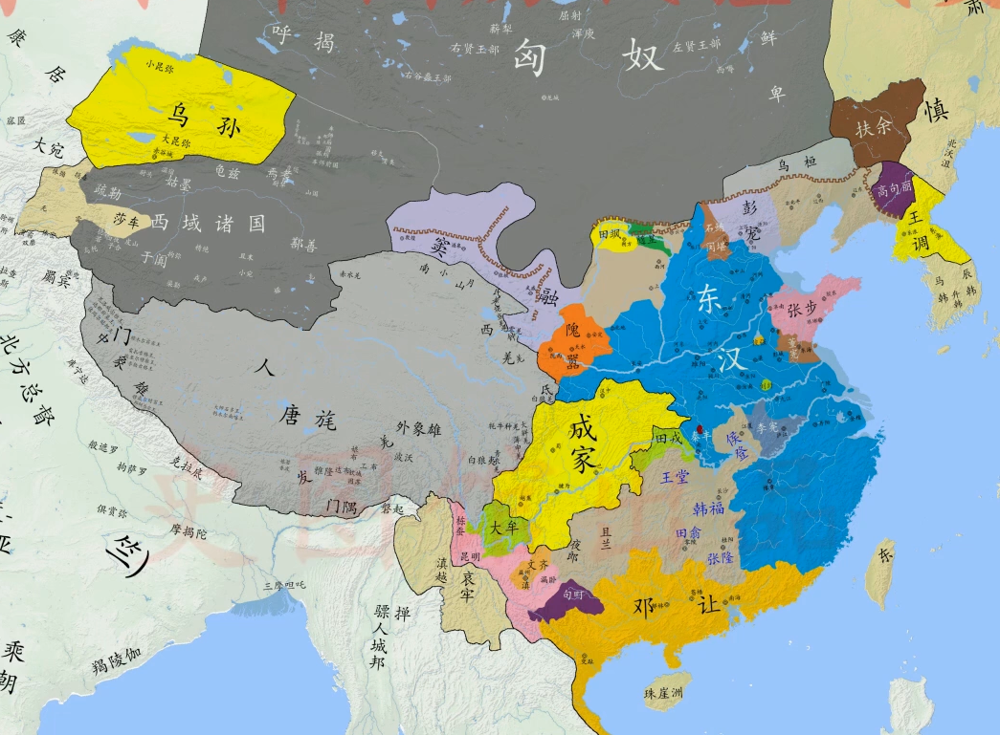  |
| 公元 28 年 7-9 月   | 七月，马武、王霸围刘纡于垂惠<br/>董宪将贲休以兰陵城降，董宪攻拔兰陵<br/>八月，马成伐李宪<br/>九月，汉军围李宪于舒                                                                         |    |
| 公元 28 年 ？ 月    | 公孙述遣兵出陈仓，冯异与公孙述战于陈仓，破之<br/>吴汉荐陈俊为泰山太守，击破张步军，遂定泰山                                                                                               | 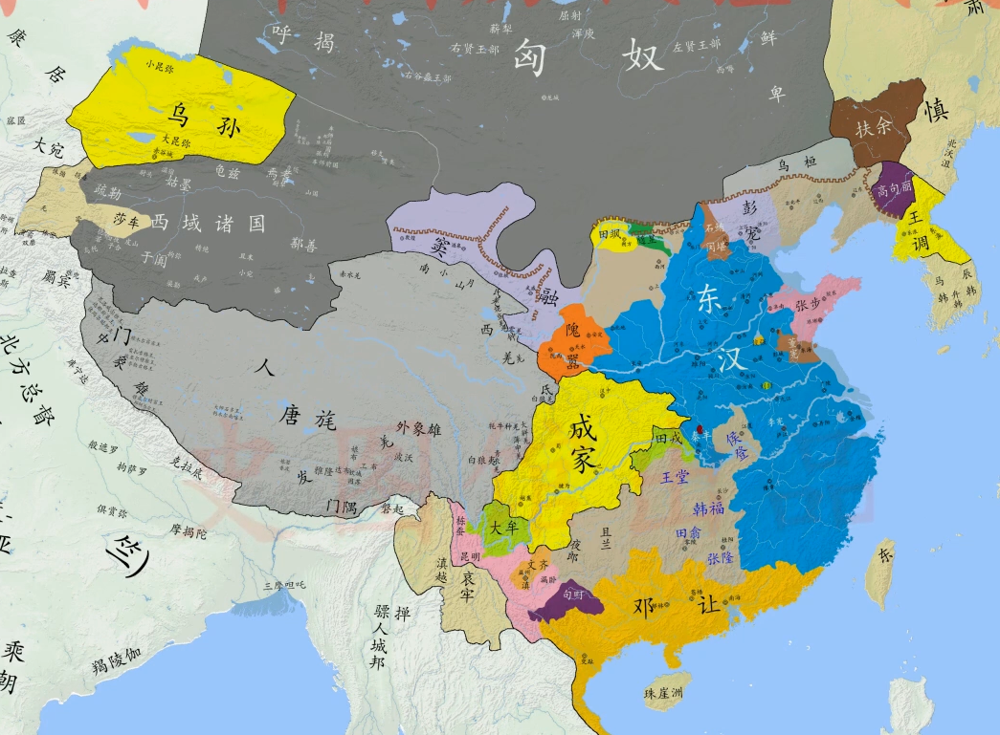  |
| 公元 29 年 2 月     | 二月，马武、王霸夺垂惠，刘纡奔佼强<br/>彭宠为其苍头所杀，其国师韩利斩彭宠子午诣祭遵降，幽州诸郡平<br/>吴汉、耿奔击富平、获索贼于平原，大破降之<br/>遣耿弁讨张步                           | 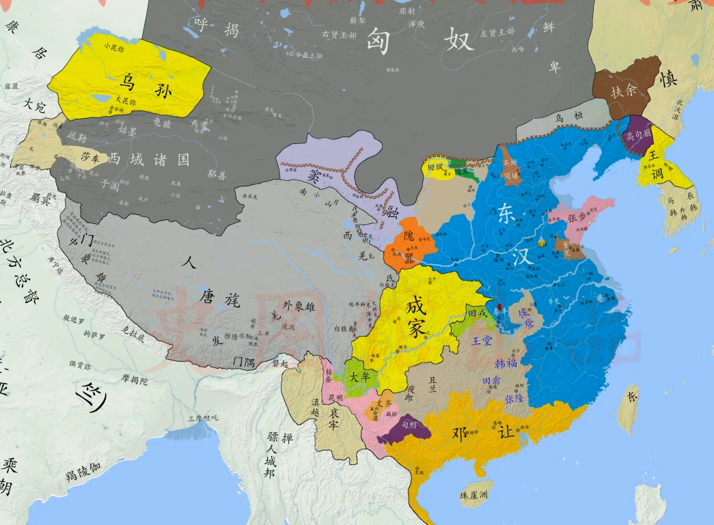    |
| 公元 29 年 3-4 月   | 三月，庞萌反，自号东平王，攻拔楚郡，与董宪合岑彭攻拔夷陵，田戎亡入蜀<br/>四月，窦融附汉                                                                                                   | 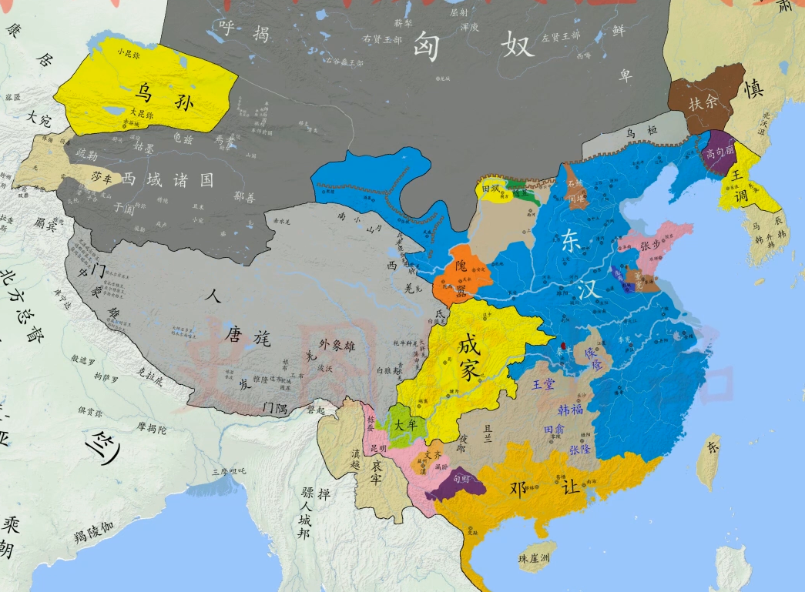   |
| 公元 29 年 6-7 月   | 六月，朱祐夺黎丘，俘秦丰<br/>庞萌、苏茂阖桃城，光武帝救之，大破萌等，庞萌、苏茂、佼强奔董宪<br/>七月，攻董宪于昌虑，大破之，佼强降，苏茂奔张步，董宪及庞萌走保郯                          |    |
| 公元 29 年 8-10 月  | 八月，吴汉攻刘纡、董宪等，夺郯，获刘纡，围董宪、庞萌于朐<br/>十月，耿奔等与张步战于临淄，败之，张步降汉<br/>初起太学                                                                      | 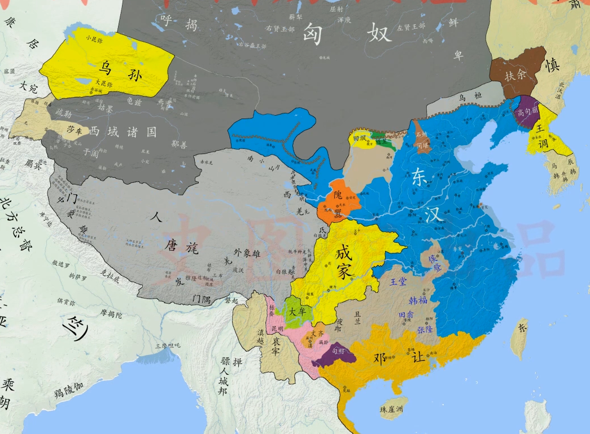  |
| 公元 29 年 12 月    | 十二月，卢芳自称天子于九原，掠有五原、朔方、云中、定襄、雁门五郡<br/>交趾邓让、江夏侯登、武陵王堂、长沙韩福、桂阳张隆、零陵田翕、苍梧杜穆、交趾锡光附汉<br/>牂婀郡诸夷从郡功曹谢暹归汉    | 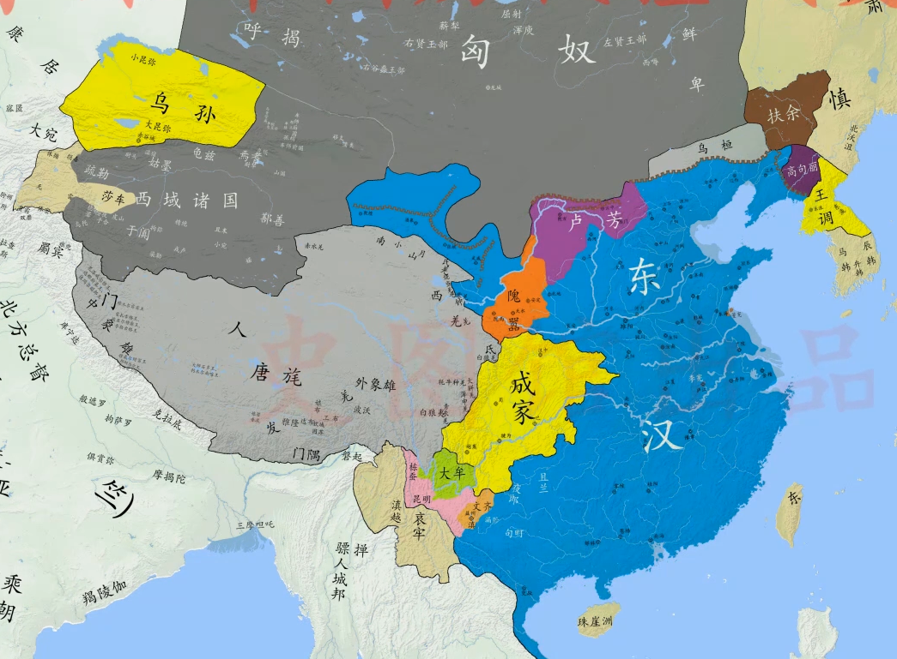   |
| 公元 30 年 1-2 月   | 正月，马成夺舒城，平定李宪<br/>二月，吴汉拔朐，俘董宪、庞萌，山东悉平                                                                                                                     | 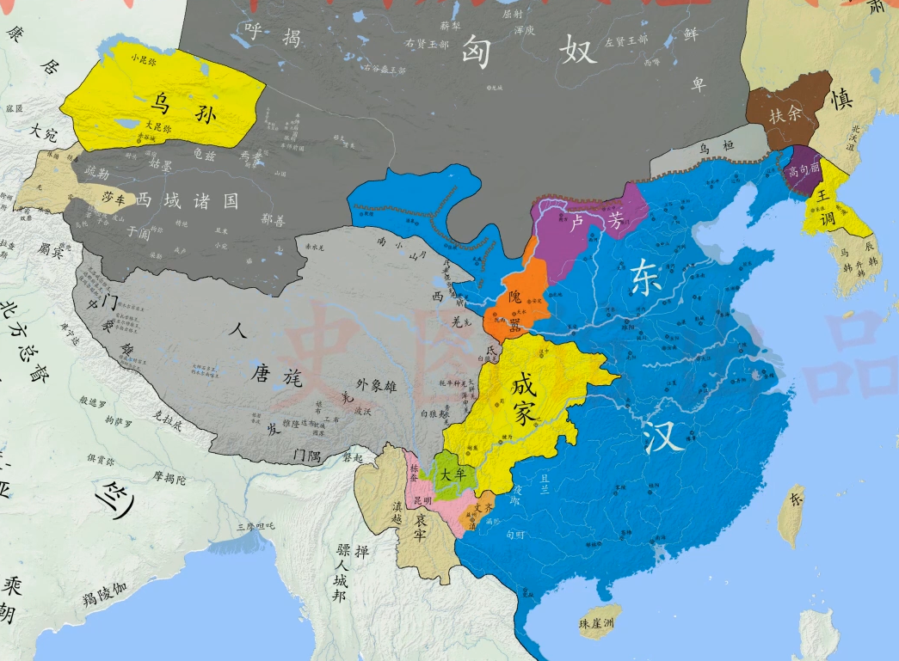  |
| 公元 30 年 3-5 月   | 三月，公孙述遣将任满寇南郡<br/>四月，盖延从陇道伐公孙述<br/>五月，隗嚣反，盖延等因与嚣战于陇帐，诸将败绩                                                                                  |    |
| 公元 30 年 6-9 月   | 六月，代郡太守刘兴击卢芳于高柳，战死<br/>秋，王遵平定乐浪<br/>弃岭东七县                                                                                                                  |    |
| 公元 30 年 12 月    | 李通与公孙述将战于西城，破之<br/>十二月，田租复三十税—<br/>隗嚣寇扶风，冯异拒之<br/>祭遵破王元于汧<br/>冯异进军义渠，击破卢芳<br/>将贾览、匈奴奥犍日逐王，北地、上郡、安定皆降            |    |
| 公元 31 年 3-8      | 三月，公孙述立隗嚣为朔宁王<br/>八月，隗嚣寇安定，冯异、祭遵拒之<br/>冬，卢芳所置朔方太守田飒、云中太守乔扈各举郡降                                                                        | 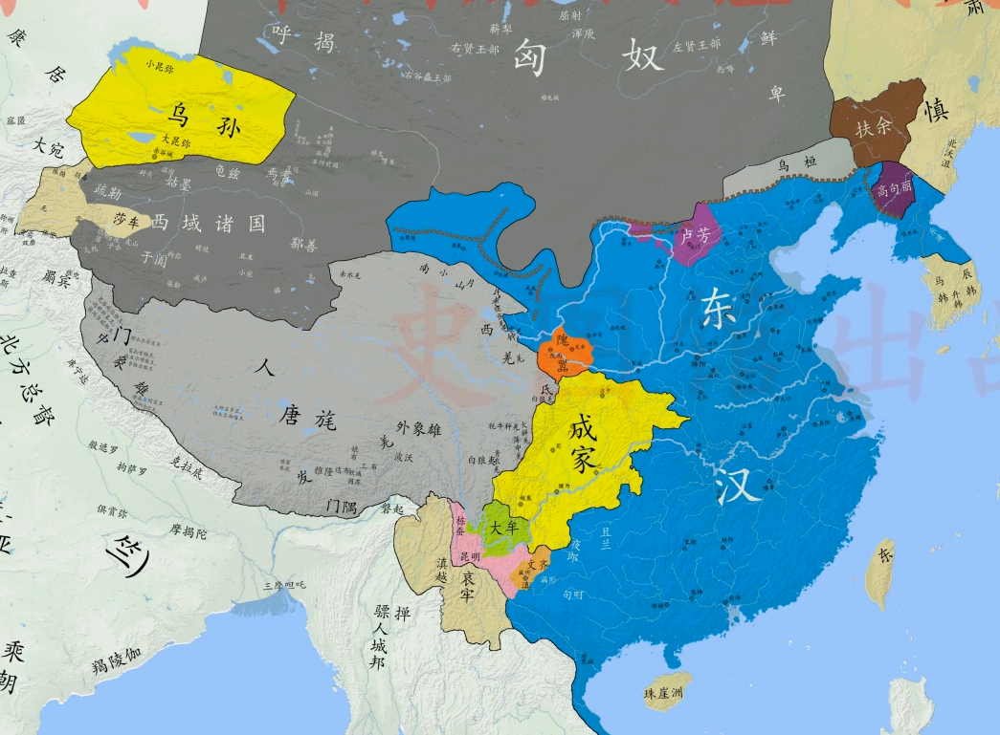      |
| 公元 32 年 正 月    | 来歙夺隗嚣咯阳                                                                                                                                                                            | 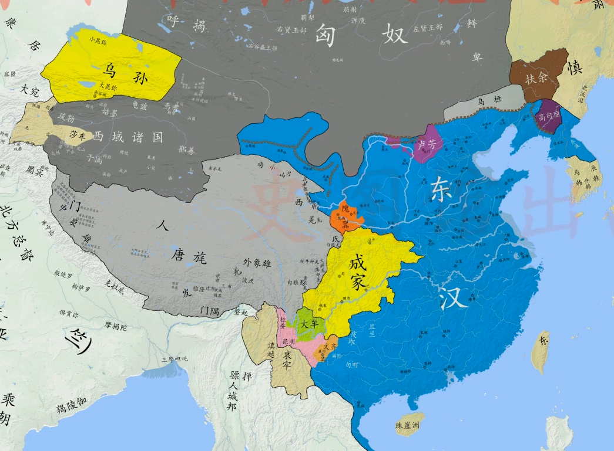    |
| 公元 32 年 4 月     | 光武帝亲征隗嚣，嚣大将十三人、属县十六、众十余万皆降<br/>隗嚣奔西城，田奔、李育保上邽<br/>颍川盗贼寇没属县，河东守兵亦叛                                                                  | 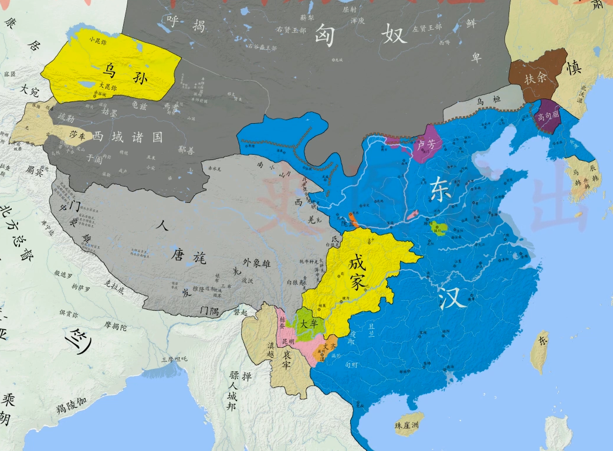    |
| 公元 32 年 8-10 月  | 八月，光武帝亲征颍川盗贼，皆降<br/>安丘侯张步逃奔临淮，乘船入海，琅鄢太守陈俊讨平之<br/>十月，公孙述救隗嚣，汉军败退，天水、陇西复反归隗嚣                                                |   |
| 公元 33 年 1-8 月   | 莎车王贤杀拘弥王、西夜王<br/>正月，隗嚣病死，其子隗纯为王<br/>三月，公孙述遣将田戎、任满据荆门<br/>六月，吴汉击卢芳于高柳，不利<br/>八月，来歙讨隗纯于天水杜茂与贾览战于繁畤，败绩        |    |
| 公元 34 年 正月-夏  | 正月，吴汉击卢芳于高柳，匈奴遣兵救之<br/>夏，冯异破公孙述于天水                                                                                                                           |     |
| 公元 34 年 10 月    | 来歙等大破隗纯，其将王元奔蜀，纯与周宗降，陇右平<br/>先零羌寇金城、陇西，来歙击羌于五豁，破之                                                                                             |    |
| 公元 35 年 春-4 月  | 春，岑彭与公孙述战于荆门，破之，平巴郡<br/>四月，先零羌寇临洮                                                                                                                             |    |
| 公元 35 年 6-10 月  | 六月，来歙破公孙述于下辩，来歙被刺杀<br/>八月，东汉诸将破公孙述于黄石、沈水<br/>十月，公孙述刺杀岑彭                                                                                      |   |
| 公元 36 年 1-9 月   | 正月，吴汉与公孙述战于武阳<br/>七月，冯骏夺江州，俘田戎<br/>九月，吴汉大破公孙述于广都<br/>臧宫拔绵竹，破涪城，复攻拨繁、郫                                                               |    |
| 公元 36 年 11 月    | 汉军克成都，平定公孙述<br/>益州太守文齐降汉<br/>九真徼外蛮夷张游率种人内属<br/>参狼羌寇武都，马援讨降之                                                                                   |    |
| 公元 37 年 2 月     | 二月，卢芳亡入匈奴，其众尽归随昱降汉                                                                                                                                                      |     |
| 公元 37 年 5-12 月  | 五月，匈奴寇河东<br/>七月，广汉徼外白马羌豪内属<br/>十二月，复置金城郡                                                                                                                    |   |
| 公元 38 年          | 正月，匈奴遣使奉献<br/>九月，平城人贾丹杀卢芳将尹由来降<br/>莎车国、鄙善国遣使奉献                                                                                                        |    |
| 公元 39 年          | 二月，徙雁门、代郡、上谷民，置常关、居庸关以东<br/>六月，诏下州郡检核垦田顷<br/>十二月，卢芳自匈奴入居高柳                                                                                |       |
| 公元 40 年          | 二月，交趾二征反叛，九真、日南、合浦应之<br/>九月，河南尹张伋坐度田不实，下狱<br/>十二月，卢芳请降，获封为代王<br/>始行五铢钱                                                             |       |
| 公元 41 年          | 七月，妖巫李广等群起据皖城<br/>九月，平定李广<br/>十月，废皇后郭氏，立贵人阴氏为皇后<br/>莎车王请设西域都护<br/>遣伏波将军马援南下征讨                                                    |       |
| 公元 42 年 2-5 月   | 二月，蜀郡守将史歆叛，吴汉围成都<br/>五月，卢芳复反，与闵堪相攻连月，匈奴遣数百骑迎芳出塞                                                                                                 |    |
| 公元 42 年 7 月     | 七月，吴汉拔成都，斩史歆等<br/>马援破二征于浪泊，追至禁貉<br/>罢州牧，置刺史                                                                                                              |     |
| 公元 43 年 1-9 月   | 正月，马援平定二征<br/>进赵、齐、鲁三国公爵为王<br/>九月，西南夷寇益州郡，遣刘尚讨之<br/>雅隆的止贡赞普在与罗昂木达孜比武时被杀，其子夏赤、聂赤到工布地区                                 |    |
| 公元 43 年 9-12 月  | 九月，越巂太守任贵谋叛<br/>十二月，刘尚诛任贵<br/>复置函谷关都尉                                                                                                                          |   |
| 公元 44 年          | 五月，匈奴寇上党、天水，至扶风<br/>十二月，匈奴寇天水刘尚连破栋蚕                                                                                                                         |       |
| 公元 45 年 正月     | 刘尚追至不韦，斩栋蚕帅，西南诸夷悉平<br/>东汉统一                                                                                                                                         |       |

#### 公元 45 年--汉光武帝建武二十一年

- 四月，安定属国胡叛，屯聚青山，遣将兵长史陈诉讨平之
- 秋，鲜卑寇辽东，辽东太守祭彤破之
- 十月，马援出塞击乌桓，不克
- 匈奴寇上谷、中山
- 郄善、车师等十六国奉献，请置都护，光武帝以中国新定，拒绝

#### 公元 46 年--汉光武帝建武二十二年

- 莎车王贤攻鄙善，逐走其王
- 七月，司隶校尉苏邺下狱死
- 乌桓破匈奴，匈奴北徙，幕南地空
- 冬，莎车王贤攻杀龟兹王弘，吞其国
- 郄善、车师前王归附匈奴

#### 公元 47 年--汉光武帝建武二十三年

- 正月，南郡蛮叛，刘尚讨破之
- 莎车王贤击灭妫塞王，立其国贵人驷犍为王
- 十月，高句丽率种人诣乐浪内属
- 十二月，武陵蛮叛，刘尚讨之，未果
- 匈奴王比率部曲遣使诣西河内附

#### 公元 48 年--汉光武帝建武二十四年

- 正月，匈奴王比遣使款五原塞，求捍御北虏
- 龟兹附匈奴
- 莎车王贤击降大宛
- 七月，武陵蛮寇临沅，李嵩、马成讨蛮不克
- 十月，匈奴奠犍日逐王比自立为南单于,匈奴分裂

#### 公元 49 年--汉光武帝建武二十五年

- 正月，辽东徼外貊人寇右北平、渔阳、上谷、太原，辽东太守祭彤招降之
- 三月，马援破武陵蛮于临沅
- 乌桓附汉，复置乌桓校尉
- 南匈奴击破北匈奴
- 十月，武陵蛮皆降汉

#### 公元 50 年--汉光武帝建武二十六年

- 南匈奴附汉
- 始置匈奴中郎将

#### 公元 51 年--汉光武帝建武二十七年

- 四月，大司徒王况薨
- 五月，北匈奴求和亲，光武帝赐缯帛
- 益州郡徼外蛮夷率种人内属

#### 公元 54 年--汉光武帝建武三十年

- 正月，鲜卑大人内属，朝贺
- 群臣奏请封禅泰山
- 胶东刚侯贾复薨

#### 公元 56 年--汉光武帝建武中元元年

- 布德贡杰赞普恢复雅隆
- 正月，无武帝封泰、杵梁父山
- 参狼羌寇武都，刘盱遣军救之
- 莎车王贤吞并于阗
- 高句丽伐南沃沮，拓竟至沧海

#### 公元 57 年--汉光武帝建武中元二年

- 正月，光武帝授倭奴国王印
- 二月，光武帝崩，明帝立莎车王贤杀于阗王、拘弥王、姑墨王、子合王，在这几国不再立王，遣将镇守
- 九月，烧当羌寇陇西，侵允街
- 十一月，遣窦固讨烧当羌

## 汉明帝


#### 公元 58 年--汉明帝永平元年

- **班固始撰《汉书》 ** _第一部纪传断代史_
- 七月，马武大破烧当羌
- 祭彤使鲜卑击赤山乌桓
- 越巂姑复夷叛，州郡讨平之

#### 公元 60 年--汉明帝永平三年

- 画邓禹等二十八将于南宫云台
- 于窴人杀莎车将君德，立大人休莫霸为王，与拘弥国人杀死莎车皮山镇将
- 贤率诸国兵数万击于窴，为休莫霸所败，休莫霸进围莎车，中流矢死，于窴人复立其兄子广德为王
- 匈奴与龟兹等国攻莎车，未能攻克
- 广德使其弟仁攻贤，贤归其父，以女妻之，与之和亲

#### 公元 61 年--汉明帝永平四年

- 莎车相且运等密谋反叛投降于窴
- 于窴攻莎车活捉贤，吞并莎车
- 匈奴发焉耆、龟兹等十五国兵攻于阗，立不居徵为莎车王;广德杀死不居徵，立齐黎为莎车王
- 十二月，陵乡侯梁松下狱死

#### 公元 62 年--汉明帝永平五年

- 十一月，北匈奴寇五原
- 十二月，北匈奴寇云中，南单于却之

#### 公元 64 年--汉明帝永平七年

- 正月，皇太后阴氏崩
- 北匈奴遣使求和亲
- 明帝遣蔡惜等前往天竺求访佛学

#### 公元 65 年--汉明帝永平八年

- 正月，遣郑众报使北匈奴北匈奴寇西河诸郡
- 西域各国互相攻伐，诸小国分别被于阗、郄善、龟兹、焉耆、车师吞并

#### 公元 66 年--汉明帝永平九年

- **班固作《两都赋》** _《文选》第一篇，开京都赋之范例_

#### 公元 67 年--汉明帝永平十年

- 二月，广陵王荆有罪自杀，国除
- 蔡惜回洛阳，后建白马寺，佛教内传
- 曷思部首领都头率众降于高句丽

#### 公元 69 年--汉明帝永平十二年

- 正月，哀牢内属，置永昌郡
- 十月，司隶校尉王康下狱死

#### 公元 73 年--汉明帝永平十六年

- 二月，祭彤出高阙、窦固出酒泉、耿秉出居延、来苗出平城击北匈奴
- 班超使西域
- 鄯善、于阗附汉
- 五月，淮阳王延谋反事败
- 北匈奴寇云中，廉范破之
- 十一月，窦固、耿秉、刘张出敦煌昆仑塞，破白山虏于蒲类海上，入车师
- 置西域都护、戊己校尉

#### 公元 74 年--汉明帝永平十七年

- 班超立成之兄子忠为疏勒王
- 改天水郡为汉阳郡

#### 公元 75 年--汉明帝永平十八年

- 六月，焉耆、龟兹攻杀西域都护陈睦
- 北匈奴及车师后王围戊己校尉耿恭
- 八月，明帝崩，章帝立

## 汉章帝


#### 公元 76 年--汉章帝建初元年

- 九月，永昌哀牢夷叛
- 十月，武陵郡兵讨破叛蛮
- 十一月，阜陵王刘延谋反，贬为阜陵侯

#### 公元 77 年--汉章帝建初二年

- 龟兹、尉头进犯疏勒，班超击败之
- 三月，罢伊吾卢屯兵，匈奴复遣兵守其地
- 讨平哀牢
- 六月，烧当羌叛，金城太守都崇讨之，败绩，羌寇汉阳
- 八月，遣马防讨烧当羌

#### 公元 78 年--汉章帝建初三年

- 四月，马防破烧当羌于临洮
- 班超率疏勒、康居、于阗、拘弥兵攻姑墨石城，大破之
- 十二月，武陵凑中蛮叛

#### 公元 79 年--汉章帝建初四年

- 六月，皇太后马氏崩
- 十一月，白虎观会议，班固作《白虎议奏》

#### 公元 80 年--汉章帝建初五年

- 三月，郡兵讨破武陵娄中叛蛮
- 番辰叛，围班超于疏勒城，班超击破之

#### 公元 83 年--汉章帝建初八年

- 六月，北匈奴三木楼訾大人稽留斯等率众款塞降

#### 公元 84 年--汉章帝元和元年

- 疏勒王忠在莎车怂恿下叛，西据乌即城，康居援助忠
- 班超请贵霜王劝说康居王不再援助忠，后康居王押忠回国，乌即城被收复

#### 公元 85 年--汉章帝元和二年


- 丁零、鲜卑击匈奴南单于遣兵与北匈奴温禺犊王战于涿邪山

#### 公元 86 年--汉章帝元和三年

- 十月，烧当羌叛，寇陇西
- 疏勒王忠向康居王借兵还据损中，与龟兹密谋背叛，班超杀之
- 西域南道畅通

#### 公元 87 年--汉章帝章和元年

- 三月，傅育追击叛羌，战死
- 七月，鲜卑击破北匈奴
- 烧当羌寇金城，刘盱讨平之
- 十月，北匈奴屋兰储等率众降
- 班超攻莎车，龟兹率姑墨、温宿、尉头援救莎车，被汉军击败，莎车归汉
- 月氏国遣使献扶拔、狮子

#### 公元 88 年--汉章帝章和二年

- 二月，章帝崩，和帝立，窦太后称制，外戚专政始
- 十月，遣窦宪伐北匈奴
- 安息国遣使献狮子、扶拔

## 汉和帝


#### 公元 89 年--汉和帝永元元年

- 六月，窦宪、耿秉与南匈奴大破北匈奴
- 窦宪登燕然山，刻石勒功而还

#### 公元 90 年--汉和帝永元二年

- 五月，阎磐讨北匈奴，取伊吾卢地
- 车师前后王并遣子入侍
- 月氏国遣兵攻班超，超击降之
- 七月，窦宪出屯凉州
- 九月，北匈奴遣使称臣
- 十月，班固击破北匈奴于河云北
-

#### 公元 91 年--汉和帝永元三年

- 二月，窦宪出居延塞，破北单于于金微山
- 北匈奴开始西迁
- 龟兹、姑墨、温宿降
- 十二月，复置西域都护、戊己校尉

#### 公元 92 年--汉和帝永元四年

- 正月，北匈奴右谷蠡王於除犍自立为单于，款塞乞降
- 六月，除外戚窦宪
- 七月，太尉宋由坐党宪自杀
- 十二月，武陵零陵澧中蛮叛
- 烧当羌寇金城

#### 公元 93 年--汉和帝永元五年

- 九月，匈奴单于於除犍叛，任尚讨灭之
- 武陵郡兵讨破叛蛮
- 贯友讨烧当羌，叛羌逃去
- 南单于安国叛，刘喜斩之
- 鲜卑据匈奴旧地

#### 公元 94 年--汉和帝永元六年

- 四月，蜀郡徼外羌率种人内附
- 七月，班超击败焉耆、尉犁，为焉耆、尉犁、危须、山国立了新王
- 七月，南单于安国从弟子逢侯率叛胡亡出塞
- 九月，邓鸿讨南单于
- 十一月，任尚大破逢侯，冯柱追击之
- 武陵凑中蛮叛，郡兵讨平之

#### 公元 96 年--汉和帝永元八年

- 五月，南匈奴右温禺犊王叛
- 七月，庞奋、冯柱讨平南匈奴
- 车师后王叛，击其前王

#### 公元 97 年--汉和帝永元九年

- 东汉伐车师后国，斩其王涿鞮，立农奇为车师后王正月，永昌徼外蛮夷及禅国重译奉贡
- 闫月，窦太后崩，梁氏始盛
- 八月，鲜卑寇肥如
- 烧当羌寇陇西，刘尚、赵世等讨破之
- 九月，司徒刘方策免，自杀
- 甘英使大秦

#### 公元 98 年--汉和帝永元十年

- 北沃沮归附高句丽，高句丽王宫东巡栅城
- 十二月，烧当羌豪迷唐等率种人诣阙贡献

#### 公元 100 年--汉和帝永元十二年

- **许慎《说文解字》成书** _中国第一部系统地分析字形和考究字源的字典_

- 四月，日南象林蛮夷反，郡兵讨破之
- 烧当羌豪迷唐复叛

#### 公元 101 年--汉和帝永元十三年

- 八月，周鲔、侯霸击破烧当羌迷唐，种人瓦解，降者分徙汉阳、安定、陇西
- 十一月，安息国献师子及条支大爵
- 鲜卑寇右北平，入渔阳，渔阳太守破之
- 十二月，巫蛮叛，寇南郡

#### 公元 102 年--汉和帝永元十四年

- 四月，荆州兵讨破巫蛮
- 六月，废皇后阴氏，立贵人邓氏为后
- 班超自西域返洛阳
- 封郑众为郸乡侯

#### 公元 104 年--汉和帝永元十六年

- 二月，兖、豫、徐、冀四州连年歉收，禁止酿酒
- 十一月，北匈奴遣使称臣贡献
- 十二月，复置辽东西部都尉官

#### 公元 105 年--汉和帝永兴元年

- 春，高句丽王宫入辽东，寇略六县

- 九月，辽东太守耿夔击高句丽，破之

- 十二月，和帝崩，殇帝立，邓太后称制

- 蔡伦改进造纸术

## 汉殇帝

#### 公元 106 年--汉殇帝延平元年


- 八月，殇帝崩，安帝立，邓太后仍称制

- 邓骘掌权

- 九月，西域诸国叛，攻都护任尚于疏勒，梁懂救之龟兹、姑墨、温宿合兵
  反，后被讨平

## 汉安帝


#### 公元 107 年--汉安帝永初元年

- 正月，蜀郡徼外羌内属
- 六月，罢西域都护
- 北匈奴重新控制西域诸国
- 先零羌叛，断陇道，邓骘、任尚讨之
- 十月，倭国遣使奉献
- 十一月，司空周章密谋废立，事败自杀
- 玄菟郡内迁至原辽东郡境内

#### 公元 108 年--汉安帝永初二年

- 正月，邓骘于冀西为种羌所败
- 十月，任尚与先零羌战于平襄，败绩
- 十一月，先零羌滇零称天子，寇三辅，犯赵、魏，南入益州，杀汉中太守
- 十二月，广汉塞外参狼羌降

#### 公元 109 年--汉安帝永初三年

- 六月，乌桓寇代郡、上谷、涿郡
- 七月，海贼张伯路寇咯缘海九郡，庞雄讨破之
- 九月，雁门乌桓及鲜卑叛，败五原郡兵于高渠谷
- 十月，南单于叛，围耿种于美稷
- 十一月，遣何熙讨南匈奴

#### 公元 110 年--汉安帝永初四年

- 正月，张伯路、刘文河、周文光等攻厌次，王宗讨破之
- 梁懂、耿夔讨破南单于于属国故城
- 二月，刘珍及《五经》博士校定东观《五经》
- 三月，南单于降汉
- 先零羌寇褒中，汉中太守郑勤战死
- 徙金城郡居襄武
- 十月，罢大将军邓骘

#### 公元 111 年--汉安帝永初五年

- 二月，先零羌寇河东，至河内，进迫洛阳扶余王寇乐浪
- 海贼张伯路复寇东莱，青州刺史法雄击破之;贼逃还辽东，辽东人李久等共斩之
- 九月，汉阳人杜琦、王信叛，与先零羌攻陷上邽城十二月，赵博遣客刺杀杜琦

#### 公元 112 年--汉安帝永初六年

- 六月，唐喜讨破汉阳贼王信
- 十一月，护乌桓校尉吴祉下狱死
- 先零羌滇零死，子零昌袭位

#### 公元 113 年--汉安帝永初七年

- 秋，护羌校尉侯霸、骑都尉马贤破先零别部牢羌于安定

#### 公元 114 年--汉安帝元初元年

- **王逸撰《楚辞章句》** _《楚辞》最早的完整注本_

- 五月，先零羌寇雍城
- 七月，蜀郡夷寇蚕陵，杀县令
- 九月，先零羌寇武都、汉中，再绝陇道
- 侯霸、马贤与战于袍罕，破之
- 十月，先零羌败皮阳于狄道

#### 公元 115 年--汉安帝元初二年

- 正月，蜀郡青衣道夷奉献内属
- 三月，先零羌寇益州，尹就讨之
- 八月，辽东鲜卑围无虑县
- 九月，辽东鲜卑攻夫犁营虞诩为武都太守，击退羌军
- 十二月，武陵澧中蛮叛，州、郡击破之

#### 公元 116 年--汉安帝元初三年

- 正月，修理太原旧沟渠苍梧、郁林、合浦蛮夷反叛
- 二月，任迎讨伐苍梧、郁林、合浦蛮夷
- 五月，武陵蛮反，州郡讨破之
- 邓遵率南匈奴破先零羌于灵州
- 六月，中郎将任尚击破先零羌于丁奚城
- 七月，武陵蛮复反，州郡讨平之
- 十一月，苍梧、郁林、合浦蛮夷降
- 十二月，任尚遣兵破先零羌于北地

#### 公元 117 年--汉安帝元初四年

- 春，任尚遣当阗种羌榆鬼等刺杀杜季贡
- 四月，鲜卑寇辽西，辽西郡兵与乌桓破之
- 九月，任尚使客刺杀零昌
- 十二月，越巂夷大牛种封离等反，寇遂久
- 任尚与骑都尉马贤共击先零羌狼莫，追至北地，战于富平河上，大破之
- 西河虔人种羌万人诣邓遵降，陇右平

#### 公元 118 年--汉安帝元初五年

- 六月，高句丽与减貊寇玄菟
- 永昌、益州、蜀郡、越巂蛮夷及旄牛豪皆叛应封离八月，鲜卑寇代郡
- 高句丽寇掠玄菟郡，又攻东减华丽城，此后东减归附高句丽
- 十月，鲜卑寇上谷，攻居庸关
- 十二月，中郎将任尚有罪，弃市

#### 公元 119 年--汉安帝元初六年

- 六月，沈氐种羌叛，寇张掖，马贤讨破之
- 七月，鲜卑寇马城，邓遵、马续率南单于追击，大破之
- 索班率千余人驻伊吾，车师前王、鄯善王降汉
- 十二月，永昌徼外抨国遣使贡献
- 益州刺史张乔遣杨辣击破封离，益州叛夷皆降
- 扶余王遣子诣阙贡献

#### 公元 120 年--汉安帝永宁元年

- 三月，车师后王叛
- 北匈奴率车师后王攻杀索班
- 沈氐羌寇张掖

#### 公元 121 年--汉安帝永宁二年/建光元年

- 正月，冯焕讨高句丽、秽貊不克
- 三月，邓太后崩，安帝亲政，宦官与王圣及圣女伯荣用事
- 四月，高句丽复与鲜卑寇辽东，蔡讽追击战死
- 庞奋承伪玺书杀玄菟太守姚光
- 五月，邓骘及邓遵因诬告自杀
- 八月，烧当羌忍良叛，马贤讨烧当羌于金城
- 鲜卑寇居庸关
- 九月，云中太守成严击鲜卑，战死
- 鲜卑围乌桓校尉徐常于马城，耿夔救之，鲜卑解去
- 十一月，鲜卑寇玄菟
- 十二月，高句丽、马韩、秽貊围玄菟城，扶余王讨破之
- 阎皇后兄弟阎显等任诸卿、校尉，掌禁兵

#### 公元 122 年--汉安帝建光二年/延光元年

- 正月，扶余王遣使贡献
- 七月，高句丽王遂成请降虔人羌叛，攻谷罗城，耿夔讨破之
- 十月，鲜卑寇雁门、定襄
- 十一月，鲜卑寇太原烧当羌豪降
- 十二月，九真徼外蛮夷贡献内属

#### 公元 123 年--汉安帝延光二年

- 正月，旄牛夷叛，寇灵关，蜀郡西部都尉讨之
- 班勇为西域长史，屯驻柳中
- 十一月，鲜卑败南匈奴于曼柏
- 分蜀郡西部为属国都尉

#### 公元 124 年--汉安帝延光三年

- 正月，班勇至楼兰，郄善归附，龟兹王白英率姑墨、温宿诣勇降
- 二月，安帝东巡泰山
- 班勇在伊和谷击走北匈奴伊蠹王，车师前部附汉
- 五月，南匈奴叛，马翼讨破之
- 日南徼外蛮夷内属
- 六月，鲜卑寇玄菟
- 七月，日南徼外蛮豪帅诣阙贡献
- 八月，安帝废太子保为济阴王

#### 公元 125 年--汉安帝延光四年

- 三月，安帝崩，阎太后临朝，立北乡侯懿，以阎显为车骑将军

- 七月，西域长史班勇击车师后王，斩之

- 十月，北乡侯薨，宦官孙程、王康、王国等拥立济阴王保，是为顺帝

- 十九侯专权

## 汉顺帝


#### 公元 126 年--汉顺帝永建元年

- 正月，皇太后阎氏崩
- 二月，陇西钟羌叛，马贤讨破之
- 班勇诛杀东且弥王
- 八月，鲜卑寇代郡，太守李超战死
- 十月，鲜卑犯边
- 冬，北匈奴单于侵车师后部，班勇率加特奴等击败呼衍王

#### 公元 127 年--汉顺帝永建二年

- 二月，鲜卑寇辽东、玄菟
- 三月，疏勒国遣使奉献
- 西域城郭诸国皆服于汉.
- 六月，班勇、张朗讨降焉耆、尉犁、危须

#### 公元 128 年--汉顺帝永建三年

- 六月，鲜卑寇渔阳

#### 公元 129 年--汉顺帝永建四年

- 于阗王放前杀死拘弥王兴，立其子为拘弥王
- 十一月，鲜卑寇朔方
- 分会稽为吴郡

#### 公元 130 年--汉顺帝永建五年

- 正月，疏勒、大宛、莎车皆贡献
- 十月，班始犯罪腰斩

#### 公元 131 年--汉顺帝永建六年

- 三月，复伊吾屯田，复置伊吾司马
- 九月，护乌桓校尉耿晔破鲜卑
- .于阗王遣侍子贡献
- 十二月，日南徼外叶调国、掉国贡献

#### 公元 132 年--汉顺帝永建七年/阳嘉元年

- 正月，立皇后梁氏

- 二月，海贼曾旌寇会稽

- 三月，扬州六郡贼章河寇四十九县

#### 公元 132 年--汉顺帝阳嘉元年

- 七月，张衡发明地动仪
- 九月，鲜卑寇辽东
- 十二月，复置玄菟郡屯田六部
- 徐由派疏勒王臣槃发兵两万攻打于阗，重新立兴的同宗成国为拘弥王

#### 公元 133 年--汉顺帝阳嘉二年

- 三月，王稠击鲜卑，破之
- 四月，复置陇西南部都尉官
- 六月，疏勒国献师子、封牛
- 八月，鲜卑寇代郡

#### 公元 134 年--汉顺帝阳嘉三年

- 三月，益州盗贼劫质令长
- 四月，车师后部司马破匈奴
- 七月，钟羌寇陇西、汉阳
- 十月，马续击破钟羌
- 十一月，武都塞上屯羌及外羌攻破屯官

#### 公元 135 年--汉顺帝阳嘉四年

- 二月，马贤大破钟羌
- 北匈奴呼衍王入侵车师后部
- 十月，乌桓寇云中
- 十一月，乌桓围耿晔于兰池，后退走

#### 公元 136 年--汉顺帝永和元年

- **张衡任河间相，作《四愁诗》** _第一首较成熟的七言诗_

- 正月，扶余王来朝
- 十二月，象林蛮夷反
- 武陵澧中、婆中蛮反

#### 公元 137 年--汉顺帝永和二年

- 二月，李进击破武陵蛮
- 五月，日南叛蛮攻郡府
- 七月，九真、交趾二郡兵反于日南
- 八月，江夏盗贼杀邾长斩呼衍王，车师后部归汉

#### 公元 138 年--汉顺帝永和三年

- **张衡作《归田赋》** _开抒情小赋之先河_

- 四月，九江贼蔡伯流寇广陵，杀江都长
- 闰四月，蔡伯流诣徐州刺史应志降
- 五月，吴郡丞羊珍反，太守王衡破之
- 六月，祝良、张乔诱降日南叛蛮
- 十月，烧当羌寇金城，马贤破之

#### 公元 139 年--汉顺帝永和四年

- 正月，张逵、蘧政、杨定、张风、杨告获罪死
- 烧当羌那离等复反
- 四月，马贤讨斩之

#### 公元 140 年--汉顺帝永和五年

- 四月，南匈奴左部句龙大人吾斯、车纽等叛，围美稷
- 五月，马续讨破南匈奴
- 且冻、傅难种羌反，攻金城
- 九月，且冻羌寇武都，烧陇关
- 匈奴句龙王吾斯等立车纽为单于，引乌桓、羌、胡等数万人攻上郡，遂寇掠并、凉、幽、冀四州
- 十一月，匈奴中郎将张耽击破南匈奴，车纽降

#### 公元 141 年--汉顺帝永和六年

- 正月，马贤与且冻羌战于射姑山，大败
- 闰月，巩唐羌寇陇西，遂及三辅
- 三月，武都太守赵冲讨破巩唐羌
- 五月，张耽破乌桓、羌胡于通天山
- 巩唐羌寇北地
- 八月，梁商逝，梁冀为大将军
- 九月，诸种羌寇武威

#### 公元 142 年--汉顺帝汉安元年

- 八月，南匈奴句龙吾斯与奠犍、台耆等复反，寇掠并部
- 九月，广陵盗贼张婴寇郡县
- 十月，罕羌邑落五千余户诣赵冲降
- 广陵贼张婴等诣太守张纲降

#### 公元 143 年--汉顺帝汉安二年

- 二月，部善国遣使贡献
- 四月，赵冲与张贡破烧何羌于参丝
- 六月，立南匈奴守义王兜楼储为南单于
- 闰十月，赵冲破烧当羌于阿阳
- 十一月，马定遣人刺杀句龙吾斯
- 十二月，扬、徐盗贼攻烧城寺

#### 公元 144 年--汉顺帝汉安三年/健康元年

- 三月，卫据讨破烧当羌南郡、江夏盗贼群起，州郡平之
- 四月，马定破南匈奴左部，胡、羌、乌桓悉降
- 八月，扬、徐盗贼范容、周生寇掠城邑，冯赦讨之顺帝崩，冲帝立，梁太后临朝
- 九月，扬州刺史尹耀、九江太守邓显讨范容等于历阳，败殁
- 十月，日南夷叛，夏方招降之
- 十一月，九江盗贼徐凤、马勉等称‘无上将军’，聚众起事
- 十二月，九江贼黄虎等攻合肥
- 赵冲击烧当羌于鹚阴河，战死

## 汉冲帝

#### 公元 145 年--汉冲帝永熹元年

- 正月，冲帝崩，梁太后与梁冀拥立质帝
- 广陵贼张婴复反，攻堂邑、江都
- 九江贼徐凤攻曲阳、东城
- 二月，诸叛羌诣左冯翊梁并降
- 三月，九江贼马勉称‘黄帝’，九江都尉滕抚讨马勉、范容、周生，大破斩之
- 丹阳贼陆宫起事，太守江汉破之
- 五月，下郅人谢安击徐凤等，新之
- 六月，鲜卑寇代郡
- 七月，庐江盗贼攻寻阳、盱台，王章破之
- 十一月，滕抚破广陵贼张婴
- 历阳贼华孟自称黑帝，攻杀九江太守杨岑，滕抚斩之

## 汉质帝


#### 公元 146 年--汉质帝本初元年

- 四月，令郡国举明经
- 闰六月，质帝称梁冀为"跋扈将军"，梁冀弑君
- 梁冀立蠡吾侯志，梁太后仍临朝

## 汉桓帝


#### 公元 147 年--汉桓帝建和元年

- 十一月，清河刘文反，伏诛
- 李固、杜乔下狱死
- 陈留盗贼李坚称帝，伏诛

#### 公元 148 年--汉桓帝建和二年

- 六月，改清河为甘陵
- 十月，长平陈景自号黄帝子，被诛
- #### 公元 150 年--汉桓帝和平元年
- 二月，扶风裴优称帝，伏诛
- 梁太后崩，桓帝亲政
- #### 公元 151 年--汉桓帝元嘉元年
- 夏，北匈奴呼衔王寇伊吾，败伊吾司马毛恺，攻伊吾屯城;诏敦煌太守马达将兵救之，至蒲类海，呼衍王引去
- 七月，武陵蛮叛
- 檀石槐统一鲜卑
- #### 公元 152 年--汉桓帝元嘉二年
- 正月，西域长史王敬为于阗人所杀

#### 公元 153 年--汉桓帝永兴元年

- 武陵太守应奉招降武陵蛮
- 车师后王阿罗多攻汉军屯
- 田城且固城
- 后部侯炭遮领余民叛阿罗多，诣汉吏降。阿罗多亡入北匀奴。敦煌太守宋亮上书奏立后部故王军就质子卑君为王

#### 公元 154 年--汉桓帝永兴二年

- 阿罗多复从匈奴中还，与卑君争国
- 重立阿罗多为王，将卑君还敦煌，以后部人三百帐与之
- 蜀郡李伯称帝，伏诛
- 十一月，泰山、琅鄢公孙举反

#### 公元 155 年--汉桓帝永寿元年

- 七月，南匈奴左奠犍台耆、且渠伯德等叛，寇美稷，张奂讨之

#### 公元 156 年--汉桓帝永寿二年

- 三月，蜀郡属国夷叛
- 七月，檀石槐寇云中郡公孙举、东郭窦等寇青、兖、徐三州，遣中郎将段颍讨举、窦等，破斩之

#### 公元 157 年--汉桓帝永寿三年

- 四月，九真居风人朱达等与蛮夷叛，魏朗破之
- 十一月，长沙蛮反，寇益阳

#### 公元 158 年--汉桓帝延熹元年

- 十二月，南匈奴诸部并叛，与乌桓、鲜卑寇缘边九郡，张奂破之

#### 公元 159 年--汉桓帝延熹二年

- 二月，鲜卑寇雁门
- 蜀郡夷寇蚕陵
- 六月，鲜卑寇辽东
- 七月，梁皇后崩
- 八月，梁冀被诛
- 一日五侯，宦官单超等五侯专权
- 十二月，烧当、烧何、当煎、勒姐等八种羌寇陇西金城塞，护羌校尉段颍追击于罗亭，破之

#### 公元 160 年--汉桓帝延熹三年

- 闰月，烧何羌寇张掖，段颍破之于积石
- 七月，长沙蛮反，屯益阳零陵蛮寇长沙
- 九真余贼屯据日南，众转强盛;诏拜桂阳太守夏方为交趾刺史
- 九月，琅邪贼劳丙起义
- 十一月，勒姐、零吾种羌围允街;段颍击破之
- 日南贼二万馀人相率诣夏方降
- 泰山叔孙无忌攻杀都尉侯章，遣中郎将宗资讨破之

#### 公元 161 年--汉桓帝延熹四年

- 六月，犍为属国夷寇钞百姓，益州刺史山昱击破之零吾羌与先零诸种反，寇三辅
- 十月，先零沈氐羌寇并、凉二州
- 十一月，皇甫规破先零、沈氐羌
- 十二月，扶余王遣使来献

#### 公元 162 年--汉桓帝延熹五年

- 三月，沈氐羌寇张掖、酒泉，皇甫规讨降之
- 四月，长沙贼起，寇桂阳、苍梧
- 五月，长沙、零陵贼入桂阳、苍梧、南海
- 七月，鸟吾羌寇汉阳、陇西、金城，郡兵破之
- 八月，艾县贼寇长沙、益阳
- 零陵蛮寇长沙
- 十月，武陵蛮寇江陵，冯混讨之未果
- 十一月，冯混大破叛蛮于武陵
- 滇那羌寇武威、张掖、酒泉

#### 公元 163 年--汉桓帝延熹六年

- 五月，鲜卑寇辽东属国
- 七月，桂阳李研起事
- 武陵蛮叛，陈奉破降之
- 孙羌讨破滇那羌
- 十一月，南海贼寇郡界
- 召张奂为度辽将军
- 复以段颍为护羌校尉

#### 公元 164 年--汉桓帝延熹七年

- 七月，荆州刺史度尚击零陵、桂阳盗贼及蛮夷，大破平之
- 十月，桓帝南巡
- 段颍击当煎羌，破之

#### 公元 165 年--汉桓帝延熹八年

- 正月，勃海王悝谋反，降爵为屡陶王
- 二月，废邓皇后
- 段颍击破罕姐羌
- 六月，桂阳胡兰、朱盖反，寇零陵，零陵太守陈球拒之
- 段颍破当煎羌于湟中
- 度尚、抗徐大破胡兰、朱盖
- 十月，立贵人窦氏为皇后
- 勃海盖登称帝，伏诛

#### 公元 166 年--汉桓帝延熹九年

- 正月，沛国戴异起事，被诛
- 六月，南匈奴、乌桓、鲜卑寇缘边九郡
- 七月，沈氐羌寇武威、张掖
- 七月，张奂击南勾奴、乌桓、鲜卑
- 十二月，南匈奴、乌桓降于张奂
- 锽石槐拒与汉和亲，分其地为三部
- 第一次党锢之祸，李膺等二百余人下狱，陈蕃因上谏而被免职

#### 公元 167 年--汉桓帝永康元年

- 正月，先零羌寇三辅，张奂破之
- 当煎羌寇武威，段颍破之于鸾鸟
- 夫馀寇玄菟，公孙域破之
- 四月，先零羌寇三辅
- 五月，庐江民众起事
- 六月，悉除党锢
- 十月，先零羌寇三辅，张奂遣尹端、董卓拒击，破之
- 十二月，桓帝崩，灵帝继位，窦太后称制

## 汉灵帝


#### 公元 168 年--汉灵帝建宁元年

- 正月，窦武为大将军
- 段颍与羌战于奢延泽、落川、令鲜水上，连破之;又战于灵武谷，羌大败
- 七月，段颍复破先零羌于泾阳
- 九月，十常侍乱政，陈蕃、窦武、尹勋、刘瑜、冯述皆被杀
- 十二月，鲜卑及藏貊寇幽、并二州
- 和得杀疏勒王汉自立

#### 公元 169 年--汉灵帝建宁二年

- 三月，尊董贵人为后
- 七月，段颍大破先零羌于射虎塞外谷，东羌悉平
- 九月，江夏蛮叛，州郡讨平之
- 丹阳山越贼起事，陈夤破之
- 十月，第二次党锢之祸
- 十二月，鲜卑侵并州

#### 公元 170 年--汉灵帝建宁三年

- 郁林乌浒民相率内属
- 济南贼起事，攻东平陵
- 凉州刺史孟佗遣任涉将敦煌兵与曹宽、张宴将焉耆、龟兹、车师前、后部三万余人讨疏勒，攻桢中成，四十综曰不能下，引去。其后疏勒王连相杀害，朝廷亦不能复治

#### 公元 171 年--汉灵帝建宁四年

- 七月，立贵人宋氏为后冬，鲜卑侵并州

#### 公元 172 年--汉灵帝熹平元年

- 六月，皇太后窦氏逝
- 十月，渤海王悝被诬谋反，自杀
- 十一月，会稽许生起事
- 十二月，鲜卑侵并州

#### 公元 173 年--汉灵帝熹平二年

- 十二月，鲜卑侵幽、并二州

#### 公元 174 年--汉灵帝熹平三年

- 吴郡司马富春孙坚召募精勇，得千余人，助州郡讨许生
- 十一月，臧旻、陈寅破许生于会稽
- 十二月，鲜卑侵北地、并州

#### 公元 175 年--汉灵帝熹平四年

- 五月，鲜卑寇幽州
- 于窴王安国攻拘弥，大破之，杀其王
- 戊己校尉、西域长史各发兵辅立拘弥侍子定兴为王

#### 公元 176 年--汉灵帝熹平五年

- 四月，益州郡夷起事，李颗讨平之
- 闰五月，禁锢党人亲属是岁，鲜卑侵幽州

#### 公元 177 年--汉灵帝熹平六年

- 四月，鲜卑侵三边
- 八月，田晏出云中，臧旻出雁门，夏育出高柳伐鲜卑，大败
- 十二月，鲜卑侵辽西

#### 公元 178 年--汉灵帝熹平七年/光和元年

- 正月，合浦、交趾乌浒蛮起事，九真、日南民起事
- 十月，废皇后宋氏，后父执金吾酆下狱死
- 鲜卑侵酒泉

#### 公元 179 年--汉灵帝元和二年

- 四月，党人禁锢小功以下皆除之
- 十月，刘邻、陈球、阳球、刘纳谋诛宦官事败
- 巴郡板楯蛮叛，萧缓讨之不克
- 十二月，鲜卑侵幽、并二州

#### 公元 180 年--汉灵帝元和三年

- 四月，江夏蛮起事
- 冬闰月，鲜卑侵幽、并二州
- 十二月，立贵人何氏为后

#### 公元 181 年--汉灵帝元和四年

- 四月，朱檇破交趾、合浦乌浒蛮
- 十月，鲜卑侵幽、并二州

#### 公元 182 年--汉灵帝元和五年

- 七月，巴郡板楯蛮降于曹谦

#### 公元 183 年--汉灵帝元和六年

- 张角密谋起事

#### 公元 184 年--汉灵帝元和七年

- 二月，黄巾起义，巨鹿张角起事，安平、甘陵起事响应张角
- 三月，以何进为大将军，屯都亭
- 免除党锢
- 遣卢植讨张角，皇甫嵩、朱儒讨豫州颍川黄巾
- 南阳黄巾张曼成攻杀郡守
- 四月，朱儒为黄巾波才所败;汝南黄中败太守赵谦于邵陵，广阳黄巾杀幽州刺吏郭勋及太守刘卫
- 五月，皇甫嵩、朱犒破黄巾波才于长社
- 六月，南阳太守秦颉击杀张曼成
- 交趾来达起事，贾琮讨干之
- 皇甫嵩、朱偶破汝南黄巾于西华，嵩讨东郡，儒讨南阳;卢植破黄巾，围张角于广宗;灵帝槛车征植董卓攻张角不克
- 七月，巴郡张修起事
- 八月，皇甫嵩胜黄中于仓亭
- 十月，皇甫嵩与黄巾军战于广宗，擒张梁，杀张角
- 十一月，皇甫嵩破黄巾于下曲阳，斩张宝;朱儒夺宛城，斩黄巾帅孙夏
- 北地先零羌及袍罕、河关群盗反，共立湟中义从胡北宫伯玉、李文侯为将军;边章、韩遂素著名西州，群盗诱而劫之，使专任军政

#### 公元 185 年--汉灵帝中平二年

- 二月，黑山军张牛角起事
- 三月，北宫伯玉侵三辅，皇甫嵩讨之不克
- 八月，张温讨北宫伯玉
- 十一月，张温破北宫伯玉于美阳，周慎围之于榆中董卓讨先零羌，不克
- 鲜卑侵幽、并二州

#### 公元 186 年--汉灵帝中平三年

- 二月，江夏兵赵慈反，杀南阳太守秦颉
- 六月，荆州刺史王敏讨赵慈，斩之
- 十月，武陵蛮反，郡兵讨破之
- 十二月，鲜卑寇幽、并二州

#### 公元 187 年--汉灵帝中平四年

- 二月，荥阳贼杀中牟令
- 三月，河南尹何苗讨荥阳贼，破之
- 韩遂杀边章及北宫伯玉、李文侯，拥兵十余万，进围陇西，太守李相如叛，与遂连和
- 四月，耿鄙讨韩遂大败，韩遂侵汉阳
- 扶风马腾叛，与韩遂推汉阳王国为主，侵三辅
- 六月，张纯与张举及乌桓大人丘力居等连盟，劫略蓟中，杀护乌桓校尉公綦稠、右北平太守刘政、辽东太守阳终等，众至十余万，屯肥如
- 十月，零陵观鹄起事，侵桂阳，孙坚斩之
- 长沙贼将军，众万馀人;诏以议郎孙坚为长沙太守，讨击平之
- 十二月，休屠各胡反

#### 公元 188 年--汉灵帝中平五年

- 正月，休屠胡侵西河，杀郡守邢纪
- 二月，黄巾余贼郭太起于西河白波谷，侵太原、河东
- 三月，休屠胡攻杀并州刺史张懿，遂与南匈奴右部胡合，杀其单于
- 四月，汝南葛陂黄巾起事灵帝末，羌胡大扰，朔方、五原、云中、定襄、上郡并流徙分散
- 六月，益州贼马相自称黄中，侵巴郡，贾龙破之
- 九月，南单于于夫罗与白波军侵河东
- 十月，青、徐黄中复起
- 十一月，凉州叛军围陈仓，皇甫嵩救之
- 巴郡板楯蛮叛，赵瑾讨平之
- 公孙瓒破张纯于石门，又被丘力居围于辽西管子城
- 罢刺史、立州牧

#### 公元 189 年--汉灵帝中平六年/汉少帝光熹元年/汉少帝昭宁元年/汉献帝永汉元年

- 二月，皇甫嵩大破凉州军于陈仓

- 三月，刘虞购斩渔阳张纯

- 四月，灵帝崩，皇子辩即位，何太后临朝

- 八月，何进谋诛宦官，反被宦官杀害

- 袁绍诛灭十常侍

- 九月，董卓入洛阳，进及苗部曲皆归于卓，卓又阴使丁原部曲司马五原吕布杀原而并其众，兵大盛

- 董卓废少帝立献帝

## 汉献帝

- **140-190[ 《古诗十九首》](https://baike.baidu.com/item/%E5%8F%A4%E8%AF%97%E5%8D%81%E4%B9%9D%E9%A6%96/797968?fr=aladdin)作成**— _五言之冠冕_
- **196-220 [《孔雀东南飞》](https://baike.baidu.com/item/%E5%AD%94%E9%9B%80%E4%B8%9C%E5%8D%97%E9%A3%9E/29019)本事发生** —_第一部长篇叙事诗_

| 时间      | 事件                                                                                                                                                                                                                                                                                                      | 地图                 |
| --------- | :-------------------------------------------------------------------------------------------------------------------------------------------------------------------------------------------------------------------------------------------------------------------------------------------------------- | -------------------- |
|           | **公元 190 年--汉献帝初平元年**                                                                                                                                                                                                                                                                           |                      |
| 正月      | 关东州郡起兵讨伐董卓，以袁绍为盟主                                                                                                                                                                                                                                                                        |   |
| 二月      | 董卓迫献帝迁都长安                                                                                                                                                                                                                                                                                        |   |
| 三月      | 徐荣败曹操于荥阳酸枣大营缺粮，关东勤王众散                                                                                                                                                                                                                                                                |   |
| ？        | 兖州刺史刘岱杀东郡太守桥瑁<br/>青州刺史焦和病卒，黄巾入其境                                                                                                                                                                                                                                               |   |
| 冬        | 豫州刺史孔他卒，袁术以孙坚领豫州刺史<br/>冬，孙坚屯鲁阳<br/>董卓败王匡于河阳津                                                                                                                                                                                                                            |   |
|           | **公元 191 年--汉献帝初平二年**                                                                                                                                                                                                                                                                           |                      |
| 二月      | 孙坚移屯梁东，为卓将徐荣所败，复收散卒进屯阳人，败董卓将胡轸孙坚进军大谷，复败走董卓、吕布，入雒阳<br/>董卓使董越屯渑池，段煨屯华阴，牛辅屯安邑，引还长安，孙坚引军还鲁阳                                                                                                                                 |   |
| 七月      | 韩馥让冀州予袁绍黑山、于毒等寇东郡，王肱不能御;曹操引兵入东郡，破白绕于濮阳，袁绍因表操为东郡太守<br/>南单于劫张杨叛袁绍，董卓以张杨为河内太守                                                                                                                                                            |   |
| 十月      | 青州黄巾寇勃海，公孙瓒破之于东光南<br/>公孙瓒进兵攻袁绍。冀州诸城多叛绍从瓒<br/>刘璋遣张鲁、张修攻灭苏固                                                                                                                                                                                                  |  |
|           | **公元 192 年--汉献帝初平三年**                                                                                                                                                                                                                                                                           |                      |
| 春        | 界桥之战，袁绍大败公孙瓒<br/>曹操破黑山军于东武阳<br/>袁绍进剿黑山军于毒、李大目、左校等                                                                                                                                                                                                                  |   |
| 四月      | 王允、士孙瑞、吕布诛杀董卓<br/>袁术使孙坚攻刘表于襄阳，孙坚战死<br/>青州黄巾寇兖州，刺史刘岱被杀，鲍信等人迎曹操领兖州刺史                                                                                                                                                                                |   |
| 六月      | 李傕、郭汜等引兵攻入长安，杀王允，死者万余人;吕布出武关投袁术                                                                                                                                                                                                                                             |   |
| 十二月    | 曹操追黄巾至济北，悉降之，得卒三十余万，男女百余万口<br/>龙凑之战，袁绍复击破公孙瓒<br/>扬州刺史陈温卒，袁绍使袁遗领扬州;袁术击破走之，以陈璃为扬州刺史<br/>象林区连自立为袜邑国王                                                                                                                        |  |
|           | **公元 193 年--汉献帝初平四年**                                                                                                                                                                                                                                                                           |                      |
| 春        | 袁震术为刘表所逼，引军屯封丘，曹操击破术军，遂围封丘;术走襄邑，又走宁陵，操追击，连破之<br/>袁术走九江，陈璃拒术不纳。袁术集兵攻向寿春，陈璃惧，走归下郅，术遂领扬州，兼称徐州伯                                                                                                                          |   |
| 秋        | 下郅阙宣聚众数千人，自称天子，陶谦击杀之;袁术遣吴景击走丹阳太守周昕                                                                                                                                                                                                                                       |   |
| 秋        | 啕谦别将攻杀曹操之父曹嵩于华、费间;曹操引兵击谦，至彭城，大战，谦兵败，走保郯;操攻郯不能克，乃去，攻取虑、睢陵、夏丘，皆屠之                                                                                                                                                                              |   |
| 十月      | 公孙瓒杀刘虞<br/>田畴屯徐无山中                                                                                                                                                                                                                                                                           |  |
|           | **公元 194 年--汉献帝兴平元年**                                                                                                                                                                                                                                                                           |                      |
| 春        | 田楷遣刘备援陶谦，谦表备为豫州刺史，屯小沛<br/>曹操军食尽，退兵<br/>马腾攻李傕，樊稠、郭汜败之于长平观<br/>曹操击陶谦，徐土不安，下邳相笮融乃将男女万口走广陵                                                                                                                                             |   |
| 春        | 曹操再攻陶谦，略地至东海、琅球，还，击破刘备于郯东                                                                                                                                                                                                                                                        |   |
| 四月      | 陈宫、张邈叛曹操，迎吕布为兖州牧，兖州郡县皆应吕布，唯鄄城、范、东阿不动<br/>笮融杀广陵太守赵昱，渡江依薛礼                                                                                                                                                                                               |   |
| 六月      | 刘繇为扬州刺史，屯曲阿<br/>以邯郸商为雍州剌史<br/>曹操与吕布战于濮阳，粮尽，各自退兵<br/>袁术遣孙策攻庐江太守陆康<br/>陶谦卒，刘备领徐州                                                                                                                                                                  |   |
| 冬        | 刘璋将沈弥、娄发、甘宁反，击璋，不胜，走入荆州<br/>刘繇迫逐吴景、孙贲，景、贲退屯历阳，繇遣将樊能、于糜屯横江，张英屯当利口以拒之。                                                                                                                                                                       |  |
|           | **公元 195 年--汉献帝兴平二年**                                                                                                                                                                                                                                                                           |                      |
| 正月-二月 | 正月，曹操败吕布于定陶<br/>二月，李傕、郭汜举兵相攻<br/>豫章太守周术卒，汉朝更以朱皓为豫章太守，攻袁术所置豫章太守诸葛玄，玄退保西城                                                                                                                                                                      |   |
| 五月      | 曹操破斩吕布将薛兰、李封于巨野，又败吕布于乘氏，追至其营而还，布夜走，操复攻拔定陶，分兵平诸县<br/>吕布东奔刘备，张邈从吕布，使其弟张超守雍丘                                                                                                                                                             |   |
| 夏        | 孙策兵至历阳，时周瑜从父尚为丹杨太守，瑜将兵迎之﹔孙策攻拔横江、当利，樊能、张英败走<br/>孙策破薛礼、笮融于袜陵，又破刘繇别将于梅陵，攻湖孰、江乘，皆下之，进击繇于曲阿                                                                                                                                   |   |
| 夏        | 刘繇与孙策战，兵败，走丹徒，孙策入曲阿袁术以袁胤为丹杨太守<br/>刘繇自丹徒奔豫章<br/>李傕、郭汜议和<br/>秋，献帝离开长安东行                                                                                                                                                                               |   |
| 秋        | 刘繇至豫章，屯彭泽笮融到豫章郡，杀朱皓，代领郡事，刘繇进讨融，融败走入山，为民所杀<br/>丹杨都尉朱治逐吴郡太守许贡而据其郡，贡南依山贼严白虎                                                                                                                                                               |   |
| 秋        | 朝廷命华歆为豫章太守<br/>曹操破雍丘，张超自杀，臧洪遂据东郡反袁绍<br/>鲜于辅、阎柔招诱胡、汉数万人，与公孙瓒所置渔阳太守邹丹战于潞北，斩丹等四千余级                                                                                                                                                      |   |
| 秋        | 乌桓峭王率种人及鲜卑七千余骑与袁绍将掬义合兵共攻公孙瓒，破瓒于鲍丘，于是代郡、广阳、上谷、右北平各杀瓒所置长吏，复与鲜于辅、刘和兵合，瓒军屡败                                                                                                                                                            |  |
| 冬        | 公孙瓒徙镇易，筑京居之<br/>十二月，献帝经弘农至安邑，张济、李傕、郭汜追击，与董承、杨奉、胡才、韩暹、匈奴右贤王去卑战于东涧、曹阳<br/>南单于于扶罗死，弟呼厨泉立，居于平阳                                                                                                                                |  |
|           | **公元 196 年--汉献帝建安元年**                                                                                                                                                                                                                                                                           |                      |
| 春        | 正月，曹操军临武平，袁术所置陈国国相袁嗣降<br/>二月，汝南、颍川黄巾何仪等拥众附袁术，曹操击破之                                                                                                                                                                                                           |   |
| 夏        | 张杨使董承先缮修雒阳宫，太仆赵岐说刘表，使遣兵诣雒阳，助修宫室<br/>六月，献帝至闻喜<br/>袁术攻刘备，备拒术于吁眙、淮阴;吕布引军东下袭取下邳，张飞败走，备兵溃，屯于海西，布复以为豫州刺史，使屯小沛                                                                                                       |   |
| 秋        | 七月，献帝至雒阳<br/>八月，张杨还野王，杨奉出屯梁，韩暹、董承并留宿卫                                                                                                                                                                                                                                     |   |
| 秋        | 曹操迎献帝迁都许<br/>孙策攻会稽，破王朗，朗乃诣策降<br/>十月，曹操征杨奉，奉南奔袁术，遂攻拔其梁屯                                                                                                                                                                                                        |  |
| 冬        | 青州刺史袁谭北排田楷、东破孔融，耀兵海隅<br/>袁术遣将纪灵等率兵三万攻刘备，吕布辕门射戟劝和双方;备合兵得万余人，布恶之，出兵攻备，备败走，归曹操，操以为豫州牧，益其兵，给粮食，使东至沛                                                                                                                  |  |
| 冬        | 张济自关中引兵入荆州界，攻穰城，为流矢所中死，济族子建忠将军绣代领其众，屯宛，贾诩说绣附于刘表，绣从之<br/>孙策进至会稽东冶县                                                                                                                                                                             |  |
|           | **公元 197 年--汉献帝建安二年**                                                                                                                                                                                                                                                                           |                      |
| 正月      | 曹操讨张绣，军于流水，绣举众降;操纳张济之妻，绣恨之，袭击操军，操长子昂、侄安民、校尉典韦战死<br/>操收散兵，还住舞阴，绣率骑来追，操击破之，绣走还穰，复与刘表合袁术僭号，孙坚与之决裂                                                                                                                    |   |
| 夏        | 曹操遣侍中、司隶校尉钟繇持节督关中诸军，繇至长安，移书马腾、韩遂等，腾、遂各遣子入侍<br/>夏，袁术遣其大将张勋、桥蕤等与韩暹、杨奉攻吕布，吕布击破之，追至钟离，掳掠而还                                                                                                                                   |   |
| ？        | 陈禹阴图袭孙策，潜结祖郎、严白虎等，使为内应策觉之，遣其将吕范、徐逸攻踽于海西，破其营垒而还                                                                                                                                                                                                              |   |
| ？        | 曹操作**[《蒿里行》](https://baike.baidu.com/item/%E8%92%BF%E9%87%8C%E8%A1%8C/2356432?fr=aladdin)** -白骨露于野，千里无鸡鸣- <br/>术求粮于陈，国相骆俊拒绝之，术忿恚，遣客诈杀俊及宠，遣桥蕤等率军大掠陈地，陈由是破败                                                                                    |   |
| 九月      | 曹操东征袁术，术留其将桥蕤等于蕲阳以拒操，操击破蕤等，皆斩之，术走渡淮<br/>沛国许褚聚少年及宗族数千家，坚壁以御外寇，淮、汝、陈、梁间皆畏惮之，操徇淮、汝，褚以众归操;赵俨等以朗陵归操                                                                                                                    |   |
| 十一月    | 曹操复攻张绣，拔湖阳，擒刘表将邓济，又攻克舞阴<br/>郭汜为其将伍习所杀                                                                                                                                                                                                                                     |  |
|           | **公元 198 年--汉献帝建安三年**                                                                                                                                                                                                                                                                           |                      |
| 春        | 称衡作[**《鹦鹉赋》**](https://baike.baidu.com/item/%E9%B9%A6%E9%B9%89%E8%B5%8B/7424804?fr=aladdin)<br/> 三月，曹操复击张绣，围绣于穰<br/>四月，使谒者仆射裴茂诏关中诸将段煨等讨李傕，破池阳黄白城，夷其三族                                                                                              |   |
| 夏        | 五月，刘表遣兵救绣，曹操击破之<br/>九月，张辽、高顺等攻刘备，破沛，虏备妻子<br/>十月，操屠彭城;广陵太守陈登率郡兵进至下郅吕布屡与操战，皆大败，还保城，不敢出<br/>孙策破降祖郎、太史慈等                                                                                                                  |   |
| 冬        | 河内太守张杨欲救吕布，不能，乃出兵东市，以为声援<br/>十一月，杨将杨丑杀杨以应操，别将畦固复杀丑，将其众北合袁绍<br/>曹军破下邳，擒斩吕布<br/>臧霸、吴敦、尹礼、孙观等皆诣操降                                                                                                                             |  |
| 冬        | 桓阶说张羡举长沙、零陵、桂阳三郡以拒表，遣使附于曹操，羡从之                                                                                                                                                                                                                                              |  |
|           | **公元 199 年--汉献帝建安四年**                                                                                                                                                                                                                                                                           |                      |
| 春        | 公孙瓒遣子续请救于黑山诸帅<br/>三月，黑山帅张燕与公孙续率兵十万，三道救之，袁绍伏击破瓒<br/>袁绍攻克易京，公孙瓒自焚，田楷战死<br/>袁绍命高干为并州刺史                                                                                                                                                   |   |
| 四月      | 曹操使将军史涣、曹仁渡河击畦固，固北诣袁绍求救，涣、仁击斩之，操济河围射戈，射犬降，操还军敖仓                                                                                                                                                                                                            |   |
| 夏        | 袁术资实空尽，不能自立，乃烧宫室，奔其部曲陈简、雷薄于灊山，复为简等所拒，遂大穷;术欲北奔袁绍复为刘备所阻，六月，还至江亭死;不从弟胤畏曹操，不敢居寿春，率其部曲奉术柩及妻子奔庐江太守刘勋于皖城                                                                                                          |   |
| 秋        | 袁绍起兵十万南攻曹操<br/>八月，操进军黎阳，使臧霸等将精兵入青州以扞东方<br/>九月，操还许，分兵守官渡                                                                                                                                                                                                      |   |
| 十一月    | 张绣率众降曹操孙策、周瑜袭皖城，克之，刘勋求救于黄祖，祖遣其子射率船军五千人助勋，策复就攻勋，大破之，勋北归曹操，射亦遁走，策收得勋兵，遂进击黄祖                                                                                                                                                        |  |
| 冬        | 刘备杀徐州刺史车胄，留关羽守下邳，身还小沛，东海昌豨及郡县多叛曹操<br/>十二月，策军至沙羡，刘表遣刘虎、韩晞将长矛兵五千来救祖，策与战，大破之，斩晞，祖脱身走<br/>策盛兵将徇豫章，太守华歆降孙策                                                                                                          |  |
|           | **公元 200 年--汉献帝建安五年**                                                                                                                                                                                                                                                                           |                      |
| 正月      | 曹操击刘备，破之，获其妻子;进拔下邳，擒关羽;又击昌豨，破之，刘备奔归袁绍                                                                                                                                                                                                                                  |   |
| 夏        | 袁绍遣其将颜良攻东郡太守刘延于白马<br/>四月，曹操北救刘延<br/>白马之战，关羽斩颜良<br/>延津之战，曹军破斩文丑，绍军夺气<br/>孙策被许贡奴客所杀                                                                                                                                                            |   |
| ？        | 汝南黄巾刘辟等叛曹操应袁绍，绍遣刘备将兵助辟，郡县多应之                                                                                                                                                                                                                                                  |   |
| ？        | 曹操使曹仁将骑击备，破走之，尽复收诸叛县而还，备还至绍军，阴欲离绍，乃说绍南连刘表，绍遣备将本兵复至汝南，与贼龚都等合，众数千人，曹操遣将蔡杨击之，为备所杀                                                                                                                                              |   |
| ？        | 许攸怒投曹操，曹军尽焚乌巢粮谷<br/>淳于琼被杀，张邻、高览降曹操<br/>袁绍军溃，绍及谭等率八百骑渡河北还<br/>曹操表沛国刘馥为扬州刺史，馥单马造合肥空城，建州治，招怀乾、绪等                                                                                                                               |   |
| 冬        | 刘表攻张怿及零、桂，皆平之<br/>张鲁袭别部司马张修，杀之而并其众，据汉中，与刘璋为敌<br/>赵韪引兵数万攻璋;厚赂荆州，与之连和，蜀郡、广汉、犍为皆应之                                                                                                                                                       |  |
|           | **公元 201 年--汉献帝建安六年**                                                                                                                                                                                                                                                                           |                      |
| 四月      | 曹操扬兵河上，击袁绍仓亭军，破之，九月，操还许<br/>曹操自击刘备于汝南，备奔刘表，龚都等皆散<br/>夏侯渊、张辽围昌豨于东海数月，昌豨降<br/>赵韪败退，在江州被杀                                                                                                                                             |   |
|           | **公元 202 年--汉献帝建安七年**                                                                                                                                                                                                                                                                           |                      |
| 夏秋      | 五月，袁绍薨，审配等拥立袁尚，袁谭屯黎阳<br/>九月，曹操渡河攻袁谭，谭告急于尚，尚自将助谭，与操相拒，连战，谭、尚数败，退而固守<br/>尚遣所置河东太守郭援，与高干、匈奴南单于共攻河东                                                                                                                      |   |
|           | 蔡琰被曹操赎回，作[**《悲愤诗》**](https://baike.baidu.com/item/%E6%82%B2%E6%84%A4%E8%AF%97/5383786?fr=aladdin) _文姬归汉的故事广为流传_ <br/>马腾乃遣子超将兵万余人与繇会，钟繇击破郭援，围南单于于平阳，南单于降<br/>刘表使刘备北侵，至叶，曹操遣夏侯惇、于禁等拒之，备烧屯去，惇等追之，被刘备设伏击败 |   |
|           | **公元 203 年--汉献帝建安八年**                                                                                                                                                                                                                                                                           |                      |
| 春        | 二月，曹操攻黎阳，与袁谭、袁震尚战于城下，谭、尚败走，还邺夏，四月，操追至邺，收其麦，还                                                                                                                                                                                                                  |   |
| 秋        | 袁尚攻袁谭，谭奔平原，婴城固守，遣辛评弟毗诣曹操请救<br/>十月，曹操至黎阳，袁尚解围平原退回邺城<br/>孙权西伐黄祖，破其舟军，惟城未克，而山寇复动，权还;建安、汉兴、南平民作乱                                                                                                                             |  |
| ？        | 孙权使吕范平鄱阳，程普讨乐安，使贺齐进讨建安、汉兴、南平，以黄盖、韩当、周泰、吕蒙等守剧县令长，讨山越，悉平之                                                                                                                                                                                            |  |
|           | **公元 204 年--汉献帝建安九年**                                                                                                                                                                                                                                                                           |                      |
| 春        | 二月，袁尚复攻袁谭于平原，曹操进军至洹水、抵邺城，为土山地道攻城<br/>四月，操留曹洪攻邺，自将击尹楷于毛城，破之，又击尚将沮鹄于邯郸，拔之。易阳令韩范、涉长梁岐皆举县降                                                                                                                                   |   |
| 夏秋      | 五月，曹军毁土山、地道，凿堑阖城，引漳水灌之<br/>八月，曹军克邺城<br/>九月，曹操领冀州牧袁尚逃往中山                                                                                                                                                                                                      |   |
| ？        | 高干以并州降曹操<br/>袁谭复背曹操，略取甘陵、安平、勃海、河间，攻袁尚于中山，尚败，走故安，从袁熙，谭悉收其众，还屯龙凑;曹操送还其女后进军讨之                                                                                                                                                            |   |
| 十二月    | 曹操军其门，袁谭弃平原，走保南皮，临清河而屯，操入平原，略定诸县                                                                                                                                                                                                                                          |  |
|           | **公元 205 年--汉献帝建安十年**                                                                                                                                                                                                                                                                           |                      |
| 正月      | 曹操攻克南皮，追斩袁谭。谭所部诸城皆服<br/>渔阳王松据涿郡，郡人刘放说松以地归曹操<br/>鲜于辅、阎柔归降曹操<br/>袁熙为其将焦触、张南所攻，与尚俱奔辽西乌桓，触驱率诸郡太守令长背袁向曹，触等皆封为列侯                                                                                                     |   |
| 夏        | 张辽击走公孙度置东莱太守柳毅<br/>四月，黑山贼帅张燕率其众十余万降<br/>故安赵犊、霍奴等杀幽州刺史及涿郡太守，三郡乌桓攻鲜于辅于犷平;秋八月，操讨犊等，斩之，渡潞水救犷平，乌桓走出塞                                                                                                                       |   |
| 冬        | 十月，高干闻操讨乌桓，复以并州叛，执上党太守，举兵守壶关口。操遣乐进、李典击之。河内张晟寇峭、渑间，河东卫固、弘农张琰亦起兵应之曹操使张既西征关中诸将马腾等，皆引兵会击晟等，破之，斩固、琰首                                                                                                            |  |
|           | **公元 206 年--汉献帝建安十一年**                                                                                                                                                                                                                                                                         |                      |
| 三月      | 王粲作[**《登楼赋》**](http://www.gushicimingju.com/gushi/fu/536.html) _“建安七子”之一_ 曹操围壶关，三月，壶关降。高干自入匈奴求救，单于不受。高千独与数骑亡，欲南奔荆州，至上洛被都尉王琰斩杀                                                                                                            |   |
| 秋        | 七月，武威太守张猛杀雍州刺史邯郸商;州兵讨诛之<br/>八月，曹操东讨海贼管承，至淳于，遣乐进、李典击破之，承走入海岛昌豨复叛，于禁讨斩之                                                                                                                                                                      |   |
|           | **公元 207 年--汉献帝建安十二年**                                                                                                                                                                                                                                                                         |                      |
| 夏        | 曹丕作[**《燕歌行》**](https://baike.baidu.com/item/%E7%87%95%E6%AD%8C%E8%A1%8C%E4%BA%8C%E9%A6%96/16471971?fr=aladdin) <br/>*现存最早的完整七言诗*田畴归顺曹操<br/>曹操征乌桓，出卢龙塞，经白檀，历平冈，东指柳城                                                                                         |   |
| 秋        | 八月，操登白狼山，卒与虏遇，大破之，斩蹋顿及名王以下，胡、汉降者二十余万口，速仆丸与尚、熙奔辽东太守公孙康<br/>九月，公孙康斩尚、熙，并速仆丸首送予曹操                                                                                                                                                   |   |
| ？        | 孙权西击黄祖，虏其人民而还<br/>刘备三顾茅庐                                                                                                                                                                                                                                                               |   |
|           | **公元 208 年--汉献帝建安十三年**                                                                                                                                                                                                                                                                         |                      |
| 夏        | 孙权西击黄祖，破其城，追斩之，虏其男女数万口<br/>六月，罢三公官，复置丞相、御史大夫，以曹操为丞相<br/>曹操征马腾为卫尉，其子超统其众                                                                                                                                                                      |   |
| 七月      | 曹操南征刘表，刘表病卒，刘琮降，刘备南走，曹操将精骑急追之，及于当阳长坂，备弃妻子，与诸葛亮、张飞、赵云等数十骑走，与关羽、刘琦会于夏口曹操进军江陵<br/>文聘降曹，以为江夏太守                                                                                                                           |   |
| 冬        | 赤壁之战，曹军战船被烧，人马烧溺死者甚众，刘备、周瑜水陆并进，追操至南郡<br/>曹操引军北还                                                                                                                                                                                                                 |  |
| 冬        | 甘宁入据夷陵<br/>周瑜攻曹仁于江陵<br/>十二月，孙权自将攻合肥<br/>刘备表刘琦为荆州刺史，引兵南徇四郡，金旋、韩玄、赵范、刘度皆降<br/>孙权使贺齐讨丹杨黟、歙贼，破之，分其地为新都郡                                                                                                                        |  |
|           | **公元 209 年--汉献帝建安十四年**                                                                                                                                                                                                                                                                         |                      |
| 三月      | 孙权撤围走<br/>庐江人陈兰、梅成据灊、六叛，曹操遣张辽讨斩之<br/>周瑜攻曹仁岁余，所杀伤甚众，仁委城走<br/>刘琦卒，权以刘备领荆州牧，周瑜分南岸地给备，备立营于油口，改名公安                                                                                                                               |   |
|           | **公元 210 年--汉献帝建安十五年**                                                                                                                                                                                                                                                                         |                      |
| 春        | 曹操作铜雀台于邺<br/>孙权借南郡予刘备<br/>孙权以步骘为交州刺史，上燮率兄弟奉承节度 ∶ 各梧太守吴巨外附内违，壁斩之<br/>权加燮左将军，燮遣子入质，岭南始服属于权                                                                                                                                            |   |
|           | **公元 211 年--汉献帝建安十六年**                                                                                                                                                                                                                                                                         |                      |
| 三月      | 曹操遣司隶校尉钟繇讨张鲁，使夏侯渊等将兵山河东与繇会，韩遂、马超疑为袭己，于是马强、韩遂、侯选、程银等十部皆反，屯据潼关                                                                                                                                                                                  |   |
| 八月      | 曹操至潼关，与马超等夹关而军<br/>曹军破关西军，斩成宜、李堪等，韩遂、马超奔凉州，杨秋奔安定                                                                                                                                                                                                               |   |
| 十月      | 曹操自长安北征杨秋，围安定，秋降<br/>刘璋请刘备入益州击张鲁，璋增备兵，厚加资给，又令督白水军，刘备屯葭萌关                                                                                                                                                                                               |  |
|           | **公元 212 年--汉献帝建安十七年**                                                                                                                                                                                                                                                                         |                      |
| ？        | 鄜贼梁兴寇略冯翊，曹操使夏侯渊助左冯翊郑浑讨之，斩兴，余党悉平<br/>孙权筑石头城，徙治袜陵，改袜陵为建业<br/>秋，曹操东征孙权刘备召刘璋白水军督杨怀、高沛，责以无礼，斩之，并其兵，进据涪城                                                                                                                |     |
|           | **公元 213 年--汉献帝建安十八年**                                                                                                                                                                                                                                                                         |                      |
| 正月      | 曹操进军濡须口，攻破孙权江西营，获其都督公孙阳。权率众御之，相守月余，曹操军还                                                                                                                                                                                                                            |   |
| 五月      | 以冀州十郡封曹操为魏公<br/>刘璋遣刘璜、冷苞、张任、邓贤、吴懿等拒备，皆败，退保绵竹;璋复遣李严、费观督绵竹诸军，严、观亦率其众降于备;刘璜、张任与璋子循退守雒城，备进军围之                                                                                                                               |   |
| 秋        | 马超率羌、胡击陇上诸郡县，郡县皆应之，马超围冀城，韦康降                                                                                                                                                                                                                                                  |   |
| 九月      | 杨阜与姜叙进兵，入卤城，赵昂、尹奉据祁山以讨马超，超兵败，南奔张鲁                                                                                                                                                                                                                                        |   |
|           | **公元 214 年--汉献帝建安十九年**                                                                                                                                                                                                                                                                         |                      |
| 春        | 马超从张鲁求兵，北取凉州，鲁遣超围祁山，张邻击败之<br/>孙权攻破皖城                                                                                                                                                                                                                                       |   |
| 夏        | 诸葛亮留关羽守荆州，与张飞、赵云将兵溯流克巴东，至江州，破巴郡太守严颜;分遣云从外水定江阳、犍为，飞定巴西、德阳;雒城溃，刘备进围成都，诸葛亮、张飞、赵云引兵来会，刘璋开城出降                                                                                                                            |   |
| 十月      | 魏公操使夏侯渊自兴国讨建，围袍罕，拔之，斩建;渊别遣张郐等渡河入小湟中，河西诸羌皆降，陇右平                                                                                                                                                                                                               |  |
|           | **公元 215 年--汉献帝建安二十年**                                                                                                                                                                                                                                                                         |                      |
| 春        | 孙权遣吕蒙督兵二万取长沙、桂阳、零陵三郡刘备闻之，自蜀亲至公安，遣关羽争三郡;孙权进住陆口，为诸军节度，使鲁肃将万人屯曾阳以拒羽                                                                                                                                                                           |   |
| 夏        | 曹操将攻汉中，刘备惧失益州，遣使求和于权，遂分荆州，以湘水为界<br/>曹操击张鲁，将自武都入氐，氐人塞道，遣张邻、朱灵等攻破之;四月，操自陈仓出散关至河池，氐王窦茂众万余人恃险不服，五月，攻屠之。                                                                                                          |   |
| 秋        | 西平、金城诸将菊演、蒋石等共斩送韩遂首<br/>七月，曹军克阳平关，入南郑，张鲁奔南山入巴中，依杜濩、朴胡<br/>建安二十年，始集塞下荒地立新兴郡                                                                                                                                                                |   |
| 秋冬      | 八月，孙权围合肥，张辽击退之<br/>九月，巴、寅夷帅朴胡、杜濩、任约，各举其众来附，皆封列侯<br/>十一月，张鲁将家属降                                                                                                                                                                                        |   |
| 冬        | 黄权击朴胡、杜濩、任约，破之。曹操使张郐督军徇三巴，进军宕渠，刘备遣巴西太守张飞与邻相拒五十余日，飞袭击邻，大破之                                                                                                                                                                                        |   |
|           | **公元 216 年--汉献帝建安二十一年**                                                                                                                                                                                                                                                                       |                      |
| 夏        | 五月，进魏公操爵为王<br/>七月，南单于呼厨泉入朝于魏，魏王操因留之于邺，使右贤王去卑监其国，分其众为五部，各立其贵人为帅，选汉人为司马以监督之                                                                                                                                                             |   |
|           | **公元 217 年--汉献帝建安二十二年**                                                                                                                                                                                                                                                                       |                      |
| 春        | 曹丕被立为魏太子，著[**《典论》**](http://www.360doc.com/content/20/0416/10/191726_906377129.shtml)成 _最早的文艺理论批评专著_<br/>正月，曹操军居巢，孙权保濡须<br/>二月，濡须之战                                                                                                                        |   |
| ？        | 刘备率诸将进兵汉中，遣张飞、马超、吴兰等屯下辨，魏王操遣曹洪拒之金祎、耿纪、韦晃、吉本、本子邈、邈弟穆等谋杀丞相长史王必，挟天子以攻魏，南引关羽为援                                                                                                                                                      |   |
|           | **公元 218 年--汉献帝建安二十三年**                                                                                                                                                                                                                                                                       |                      |
| 春        | 正月，王必与颍川典农中郎将严匡共讨斩吉本等曹洪击破吴兰，斩之<br/>三月，张飞、马超走<br/>四月，代郡、上谷乌桓无臣氐等反                                                                                                                                                                                    |   |
| 秋        | 刘备屯阳平关，夏侯渊、张邻、徐晃等与之相拒备遣陈式等绝马鸣阁道，徐晃击破之，张邻屯广石，备攻之不能克<br/>七月，曹操自将击刘备;九月，至长安<br/>曹彰击破代郡乌桓                                                                                                                                           |   |
| 十月      | 宛守将侯音反，命征南将军曹仁讨之                                                                                                                                                                                                                                                                          |  |
|           | **公元 219 年--汉献帝建安二十四年**                                                                                                                                                                                                                                                                       |                      |
| 正月      | 曹仁屠宛，斩侯音，复还屯樊<br/>刘备自阳平南渡沔水，缘山稍前，营于定军山，夏候渊引兵来争，黄忠攻之，渊军大败，斩渊及益州刺史赵顒                                                                                                                                                                           |   |
| 春夏      | 三月，曹操自长安出斜谷入汉中，与刘备相守积月，军士多亡<br/>五月，操悉引出汉中诸军还长安，刘备遂有汉中<br/>曹操使张既之武都，徙氐五万余落出居扶风、天水界                                                                                                                                                  |   |
| 春        | 武威颜俊、张掖和鸾、酒泉黄华、西平菊演等，各据其郡，更相攻击，和鸾杀颜俊，武威王秘又杀和鸾<br/>刘备遣孟达从种归北攻房陵，杀房陵太守蒯祺，又遣养子刘封自汉中与达会攻上庸，太守中耽举郡降                                                                                                                   |   |
| 秋        | 孙权攻合肥<br/>关羽使糜芳守江陵，傅士仁守公安，自率众攻曹仁于樊<br/>八月，关羽水淹于禁等七军，擒于禁、斩庞德，羽又遣别将围吕常于襄阳，荆州剌史胡修、南乡太守傅方皆降于羽                                                                                                                                  |   |
| 冬        | 魏讽潜结徒党，与长乐卫尉陈祎谋袭邺，未及期，祎惧而告之，魏太子不诛讽<br/>十月，曹操至洛阳陆浑民孙狼等杀县主簿，南附关羽                                                                                                                                                                                   |  |
| 冬        | 曹操使平寇将军徐晃助曹仁，先后遣殷署、朱盖等凡十二营诣徐晃，徐晃击破关羽，解围樊城，羽遂撤围退，然舟船犹据沔水，襄阳隔绝不通<br/>吕蒙白衣渡江，取江陵、公安，孙权又遣潘溶攻武陵樊他，斩之                                                                                                                 |  |
| 冬        | 十一月，汉中王备所置宜都太守樊友弃郡走，诸城长吏及蛮夷君长皆降于陆逊<br/>关羽西保麦城，孙权使诱之，羽伪降、遁走<br/>十二月，潘璋司马马忠获羽及其子平于章乡，斩之                                                                                                                                          |  |
|           | **公元 220 年--汉献帝建安二十五年/延康元年**                                                                                                                                                                                                                                                              |                      |
| 正月      | 魏武王曹操薨<br/>献帝授太子不丞相印、经，魏王玺、绶，领冀州牧<br/>临菑侯植醉酒悖慢，劫胁使者，魏王丕贬植为安乡候<br/>立九品官人之法                                                                                                                                                                       |   |
| 五月      | 武威三种胡复叛，太守毋丘兴告急于金城太守、护羌校尉苏则，则发兵救武威，降其三种胡                                                                                                                                                                                                                          |   |
| ？        | 苏则与毋丘兴击张进于张掖;菊演欲为变，则诱而斩之;则破斩张进，黄华惧，乞降，河西平<br/>敦煌功曹张恭引兵攻酒泉，别遣铁骑二百东迎太守尹奉，黄华欲救张进，面顾恭兵，恐击其后，故降，诏赐恭爵关内侯                                                                                                             |   |
| ？        | 孟达降魏，封平阳亭侯，合房陵、上庸、西城三郡为新城，以达领新城太守遣征南将军夏侯尚、右将军徐晃与达共袭刘封，上庸太守中耽叛封降，封走还成都                                                                                                                                                                |   |
|           | **公元 220 年--魏文帝黄初元年**                                                                                                                                                                                                                                                                           |                      |
| 冬        | 十月，汉献帝禅位于魏魏王不即皇帝位，改元，大赦<br/>十一月，封汉帝为山阳公                                                                                                                                                                                                                                 |  |
|           | **公元 221 年--魏文帝黄初 2 年/汉昭烈帝章武元年**                                                                                                                                                                                                                                                         |                      |
| 夏        | 四月，汉中王备即皇帝位孙权自公安徙都鄂，更名鄂曰武昌<br/>六月，魏帝赐甄夫人死张飞被张达、范彊所杀                                                                                                                                                                                                         |   |
| 七月      | 汉主自率诸军击孙权，吴班、冯习攻破权将李异、刘阿等于巫，进军种归，孙权以镇西将军陆逊为大都督、假节，督将军朱然、潘璋、孙桓等五万人拒之                                                                                                                                                                    |   |
|           | **公元 222 年--魏文帝黄初 3 年/汉昭烈帝章武 2 年/吴王黄武元年**                                                                                                                                                                                                                                           |                      |
| 夏        | 夷陵之战，陆逊大破蜀汉军，张南、冯习、傅彤及胡王沙摩柯皆死，黄权在江北，道绝，不得还，降魏;汉主夜遁，仅得入白帝城，其舟船、器械、军资，一时略尽，尸骸塞江而下                                                                                                                                             |   |

# 三国（220-280）[60]

## 曹魏（220 ·12—265 ·12）

- **洛阳，汉族，曹丕**

## 蜀（221 ·5 ·15—263）

- **成都，汉族，刘备**

## 孙吴（229 ·5 ·23-280 ·5 ·1）

- **建业，汉族，孙权**


#### 公元 222 年—魏文帝黄初三年/汉昭烈帝章武二年/吴王黄武元年

| 时间     | 事件                                                                                                                                                                                                                                                                                                                                 | 地图                 |
| -------- | ------------------------------------------------------------------------------------------------------------------------------------------------------------------------------------------------------------------------------------------------------------------------------------------------------------------------------------ | -------------------- |
| 九月     | 魏文帝命曹仁出濡须，曹真、夏侯尚、张邻、徐晃围南郡，曹休、张辽、臧霸出洞口伐吴;吴建威将军吕范督五军，以舟军拒休等，诸葛瑾、潘璋、杨粲救南郡，朱桓以濡须督拒曹仁                                                                                                                                                                      |   |
| 冬       | 魏文帝自许昌南征<br/>十一月，魏文帝至宛<br/>蜀汉汉嘉太守黄元叛                                                                                                                                                                                                                                                                       |  |
| 223-春   | 曹植徙封雍丘王，作[**《洛神赋》**](https://baike.baidu.com/item/%E6%B4%9B%E7%A5%9E%E8%B5%8B/5572)_髣髴兮若轻云之蔽月，飘飖兮若流风之回雪_<br/>朱桓败曹仁于濡须，斩常雕，生虏王双<br/>曹真、夏侯尚围攻江陵，不克<br/>会天大疫，帝悉召诸军还<br/>三月，陈忠侯曹仁卒<br/>黄元兵败被斩<br/>四月，汉昭烈帝崩于永安                        |   |
| 夏       | 五月，太子禅即位<br/>六月，魏任城威王彰卒<br/>魏寿肃侯贾诩卒<br/>益州郡耆帅雍闾杀太守正昂，求附于吴。永昌功曹吕凯、府丞王伉率吏士闭境拒守，闾不能进;牂柯太守朱褒、越巂夷王高定皆叛应闾                                                                                                                                               |   |
| 十月     | ，邓芝使吴，吴、汉重新修好                                                                                                                                                                                                                                                                                                           |  |
| 224 年   | 步度根部众稍弱，将其众万余落保太原、雁门，是岁，诣阙贡献。而轲比能众遂强盛，出击东部大人素利。护乌丸校尉田豫乘虚椅其后，轲比能使别帅琐奴拒豫，豫击破之                                                                                                                                                                               |     |
| 春夏     | 春，并州刺史梁习讨轲比能，大破之<br/>夏，利成郡兵蔡方等反，杀太守徐质，推郡人唐咨为主，屯骑校尉任福等讨平之，咨自海道亡入吴                                                                                                                                                                                                          |   |
| 秋       | 诸葛亮由越巂入南中，斩雍闾及高定，使糜降督益州李恢由益州入，门下督巴西马忠由牂柯入，击破诸县，降服孟获，益州、永昌、牂柯、越巂四郡皆平。改益州郡为建宁郡，分建宁、牂柯及越嶲郡置兴古、云南郡                                                                                                                                         |   |
| 冬       | 十月，魏文帝率舟师南下，入广陵故城，临江观兵，不得渡，还<br/>十二月，吴番阳贼彭绮攻没郡县                                                                                                                                                                                                                                            |  |
| 226-秋   | 魏文帝崩，太子睿继位<br/>八月，孙权自将攻魏江夏郡，不克<br/>诸葛瑾等攻襄阳，司马懿击破之<br/>吴丹阳、吴、会山民复为寇，攻没属县<br/>钱塘大帅彭式等蚁聚为寇，周纺讨平之                                                                                                                                                               |   |
| ？       | 交趾太守士燮卒，其子士徽反叛，吕岱讨平之                                                                                                                                                                                                                                                                                             |   |
| 227-春   | 吴胡综、周纺击彭绮，生获之<br/>三月，诸葛亮率诸军北驻汉中，上[《出师表》](https://baike.baidu.com/item/%E5%87%BA%E5%B8%88%E8%A1%A8/82086?fr=aladdin)                                                                                                                                                                                 |   |
| 228-正月 | 孟达谋叛魏，正月，司马懿攻拔新城，斩之                                                                                                                                                                                                                                                                                               |   |
| ？       | 诸葛亮第一次北伐<br/>天水、南安、安定三郡叛应亮<br/>天水参军姜维降于诸葛亮<br/>张邻破马谬于街亭<br/>诸葛亮撤军还汉中                                                                                                                                                                                                                 |   |
| 秋       | 吴王孙权使鄱阳太守周纺向扬州牧曹休诈降，休率步骑十万向皖以应纺;魏明帝又使司马懿向江陵，贾逵向东关，三道俱进<br/>八月，陆逊破曹休于石亭，追至夹石                                                                                                                                                                                     |   |
| 冬       | 九月，长平壮侯曹休卒轲比能围护乌桓校尉田豫于马城<br/>十二月，诸葛亮第二次北伐，围陈仓不克，粮尽，引去。王双追之，亮击斩双                                                                                                                                                                                                            |   |
| 229-春   | 春，诸葛亮第三次北伐，遣其陈式攻武都、阴平二郡，雍州刺史郭淮引兵救之。亮自出建威，淮退，遂拔二郡以归                                                                                                                                                                                                                                 |   |
| 229      | 四月，吴王孙权称帝，与汉人盟，约中分天下<br/>九月，吴迁都建业                                                                                                                                                                                                                                                                        |     |
| 230-春   | 吴主使将军卫温、诸葛直将甲士万人，浮海求夷洲                                                                                                                                                                                                                                                                                         |   |
| 秋       | 六月，曹真、司马懿伐蜀<br/>九月，以路难道远，诏曹真等班师                                                                                                                                                                                                                                                                            |   |
| 十二月   | 吴军攻合肥，满宠表召兖、豫诸军皆集，吴寻退还<br/>武陵五溪蛮夷叛吴                                                                                                                                                                                                                                                                    |  |
| 231-二月 | 吴主假太常潘溶节，使与吕岱督军五万人讨武陵五溪蛮<br/>卫温、诸葛直军行经岁，士卒疾疫死者什八九，得夷洲数千人还，坐无功，诛                                                                                                                                                                                                            |   |
| 夏       | 诸葛亮第四次北伐，围祁山，司马懿西救祁山，亮分兵留攻祁山，自逆懿于上邽，郭淮、费曜等徼亮，亮破之<br/>六月，诸葛亮粮尽退军，伏杀张邻于木门                                                                                                                                                                                            |   |
| 232      | 魏伐公孙渊，不克<br/>吴主遣将军周贺、校尉裴潜乘海之辽东，从公孙渊求马，返回途中遇风，在成山被田豫击杀                                                                                                                                                                                                                                |     |
| 233-三月 | 公孙渊奉表称臣于吴<br/>三月，吴主遣张弥、许晏、贺达携金宝珍货乘海授渊，封渊为燕王<br/>轲比能诱步度根部落，并州刺史毕轨讨之，败于楼烦，步度根与泄归泥部落皆叛出塞，与轲比能合寇边                                                                                                                                                     |   |
| ？       | 魏明帝遣骁骑将军秦朗讨轲比能，轲比能乃走幕北，泄归泥将其部众来降，步度根寻为轲比能所杀<br/>公孙渊以吴远难恃，乃斩张弥、许晏等首，传送洛阳，悉没其兵资珍宝                                                                                                                                                                            |   |
| 234-春夏 | 二月，诸葛亮第五次北伐出斜谷，四月，至郿，军于渭水之南<br/>三月，山阳公刘协卒<br/>五月，吴主入居巢湖口，向合肥新城，命陆逊、诸葛瑾攻江夏、襄阳，孙韶、张承攻广陵、淮阴，皆不克                                                                                                                                                       |   |
| 秋       | 八月，诸葛亮病逝军中<br/>马岱斩魏延<br/>诸葛恪迫降山民<br/>十一月，潘溶讨平武陵蛮                                                                                                                                                                                                                                                    |   |
| 235      | 正月，魏以大将军司马懿为太尉<br/>汉主废杨仪为平民<br/>四月，汉以蒋碗为大将军、录尚书事;费祎代碗为尚书令<br/>幽州刺史王雄使勇士韩龙刺杀鲜卑轲比能，自是种落离散，互相侵伐                                                                                                                                                             |   |
| 236      | 三月，张昭卒<br/>五月，董昭卒<br/>九月，凉州塞外胡阿毕师使侵犯诸国，西域校尉张就讨之<br/>十月，鄱阳彭旦起事吴平定李桓、罗厉等<br/>十二月，陈群卒                                                                                                                                                                                     |     |
| 237      | 陆逊讨破彭旦<br/>魏以幽州刺史册丘俭伐公孙渊，渊发兵阻俭于辽隧，俭与战不利，引军还右北平，渊因自立为燕王，改元绍汉，置百官                                                                                                                                                                                                            |     |
| ？       | 鄱阳郡民吴遽起事，陆逊讨平之<br/>诸葛恪平服山越                                                                                                                                                                                                                                                                                      |    |
| 238      | 魏帝命司马懿将兵四万伐公孙渊六月，魏军至辽东，击破公孙渊将卑衍、杨祚等，进围襄平                                                                                                                                                                                                                                                     |   |
|          | 八月，司马懿屠襄平，辽东、带方、乐浪、玄菟四郡皆平<br/>十二月，魏明帝病重，托孤，司马懿疾驱入朝                                                                                                                                                                                                                                      |   |
| 239-春   | 正月，魏明帝崩，齐王曹芳继位<br/>越巂蛮夷数叛汉，杀太守，是后太守不敢之郡，寄治安定县<br/>四月，吴军击辽东，俘人民而还                                                                                                                                                                                                               |   |
| 十二月   | 吴将廖式杀临贺太守严纲，自称平南将军，攻零陵、桂阳，吕岱、唐咨讨之                                                                                                                                                                                                                                                                   |  |
| 240      | 汉主以张嶷为越巂太守，嶷招慰新附，诛讨强猾，蛮夷畏服，郡界悉平，复还旧治<br/>吕岱、唐咨等攻讨一年，斩廖式及其支党，郡县悉平                                                                                                                                                                                                          |     |
| 241      | 吴攻魏，全琮略淮南，诸葛恪攻六安，朱然围樊，诸葛瑾攻粗中。征东将军王凌、扬州刺史孙礼与全琮战于芍陂，琮败走;太傅司马懿督诸军救樊，吴军退走﹔陆逊拔邾，留兵置戍                                                                                                                                                                        |     |
| 242      | 吴主立孙和为太子<br/>高句丽攻魏辽东西安平吴主遣将军聂友、校尉陆凯将兵三万击儋耳、珠崖建安、鄱阳、新都三郡山民起事，钟离牧讨平之                                                                                                                                                                                                      |     |
| 243      | 吴诸葛恪袭魏六安                                                                                                                                                                                                                                                                                                                     |     |
| 244      | 曹爽、夏侯玄伐蜀<br/>兴势之战，费祎击破魏军<br/>东部鲜卑内迁                                                                                                                                                                                                                                                                         |     |
| 秋       | 八月，魏幽州刺史册丘俭伐高句丽，大败高句丽军于梁口<br/>十月，魏军破丸都                                                                                                                                                                                                                                                              |   |
| 245-春   | 毋丘俭攻略南沃沮，遣刘茂、弓遵攻略东藏地，令王颀北上追击位宫，过沃沮千有余里，至肃慎氏南界，刻石纪功而还                                                                                                                                                                                                                             |   |
| 五月     | 五月，魏军讨平减貊，班师<br/>高句丽王位宫返回丸都<br/>十一月，蒋碗卒<br/>十二月，董允卒                                                                                                                                                                                                                                              |   |
| 246      | 吴车骑将军朱然攻魏粗中，杀略数千人<br/>汶山平康夷反，姜维讨平之                                                                                                                                                                                                                                                                      |   |
| 247      | 五月，司马懿始称疾，不与政事<br/>雍、凉羌胡叛降汉，姜维将兵出陇右以应之，与雍州刺史郭淮、讨蜀护军夏侯霸战于洮西。胡王白虎文、治无戴等率部落降维，维徙之入蜀。淮进击羌胡余党，皆平之                                                                                                                                                  |   |
| 248      | 涪陵夷反，汉车骑将军邓芝讨平之<br/>吴交趾、九真夷贼攻没城邑。吴主以衡阳督军都尉陆胤为交州刺史、安南校尉。胤入境，喻以恩信，降者五万余家，州境复清林邑侵日南郡                                                                                                                                                                        |     |
| 249-1    | 正月，高平陵之变<br/>诛曹爽、何晏、邓题、丁谧、毕轨、李胜等三族                                                                                                                                                                                                                                                                      |   |
| 3 月     | 夏侯霸降汉<br/>三月，朱然卒<br/>秋，姜维依痫山筑二城,攻魏雍州，败于牛头山                                                                                                                                                                                                                                                            |   |
| 250      | 魏荆州刺史王基、征南将军王袒攻吴夷陵、江陵姜维攻魏西平，不克                                                                                                                                                                                                                                                                         |     |
| 秋       | 吴主废太子孙和、鲁王孙霸                                                                                                                                                                                                                                                                                                             |   |
| 251      | 太尉王凌谋立楚王曹彪，司马懿率军讨降之                                                                                                                                                                                                                                                                                               |     |
| 夏       | 吴主立潘夫人为皇后，大<br/>赦，改元<br/>六月，赐楚王彪死，尽收<br/>诸王公置邺<br/>八月，司马懿卒                                                                                                                                                                                                                                     |   |
| 252      | 吴大帝崩，太子孙亮继位<br/>十二月，王於、册丘俭、 胡遵、诸葛诞攻吴<br/>诸葛恪、丁奉大破魏军于                                                                                                                                                                                                                                        |     |
| 253      | 正月，费祎被郭修剌杀<br/>吴诸葛恪寇魏淮南，驱略民人，五月，攻合肥新城，连月不克;七月，格引军去，<br/>十月，孙峻杀诸葛恪                                                                                                                                                                                                              |     |
| 254      | 六月，姜维攻魏陇西，狄道县长李简降，进拔河间、临洮，复击杀讨蜀护军徐质<br/>司马师废魏帝曹芳，迎立高贵乡公曹髦                                                                                                                                                                                                                        |     |
| 255      | 正月，册丘俭、文钦起兵于寿春<br/>零陵山贼陈患起事，陆凯讨斩之                                                                                                                                                                                                                                                                        |     |
| 秋       | 寿春城溃，卅丘俭死，文钦南奔吴<br/>七月，吴将军孙仪、张台、林恂谋杀孙峻失败，死者数十人                                                                                                                                                                                                                                              |   |
| 八月     | 姜维将数万人至袍罕，趋狄道，大破魏雍州<br/>刺史王经于洮西，经还保狄道城，维进围狄道;陈泰率军来援，姜维退驻钟提                                                                                                                                                                                                                       |   |
| 256      | 孙峻使文钦与吕扰及刘纂、朱异、唐咨自江都入淮、泗攻魏<br/>孙峻卒，从弟孙琳代之<br/>吕岱卒                                                                                                                                                                                                                                             |     |
| 七月     | 姜维复率众出祁山，从董亭趣南安，渡渭东行，缘山趣上邽，艾与战于段谷，大破之<br/>车师后部并入鲜卑                                                                                                                                                                                                                                      |   |
| 257      | 诸葛诞据寿春反司马昭，遣长史吴纲及子靓至吴，称臣请救<br/>吴将全怿、全端、唐咨、王祚将三万众，与文钦同救诞                                                                                                                                                                                                                            |     |
| 六月     | 司马昭督诸军二十<br/>六万进讨，击破吴援军，<br/>围困诸葛诞于寿春<br/>姜维北伐，出骆谷，至沈<br/>岭，邓艾进兵据之                                                                                                                                                                                                                     |   |
| 258      | 诸葛诞杀文钦，其子鸯、虎出城降<br/>二月，寿春破，诸葛诞被灭三族，唐咨、王祚等皆降于魏<br/>姜维闻诸葛诞死，退还成都                                                                                                                                                                                                                   |     |
| 九月     | 九月，吴主孙亮谋诛孙琳，事败，孙琳废孙亮，立琅邪王孙休<br/>十二月，吴景帝与丁奉设计诛杀孙琳                                                                                                                                                                                                                                          |   |
| 260      | 四月，进大将军司马昭位相国，封晋公<br/>魏帝曹髦被杀<br/>六月，常道乡公曹璜继位，更名奂                                                                                                                                                                                                                                               |     |
| 261      | 嵇康作[**《与山巨源绝交书》**](https://baike.baidu.com/item/%E4%B8%8E%E5%B1%B1%E5%B7%A8%E6%BA%90%E7%BB%9D%E4%BA%A4%E4%B9%A6/10995636?fr=aladdin) _拒绝出仕，有《嵇中散集》_                                                                                                                                                          |                      |
| 262      | 姜维出兵攻洮阳，邓艾与战于候和，破之，维退驻沓中                                                                                                                                                                                                                                                                                     |     |
| 263-5    | 阮籍逝世*代表作[**《咏怀八十二首》**](https://baike.baidu.com/item/%E5%92%8F%E6%80%80%E5%85%AB%E5%8D%81%E4%BA%8C%E9%A6%96/13384769?fr=aladdin)，促进了五言诗的发展*<br/>五月，吴交趾郡吏吕兴等杀太守孙谓，九真、日南皆应之<br/>魏大举伐汉，邓艾自狄道趣甘松、沓中，诸葛绪自祁山趣武街桥头;钟会统十余万众分从斜谷、骆谷、子午谷趋汉中 |   |
|          | 胡烈下阳平关，钟会围汉、乐二城<br/>姜维退趣白水，遇廖化、张翼、董厥等，合兵守剑阁以拒会                                                                                                                                                                                                                                              |   |
|          | 十月，吴主使大将军丁奉督诸军向寿春，将军丁封、孙异向沔中，以救汉<br/>邓艾过阴平，至江油，守将马邈降，至涪，诸葛瞻督诸军拒艾，邓忠、师纂大破之，斩瞻及黄崇<br/>邓艾军至雒，后主遣侍中张绍等奉玺绶以降于艾                                                                                                                             |  |
|          | 分益州置梁州<br/>邓艾、钟会争功                                                                                                                                                                                                                                                                                                      |  |
| 264      | 卫礶至成都收邓艾，执艾父子，置于槛车<br/>姜维、钟会谋叛，兵败被杀<br/>卫礶杀邓艾父子于绵竹步协率军西上攻巴东，罗宪力弱不能御，遣参军杨宗突围北出，告急于安东将军陈骞，送文武印绶<br/>三月，晋公司马昭晋爵为王<br/>霍弋率南中六郡降魏<br/>司马昭遣荆州刺史胡烈将兵攻吴西陵以救罗宪，秋，七月，吴师退<br/>吴景帝崩，乌程侯孙皓继位     |     |
| 265      | 八月，晋文王司马昭卒，司马炎袭爵<br/>冬，吴迁都武昌<br/>十二月，魏元帝禅位于晋                                                                                                                                                                                                                                                       |     |

# 西晋（266—316）[51]


**洛阳，汉族，司马炎**

## 晋武帝

| 时间     | 事件                                                                                                                                                                                                                                                                                                                    | 地图                 |
| -------- | :---------------------------------------------------------------------------------------------------------------------------------------------------------------------------------------------------------------------------------------------------------------------------------------------------------------------- | -------------------- |
| 266      | 二月，晋除汉宗室禁锢<br/>十月，吴永安山贼施但起事，丁固、诸葛规击破之<br/>十二月，吴还都建业                                                                                                                                                                                                                            |     |
| 267      | 正月，晋武帝立子衷为皇太子<br/>晋军占吴国九真郡                                                                                                                                                                                                                                                                         |     |
| 268      | 李密除太子洗马，不就，作[**《陈情表》**](https://baike.baidu.com/item/%E9%99%88%E6%83%85%E8%A1%A8/3075432?fr=aladdin) <br/>十月，吴将施绩入江夏，万或寇襄阳，荆州刺史胡烈拒绩，破之<br/>吴刘俊、惰则前后三攻交趾，交趾太守杨稷皆拒破之，郁林、日南皆附晋<br/>十一月，吴丁奉、诸葛靓出芍陂，攻合肥，晋汝阴王司马骏拒却之 |     |
| 270      | 鲜卑秃发树机能率部起事<br/>六月，秦州刺史胡烈讨鲜卑秃发树机能于万斛堆，兵败被杀                                                                                                                                                                                                                                         |     |
| 271      | 正月，匈奴右贤王刘猛叛出塞<br/>北地胡寇金城，凉州刺史牵弘讨之<br/>众胡皆内叛，与树机能共围弘于青山，弘军败而死<br/>吴将薛瑚、陶璜攻陷交趾，虏杨稷、毛灵等，讨降夷獠，交州境皆平<br/>十一月，刘猛寇并州，并州刺史刘钦等击破之<br/>安乐公刘禅卒                                                                           |     |
| 272      | 正月，监军何桢讨刘猛，屡破之，潜以利诱其左部帅李恪，恪杀猛以降<br/>二月，立贾充之女为太子妃                                                                                                                                                                                                                             |   |
| 272-夏   | 夏，汶山白马胡侵掠诸种，益州刺史皇甫晏欲讨之;牙门张弘等畏胡众，因夜作乱，杀晏，纵兵抄掠，广汉太守王溶发兵讨弘，诏以溶为益州刺史;溶击弘，斩之，夷三族                                                                                                                                                                    |   |
| 8 月     | 八月，吴将步阐据西陵降晋<br/>敦煌太守尹琥卒，凉州刺史杨欣表敦煌令梁澄领太守。功曹宋质废澄，表议郎令狐丰为太守。杨欣遣兵之计，为质所败                                                                                                                                                                                   |   |
| 10 月    | 十月，晋武帝遣荆州刺史杨肇迎阐于西陵，车骑将军羊祜出江陵，巴东监军徐胤帅水军击建平，以救阐，陆抗率军拒击晋军，攻拔西陵                                                                                                                                                                                                  |  |
| 273      | 六月，吴将鲁淑围晋弋阳，征虏将军王浑击败之鲜卑寇广宁，杀略五千人                                                                                                                                                                                                                                                        |   |
| 274      | 二月，分幽州置平州<br/>八月，凉州虏寇金城诸郡，汝阴王骏讨之，斩其帅乞文泥等<br/>九月，吴将孙遵、李承率众寇江夏，太守嵇喜击破之                                                                                                                                                                                          |     |
| 275      | 六月，鲜卑拓跋力微遣其子沙漠汗入贡<br/>吴攻晋江夏<br/>六月，戊己校尉马循讨作乱鲜卑，斩其渠帅                                                                                                                                                                                                                            |     |
| 276      | 春，令狐丰卒，弟宏继立，杨欣讨斩之<br/>七月，鲜卑阿罗多等寇边，西域戊己校尉马循讨破之，于是来降                                                                                                                                                                                                                         |     |
| 277      | 三月，平虏护军文鸯督凉、秦、雍州诸军讨树机能，破之，诸胡二十万口降<br/>十二月，吴将孙慎入江夏、汝南，略千余家而去                                                                                                                                                                                                       |     |
| 278      | 六月，杨欣与树机能之党若罗拔能等战于武威，败死<br/>十月，扬州刺史应绰伐吴皖城，斩首五千级，毁船六百余艘                                                                                                                                                                                                                 |     |
| 279-正月 | 正月，秃发树机能陷凉州，使讨虏护军武威太守马隆击之                                                                                                                                                                                                                                                                      |   |
| ？       | 吴将郭马等聚众攻杀广州督虞授，马自号都督交、广二州诸军事，使何典攻苍梧，王族攻始兴，杀南海太守刘略，逐广州刺史徐旗                                                                                                                                                                                                      |   |
| 冬       | 十一月，晋六路伐吴<br/>十二月，马隆与树机能大战，斩之，凉州平                                                                                                                                                                                                                                                           |  |
| 280-2    | 二月，晋军攻克吴西陵、夷道、江陵、江安诸城，于是沅、湘以南，接于交、广，州郡皆望风送印绶<br/>王戌遣罗尚、刘乔将兵与王溶合攻，克武昌<br/>晋伐吴诸军顺流而下直指建业                                                                                                                                                      |   |
|          | 三月，王溶率军至石头，吴主孙皓出降，吴亡<br/>四月，大赦，改元<br/>五月，封孙皓为归命侯                                                                                                                                                                                                                                  |   |

#### 公元 281 年--晋武帝太康 2 年

- 十月，鲜卑慕容部寇昌黎
- 十一月，鲜卑寇辽西，平州刺史鲜于婴讨破之

#### 公元 282 年--晋武帝太康三年

- 三月，安北将军严询败慕容涉归于昌黎
- 晋收复卢容县，重置日南郡
- 王恺、石崇斗富

#### 公元 283 年--晋武帝太康四年

- 山涛卒
- 归命侯孙皓卒
- 鲜卑慕容涉归卒，弟删篡立，将杀涉归子廆，魔亡匿于辽东

#### 公元 285 年--晋武帝太康六年

- 慕容删为其下所杀，部众 复迎魔而立之。涉归与宇 文部素有隙，宛请讨之， 朝廷弗许，魔怒，入寇辽 西，幽州军讨鬼，战于肥 如，魔众大败，自是每岁 犯边，又东击扶余，扶余 王依虑自杀，魔夷其国 城，驱万余人而归

#### 公元 286 年--晋武帝太康七年

- 夏，慕容廆寇辽东
- 故扶余王依虑子依罗求还 复旧国，请援于东夷校尉 何龛，龛遣督护贾沈将兵 送之。廆遣其将孙丁帅骑 邀之于路，沈力战，斩 丁，遂复扶余

#### 公元 287 年--晋武帝太康八年

- 十月，南康平固县吏李丰聚众攻郡县，自号将军
- 十一月，海安令萧辅聚众反
- 十二月，吴兴人蒋迪聚党围阳羡县，州郡捕讨，皆伏诛

#### 公元 289 年--晋武帝太康十年

- 五月，慕容中遣使请降，徙居徒河之青山

#### 公元 290 年--晋武帝太熙元年/晋惠帝永熙元年

- 三月，晋武帝崩，太子衷即位，改元

## 晋惠帝

#### 公元 291 年--晋惠帝元康元年

- 正月，贾后召汝南王亮、楚王玮进京
- 三月，杨骏被夷三族
- 六月，楚王玮杀卫纳、汝南王亮，贾后杀楚王玮

#### 公元 292 年--晋惠帝元康二年

- 二月，杨太后饿死于金墉城

#### 公元 294 年--晋惠帝元康四年

- 五月，匈奴郝散反，攻上党，杀长吏
- 八月，郝散率众降，冯翊都尉杀之
- 慕容廆徙居大棘城

#### 公元 295 年--晋惠帝元康五年

- 荆、扬、兖、豫、青、徐六州大水
- 十月，武库火
- 拓跋鲜卑壮大

#### 公元 296 年--晋惠帝元康六年

- 夏，郝散弟度元与冯翊、北地马兰羌、卢水胡俱反，杀北地太守张损，败冯翊太守欧阳建
- 八月，雍州刺史解系为郝度元所败，秦雍氐、羌悉后，立氐帅齐万年为帝，围泾阳
- 十二月，杨茂搜自略阳率部落四千家还保仇池，自号辅国将军、右贤王

#### 公元 297 年--晋惠帝元康七年

- 正月，齐万年屯兵梁山，梁王彤、夏侯骏使周处以五千兵击之，周处战死

#### 公元 298 年--晋惠帝元康八年

- 九月，荆、豫、徐、扬、冀五州大水
- 李特、庠、流兄弟随略
- 阳、天水等六郡民迁徙入蜀
- 张华、陈准荐孟观讨齐万年

#### 公元 299 年--晋惠帝元康九年

- 潘岳作[**《悼亡诗》**](https://baike.baidu.com/item/%E6%82%BC%E4%BA%A1%E8%AF%97%E4%B8%89%E9%A6%96/1469163?fr=aladdin) _后世悼亡诗之始_

- 正月，孟观大破氐众于中亭，获齐万年
- 太子洗马江统作《徙戎论》
- 十二月，贾后废太子遹为庶人

#### 公元 300 年--晋惠帝永康元年

- 陆机作[**《文赋》**](https://baike.baidu.com/item/%E6%96%87%E8%B5%8B/10900884?fr=aladdin) _重要的文学理论专著_
- 三月，贾后杀太子遹
- 四月，赵王伦政变夺权，追复故太子遹位号，废杀贾后
- 八月，淮南王允政变失败
- 十一月，立皇后羊氏益州刺史赵麽据州叛

#### 公元 301 年--晋司马伦建始元年/晋惠帝永宁元年

- 正月，赵王伦称帝，尊惠帝为太上皇
- 李特攻成都，赵废与妻子乘小船走，至广都为从者所杀。特遣使诣洛阳降
- 三月，齐王冏、成都王颖、常山王乂起兵讨司马伦
- 前安西参军夏侯奭在始干合众数千人以应冏，遣使邀河间王颐，颐遣振武将军张方讨斩之，遣张方将兵助伦，后又响应齐王冏，召方还
- 闰三月，阳翟之战
- 四月，黄桥之战、颍阴之战
- 禁军兵变杀赵王伦，惠帝复位
- 六月，齐王冏入京，辅政
- 七月，复封司马乂为长沙王
- 十月，李特起事，攻辛冉于广汉，冉出战，屡败，溃围奔德阳。特入据广汉，进兵攻刺史罗尚于成都

#### 公元 302 年--晋惠帝永宁二年

- 夏，河间王顒遣衙博讨李特，军于梓潼;罗尚遣张龟军于繁城。特使其子荡等袭博;而自将击龟，破之。荡败博兵于阳沔，梓潼太守张演委城走，巴西丞毛植以郡降。荡进攻博于葭萌，博走，其众尽降

- 朝廷以张微为广汉太守，军于德阳，八月，李特又击破张微，杀之，以其将硕守德阳

- 建宁大姓李睿、毛洗遂太守杜俊，朱提大姓李猛逐太守雍约以应特;南夷校尉李毅讨斩洗;李猛降而辞不逊，毅诱而杀之

- 十一月，复置宁州，以李毅为刺史

- 李含离间，河间王颐起兵讨齐王冏

- 十二月，李含屯阴盘、张方军新安，檄长沙王乂使讨冏，乂入皇宫据守，击破齐王军，斩冏，成都王颖掌权;陈留王曹奂薨

#### 公元 303 年--晋惠帝永宁三年

- 左思[**《三都赋》**](https://hanyu.baidu.com/shici/detail?pid=cc615fcff57411e59646c8e0eb15ce01&from=kg0) _“于是豪贵之家究机传写洛阻为之纸贵”_

#### 公元 304 年--晋惠帝永兴元年

- 十二月，立豫章王炽为皇太弟
- 东嬴公腾遣将军聂玄击汉王渊，战于大陵，玄大败刘渊遣刘曜寇上党，取泫氏、屯留、长子、中都又遣乔晞寇西河，取介休

#### 公元 305 年--晋惠帝永兴二年

- 四月，天水城中军民杀皇甫重降，河间王颐以冯翊太守张辅为秦州刺史
- 六月，张辅至秦州杀天水太守封尚，欲以立威，又召陇西太守韩稚，稚子朴击杀辅
- 凉州刺史张轨遣中督护汜琰讨稚，稚诣轨降
- 鲜卑若罗拔能寇凉州，轨遣司马宋配击之，斩拔能，俘十余万口
- 七月，东海王越传檄讨河间王颗
- 公师藩起兵，攻河北郡县
- 八月，豫州刺史刘乔不听东海王调令，发兵拒之;东平王株背山东诸侯，与刘乔合
- 十月，刘乔袭许昌，败范阳王虓
- 十二月，王浚、范阳王虓与刘琨击杀石超、刘祐，败刘乔、东平王
- 右将军陈敏叛，割据江东刘弘遣陶侃剿|陈敏

#### 公元 306 年--晋惠帝永兴三年

- 正月，河间王颐杀张方求和
- 三月，惜令刘柏根反，众以万数，自称惜公。王弥帅家僮从之
- 高密王略使刘暾将兵拒刘伯根;暾兵败，奔洛阳，略走保聊城;王浚遣将讨柏根，斩之，王弥亡入长广山为群盗
- 五苓夷围州城，宁州刺史李毅卒，其女李秀代领州事，婴城固守，伺夷稍怠，出兵击破之
- 五月，祁弘击破彭随、刁默，西入关，又败顒将马瞻、郭伟于霸水，顒逃入太白山，弘等入长安，所部鲜卑大掠，杀二万余人:弘等奉帝乘牛车东还成都王颖出武关南逃新野
- 六月，惠帝东归，入洛阳马瞻等入长安，杀梁柳，与始平太守梁迈共迎颐于南山。弘农太守裴廪、秦国内史贾龛、安定太守贾疋等起兵击颗，斩马瞻、梁迈;关中皆服于越，颗保城而已
- 司马郭动作乱，欲迎颖为主，郭舒讨斩之﹔颖北渡河，奔朝歌，收故将士，得数百人，欲赴公师藩九月，顿丘太守冯嵩执之送邺城，范阳王媲幽之公师藩自白马南渡河，兖州刺史苟晞讨斩之
- 十月，范阳王虓薨，长史刘舆赐死成都王颖
- 司马越表刘琨为并州刺史，以东燕王腾镇邺
- 十一月，惠帝食毒饼死，太弟炽即位
- 十二月，东海王越召河间王颐入朝，南阳王模遣梁臣杀之于新安

## 晋怀帝


#### 公元 307 年--晋怀帝永嘉元年

- 二月，王弥寇青、徐二州
- 顾荣、甘卓攻杀陈敏
- 汲桑聚众劫掠郡县
- 五月，汲桑攻破邺城，大掠，新蔡王腾被杀
- 秦州流民邓定、訇氐等据成固，寇掠汉中，巴西太守张燕讨之，成主雄兵救定，大破燕，张殷及汉中太守杜孟治弃城走，成军徙汉中民于蜀而还
- 八月，苟晞击汲桑于东武阳，大破之，桑退保清渊以琅邪王睿为安东将军，都督扬州江南诸军事，假节，镇建业
- 九月，苟晞连破汲桑，桑与石勒收余众将奔汉，冀州刺史丁绍又破之于赤桥，桑奔马牧，勒奔乐平
- 石勒说服上党胡人张㔨督、冯莫突归降刘渊；十月，石勒说服乐平乌桓张伏利度归降刘渊
- 十二月，乞活田甄、田兰、薄盛等起兵，为新蔡王腾报仇，斩汲桑于乐陵慕容魔自称大单于
- 顿丘太守魏植大掠兖州，苟晞讨破之
- 刘灵起事，为王赞所败，遣使降汉

#### 公元 308 年--晋怀帝永嘉二年

- 正月，汉王渊遣抚军将军刘聪等十将南据太行，辅汉将军石勒等十将东下赵、魏
- 二月，石勒寇常山，王浚击破之
- 张轨中风，使其子茂摄州事，陇西内史张越欲逐轨而代之，被击败
- 三月，太傅越自许昌徙镇鄄城
- 王弥分遣诸将攻掠青、徐、兖、豫四州，所过攻陷郡县，多杀守令;苟晞与之连战，不能克。夏，四月，弥入许昌
- 五月，弥入轩辕关，败官军于伊北，京师大震，宫城门昼闭;弥至洛阳，屯于津阳门，被北宫纯击败，王衍遣左卫将军王秉追之，战于七里涧，又败之，王弥北渡河降汉
- 七月，汉王渊寇平阳，太守宋抽弃郡走，河东太守路述战死;渊徙都蒲子上郡鲜卑陆逐延、氐酋单征并降于汉
- 八月，司马越自鄄城徙屯濮阳;又徙屯荥阳
- 九月，王弥、石勒寇邺，和郁弃城走
- 十月，汉王渊即皇帝位
- 十一月，并州刺史刘琨使上党太守刘惇帅鲜卑攻壶关，汉镇东将军綦毋达战败亡归
- 石勒、刘灵帅众三万寇魏郡、汲郡、顿丘，勒执魏郡太守王粹于三台，杀之

#### 公元 309 年--晋怀帝永嘉三年

- 汉赵军克黎阳
- 石勒寇巨鹿、常山，众至十余万，集衣冠人物，别为君子营
- 王弥、刘聪攻壶关，刘琨遣黄肃、韩述救之，聪败述于西涧，勒败肃于封田，皆杀之。太傅越遣淮南内史王旷、将军施融、曹超将兵拒聪等，旷等逾太行与聪遇，战于长平之间，旷兵大败，融、超皆死
- 刘聪遂破屯留、长子，上党太守庞淳以壶关降汉
- 刘琨以都尉张倚领上党太守，据襄垣
- 刘琨自将击虎，刘聪遣兵袭晋阳，不克
- 八月，汉主渊命楚王聪等进攻洛阳，平北将军曹武等拒之，皆为聪所败，聪长驱至宜阳;九月，弘农太守垣延诈降，夜袭聪军，聪大败而还
- 王浚遣祁弘与段务勿尘击石勒于飞龙山，大破之，勒退屯黎阳
- 十月，汉主渊复遣刘聪、王弥、刘曜攻洛阳，不克天水人訇琦等杀成太尉李离、尚书令阎式，以梓潼降罗尚
- 谯登募巴、蜀流民西上，至巴郡，进攻宕渠，斩马脱，会梓潼降，登进据涪城;雄自攻之，为登所败
- 十一月，汉楚王聪、始安王曜归平阳，王弥南出轩辕，流民之在颍川、襄
  城、汝南、南阳、河南者皆烧城邑，杀长吏以应弥石勒寇信都，杀冀州刺史王斌，王浚自领冀州
- 魏郡太守刘矩以郡降石勒

#### 公元 310 年--晋怀帝永嘉四年

- 正月，石勒济河，拔白马，王弥以三万众会之，共寇徐、豫、兖州
- 二月，勒袭鄄城，杀兖州刺史袁孚，遂拔仓垣，杀王堪，复北济河，攻冀州诸郡
- 成太尉李国镇巴西，文石杀国，以巴西降罗尚
- 建威将军钱瑜反，寇阳羡，周纪讨斩之
- 曹嶷自大梁引兵而东，所至皆下，遂克东平，进攻琅鄢
- 四月，王浚将祁弘败汉冀州刺史刘灵于广宗，杀之成将张宝复夺梓潼，訇琦等奔巴西
- 七月，汉楚王聪、始安王曜、石勒、越国围河内太守裴整于怀，诏征虏将军宋抽救怀。勒与王桑逆击抽，杀之;河内人执整以降，河内督将郭默收整余众，自为坞主
- 刘渊死，子刘和继位;刘聪杀刘和自立
- 王如、严嶷、侯脱各聚众攻城镇
- 十月，汉河内王粲出轩辕，掠梁、陈、汝、颍间。勒出成皋关，围陈留太守王赞于仓垣，为赞所败，退屯文石津
- 刘琨破刘虎，虎徙居朔方肆卢川
- 石勒趣南阳，王如、侯脱、严嶷等遣众一万屯襄城以拒勒。勒击降之，进屯宛北，攻克宛;严嶷引兵救宛，不及而降;勒斩脱，囚嶷，尽并其众，南寇襄阳，攻拔江西垒壁三十馀所。还，趣襄城，王如遣弟璃袭勒，勒击灭之
- 十二月，罗宇等使人杀益州刺史皮素，建平都尉暴重杀宇，巴郡乱
- 曹嶷北收齐地，苟纯闭城自守。晞还救青州，与嶷连战，破之
- 宁州刺史王逊击灭五苓夷

#### 公元 311 年--晋怀帝永嘉五年

- 正月，苟晞为曹嶷所败，弃城奔高平
- 石勒渡沔，寇江夏，拔之成太傅骧拔涪城，获谯登。太保始拔巴西，杀文石
- 湘州巴蜀流民反，推杜弢为主，弢自称梁、益二州牧、领湘州刺史
- 二月，石勒攻新蔡，杀新蔡庄王确于南顿;进拔许昌，杀平东将军王康
- 氐苻成、隗文复叛，自宜都趣巴东;建平都尉暴重讨之，重因杀韩松，自领三府事
- 三月，东海王越薨于项，王衍等奉越柩还葬东海怀帝追贬越为县王
- 益州将吏共杀暴重，表巴郡太守张罗行三府事。罗与隗文等战，死，文等驱掠吏民，西降于成。三府文武表平西司马王异行三府事，领巴郡太守
- 四月，石勒帅轻骑追太傅越之丧，及于苦县宁平城，大败晋兵，太尉王衍等被俘
- 何伦等至有仓，遇勒，战败，宗室四十八王皆没于勒
- 汉赵固、王桑攻裴盾，杀之
- 杜弢攻长沙，五月，荀眺弃城奔广州，弢追擒之。于是弢南破零、桂，东掠武昌
- 南阳王模表遣世子保为平西中郎将，镇上邽，秦州刺史裴苞拒之。模帐下都尉陈安攻苞，苞奔安定，太守贾疋纳之
- 汉呼延晏、刘耀、王弥、石勒引兵攻洛阳
- 六月，汉赵军入洛阳，大掠，晋怀帝被俘
- 江州刺史华轶、豫州刺史裴宪不受代，琅牙王睿遣王敦、甘卓、周访合兵击轶，轶兵败奔安成，访追斩之，裴宪奔幽州
- 赵染降汉，刘聪遣安西将军刘雅、河内王粲、始安王曜攻长安，染败模兵于潼关，长驱至下邽;凉州将北宫纯帅其众降汉;汉兵围长安，南阳王模遣淳于定出战而败，模遂降于汉;九月，粲杀模
- 石勒攻王赞于阳夏，擒之，遂袭蒙城，执豫章王端及苟晞
- 十月，石勒杀王弥苟晞、王赞潜谋叛勒，勒杀之，并晞弟纯
- 石勒引兵掠豫州诸郡，临江而还，屯于葛陂
- 安定太守贾疋、雍州刺史菊特、新平太守竺恢、扶风太守梁综等与索琳起兵，败走刘粲，围刘曜于长安
- 阎鼎等奉秦王邺入关中，贾疋遣兵迎之;十二月，入于雍城
- 邢延以新兴附汉
- 辽东附塞鲜卑素喜连、木丸津攻陷诸县，杀掠士民
- 慕容魔遂帅众东击连、津，破斩之，尽并二部之众
- 王浚以妻舅崔患为东夷校尉

#### 公元 312 年--晋怀帝永嘉六年

- 正月，汉将靳冲、卜羽寇并州，围晋阳
- 故新野王款牙门将胡亢聚众于竟陵，寇掠荆土，以歆南蛮司马杜曾为竟陵太守
- 二月，石勒攻寿春，为纪瞻所败
- 三月，代公猗卢遣兵救晋阳，汉兵败走
- 贾疋等围长安数月，汉中山王曜连战皆败，驱掠士女八万余口奔平阳
- 秦王业自雍入于长安
- 五月，汉河内王粲攻傅祗于三渚，右将军刘参攻郭默于怀;会祗病薨，城陷
- 七月，石勒北归，击破向冰于枋头，长驱至邺，刘演保三台以自固
- 张宾劝石勒进据襄国
- 汉河内王粲、中山王曜将兵寇并州，琨闻之，东出常山及中山，使其将郝洗、张乔将兵拒粲，且遣使求救于猗卢，洗、乔俱败死。粲、曜乘虚袭晋阳，太原太守高乔等以晋阳降汉，八月，琨还救不及，奔常山
- 拓跋猗卢遣兵助刘琨收复晋阳，大将军粲、镇北大将军丰掠晋阳之民，逾蒙山而归。十一月，猗卢追之，战于蓝谷，汉兵大败
- 石勒破游纶、张豺于苑乡王浚遣王昌帅诸军及辽西公段疾陆眷、疾陆眷弟匹殚等部众攻勒于襄国，石勒击败之，疾陆眷与石勒盟
- 勒攻信都，杀冀州刺史王象
- 王如军中饥乏，计穷，降于王敦
- 王敦杀王澄
- 广州将温邵等叛刺史郭讷，迎王机为刺史
- 南安赤亭羌姚弋仲东徙榆眉

## 晋愍帝


#### 公元 313 年--晋愍帝建兴元年

- 二月，刘聪杀晋怀帝
- 四月，皇太子司马邺继位刘曜、乔智明寇长安
- 石勒使石虎攻邺，陷之，刘演奔廪丘
- 石勒攻李恽于上白，斩之，王浚复以薄盛为青州刺史
- 慕容中遣慕容翰攻段氏，取徒河、新城，至阳乐
- 王如余党李运、王建等自襄阳将三千余家入汉中，五月，晋邈攻杀运、建，建婿杨虎收余众击光，屯于厄水，梁州刺史张光遣其子孟苌讨之，不克
- 石勒使孔苌击定陵，杀田徽，薄盛帅所部降勒，乌桓亦叛王浚，潜附于勒
- 杜曾杀胡亢，并其众
- 祖逖中流击楫
- 周颤屯浔水城，为杜弢所困，陶侃使明威将军朱伺救之，弢通归长沙
- 杨难敌与杨虎夹击孟苌，大破之，张光婴城自守，九月，光卒，众推始平太守胡子序领梁州
- 刘曜、赵染攻菊允于黄白城
- 王贡与杜曾反击侃，十月，侃兵大败，仅以身免;侃复帅周访等进攻杜弢，大破之
- 刘曜袭长安，入外城，败菊鉴于零武
- 杨虎、杨难敌急攻梁州，胡子序弃城走，难敌自称刺史
- 十一月，菊允引兵袭刘曜，汉兵大败，乔智明被杀，曜引归平阳
- 王谷浑从阴山途径陇，迁
  至袍罕之地
- 刘曜围河南尹魏浚于石梁，兖州刺史刘演、河内太守郭默遣兵救之，曜分兵逆战于河北，败之;浚夜走，刘耀获而杀之
- 高句丽南略乐浪，太守张统弃郡奔慕容魔，此后乐浪、带方二郡自治
- 岭东减貊归附高句丽

#### 公元 314 年--晋愍帝建兴二年

- 杨虎掠汉中吏民以奔成，梁州人张咸等起兵逐杨难敌，难敌走，其地遂归成，于是汉嘉、涪陵、汉中之地皆为成有
- 三月，石勒袭王浚于蓟，擒送襄国斩首
- 鲜卑段匹殚据蓟
- 乐陵太守绍续遣使附琅牙王睿，石勒遣兵围续，匹殚使其弟文鸯救之，勒引去
- 汉中山王曜、赵染寇长安，索琳与战于城西，染兵败而归
- 曜、染复与将军殷凯攻长安，菊允逆战于冯翊，允败，收兵﹔夜袭凯营，凯败死
- 刘曜攻郭默于怀，默率众投李矩于新郑
- 秋，赵染攻北地，掬允拒之，染中弩而死
- 周腮收合徒众，讨王导、刁协，豪杰翕然附之，孙皓族人弼亦起兵于广德以应之

#### 公元 315 年--晋愍帝建兴三年

- 正月，周腮、周札降服
- 二月，愍帝进封拓跋猗卢爵为代王
- 琅玡王睿使王运受杜弢降峰，赦其罪，命为巴东监军;既受命，诸将犹攻之不已，弢怒，遂复反，遣其将杜弘、张彦杀临川内史谢擒，遂陷豫章
- 三月，周访击张彦，斩之，杜弘奔临贺
- 六月，盗发汉霸、杜二陵及薄太后陵
- 杜弢众溃，通走，道死，陶侃与南平太守应詹进克长沙，湘州悉平
- 杜曾攻宛、襄阳，不克
- 八月，荆州将吏郑攀等帅其徒三千人屯员口，西迎杜曾
- 陶侃调任广州刺史，讨平王机
- 刘曜攻北地，拔冯翊，太守梁肃奔万年，曜转寇上郡，菊允去黄白城，军于零武，以兵弱，不敢进
- 长安以西不复贡奉朝廷

#### 公元 316 年--晋愍帝建兴四年

- 拓跋猗卢被长子六修攻杀，拓跋普根闻难来赴，攻灭六修
- 石勒遣石虎攻刘演于廪丘，虎拔廪丘，演奔幽州
- 五月，平夷太守雷绍、平乐太守董霸率三千余家叛降于成
- 六月，刘曜陷北地，进至泾阳，渭北诸城悉溃
- 司马保遣胡崧将兵入援，击曜于灵台，破之;崧恐国威复振则菊、索势盛，诸郡兵屯渭北不进，还槐里
- 十一月，刘曜陷攻陷长安外城，晋愍帝出降
- 石勒围乐平太守韩据于玷城，刘琨遣箕澹救之，石勒大破之，澹、雄帅骑千余奔代郡，韩据弃城走
- 十二月，司空长史李弘以并州降石勒，刘琨帅众由飞狐奔蓟
- 孔苌攻箕澹于代郡，杀之

# 东晋（317-420）[103]

**建康，汉族，司马睿**

## 晋王/晋元帝


#### 公元 317 年--晋王建武元年

- 正月，汉兵东略弘农，太守宋哲奔江东
- 二月，汉主聪遣其从弟畅攻荥阳，太守李矩击败之
- 三月，琅牙王司马睿称晋王，改元
- 六月，祖逖讨平谯郡流民张平、樊雅
- 八月，汉赵固袭卫将军华荟于临颖，杀之
- 赵固斩长史郭振父子降晋，李矩复令赵固守洛阳
- 周访破杜曾，汉、沔平
- 冬，赵固与河内太守郭默侵汉河东，至绛，骑兵将军刘勋追击之，杀万余人，固、默引归
- 晋愍帝在平阳遇害
- 刘粲屯小平津，遣刘雅生攻洛阳，固奔阳城山
- 慕容吐谷浑卒，子吐延立

#### 公元 318 年--晋元帝太兴元年

- 正月，辽西公疾陆眷卒，叔父涉复辰自立，末还袭杀涉复辰，自称单于，与匹殚相攻
- 三月，晋王司马睿即皇帝位
- 陈安攻司马保，举兵逼上邽
- 张寔不用江东年号，犹称建兴
- 司徒荀组在许昌，逼于石勒，率其属数百人渡江
- 刘虎自朔方侵拓跋郁律西部，秋，七月，郁律击虎，大破之。虎走出塞，从弟路孤帅其部落降于郁律
- 刘聪死，刘粲继位靳准杀刘粲
- 石勒、刘曜讨靳准
- 乔泰、王腾、靳康等杀准，推靳明为主，遣使降汉，石勒遣石虎攻平阳，靳明率平阳士女奔汉，石勒焚平阳宫室
- 成梁州刺史李凤以巴西叛，太傅骧讨斩之
- 彭城内史周抚杀沛国内史周默，降石勒

#### 公元 319 年--晋元帝太兴二年


- 二月，刘遐、徐龛击周抚于寒山，破斩之
- 陈留蓬陂坞主陈川大掠豫州诸郡，逖遣兵击破之，川以浚仪叛降石勒
- 泰山太守徐龛叛降石勒
- 陈安降汉，攻司马保
- 祖逖攻陈川于蓬关，石勒遣石虎将兵五万救之，战于浚仪，逖兵败，退屯梁国，勒又遣桃豹将兵至蓬关，逖退屯淮南
- 石勒遣石虎击鲜卑日六延
  于朔方，大破之
- 孔苌攻取幽州诸郡，段匹碎士众饥散，欲移保上谷，代王郁律勒兵将击之，匹墠奔乐陵，依邵续赵固死，郭诵留屯阳翟，石生屡攻之，不能克
- 刘曜改国号为赵
- 徐龛寇掠济、岱，破东莞
- 冬，石勒即赵王位
- 平州刺史崔患说高句丽、段氏、宇文氏，使共攻之，约灭魔，分其地;三国合兵伐魔，被慕容魔所破
- 慕容鬼兵临襄平，崔患奔高句丽
- 东莱太守鞠彭率千余家浮海归慕容廛
- 氐王蒲洪降赵
- 屠各路松多起兵于新平、扶风以附晋王保，保遣其将杨曼等分据陈仓、阴密

#### 公元 320 年--晋元帝太兴三年

- 正月，刘曜攻陈仓，王连战死，杨曼奔南氐;曜进拔草壁，又拔阴密，晋王保惧，迁于桑城
- 段匹确与弟文鸯攻段末胚;石勒遣石虎围攻厌次，擒绍续，匹墠、文鸯还，突入城中继续坚守
- 赵将尹安等四军屯洛阳，叛降后赵，复叛降司州刺史李矩
- 河南之民皆相率归李矩，洛阳遂空
- 六月，刘弘、阎涉、赵卬杀张寔，其弟茂立
- 氐、羌十余万落据险不服，其酋虚除权渠自号秦王，游子远讨平之
- 祖逖北伐，败后赵将桃豹于陈川故城，豹退屯东燕城;后赵镇戍归逖者甚多，自河以南，多叛后赵归于晋
- 赵固、上官已、李矩、郭默互相攻击，逖驰使和解之，示以祸福，遂皆受逖节度
- 后赵中山公虎帅步骑四万击徐龛，龛乞降，勒许之;蔡豹屯卞城，石虎将击之，豹退守下郅，为徐龛所败，虎引兵城封丘而旋
- 高句丽寇辽东，慕容仁与战，大破之，自是不敢犯境

#### 公元 321 年--晋元帝太兴四年

- 二月，徐龛复向东晋请降石虎攻厌次，孔苌攻拔其统内诸城，段文鸯被擒，段匹砰降后赵

- 八月，祖逖卒于雍丘

- 后赵石虎攻代，败郁律于离石，悉降其众城

- 王敦起兵于武昌，沈充起兵于吴国响应王敦，谯王承据湘州不服王敦

- 二月，后赵石虎攻徐龛，围泰山

- 前赵破仇池，故晋王保将杨韬及陇西太守梁勋降赵陈安叛前赵，遣将拔汧城休屠石武以桑城降前赵

- 王敦攻入石头城，掌控建康朝廷

- 沈充陷吴国，杀内史张茂王敦将魏乂攻克长沙，俘谯王承

- 五月，甘卓被襄阳太守周虑所杀，王敦遣周抚都督沔北诸军事

- 七月，石虎拔泰山

- 郄鉴由邹山退屯合肥

- 十月，王谅杀修湛，新昌太守梁硕遂据郡叛

- 后赵南侵，拔襄城、城父，围谯，取陈留，祖约退屯寿春

- 十一月，晋元帝崩，明帝立

- 十二月，后赵张宾卒

- 张茂遣军取陇西、南安

## 晋明帝


#### 公元 323 年--晋明帝太宁元年

- 正月，越嶲郡叛降于成
- 三月，后赵攻晋，克彭城、下郅
- 梁硕陷龙编，杀交州刺史王谅
- 六月，陶侃遣高宝攻梁硕，斩之
- 赵破陈安于南安，安奔陇城
- 七月，前赵围陇城、上邽，拔平襄，陇上诸县降，陈安突围出奔陕中，被擒杀
- 后赵石虎攻克广固，灭曹嶷
- 前赵攻前凉，前凉求和，称藩于赵，刘曜封张茂为凉王
- 前赵破仇池，杨难敌南奔汉中降于成，后还保武都成李寿、李稚等攻仇池，败
- 越巂斯叟攻成将任回，李雄遣其征南将军费黑讨之

#### 公元 324 年--晋明帝太宁二年

- 正月，后赵将石瞻寇下邳、彭城，取东莞、东海后赵司州刺史石生攻前赵河南太守尹平于新安，斩之，掠五千户而归
- 石生寇许、颍，攻郭诵于阳翟，败;石聪与石生复又破司州刺史李矩、颍川太守郭默
- 五月，张茂死，张骏立夏，王敦病死，余党王含、钱凤等兵败被平
- 冬，代王贺侮徙居东木根山
- 辛晏据袍罕叛前凉
- 宁州刺史王逊用法严苛，梁水太守爨量、益州太守李逖叛附于成

#### 公元 325 年--晋明帝太宁三年

- 二月，辛晏降前凉慕容魔大破宇文部
- 三月，段末胚卒，弟牙立杨难敌袭仇池，克之鲁潜以许昌叛降后赵
- 四月，后赵将石瞻拔邹山，杀兖州刺史檀斌
- 王腾杀后赵并州刺史、上党内史降前赵
- 李矩、郭默数败于石生，遂附于前赵
- 前赵中山王岳攻后赵，克孟津、石梁
- 后赵中山公石虎破刘岳、呼延谟于洛西，前赵军溃归弘农、长安
- 六月，石虎攻拔石梁，坑降卒九千人
- 石虎回师并州攻灭王腾
- 郭默南奔建康，李矩南走卒于鲁阳，矩长史崔宣率余众两千人降后赵
- 闰七月，晋明帝崩，成帝立
- 十一月，段辽攻杀段牙自立
- 陶侃表尹奉为宁州刺史，尹奉讨平爨量、李逖

## 晋成帝


#### 公元 326 年--晋成帝咸和元年

- 四月，后赵石生寇汝南，擒内史祖济
- 成讨平越嶲斯叟
- 十月，前赵将黄秀寇郁，顺阳太守魏该南奔襄阳
- 十一月，后赵攻寿春，寇
  逡遒、阜陵
- 十二月，刘闾杀下邳内史夏侯嘉，以下邳降后赵后赵石瞻攻王瞻于邾城，
  拔之，彭城内史刘续入据兰陵石城，石瞻复攻拔之张骏畏前赵之逼，徙陇西、南安民两千户于姑臧

#### 公元 327 年--晋成帝咸和二年

- 十月，前凉伐前赵大败，失河南地
- 十一月，苏峻起兵于历阳，豫州刺史祖约响应
- 十二月，苏峻遣韩晃、张健陷姑孰
- 石虎败代王纥那于句注山北，纥那徙居大宁

#### 公元 328 年--晋成帝咸和三年

- 正月，苏峻攻入建康，寇吴国等地
- 四月，南阳太守王国降后赵
- 温峤起兵讨苏峻，军于寻阳
- 五月，陶侃率军至寻阳吴兴太守虞潭、吴国内史蔡谟举兵讨苏峻，苏峻分兵拒之
- 六月，韩晃陷泾县，杀宣城内史桓彝
- 七月，后赵石聪、石堪破祖约于寿春，约奔历阳
- 后赵石虎攻前赵蒲坂，刘曜率大军救援，石虎退，曜追之，破石虎于高侯，前赵军遂济大阳，攻石生于金墉，分兵攻河内、汲郡，后赵荥阳、野王降前赵
- 苏峻败亡
- 十一月，石勒亲征
- 十二月，后赵军大破前赵军于洛阳，刘曜被石堪擒获
- 前凉攻赵贞

#### 公元 329 年--晋成帝咸和四年

- 正月，祖约奔后赵
- 前赵太子刘熙弃长安西迁上邽，关中大乱，蒋英、辛恕据长安降后赵，后赵将石生率洛阳之兵赴之
- 二月，勤王军入石头城，平苏峻余党苏逸、苏硕等
- 八月，前赵南阳王刘胤率军反攻长安
- 九月，石虎大破前赵军于义渠，进克上邽，太子熙、南阳王胤皆被杀，石虎又克集木且羌于河西，氐王蒲洪、羌酋姚弋仲皆降于石虎，秦、陇悉平
- 土谷浑立国
- 贺兰部诸大人立拓跋翳槐为代王，代王纥那奔宇文部

#### 公元 330 年--晋成帝咸和五年

- 二月，石勒称大赵天王郭默据豫章，五月，陶侃、庾亮讨斩之
- 夏，后赵将刘征攻南沙
- 九月，石勒称帝
- 后赵将郭敬攻东晋，取樊城、襄阳
- 休屠王羌叛赵，石生击破之
- 十月，成李寿、费黑攻东晋，拔巴东、建平

#### 公元 331 年--晋成帝咸和六年

- 正月，后赵刘征寇娄县、武进
- 七月，成李寿攻武都、阴平，杨难敌降

#### 公元 332 年--晋成帝咸和七年

- 秋，东晋收复樊城、新野、襄阳
- 成李寿、费黑攻东晋朱提

#### 公元 333 年--晋成帝咸和八年

- 正月，李寿拔朱提，朱提太守董炳、建宁太守霍彪降
- 三月，宁州刺史尹奉降于成，成尽有南中
- 七月，石勒死，石弘继位石虎掌权
- 赵将石聪及谯郡太守彭彪遣使降晋，为虎所诛
- 八月，慕容鱿攻宇文部，逸豆归请和，遂筑榆阴、安晋二城而还
- 成建宁、牂柯二郡降，李寿复击取之
- 九月，石虎杀刘太后
- 十月，河东王石生、石朗起兵于关中、洛阳讨伐石虎，虎将步骑七万攻朗于金墉;金墉溃，获朗，刖而斩之
- 石虎破长安，生麾下斩石生降，郭权奔陇右
- 蒲洪复降于石虎，虎以洪为龙骧将军，使居枋头;以羌帅姚弋仲为奋武将军，使徙居清河之聂头慕容仁起兵于平郭攻慕容就，占有辽东

#### 公元 334 年--晋成帝咸和九年


- 段辽遣兵袭徒河、柳城，不克
- 四月，上邽豪族杀郭权降长安人陈良夫奔黑羌，与北羌王薄句大等侵扰北地、冯翊，石斌、石韬合击，破之
- 成主雄死，十月，李期杀太子李班自立
- 石虎废石弘，自立为居摄赵天王
- 慕容鱿讨辽东，克襄平
- 十二月，赵徐州从事朱纵斩刺史郭祥，以彭城降晋，赵将王朗攻之，纵奔淮南

#### 公元 335 年--晋成帝咸康元年


- 后赵攻晋襄阳、历阳
- 七月，后赵迁都邺
- 张骏遣杨宣征伐伐龟兹、部善，焉耆、于阗皆诣姑臧朝贡

#### 公元 336 年--晋成帝咸康二年

- 正月，慕容鱿攻灭慕容仁
- 十月，广州刺史邓岳遣督护王随等收复夜郎、兴古林邑王范文出兵攻大岐界、小岐界、式仆、徐狼、屈都、乾鲁、扶单等国，皆灭之

#### 公元 337 年--晋成帝咸康三年

- 正月，赵王虎称大赵天王石虎杀太子石邃，改立石宣为太子
- 十月，慕容鱿称燕王
- 代国人复奉翳槐为代王，代王纥那奔燕，翳槐徙居盛乐

#### 公元 338 年--晋成帝咸康四年

- 正月，后赵与前燕攻灭鲜卑段部
- 汉王李寿发动政变废李期自立，改国号为汉
- 石虎发兵攻燕，得三十六城，围攻棘城
- 赵兵攻城不能克，引退，就遣其子恪帅二千骑追击之，赵兵大败，诸军皆弃中逃溃，惟石闵一军独全燕王就分兵讨诸叛城，皆下之，拓境至凡城

#### 公元 339 年--晋成帝咸康五年

- 三月，广州刺史邓岳将兵击汉宁州，汉建宁太守孟彦执其刺史霍彪以降，参军李松攻汉巴郡、江阳，四月，执汉荆州刺史李闳、巴郡太守黄植送建康
- 九月，后赵夔安、石鉴、石闵、李农、张貉、李菟攻晋荆、扬北鄙，石闵败晋兵于沔阴，杀将军蔡怀;夔安、李农陷沔南;张貉陷邾城:夔安进据胡亭，寇江夏，进围石城，竟陵太守李阳拒战，被之，安乃退
- 后赵李农、张举攻前燕凡城，不克
- 慕容就击高句丽，兵及新城，高句丽王钊乞盟
- 十二月，汉李弈寇巴东，守将劳杨败死

#### 公元 340 年--晋成帝咸康六年

- 三月，汉人攻拔丹川，守将孟彦、刘齐、李秋皆死
- 赵王虎运谷于乐安城以备攻燕，自幽州以东至白狼，大兴屯田，悉括取民马
- 十月，就帅诸军入自翳螾塞袭赵，直抵蓟城，赵幽州刺史石光闭城不敢出;燕兵进破武遂津，入高阳

#### 公元 341 年--晋成帝咸康七年

- 正月，燕王;筑龙城于柳城之北、龙山之西
- 二月，东晋正式册封慕容鱿为燕王
- 十月，匈奴刘虎寇代西部，代王什翼犍遣军击破之。虎卒，子务桓立

#### 公元 342 年--晋成帝咸康八年

- 五月，晋成帝崩，康帝立
- 十一月，前燕军大破高句丽，入丸都，发高句丽王钊父乙弗利墓，烧其宫室，毁丸都城而还

#### 公元 343 年--晋康帝建元元年


- 二月，高句丽王钊遣其弟称臣入朝于燕，燕王就乃还其父尸，犹留其母为质
- 八月，统遣世子儁帅前军师评等击代。什翼犍帅众避去，燕人无所见而还
- 汉主寿卒，太子势即位

#### 公元 344 年--晋康帝建元二年

- 前燕攻灭宇文部，辟地千余里
- 康帝崩，皇子聊继位

## 晋穆帝


#### 公元 345 年--晋穆帝永和元年

- 干宝著[**《搜神记》**](https://baike.baidu.com/item/%E6%90%9C%E7%A5%9E%E8%AE%B0/313?fr=aladdin) 成 _影响深远的志怪小说_

- 十月，燕王就遣慕容恪攻高句丽，拔南苏，置戍而还
- 十二月，张骏伐焉耆，降之
- 燕王就遣其世子儒率慕容格、慕舆根等袭夫余，拔夫余城，虏其王玄及部落五万余口而还

#### 公元 346 年--晋穆帝永和二年

- 后赵将王擢击张重华，袭武街，麻秋、孙伏都攻金城，太守张冲请降，张重华遣裴恒将兵御赵，恒壁于广武
- 冬，汉太保李弈自晋寿举兵攻成都，被杀

#### 公元 347 年--晋穆帝永和三年

- 桓温灭成汉
- 林邑王范文攻陷日南，将士死者五六千，杀太守夏侯览，文既去，交州刺史朱蕃使督护刘雄戍日南
- 汉镇东将军邓定、将军隗文等皆举兵反，四月，邓定、隗文等入据成都，征虏将军杨谦弃涪城，退保德阳
- 麻秋攻袍罕不克，退保大夏，五月，秋与石宁复进屯河南，刘宁、王擢略地广武、武街，至于曲柳
- 七月，林邑复陷日南，杀督护刘雄
- 隗文、邓定立范贲为帝王擢与艾前锋战，败走，还河南，八月，艾进击秋，大破之，秋遁归金城
- 麻秋又袭张重华将张瑁，败之，斩首三千馀级。袍罕护军李逵帅众七千降于赵，自河以南氐、羌皆附于赵
- 十二月，振威护军萧敬文杀征虏将军杨谦，攻陷涪城，自称益州牧，遂取巴西

#### 公元 348 年--晋穆帝永和四年

- 四月，林邑寇九真，杀士民什八九
- 后赵太子石宣杀秦公石韬，石虎杀石宣
- 九月，燕王慕容鱿死，世子僖立
- 石虎立石世为太子

#### 公元 349 年--晋穆帝永和五年

- 正月，石虎称帝，改元；后赵高力督梁犊起兵于雍州，拔下辩、长安，败乐平王石苞，东出潼关，又败李农于新安，农退壁成皋，犊遂东掠荥阳、陈留诸郡
- 石虎以燕王斌统冠军大将军姚弋仲、车骑将军蒲洪等讨梁犊，斌等击犊于荥阳，大破斩之，讨其余党，尽灭之
- 四月，益州刺史周抚、龙骧将军朱焘平范贵
- 桓温遣督护滕唆击林邑王文于卢容，败退九真
- 石虎死，石世继位
- 五月，彭城王石遵举兵入邺城，自立，废杀石世
- 沛王石冲讨石遵，石闵、李农破斩之
- 蒲洪据枋头，遣使降晋
- 六月，后赵扬州刺史王浃举寿春降，晋将陈逵进据寿春
- 褚衰北伐，被李农击败司马勋北伐，破长城戍，壁于悬钩，使治中刘焕攻长安，赵主遵遣王朗帅精骑二万以讨勋为名，因劫苞送邺，勋兵少不敢进
- 冬，十月，释悬钩，拔宛城，杀赵南阳太守袁景
- 十一月，石闵废杀石遵，立义阳王石鉴
- 新兴王石祗镇襄国，与姚弋仲、蒲洪等连兵共讨石闵、李农

#### 公元 350 年--晋穆帝永和六年

- 石闵更国号曰卫，易姓李氏，大赦，改元青龙
- 后赵公卿万余人出奔襄国抚军将军张沈据澄口，张贺度据石渎，建义将军段勤据黎阳，宁南将军杨群据桑壁，刘国据阳城，段龛据陈留，众各数万，皆不附于闵
- 闵废卫主鉴，并杀赵主虎三十八孙，尽灭石氏，改国号魏
- 前燕出兵伐后赵，拔蓟，取幽州
- 魏主闵复姓冉氏
- 赵新兴王祗即皇帝位于襄国
- 庐江太守袁真攻克合肥
- 七月，段龛引兵东据广固，自称齐王
- 苻健率部西入关中
- 冉闵大破张贺度、段勤、刘国、靳豚于苍亭
- 九月，燕王缟取章武、河间，慕容评取渤海
- 苻菁与张先战于渭北，擒之，三辅郡县堡壁皆降
- 十月，苻健长驱至长安，杜洪、张据奔司竹，苻健入长安
- 赵凉州刺史石宁据上邽不降，十二月，苻雄击斩之

#### 公元 351 年--晋穆帝永和七年

- 正月，苻健称天王，国号秦
- 冉闵攻襄国，姚襄及赵汝阴王琨各引兵救襄国，击败冉闵
- 赵主祗使其将刘显帅众攻邺，大败
- 刘显杀石祗，七月，称帝于襄国
- 八月，魏徐州刺史周成、兖州刺史魏统、荆州刺史乐弘、豫州牧张遇各以其地降晋;高崇、吕护执洛州刺史郑系，以其地降慕容恪攻取中山、赵郡，慕容评攻王午于鲁口
- 姚弋仲遣使降晋

#### 公元 352 年--晋穆帝永和八年


- 正月，杜洪、张据屯宜
- 秋，据杀洪，自立为秦王冉闵攻灭刘显
- 张遇据许昌叛，使其将上官恩据洛阳
- 乐弘攻督护戴施于仓垣
- 姚弋仲死，其子襄帅众归晋，诏襄屯谯城
- 段勤据绎幕称赵帝
- 慕容恪大破冉闵于廉台，闵为燕兵所擒，闵子操奔鲁口，慕容恪进屯常山
- 慕容霸军至绎幕，段勤与弟思陪举城降
- 前秦以张遇为征东大将军、豫州牧
- 五月，秦主健攻张据于宜秋，斩之
- 燕人斩冉闵于龙城
- 前燕慕容评围邺城，慕容格、封弈、阳骛攻鲁口
- 谢尚、姚襄共攻张遇于许昌，与秦东海王雄、平昌王菁战于颍水之诚桥，尚等大败
- 桓温使司马勋助周抚讨萧敬文于涪城，斩之
- 马愿等开邺城降燕兵
- 十月，谢尚遣冠军将军王侠攻许昌，克之
- 中山苏林起兵于无极，自称天子，格自鲁口还讨林王午为其将秦兴所杀，吕护杀兴，复自称安国王
- 十一月，燕王儒称帝
- 苻雄攻王擢，王擢降前凉

#### 公元 353 年--晋穆帝永和九年

- 王羲之结“兰亭雅集”,作[**《兰亭集序》**](https://baike.baidu.com/item/%E5%85%B0%E4%BA%AD%E9%9B%86%E5%BA%8F/17357702?fr=aladdin) _推动山水诗的兴起_

- 二月，前燕迁都蓟
- 张重华遣将军张弘、宋修会王擢伐秦。秦丞相雄、卫将军菁拒之，大败凉兵于龙黎，虏张弘、宋修，王擢弃秦州，奔姑臧
- 常山李犊聚众数千人叛燕
- 张重华复使王擢率军二万伐上邽，秦州郡县多应之，苻愿战败，奔长安
- 慕容恪讨李犊，犊降，遂东击吕护于鲁口
- 关中多地起兵反前秦
- 九月，秦丞相雄遣平昌王菁略定上洛，置荆州于丰阳川
- 殷浩与姚襄交恶;殷浩北伐;姚襄击败殷浩于山桑，屯芍陂，济淮屯盱眙
- 乐陵珠秃、平原杜能、清河丁娆、阳平孙元降前燕秦丞相雄克池阳，斩孔特
- 十二月，清河王法、苻飞克鄠，斩刘珍、夏侯显

#### 公元 354 年--晋穆帝永和十年

- 敌委魏降将周成反，自宛袭洛阳，河南太守戴施奔鲔渚
- 秦丞相雄克司竹，胡阳赤奔霸城，依呼延毒
- 三月，前燕军拔鲁口，吕护奔野王，燕以护为河内太守
- 桓温攻上洛，获秦荆州剌史郭敬，进击青泥，破之司马勋掠秦西鄙，凉秦州刺史王擢攻陈仓以应温
- 四月，温与秦兵战于蓝田，秦兵大败;桓冲又败秦丞相雄于白鹿原
- 秦丞相雄袭司马勋于子午谷，破之
- 王擢拔陈仓，杀秦扶风内史毛难
- 桓温与苻雄等再战于白鹿原，温兵不利，死者万余人，六月，桓温撤军，呼延毒率众一万从温还
- 秦丞相雄击司马勋、王擢于陈仓，勋奔汉中，擢奔略阳
- 七月，朱秃袭慕容钩，杀之，南奔段龛
- 秦太子苌攻乔秉于雍，八月，斩之，关中悉平
- 凉王张祚遣秦州刺史牛霸等帅兵三千击擢，破之
- 十一月，王擢率众降秦

#### 公元 355 年--晋穆帝永和十一年


- 东晋兰陵太守孙黑、济北太守高柱、建兴太守高竞以郡降燕
- 姚襄所部多劝襄北还，襄从之。五月，襄攻冠军将军高季于外黄，会季卒，襄进据许昌
- 秦主健死，太子苻生继位凉王张祚被废，张玄靓被拥立
- 西平人卫琳亦据郡叛，张璀遣弟踞击琳，败之﹔酒泉太守马基起兵应琳，璀遣司马张姚、王国击斩之燕主儒遣太原王恪击段龛

#### 公元 356 年--晋穆帝永和十二年

- 正月，慕容恪大破段龛于淄水，围广固
- 匈奴大人刘务桓卒，弟阏头立，将贰于代。二月，代王什翼犍引兵西巡，临河，阏头惧，请降
- 姚襄自许昌攻周成于洛阳桓温自江陵北伐，遣督护高武据鲁阳，辅国将军戴施屯河上，自帅大兵继进，八月，桓温败姚襄于伊水
- 姚襄西走，桓温追之不及周成率众出降，温屯故太极殿前，既而徙屯金墉城，谒诸陵
- 姚襄奔平阳，秦并州刺史尹赤复以众降襄，襄遂据襄陵，张平击之，襄为平所败，与平约和
- 段龛出降，慕容恪抚安新民，悉定齐地，留慕容尘镇广固，以尚书左丞鞠殷为东莱太守，章武太守鲜于亮为齐郡太守

#### 公元 357 年--晋穆帝升平元年


- 姚襄将图关中，四月，自北屈进屯杏城，遣姚兰略地敷城，姚益生、王钦卢各将兵招纳诸羌、胡，秦将苻飞龙击兰，擒之。襄引兵进据黄落，邓羌大败姚襄，秦兵擒而斩之，襄弟苌率其众降
- 六月，苻坚杀苻生自立，去皇帝之号，称大秦天王
- 十一月，前燕迁都邺

#### 公元 358 年--晋穆帝升平二年

- 燕主犒遣领军将军慕舆根，将兵助司徒评攻冯鸯，鸯奔野王依吕护，其党尽降
- 燕主嶲遣慕容评讨张平于并州，司空阳骛讨高昌于东燕，慕容臧讨李历于
  濮，阳骛攻昌别将于黎阳，不拔。历奔荥阳，其众皆降。并州壁垒百余降于燕，平率众三千奔平阳
- 十月，泰山太守诸葛攸攻燕东郡，入武阳，燕主借遣大司马恪统阳骛及乐安王臧之兵以击之。攸败走，还泰山，恪遂渡河，略地河南，分置守宰
- 燕泰山太守贾坚屯山荏，荀羡引兵攻拔之，慕容尘遣司马悦明复取山荏

#### 公元 359 年--晋穆帝升平三年

- 高昌不能拒燕，七月，自白马奔荥阳
- 泰山太守诸葛攸将水陆二万击燕，入自石门，屯于河渚。燕上庸王评、长乐太守傅颜与攸战于东阿，攸兵大败
- 十月，谢万北伐，失败，于是许昌、颍川、谯、沛诸城相次皆没于燕

#### 公元 360 年--晋穆帝升平四年

- 奴刘卫辰遣使降秦，请田内地，春来秋返;秦王坚许之
- 十月，乌桓独孤部、鲜卑没弈干各率众数万降秦

#### 公元 361 年--晋穆帝升平五年

- 刘卫辰掠秦边民，秦王坚责之，使归所掠。卫辰由是叛秦，专附于代
- 吕护欲引晋兵以袭邺，三月，慕容恪引兵围之
- 四月，桓温遣其弟豁收复许昌

## 晋哀帝


#### 公元 362 年--晋哀帝隆和元年

- 正月，前燕吕护攻洛阳
- 七月，吕护退守小平津，中流矢而卒
- 前燕复取许昌

#### 公元 363 年--晋哀帝兴宁元年

- 四月，前燕攻荥阳，太守刘远南逃，燕军拔密城
- 八月，前凉张天锡杀张玄规，自称凉州牧
- 十月，燕镇南将军慕容尘攻陈留太守袁披于长平，汝南太守朱斌袭许昌，克之
- 代王什冀犍大破高车

#### 公元 364 年--晋哀帝兴宁二年

- 二月，前燕慕容评、李洪略地河南
- 四月，燕李洪攻许昌、汝南，败晋兵于悬瓠，颍川太守李福战死，汝南太守朱斌奔寿春，陈郡太守朱辅退保彭城
- 慕容恪遣司马悦希军于盟津，豫州刺史孙兴军于成皋，将取洛阳
- 冠军将军陈祐闻许昌已没，遂奔新城，燕司马悦希引兵略河南诸城，尽取之

#### 公元 365 年--晋哀帝兴宁三年

- 正月，刘卫辰复叛代
- 晋哀帝崩，琅玡王王奕继位
- 三月，前燕克洛阳，执扬武将军沈劲
- 司马悦希略地至峭、渑，慕容垂镇鲁阳
- 奴右贤王曹毂、左贤王刘卫辰皆叛秦，毂帅众二万寇杏城，秦王坚自将讨之，八月，坚击毂，破之，斩毂弟活，毂请降
- 建节将军邓羌讨刘卫辰，擒之于木根山
- 九月，苻坚入朔方，巡抚诸胡
- 十月，淮南公苻幼率杏城之众袭长安，李威击斩之
- 十一月，东晋梁州刺史司马勋举兵入剑阁，取涪，攻成都

## 晋废帝


#### 公元 366 年--晋废帝太和元年

- 五月，朱序、周楚击司马勋，破之，擒勋及其党
- 七月，前秦王猛、杨安、姚苌等率众二万寇晋荆州，攻南乡郡
- 十月，前燕慕容厉寇兖州，拔鲁、高平数郡
- 陇西李俨以郡降秦，既而复通于张天锡;十二月，羌敛岐以略阳四千家叛秦，称臣于俨;俨于是拜置牧守，与秦、凉绝
- 南阳督护赵亿据宛城降燕

#### 公元 367 年--晋废帝太和二年

- 前秦王猛、姜衡、邓羌、姚苌讨敛岐，敛岐部落皆降
- 四月，燕慕容尘寇竟陵,太守罗崇击破之
- 张天锡攻克李俨大夏、武始二郡
- 王孟擒李俨送长安，夺前凉袍罕
- 荆州刺史桓豁、竟陵太守罗崇复宛，慕容亿走，赵盘退归鲁阳
- 七月，燕下郅王厉等破敕勒
- 十月，苻柳据蒲阪，苻双据上邽，苻度据陕城，苻武据安定，皆举兵反

#### 公元 368 年--晋废帝太和三年

- 秦魏公度以陕城降燕
- 秦杨成世为赵公双将苟兴所败，毛嵩亦为燕公武所败，奔还;秦王坚复遣王鉴、吕光、郭将、翟褥讨之，破双、武于榆眉，苻武弃安定，与双皆奔上邽
- 七月，王鉴等拔上却，斩双、武
- 九月，王猛等拔蒲阪，斩晋公柳及其妻子，猛屯蒲阪，遣邓羌与王鉴等会攻陕城
- 十二月，前秦军拔陕城，获魏公瘦，送长安

#### 公元 369 年--晋废帝太和四年

- 桓温伐前燕，经金乡、武阳，檀玄攻湖陆，拔之，获燕宁东将军慕容忠，又败慕容厉于黄墟，高平太守徐翻举郡降，邓遐、朱序败燕将傅颜于林渚，袁真克谯、梁
- 八月，前秦发兵救燕
- 桓温军战不利，粮草不济，于是焚舟、弃辎重,自陆道奔还，慕容垂、慕容德追击斩杀晋军以万计
- 十月，袁真据寿春叛降前燕
- 十一月，慕容垂降前秦
- 秦王坚遣王猛、梁成、邓羌率军三万伐燕，十二月，进攻洛阳

#### 公元 370 年--晋废帝太和五年

| 时间 | 事件                                                                                                                                                                        | 地图                 |
| ---- | --------------------------------------------------------------------------------------------------------------------------------------------------------------------------- | -------------------- |
| 春   | 正月，燕荆州刺史武威王慕容筑以洛阳降于秦<br/>二月，袁真卒，陈郡太守朱辅立真子瑾，保寿春<br/>四月，南顿太守桓石虔克寿春南城                                                  |   |
| 秋   | 前秦王猛攻壶关，杨安攻晋阳，八月，王猛攻克壶关，执上党太守南安王越，所过郡县，皆望风降附<br/>广汉妖贼李弘，陇西人李高聚众攻破涪城，逐梁州刺史杨亮。九月，益州刺史周楚讨平之 |   |
| 十月 | 前秦军攻克晋阳<br/>十月，王猛大破前燕军于潞川，慕容评单骑还邺,秦兵长驱而东，围邺                                                                                            |  |
| 冬   | 燕散骑侍郎余蔚率扶余、高句丽及上党质子五百余人夜开邺北门，纳秦兵，秦王坚入邺宫<br/>燕主暲与上庸王评、乐安王臧等奔龙城，在高阳被擒，燕诸州牧守皆降秦，前燕亡<br/>仇池内乱    |  |

#### 公元 371 年--晋废帝太和六年

- 正月，前秦王鉴、张蚝救寿春，桓温遣桓伊、桓石虔击破之，拔寿春，擒袁瑾
- 四月，前秦攻仇池，杨统、杨纂降
- 十一月，桓温废司马奕为东海王，立会稽王昱为帝

## 晋简文帝


#### 公元 372 年--晋简文帝咸安二年

- 秦王坚出慕容评为范阳太守，燕之诸王悉补边郡
- 晋简文帝崩，孝武帝立

## 晋孝武帝


#### 公元 373 年--晋孝武帝宁康元年

- 七月，桓温病卒
- 冬，秦王坚遣王统、朱彤帅出汉川，毛当、徐成出剑门，入寇梁、益，梁州刺史杨亮帅巴獠万余拒之，败于青谷，朱彤拔汉中、徐成克剑门，杨安取梓潼，益州刺史周仲孙奔南中，秦遂取梁、益

#### 公元 374 年--晋孝武帝宁康二年

- 五月，蜀人张育、杨光起兵击秦，秦王坚遣邓羌讨之。益州刺史竺瑶、威远将军桓石虔率众三万攻垫江，姚苌兵败，退屯五城张育自号蜀王，与巴獠酋帅张重、尹万等五万余人进围成都
- 七月，张育与张重等争权，举兵相攻，秦杨安、邓羌袭育，败之，育与杨光退屯绵竹，九月，杨安败张重、尹万于成都南，重死;邓羌击张育、杨光于绵竹，皆斩之

#### 公元 375 年--晋孝武帝宁康三年

- 六月，王猛病逝

#### 公元 376 年--晋孝武帝太元元年

- 三月，秦兵寇南乡，拔之，山蛮三万户降秦
- 八月，前秦梁熙、姚苌、王统、李辩伐前凉，济自清石津，攻凉骁烈将军梁济于河会城，降之，苟苌及掌据战于洪池，据兵败，秦兵又破充哲于赤岸，至姑臧，张天锡出降凉州郡县悉降于秦
- 十月，东晋移淮北民于淮南
- 十一月，代国内乱，前秦灭代
- 秦王坚分代民为二部，自河以东属库仁，自河以西属卫辰，各拜官爵，使统其众

#### 公元 378 年--晋孝武帝太元三年

- 二月，前秦苻丕、苟苌、慕容暲、石越、姚苌、苟池、毛当等率军会攻襄阳慕容垂拔南阳，执太守郑裔，与苻丕会襄阳
- 前秦将俱难、毛盛、邓保寇淮阳、盱眙
- 八月，前秦兖州刺史彭超攻彭城
- 秦梁州刺史韦钟围魏兴太守吉挹于西城
- 巴西人赵宝起兵梁州

#### 公元 379 年--晋孝武帝太元四年

- 二月，苻丕督诸军拔襄阳，擒朱序，送长安
- 前秦将慕容越拔顺阳，执太守谯国丁穆
- 戴逯率彭城之众奔谢玄，彭超遂据彭城，南攻盱眙，俱难克淮阴
- 毛虎生帅众三万击巴中以救魏兴，赵福等至巴西，为秦将张绍等所败，虎生退屯巴东，四月，韦钟拔魏兴
- 五月，俱难、彭超拔盱眙，执高密内史毛璨之秦兵围幽州刺史田洛于三阿
- 谢玄自广陵救三阿，俱难、彭超战败，退保盱眙六月，玄与田洛率军进攻盱眙，难、超又败，退屯淮阴，玄遣何谦等率舟师乘潮而上，邓保战死，难、超退屯淮北，玄与何谦、戴亟等复大破秦军于君川，难、超北走

#### 公元 380 年--晋孝武帝太元五年


- 前秦行唐公苻洛起兵于和龙，北海公苻重悉蓟城之众与洛会，屯中山
- 五月，窦冲等与洛战于中山，洛兵大败，生擒洛，送长安。重走还蓟，吕光追斩之
- 七月，秦王坚分三原、九峻、武都、汧、雍氐十五万户使诸宗亲各领之，散居方镇
- 十月，九真太守李逊据交州反

#### 公元 381 年--晋孝武帝太元六年

- 七月，交趾太守杜缓斩李逊，交州平
- 前秦将阎振、吴仲攻竟陵，十二月，桓石虔袭击振、仲，大破之，振、仲退保管城，石虔攻之，拔管城，获振、仲

#### 公元 382 年--晋孝武帝太元七年


- 九月，车师前部王弥窴、部善王休密驮入朝于秦，请为乡导，以伐西域之不服者，秦王坚以骁骑将军吕光与姜飞、彭晃、杜进、康盛等总兵十万以伐西域

#### 公元 383 年--晋孝武帝太元八年

- 五月，桓冲率众伐秦，攻襄阳，前将军刘波等攻沔北诸城，鹰扬将军郭铨攻武当。六月，冲别将攻万岁、筑阳，拔之
- 秦王苻坚下诏伐晋
- 九月，苻坚至项城
- 十月，秦阳平公融等攻寿阳，克之，执平虏将军徐元喜等，慕容垂拔郧城
- 胡彬闻寿阳陷，退保硖石
- 晋军大破秦军于淝水，复取寿阳
- 十二月，吕光行越流沙三百余里，焉耆等诸国皆降。惟龟兹王帛纯拒之，婴城固守，光进军攻之
- 慕容垂停河内募兵，得众八千

#### 公元 384 年--晋孝武帝太元九年

- 慕容垂建后燕，取野王、列人、顿丘、荥阳、枋头等地，围攻邺
- 刘牢之攻秦谯城，拔之
- 桓冲遣上庸太守郭宝取秦魏兴、上庸、新城三郡，将军杨俟期进据成固
- 慕容泓建西燕，屯华阴
- 慕容冲起兵于平阳
- 燕王垂遣慕容温攻信都，不克
- 姚苌建立后秦
- 窦冲破慕容冲于河东，冲率骑八千奔慕容泓
- 竟陵太守赵统攻襄阳，秦荆州刺史都贵奔鲁阳
- 五月，秦洛州刺史张五虎据丰阳降晋
- 刘春攻鲁阳，都贵奔长安
- 慕容泓被杀，慕容冲立
- 秦苻定、苻绍以信都降燕，慕容麟引兵西攻常山拔之，苻亮、苻谟皆降，
  麟进围中山，七月，克之，执苻鉴
- 燕宁朔将军平规进据蓟南
- 慕容冲破前秦平原公晖，进据阿房城
- 桓石民遣高茂北戍洛阳
- 秦梓潼太守垒袭以涪城降
- 吕光破龟兹、绘胡，王侯降者三十余国，光立帛纯弟震为龟兹王
- 翟真自邯郸北走，自立
- 谢玄、桓石虔伐秦，收复下邳、彭城
- 刘库仁遣公孙希大破平规于蓟南，乘胜进据唐城，与慕容麟相持
- 九月，谢玄遣刘牢之攻秦兖州刺史张崇，崇弃鄄城奔燕，牢之据鄄城，河南城堡皆来归附
- 十月，谢玄遣高素攻秦青州刺史苻朗，军至琅邪，朗降
- 刘库仁被杀，弟眷代领库仁部众
- 谢玄遣滕恬之渡河守黎阳
- 苻丕遣邵兴将数千骑招集
- 冀州故郡县，赵粟等起兵
- 柏乡以应兴，慕容隆破之
- 后秦王姚苌攻新平
- 慕容农击翟辽于鲁口，破之，辽退屯无极，农进屯藁城以逼之
- 慕容麟与农合兵袭翟辽，大破之，辽单骑奔翟真
- 十二月，苻坚处死慕容暲
- 前秦梁州刺史潘猛弃汉中，奔长安

#### 公元 385 年--晋孝武帝太元十年


- 正月，慕容冲即皇帝位于阿房
- 后燕带方王佐与宁朔将军平规共攻蓟，王永兵屡败
- 二月，永烧和龙及蓟城宫室奔壶关，佐等入蓟
- 后秦王苌留诸将攻新平，自引兵击安定，擒秦勃海公珍，岭北诸城悉降之
- 荥阳人郑燮以郡降晋
- 四月，刘牢之进兵至邺，与燕王垂战，先胜后败
- 秦长乐公不帅众就谷于枋头，刘牢之入屯邺城，坐军败，征还
- 任权攻拔成都，斩秦益州刺史李丕，收复益州
- 后秦王姚苌拔新平
- 鲜于乞杀翟真自立，营人共杀乞，立真从弟成为主
- 秦王坚留太子宏守长安，率数百骑出奔五将山
- 燕王垂命带方王佐镇龙城
- 六月，高句丽寇辽东，佐遣郝景将兵救之，为高句丽所败，高句丽遂陷辽东、玄菟
- 苻宏弃长安西奔下辨，西燕主冲入据长安
- 七月，后秦将吴忠擒苻坚，姚苌遣人缢杀坚
- 苻丕复入据邺城
- 燕建节将军余岩叛，自武邑北趣幽州，据令支
- 翟成长史鲜于得斩成出降，慕容垂屠行唐
- 苻丕即皇帝位于并州，追
  谥坚曰宣昭皇帝
- 慕容麟、慕容隆自信都徇勃海、清河，麟击勃海太守封懿，执之
- 刘显杀刘眷自立，拓跋珪奔贺兰部
- 吕光自龟兹还，进至高昌，杨翰以郡迎降
- 九月，敦煌太守姚静、晋昌太守李纯以郡降吕光，光遣彭晁、杜进、姜飞为前锋，破梁熙之子胤战于安弥，于是四山胡、夷皆附于光。武威太守彭济执熙以降，光杀之，入姑臧乞伏国仁自立，筑勇士城为都
- 吕光以主簿尉祐为金城太守，祐至允吾，袭据其城以叛，姜飞击破之，祐奔据兴城
- 十一月，杨定建后仇池
- 绎幕人蔡匡据城叛燕，慕容麟、慕容隆共攻之，匡降，燕王垂杀之
- 慕容农将步骑三万至令支，岩计穷出降，农斩之;农进击高句丽，复辽东、玄菟二郡
- 慕容麟攻王兖于博陵，十二月，麟拔博陵，执兖及苻鉴，杀之
- 苻定据信都以拒燕，燕王遣从弟北地王精将兵攻之

#### 公元 386 年--晋孝武帝太元十一年


- 正月，拓跋珪即代王位
- 燕王垂称帝
- 翟辽杀滕恬之，据黎阳
- 二月，韩延杀慕容冲，段随被立为燕王
- 魏安人焦松等聚兵迎张大豫为主，攻吕光昌松郡，拔之，逼姑臧，建康、祁连二郡响应
- 代王珪徙居盛乐
- 三月，泰山太守张愿以郡叛，降翟辽
- 刘显自善无南走马邑，其族奴真率所部降代王珪
- 西燕弃长安东归，至闻喜
- 四月，代王珪改称魏王后秦入据长安
- 六月，荆州刺史桓石民遣将军晏谦击弘农，下之
- 西燕刁云等杀西燕主忠，推慕容永为主
- 慕容楷招降苻定、苻绍、苻谟、苻亮等，燕主垂封定等为侯
- 七月，袍罕诸氐废卫平，推苻登为雍、河二州牧、略阳公
- 八月，燕赵王麟擒鲜于乞
- 翟辽寇谯，朱序击走之
- 姚苌自安定引兵会硕德攻王统，天水屠各、略阳羌胡应之者一万余户，秦略阳太守王皮降之
- 九月，王统以上邽降于后秦
- 西燕慕容永与前秦军战于襄陵，秦兵大败，苻丕率骑数千南奔东垣，谋袭洛阳。晋将冯该邀击，杀丕。慕容永进据长子，称帝
- 燕寺人吴深据清河反
- 苻登进攻姚硕德于秦州，后秦主苌往救之。登与苌战于胡奴阜，大破之
- 张大豫自西郡入临洮
- 苻登即皇帝位
- 十二月，燕主垂攻吴深垒，拔之

#### 公元 387 年--晋孝武帝太元十二年


- 后燕兰汗、平幼、慕容隆攻温攀、温楷于隔嗷，大破之。温详夜奔彭城，其众三万皆降于燕。燕主垂以太原王楷镇东阿
- 翟辽遣其子钊寇陈、颍，朱序遣将军秦膺击走之
- 齐涉据新栅，叛燕，连张愿，愿自帅万余人进屯祝阿之薨口，招引翟辽
- 慕容德、慕容绍与愿战于竞口，大破之，愿脱身保三布口。燕人进军历城，垂以陈留王绍镇历地，新栅人冬鸾执涉降。垂诛涉父子
- 三月，燕上谷人王敏杀太守封戢，代郡人许谦逐太守贾闰，各以郡附刘显
- 四月，后秦姚硕德为杨定所逼，退还泾阳。定与秦鲁王纂共攻之，战于泾阳，硕德大败
- 高平人翟畅执太守徐含远，以郡降翟辽
- 六月，魏王珪亲征刘显于马邑南，追至弥泽，大破之，显南奔慕容永
- 吴深杀清河太守丁国，章武人王祖杀太守白钦，勃海人张申据高城以叛燕，燕主垂命乐浪王温讨之
- 秦主登军于瓦亭，后秦主苌攻彭沛谷堡，拔之，谷奔杏城
- 慕容麟斩王敏，平上谷吕光将彭晃，徐灵破张大豫于临洮，大豫奔广武，王穆奔建康
- 八月，广武人执大豫送姑臧，斩之，穆袭据酒泉
- 九月，后秦主苌破苻师奴,秦主登进据胡空堡，戎、夏归之者十余万
- 十月，翟辽复遣兵与王祖、张申寇抄后燕清河、平原
- 后秦主苌进击西燕主永于河西，永走，兰椟复列兵拒守，苌攻之，十二月，姚苌擒椟，入杏城
- 后秦将姚方成攻拔前秦雍刺史徐嵩垒
- 康宁、彭晃皆叛吕光
- 吕光拔张掖、酒泉，平彭晃、王穆

#### 公元 388 年--晋孝武帝太元十三年


- 二月，翟辽自称魏天王
- 燕青州刺史陈留王绍为平原太守辟闾浑所逼，退屯黄巾固
- 三月，燕赵王麟破许谦，平代郡
- 四月，乞伏国仁破鲜卑越质叱黎于平襄，获其子诘归
- 六月，乞伏国仁卒，弟乾归立
- 魏王珪破库莫奚于弱落水南，七月，库莫奚复袭魏营，珪又破之
- 后燕将平幼会章武王宙讨吴深，破之，深走保绎幕
- 九月，河南王乾归迁都金城
- 张申攻广平，王祖攻乐
  陵，燕高阳王隆将兵讨之
- 十二月，慕容楷、慕容麟将兵会高阳王隆于合口，以击张中，王祖帅诸垒共救之。慕容隆与平幼击破张中、王祖，中、祖出降

#### 公元 389 年--晋孝武帝太元十四年


- 正月，魏王珪袭高车诸部落，大破之，二月，至女水，讨叱突邻部，大破之
- 吕光自称三河王
- 四月，翟辽寇荥阳，执太守张卓
- 五月，清河民孔金斩吴深，送首中山
- 金城王乾归击侯年部，大破之，于是秦、凉鲜卑、羌、胡多附乾归
- 燕范阳王德、赵王麟击贺讷，追奔至勿根山，讷穷迫请降，徙之上谷，质其弟染干于中山
- 秦主登攻后秦将吴忠等于平凉，克之。八月，登据苟头原以逼安定;后秦主苌袭秦辎重于大界，克之，杀毛后及南安王弁等
- 九月，杨定攻后秦陇、冀，克之，斩姚常，执姚那奴，姚详弃略阳，奔阴密
- 十月，秦主登约河西杨政、弘农杨楷各引其众会攻长安
- 十一月，袍罕羌彭奚念附于乞伏乾归，以奚念为北河州刺史
- 会稽王司马道子专权

#### 公元 390 年--晋孝武帝太元十五年

- 西燕主永引兵向洛阳，朱序自河阴北济河，击败之，永走还上党
- 三月，后秦主苌攻前秦扶风太守齐益男于新罗堡，克之
- 翘王珪西征，次鹿浑海，袭破高车袁纥部
- 四月，魏王珪会燕赵王麟于意辛山，讨贺兰、纥突邻、纥奚诸部落，大破之。魏揭飞、雷恶地叛后秦，被姚苌击败，降
- 七月，冯诩人郭质起兵于广乡以应秦，三辅壁垒皆应之，独郑县人苟曜不从
- 刘卫辰遣子直力鞮攻贺兰部，贺讷困急，请降于魏；魏王珪引兵救之，直力鞮退
- 八月，刘牢之击翟钊于鄄城，钊走河北，又败翟辽于滑台，张愿降
- 九月，北平人吴柱立沙门法长为天子，破北平郡，转寇广都，入白狼城，高阳王隆讨斩之
- 晋以侍中王国宝为中书令，俄兼中领军
- 十二月，郭质及苟曜战于郑东，质败，奔洛阳
- 越质诘归据平襄，叛金城王乾归

#### 公元 391 年--晋孝武帝太元十六年


- 正月，金城王乾归击越质诘归，诘归降
- 三月，秦主登自雍攻后秦安东将军金荣于范氏堡，克之，遂渡渭水，攻京兆太守韦范于段氏堡，不克，进据曲牢
- 四月，燕兰汗破贺染干于牛都
- 五月，后秦主苌破苻登于马头原，登退屯郿
- 前秦兖州刺史强金槌据新平降后秦
- 六月，燕赵王麟破贺讷于赤城，擒之，降其部落
- 秦骠骑将军没弈干以其二子为质于金城王乾归，寻叛，东合刘卫辰
- 魏伐柔然，长孙嵩追斩屋击于平望川，肥追匹候跋至涿邪山，匹候跋举从降，获温纥提之子曷多汗等，温纥提将奔刘卫辰，珪追及之，温纥提亦降
- 翟辽卒，子钊代立，攻燕邺城，燕辽西王农击却之
- 三河王吕光遣兵乘虚伐金城王乾归，乾归闻之，引兵还，光兵亦退
- 十一月，魏王珪攻刘卫辰部，直抵其所居悦跋城，卫辰父子出走，伊谓禽直力珪于木根山，卫辰为其部下所杀
- 十二月，珪军于盐池，诛卫辰宗党五千余人，自河以南诸部悉降，卫辰少子勃勃亡奔没弈干

#### 公元 392 年--晋孝武帝太元十七年


- 二月，翟钊遣其将翟都侵馆陶，屯苏康垒。三月，燕主垂引兵南击钊
- 没弈干率众降于后秦
- 燕主垂进逼苏康垒，四月，翟都南走滑台
- 六月，后燕灭翟魏，翟钊奔西燕
- 三河王吕光遣其弟宝等攻金城王乾归，败，又遣其子纂击南羌彭奚念，纂亦败归，光自将击彭奚念于袍罕，克之
- 十月，秦主登以窦冲屯华阴，河南太守杨俟期军湖城，击冲，走之
- 十一月，倭人入侵百济南部
- 十二月，休官权千成据显亲，自称秦州牧

#### 公元 393 年--晋孝武帝太元十八年


- 正月，权千成为秦所逼，降于金城王乾归
- 六月，窦冲叛前秦自立
- 八月，魏王珪南征薛干部帅太悉佛于三城，乘虚屠其城，获太悉佛子珍宝，徙其民而还，太悉佛遂奔后秦
- 氐帅杨佛嵩叛晋奔后秦，杨俟期、赵哮追之，九月，败佛嵩于潼关，后秦将姚崇救佛嵩，败晋兵
- 十一月，慕容垂发兵攻西燕
- 十二月，姚苌死，其子姚兴秘不发丧

#### 公元 394 年--晋孝武帝太元十九年


- 四月，姚兴大败苻登于废桥，登单骑奔雍，太子崇及安成王广闻败，皆弃城走;登至，无所归，乃奔平凉，收集遗众入马毛山
- 后燕大破西燕于台壁，西燕晋阳守将弃城走，丹杨王瓒等进取晋阳
- 七月，后秦主兴自安定入泾阳，与苻登战于山南，执登，杀之，秦太子崇奔湟中继位
- 八月，后燕军入长子，执慕容永，斩之
- 十月，秦主崇为梁王乾归所逐，奔陇西王杨定。定率众二万与崇共攻乾归，大败，苻崇、杨定被杀，乾归尽有陇西之地
- 燕主垂命辽西王农济河，与安南将军尹国略地青、克，农攻廪丘，国攻阳城，皆拔之。东平太守韦简战死，高平、太山、琅牙诸郡皆委城奔溃
- 十一月，燕辽西王农败辟闾浑于龙水，遂入临淄

#### 公元 395 年--晋孝武帝太元二十年


- 正月，太悉伏自长安亡归岭北，上郡以西鲜卑杂胡皆应之
- 四月，西秦王乾归遣乞伏益州讨上邽姜乳，败
- 五月，燕主垂遣太子宝、辽西王农、赵王麟率众八万，自五原伐魏
- 秃发乌孤击乙弗、折掘等诸部，皆破降之，筑廉川堡
- 宝、麟等内自疑，十月，烧船夜遁，十一月，北魏军大破后燕军于参合陂

#### 公元 396 年--晋孝武帝太元二十一年


- 正月，燕主垂调龙城精兵入中山
- 二月，燕将平规以博陵、武邑、长乐三郡兵反于鲁口，垂自将击规，军至鲁口，规弃众，将数十人走渡河
- 三月，燕主垂率军攻北魏平城，拓跋虔出战，败死，燕军尽收其部落
- 四月，慕容垂病重，回师途中病死于谷沮阳
- 六月，魏王珪遣将军王建等击燕广宁太守刘亢泥，斩之，徙其部落于平城，燕上谷太守开封公慕容详弃郡走
- 三河王吕光即天王位，国号大凉，改元龙飞
- 七月，魏军攻燕并州，至阳曲，临晋阳，燕辽西王农出战，大败，魏中领将军长孙肥获农妻子，燕军尽没，农被创，独与三骑逃归中山，魏王珪遂取并州，遣辅国将军奚收略地汾川，获燕丹杨王买得及离石护军高秀和
- 晋孝武帝被张贵人用被子
  闷杀，安帝继位
- 十月，魏王珪进攻常山，拔之，获太守苟延，别诏将军封真等三军，从东道出袭幽州，围蓟;自常山以东，守宰或走或降，诸郡县皆附于魏，惟中山、邺、信都三城为燕守
- 越质诘归率户二万叛西秦降后秦，秦人处之成纪
- 十二月，后秦陇西王姚硕德攻姜乳于上邽，乳率众降
- 原西燕河东太守柳恭降后秦

#### 公元 397 年--晋安帝隆安元年


- 正月，燕主宝使慕舆腾攻
  博陵，杀魏所置守宰
- 魏王珪攻信都，燕宜都王凤逾城奔中山，信都降魏凉王光伐西秦，后凉天水公延以袍罕之众攻临洮、武始、河关，皆克之，与乾归遇，延战死，将军姜显等收散卒还屯袍罕
- 秃发乌孤自立，治兵广武，攻凉金城，克之
- 二月，柏肆之战
- 三月，燕主宝奔蓟，又北迁龙城
- 沮渠蒙逊起兵拔临松郡；凉王光遣太原公纂将兵击；破沮渠蒙逊，蒙逊逃入山中
- 沮渠男成拥立段业为大都督、凉州牧、建康公
- 王恭、殷仲堪讨王国宝
- 六月，西秦王乾归以翟瑁为兴晋太守，镇袍罕
- 后凉散骑常侍、太常郭磨举兵叛凉
- 后秦寇东晋湖城，弘农太守陶仲山、华山太守董迈皆降之，遂至陕城，进寇上洛，拔之
- 十月，中山饥甚，慕容麟出据新市，魏王珪进军攻之，大破麟于义台，麟奔邺投慕容德
- 魏克中山

#### 公元 398 年--晋安帝隆安二年


- 正月，燕范阳王德自邺南徙滑台，魏卫王仪入邺慕容德称燕王
- 后燕尚书兰汗杀慕容宝
- 五月，段业遣沮渠蒙逊攻西郡，执太守吕纯以归，于是晋昌太守王德、敦煌太守孟敏皆以郡降业
- 吕弘引兵弃张掖东走，段业徙治张掖
- 七月，慕容盛杀兰汗，以长乐王摄行统制
- 魏王珪迁都平城
- 王恭、殷仲堪、桓玄、庾楷起兵对抗东晋朝廷
- 八月，佺期、玄至湓口，王愉无备，奔临川，玄遣偏军追获之
- 谯王尚之大破庾楷于牛渚，楷单骑奔桓玄，会稽王道子以尚之为豫州刺史刘牢之杀王恭，归顺司马道子
- 杨栓期、桓玄至石头，殷仲堪至芜湖，闻王恭被杀，退军蔡洲
- 张超据南皮，自号乌桓王
- 秃发乌孤击破梁饥，乐都太守田瑶、湟河太守张稠、浇河太守王稚皆以郡降，岭南羌、胡数万落皆附
- 西秦乞伏益州与吐谷浑王视罴战于度周川，视罴大败，走保白兰山
- 十二月，殷仲堪、桓玄、杨俟期退军荆州
- 魏王珪即皇帝位
- 后凉兴城降于秃发乌孤
- 会稽王道子使元显诱孙泰斩之，兄子恩逃入海

#### 公元 399 年--晋安帝隆安三年


- 二月，林邑王范达陷日南、九真，遂寇交趾，太守杜缓击破之
- 魏征虏将军庾岳破张超于勃海，斩之
- 段业即凉王位
- 氐人李辩叛慕容德，以滑台降魏，慕容德引师而南，兖州北鄙诸郡县皆降之
- 魏主珪遣庾真、奚斤击库狄、宥连、侯莫陈三部，皆破之，追奔至大峨谷，置戍而还
- 魏前河间太守范阳卢溥率部曲数千家就食渔阳，据有数郡，七月，燕主盛遣使拜溥幽州刺史
- 后秦姚崇、杨佛嵩寇洛阳，河南太守辛恭靖婴城固守
- 后燕辽西太守李朗举郡降魏
- 武威王秃发乌孤死，弟和]
  鹿孤继立
- 南燕王德据琅玩，引兵而北，取东晋青州，杀幽州刺史辟闾浑，定都广固
- 九月，后燕李旱袭令支，克之，广威将军孟广平追及李朗于无终，斩之
- 十月，后秦兵拔洛阳，获辛恭靖，恭靖逃归;自淮、汉以北，诸城多请降，送任于秦
- 孙恩陷会稽，江南八郡响应，命徐州刺史谢琰讨恩;刘牢之亦发兵讨恩
- 十二月，后燕燕郡太守高湖率户三千降魏
- 刘牢之大破孙恩，孙恩逃入海岛
- 桓玄击败并杀死杨俟期、殷仲堪，掌控荆、雍、江三州
- 吕光死，吕纂杀吕绍自立

#### 公元 400 年--晋安帝隆安四年


- 正月，西秦王乾归迁都苑川
- 魏将和跋袭卢溥于辽西，克之，擒溥及其子焕，送平城车裂
- 燕王盛派军攻高句丽，拔新城、南苏二城
- 三月，诏以桓玄为都督荆、司、雍、秦、梁、益、宁七州诸军事、荆州刺史，复领江州刺史，玄辄以兄伟为雍州刺史，朝廷不能违，又以从子振为淮南太守
- 凉王吕纂杀吕弘
- 五月，孙恩寇浃口，入余姚，破上虞，谢琰兵败被杀，恩转寇临海，朝廷遣桓不才、孙无终、高雅之拒之
- 后秦陇西公姚硕德伐西秦，入自南安峡，西秦王乾归率诸将拒于陇西
- 十月，乞伏乾归降后秦
- 十一月，高雅之与孙恩战于余姚，雅之败走山阴，刘牢之率众击恩，恩走入海
- 北京晋昌太守唐瑶叛，推李嵩为冠军大将军、沙州刺史、凉公、领敦煌太守宋繇东伐凉兴，并击玉门以西诸城，皆下之
- 酒泉太守王德亦叛北凉，北凉王业遣沮渠蒙逊讨破之

#### 公元 401 年--晋安帝隆安五年


- 二月，孙恩出浃口，攻句章，不能拔，刘牢之击之，恩复走入海
- 秦王兴使乞伏乾归还镇苑川，尽以其故部众配之
- 后凉吕超杀吕纂，吕隆继位
- 三月，孙恩北趣海盐，刘裕随而拒之，筑城于海盐故治，恩日来攻城，裕屡击破之
- 五月，沮渠蒙逊杀段业
- 六月，孙恩攻丹徒、广陵宁朔将军高雅之击恩于郁洲，为恩所执
- 梁中庸等共推沮渠蒙逊为大都督、大将军、凉州牧、张掖公
- 七月，魏兖州刺史长孙肥将步骑二万南徇许昌，东至彭城，将军刘该降之
- 后秦陇西公硕德自金城济河，直趣广武，至姑臧，凉王隆遣辅国大将军超、龙骧将军邈等逆战，硕德大破之，隆婴城固守
- 姚硕德表姜纪为武威太守，配兵二千，屯晏然诏以刘裕为下邳太守，讨孙恩于郁洲，累战，大破之，恩复缘海南走，裕亦随而邀击之
- 慕容盛被杀，慕容熙继位
- 九月，吕隆遣使请降于后秦，遣子弟及文武旧臣五十余家入质于长安
- 沮渠蒙逊所部酒泉、凉宁二郡叛降于西凉
- 十一月，刘裕追孙恩至沪渎、海盐，又破之，俘斩以万数，恩遂自浃口远窜入海
- 十二月，魏主珪遣常山王遵、定陵公和跋率众五万袭没弈干于高平
- 魏将宿沓干伐燕，攻令支，拔令支而戍之
- 吕超攻姜纪，不克，遂攻焦朗于魏安，秃发得檀与朗连和，曜兵姑臧，壁于胡院

#### 公元 402 年--晋安帝元兴元年/大亨元年


- 正月，燕慕容拔攻拔魏令支戍，宿沓干走
- 魏材官将军和突攻黜弗、素古延部，破之，由是秦、魏有隙
- 社仑率其部落远遁漠北，夺高车之地而居之<br/>社仑西北击匈奴遗种拔也鸡，大破之，遂吞并诸部
- 秃发褥檀克显美
- 魏常山王遵等至高平，没弈干弃其部众，率数千骑与刘勃勃奔秦州，魏军追至瓦亭，不及而还
- 利鹿孤遣褥檀讨焦朗，朗面缚出降
- 玄发江陵，击败蕉王尚之、司马休之于历阳，攻入建康
- 三月，刘牢之降于桓玄。桓玄掌控东晋朝廷。复隆安年号，复改元大亨
- 孙恩寇临海，临海太守辛景击破之<br/>孙恩赴海死
- 桓玄以卢循为永嘉太守
- 五月，卢循自临海入东阳，太尉玄遣抚军中兵参军刘裕将兵击之，循败，走永嘉
- 高句丽攻宿军，燕平州刺史慕容归弃城走
- 八月，魏主珪至柴壁，围姚平，姚兴悉其众来救。珪渡蒙坑，逆击秦军，大破之<br/>十月，平赴水而死，俘其余众三万余桓玄杀高素、竺谦之等北府旧将
- 司马休之、刘敬宣等奔南燕<br/>袁虔之等奔后秦

#### 公元 403 年--晋安帝大亨二年


- 正月，卢循复遣司马徐道覆寇东阳，二月，建武将军刘裕击破之
- 刘裕破卢循于永嘉，追至晋安，屡破之，循浮海南走
- 八月，后凉吕隆降后秦，姚兴遣尚书左仆射齐难、镇西将军姚诘等率步骑四万迎隆于河西，南凉王傉檀摄昌松、魏安二戍以避之
- 九月，新野人庾仄起兵袭雍州刺史冯该于襄阳，桓石康至州，发兵攻襄阳，仄败，奔后秦

#### 公元 403 年--楚武悼帝永始元年


- 十一月，晋安帝禅位于楚王桓玄，大赦，改元永始，以南康之平固县封帝为平固王，迁帝于寻阳

#### 公元 404 年--楚武悼帝永始二年

| 时间 | 事件                                                                                                                                                                                             | 地图                 |
| ---- | ------------------------------------------------------------------------------------------------------------------------------------------------------------------------------------------------ | -------------------- |
| 二月 | 益州刺史毛琥执留玄使，不受其命，桓玄以桓希为梁州刺史，分命诸将戍三巴以备之，琥遣巴东太守柳约之、建平太守罗述、征虏司马甄季之击破希等，仍帅众进屯白帝后秦占领沔北十二郡、梁、陈、颍川等地         |     |
| ？   | 刘裕、刘毅、何无忌、孟袒等起兵于京口、广陵刘裕大败桓军于覆舟山，桓玄西逃寻阳<br/>裕以魏咏之为豫州刺史，镇历阳，诸葛长民为宣城内史<br/>刘敬宣、司马休之自南燕逃归，裕以敬宣为晋陵太守             |   |
| 夏   | 四月，桓玄挟帝至江陵<br/>桑落洲之战，何无忌、刘道规大破澹之等，何无忌等克鲨口，进据寻阳<br/>刘毅、何无忌、刘道规、孟怀玉帅众自寻阳西上，五月，与桓玄战于峥嵘洲，玄众大溃，烧辎重夜通，郭铨诣毅降 |   |
| 夏   | 桓玄入江陵，城内乱，玄将奔汉中，毛修之诱玄入蜀，途中被益州督护冯迁斩杀，又斩桓石康、桓浚、庾赜之，执桓异送江陵，斩于市<br/> 荆州别驾王 康产奉帝入南郡府舍                                        |   |
| 夏   | 时桓谦匿于沮中，扬武将军醒振匿于华容浦，玄故将王稚徽戍巴陵，桓振袭江陵，桓谦聚众应之，复陷江陵，杀王康产<br/>刘毅至巴陵，诛王稚徽<br/>何无忌、刘道规攻破桓谦于马头，桓蔚于龙泉                   |   |
| 夏   | 何无忌振逆战于灵溪，冯该以兵会桓振，无忌等大败，退还寻阳<br/>柳约之、罗述、甄季之自白帝进军，至枝江，闻何无忌等败于灵溪，亦引兵退<br/>六月，毛琥遣将攻汉中，斩桓希，琥自领梁州                   |  |
| 冬   | 卢循寇南海，攻番禺，围百余日。十月，循夜袭城而陷之，又遣徐道覆攻始兴，执始兴相阮腆之<br/>刘毅攻鲁山城，刘道规攻偃月垒，何无忌遏中流，自辰至午，二城俱溃<br/>十二月，刘毅等进克巴陵               |  |

#### 公元 405 年--晋安帝义熙元年


- 陶渊明辞彭泽令，作[**《归去来兮辞》**](https://baike.baidu.com/item/%E5%BD%92%E5%8E%BB%E6%9D%A5%E5%85%AE%E8%BE%9E/334939?fr=aladdin)
- 正月，南阳太守鲁宗之起兵袭襄阳，桓蔚走江陵，宗之击破桓振将温楷于柞溪，振留桓谦、冯该守江陵，引兵与宗之战，大破之，刘毅等击破冯该于豫章口，桓谦弃城走，毅等入江陵，斩卞范之，桓振逃于溃川
- 刘裕掌权
- 卢循为广州刺史
- 谯纵称成都王

#### 公元 406 年--晋安帝隆安二年

- 陶渊明作[**《归园田居》**](https://baike.baidu.com/item/%E5%BD%92%E5%9B%AD%E7%94%B0%E5%B1%85/387?fr=aladdin)五首 _开创田园诗派_

#### 公元 407 年--晋安帝隆安三年


- 赫连勃勃叛秦自立
- 冯跋立高云为天王

#### 公元 409 年--晋安帝隆安五年


- 乞伏乾归复西秦
- 刘裕北伐
- 冯跋即天王位

#### 公元 410 年--晋安帝隆安六年


- 刘裕陷广固
- 晋灭南燕

#### 公元 411 年--晋安帝隆安七年


- 杜慧度破卢循

#### 公元 413 年--晋安帝隆安九年


- 朱龄石伐谯蜀

#### 公元 414 年--晋安帝隆安十年


- 南凉秃发傉檀降西秦

#### 公元 415 年--晋安帝隆安十一年


- 白亚栗斯自称大将军

#### 公元 416 年--晋安帝隆安十二年


- 刘裕伐后秦

#### 公元 417 年--晋安帝隆安十三年


#### 公元 418 年--晋安帝隆安十四年


# 五胡十六国[135]

1.  前赵（304—318）

        平阳山，匈奴族，刘渊

- 十月，李雄称成都王，刘渊称汉王，成汉、汉赵立国
  

2.  成汉（306—347）

        成都，氐族，李雄

- 成都王李雄称帝

3.  前凉（314—363）

        姑臧，汉族，张寔

4.  后赵（319—351）

        襄国，羯族，石勒

5.  前燕（337—370）

        龙城，鲜卑族，慕容皝

6.  前秦（351—394）

        长安，氐族，符健

7.  后秦（384—417）

        长安，羌族，姚苌

8.  后燕（384—407）

        中山，鲜卑族，慕容垂

9.  西秦（385—431）

        苑川，鲜卑族，乞伏国仁

10. 后凉（386—403）

        略阳，氐族，吕光

11. 南凉（397—414）

        西平，鲜卑族，拓跋乌孤

12. 南燕（398—410）

        广固，鲜卑族，慕容德

13. 西凉（407—421）

        酒泉，汉族，李暠

14. 胡夏（407—431）

        统万城，匈奴，赫连勃勃

15. 北燕（407—436）

        和龙，高句丽，高云

16. 北凉（397—439）

        张掖，胡，蒙逊

17. \*冉魏（350—352）

        邺城，汉族，冉闵

18. \*西燕（384—394）

        长子，鲜卑族，慕容泓

19. \*西蜀（405—413）

        益州，汉族，谯纵

# 南北朝（420—589）[135]

## 南—刘宋（420—479）

        健康，汉族，刘裕

### 宋武帝


#### 公元 420 年--宋武帝永初元年

- 刘裕篡晋

#### 公元 422 年--宋武帝永初三年

- 北魏陷洛阳

#### 公元 423 年--宋武帝永初四年

- 谢灵运病初愈，作[**《登池上楼》**](https://hanyu.baidu.com/shici/detail?pid=100817df3e684c25bcd1e00f625404b4&from=kg0) _开创山水诗派_

### 宋文帝

| 时间 | 事件                                               | 地图                |
| ---- | -------------------------------------------------- | ------------------- |
| 426  | 文帝亲政;北魏征夏;元嘉之治                         |  |
| 427  | 北魏攻至统万城                                     |  |
| 428  | 北魏攻取上邽                                       |  |
| 430  | 第一次元嘉北伐                                     |  |
| 431  | 夏国陷西秦南安；慕容慕璝俘赫连定                   |  |
| 432  | 北魏侵宋；赵广起事                                 |  |
| 436  | 北魏灭北燕；冯弘东走高句丽                         |  |
| 439  | 北魏灭北凉；北魏统一北方；高昌北凉立；太平真君之治 |  |

#### 公元 442 年--宋文帝元嘉十九年

- 后仇池附宋

#### 公元 443 年--宋文帝元嘉二十年

- 后仇池亡

#### 公元 443 年--宋文帝元嘉二十一年

- 刘义庆逝世，有[**《世说新语》**](https://baike.baidu.com/item/%E4%B8%96%E8%AF%B4%E6%96%B0%E8%AF%AD/5597?fr=aladdin) 八卷 _第一部文言志人小说集_

#### 公元 445 年--宋文帝元嘉二十二年

- 范晔被捕入狱，身死，有**《后汉书》**留世 _与《史记〉、《〈汉书〉、《三国志〉合称“前四史”_

#### 公元 446 年--宋文帝元嘉二十三年


- 太武帝灭佛
- 檀和之攻林邑国

#### 公元 447 年--宋文帝元嘉二十四年


- 征讨结束

#### 公元 448 年--宋文帝元嘉二十五年

- 焉耆附北魏

#### 公元 450 年--宋文帝元嘉二十七年


- 第二次元嘉北伐

#### 公元 451 年--宋文帝元嘉二十八年

- 北伐结束

#### 公元 452 年--宋文帝元嘉二十九年


- 第三次元嘉北伐

#### 公元 453 年--宋文帝元嘉三十年

- 刘劭弑父夺位

### 宋孝武帝

#### 公元 454 年--宋孝武帝孝建元年

- 鲁爽叛乱

#### 公元 455 年--宋孝武帝孝建二年

- 刘浑自称楚王

#### 公元 456 年--宋孝武帝孝建三年

- 刘浑自杀

#### 公元 459 年--宋孝武帝大明三年

- 竟陵王之乱

#### 公元 460 年--宋孝武帝大明四年

- 建云冈石窟
- 高昌北凉亡

### 宋明帝

#### 公元 465 年--宋废帝永光元年/景和元年-/-宋明帝泰始元年

| 时间                        | 事件                            | 地图                |
| --------------------------- | ------------------------------- | ------------------- |
| 公元 465 年--宋明帝泰始元年 | 义嘉之难                        |  |
| 公元 466 年--宋明帝泰始二年 | 冯太后掌权<br/>沉攸之埔斩刘子勋 |  |
| 公元 467 年--宋明帝泰始三年 | 北魏再攻宋                      |  |
| 公元 468 年--宋明帝泰始四年 | 山东皆降北魏                    |  |
| 公元 469 年--宋明帝泰始五年 | 慕容句曜陷宗淮北山东            |  |
| 公元 470 年--宋明帝泰始六年 | 西域脱离北魏<br/>司马小君起事   |  |

## 南—萧齐（479—502）

        健康，汉族，萧道成

### 齐高帝


#### 公元 479 年--齐高帝建元元年

- 萧道成篡宋

#### 公元 486 年--齐武帝永明四年

- 唐寓之起义
- 永明之治
- 推均田制

#### 公元 487 年--齐武帝永明五年

- 推三长制
- 高车脱柔然
- 平唐寓之

#### 公元 490 年--齐武帝永明八年

- 沈约、谢脁等人开创**“永明体”** _强调声韵格律，推动近体诗形成_
- 废止检籍政策

#### 公元 500 年--齐炀帝永元二年


- 元韶掌权
- 雍道晞起事
- 魏孝文帝攻南齐

#### 公元 501 年--齐炀帝永元三年-/-齐和帝中兴元年

- 约五世纪 [**《木兰诗》**](https://baike.baidu.com/item/%E6%9C%A8%E5%85%B0%E8%AF%97/1307816?fr=aladdin) 作成 _北朝民歌，乐府双璧之一_
- 刘勰撰成[**《文心雕龙》**](https://baike.baidu.com/item/%E6%96%87%E5%BF%83%E9%9B%95%E9%BE%99/743008?fr=aladdin) _第一部系统的文学里论巨者_

- 萧衍掌权

## 南—萧梁（502—557）

        健康，汉族，萧衍

### 梁武帝

| 时间 | 事件                                                                                                                                  | 地图                |
| ---- | ------------------------------------------------------------------------------------------------------------------------------------- | ------------------- |
| 502  | 著南齐书；萧衍篡齐；天监之治                                                                                                          |  |
| 505  | 南梁北伐<br/>江淹逝世 代表作[**《别赋》**](https://baike.baidu.com/item/%E5%88%AB%E8%B5%8B/4972?fr=aladdin)，后人辑有**《江文通集》** |  |
| 507  | 钟离之战                                                                                                                              |  |
| 513  | 钟嵘[**《诗品》**](https://baike.baidu.com/item/%E8%AF%97%E5%93%81/7821254?fr=aladdin) 撰成 _第一部诗论专著_                          |                     |
| 521  | 郦道元著[**《水经注》**]成 _古代最全面、最系统的综合性地理著作_                                                                       |
| 526  | 梁昭明太子编**《文选》**成 _现存的最早一部诗文总集_                                                                                   |                     |
| 529  | 元颗入洛；陈庆之北伐                                                                                                                  |  |

#### 公元 538 年--梁武帝大同四年

- 冼夫人附梁

#### 公元 541 年--梁武帝大同七年

- 柔然灭高车
- 高车去宾奔东魏
- 李贲叛变

#### 公元 544 年--梁武帝大同十年

- 李贲建万春国

#### 公元 546 年--梁武帝大同十二年

- 民歌《敕勒歌》作于此年 _“天苍苍，野茫茫，风吹草低见牛羊”_
- [**《洛阳伽蓝记》**](https://baike.baidu.com/item/%E6%B4%9B%E9%98%B3%E4%BC%BD%E8%93%9D%E8%AE%B0/611298?fr=aladdin) 成书 _北朝文学旷世杰作_

#### 公元 548 年--梁武帝太清二年

- 侯景之乱

| 时间 | 事件                         | 地图                |
| ---- | ---------------------------- | ------------------- |
| 549  | 侯景破建康                   |  |
| 550  | 南梁分裂                     |  |
| 551  | 侯景称帝                     |                     |
| 552  | 突厥脱离柔然；萧纪叛乱       |  |
| 553  | 陈霸先王僧辩掌权；突厥灭柔然 |  |
| 554  | 江陵之战                     |  |
| 555  | 陈霸先杀王僧辩；萧詧称帝     |  |

## 南—南陈（557—589）

        健康，汉族，陈霸先


#### 公元 557 年--陈武帝永定元年

- 陈霸先篡梁
- 王琳存梁抗陈

#### 公元 560 年--陈文帝天嘉元年


- 王琳北逃北齐
- 天嘉小康

| 时间 | 事件                         | 地图                |
| ---- | ---------------------------- | ------------------- |
| 562  | 南陈平定留异                 |  |
| 563  | 南陈平定周迪                 |  |
| 564  | 南陈平定陈宝应；南陈统一南方 |  |

#### 公元 578 年--陈太建十年

- 庾信作《哀江南赋》 _“庾信文章老更成，凌云健笔意纵横”_
- 六世纪 [**《西洲曲》**](https://hanyu.baidu.com/shici/detail?pid=57ca4cfcc011489cb0c2aeae78e9e610&from=kg0) 作成 _“南风知我意，吹梦到西洲”_

## 北—北魏（386—534）

        平城/洛阳，鲜卑族，拓跋珪

- 公元 445 年，盖吴起事
- 公元 450 年，南北朝北魏太平真君十一年六月，北魏大臣崔浩，因为在其主持编纂的国史中直言不讳地揭露了北魏统治者拓跋氏祖先的羞耻屈辱的历史事实，而让北魏世祖拓跋焘觉得受到侮辱，于是下令诛杀崔浩满门，株连九族，同时受株连被杀的还有崔浩姻亲范阳卢氏、太原郭氏和河东柳氏等北方大族，这次事件史上被称为“国史之狱”
- 公元 490 年，司马惠御起事
- 公元 494 年，魏孝文帝迁都洛阳，孝文汉化
- 公元 499 年，王惠定起事
- 公元 503 年，樊素安起事
- 公元 506 年，陈瞻、王法智起事
- 公元 508 年，元愉据冀州称帝
- 公元 509 年，高肇掌权
- 公元 515 年，元怿元乂掌权；法庆之乱；灵太后掌权
- 公元 524 年，关陇起义；六镇之乱
- 公元 525 年，杜洛周起义；刘蠡升起义；元法僧起义；元法僧降梁
- 公元 526 年，鲜于修礼起义；葛荣起义；灵太后掌权；陈双炽起义
- 公元 527 年，刘获起义
- 公元 528 年，河阴之变；尔朱荣掌权；邢呆起义；刘举起义；万俟丑奴起义
- 公元 532 年，尔朱氏之乱
- 公元 533 年，宇文泰高欢掌权
- 公元 534 年，孝武西迁；北魏分裂；元修奔长安

## 北—东魏（534—550）

        邺，鲜卑族，元善见


- 高欢立元善见为帝
- 公元 536 年，王迢触起义
- 公元 537 年，沙苑之役
- 《齐民要术》成书-贾思勰
- 公元 547 年，高澄掌权

## 北—西魏（535—556）

        长安，鲜卑族，元宝炬


- 字文泰立元宝炬为帝
- 公元 542 年，设府兵制
- 公元 543 年，邙山之战
- 公元 546 年，玉璧之战
- 公元 554 年，元欣为大丞相
- 公元 556 年，宇文护掌权；宇文护废西魏帝

## 北—北齐（550—577）

        邺，鲜卑族，高洋


- 高洋篡东魏

- 公元 551 年，高洋杀东魏帝
- 公元 552 年，修筑长城
- 公元 555 年，《魏书》成书

## 北—北周（557—581）

        长安，鲜卑族，宇文觉

| 时间 | 事件                      | 地图                |
| ---- | ------------------------- | ------------------- |
| 557  | 北周孝闵帝即位            |  |
| 570  | 突厥西扩<br/>周武帝灭佛   |  |
| 575  | 宇文邕攻北齐              |  |
| 576  | 宇文邕剑指邺城            |  |
| 577  | 北周陷邺城<br/>北周灭北齐 |  |
| 578  | 周武帝南征                |  |
| 579  | 高宝宁割据                |  |
| 580  | 尉迟迥之乱                |  |

# 隋（581—618）[37]

- **大兴，汉族，杨坚**
  

#### 公元 581 年--隋文帝开皇元年

- 突厥四分
- 北伐突厥
- 修筑长城
- 杨坚篡北周
- 开皇之治

#### 公元 582 年--隋文帝开皇二年

- 建大兴城

#### 公元 583 年--隋文帝开皇三年

- 颁开皇律
- 建广通渠
- 突厥分裂

#### 公元 585 年--隋文帝开皇五年

- 隋修长城

#### 公元 587 年--隋文帝开皇七年

- 突厥分东西
- 隋灭后梁

| 时间 | 事件                                                                                          | 地图            |
| ---- | --------------------------------------------------------------------------------------------- | --------------- |
| 588  | 杨广九路征陈                                                                                  |  |
| 589  | [**隋文帝伐陈诏**](http://www.360doc.com/content/19/0220/09/53128774_816239584.shtml)；隋灭陈 |  |
| 590  | 洗夫人归降；高智慧起事                                                                        |  |

#### 公元 593 年--隋文帝开皇十三年

- 爨氏控制西南

| 时间 | 事件                               | 地图            |
| ---- | ---------------------------------- | --------------- |
| 596  | 爨氏叛隋；次年，爨氏复附隋         |  |
| 598  | 第一次高句丽战争                   |  |
| 599  | 东突厥降隋                         |  |
| 600  | 达头可汗进犯隋朝；隋文帝废太子杨勇 |  |
| 602  | 刘方平李佛子                       |  |

#### 公元 603 年--隋文帝仁寿三年

- 突厥崩溃
- 灭启民可汗

#### 公元 604 年--隋文帝仁寿四年

- 仁寿宫变
- 始建隋唐大运河

## 隋炀帝


#### 公元 605 年--隋炀帝大业元年

- 开科举
- 迁都洛阳
- 刘方征林邑
- 平林邑
- 开通济渠

#### 公元 606 年--隋炀帝大业二年

- 置进士科
- 炀帝再筑长城

#### 公元 609 年--隋炀帝大业五年


- 五月，炀帝亲征吐谷浑

#### 公元 610 年--隋炀帝大业六年

- 隋唐大运河建成
- 尉文通起义

#### 公元 611 年--隋炀帝大业七年

- 炀帝始征高句丽
- 瓦岗军起义
- 隋末民变
- 长白山起义
- 西突厥附隋

#### 公元 612 年--隋炀帝大业八年

- 3 月，第二次高句丽战争
- 6 月，隋军深入高句丽
- 7 月,隋军败退

#### 公元 613 年--隋炀帝大业九年

- 3 月，第三次高句丽战争；杜伏威起义；格谦起义；孟海公起义
- 6 月，杨玄感谋反
- 7 月， 刘元进起事

#### 公元 614 年--隋炀帝大业十年

- 12 月，平定杨玄感；刘元进降
- 10 月，刘迦论起义；第四次高句丽战争

#### 公元 615 年--隋炀帝大业十一年


- 伏允复吐谷浑
- 朱桀起兵
- 炀帝北巡长城
- 李渊任太原留守

#### 公元 616 年--隋炀帝大业十二年

- 炀帝三游江都
- 瓦岗军取荥阳
- 操师乞起兵

#### 公元 617 年--隋炀帝大业十三年

- 1 月，翟让并卢明月
- 4 月，萧铣起义；刘武周称帝
- 7 月，晋阳起兵
- 8 月，李轨、薛举、刘武周起事
- 10 月，梁师都、郭子和起事；李渊夺长安
- 11 月，李密杀翟让；窦建德称王

#### 公元 618 年--隋炀帝大业十四年

- 617-12 月，曹武彻起兵
- 4 月，江都政变
  

# 唐（618—907）

- **长安，汉族，李渊**
  

  #### 公元 618 年--唐高宗武德元年

  | 时间  | 事件                                   | 地图               |
  | ----- | -------------------------------------- | ------------------ |
  | 6 月  | 李渊称帝<br/>浅永原之战<br/>沈法兴起事 |   |
  | 8 月  | 王世充伐李密<br/>郭子和附唐朝          |   |
  | 9 月  | 王世充灭瓦岗军                         |   |
  | 10 月 | 唐伐薛仁呆                             |  |
  | 12 月 | 高开道为燕王<br/>平定薛仁呆            |  |

#### 公元 619 年--唐高宗武德二年

| 时间  | 事件                    | 地图               |
| ----- | ----------------------- | ------------------ |
| 3 月  | 行租庸调<br/>罗艺附唐   |   |
| 5 月  | 李轨降唐<br/>王世充称帝 |   |
| 6 月  | 刘武周伐唐              |   |
| 10 月 | 柏壁之战<br/>李子通称帝 |  |

#### 公元 620 年--唐高宗武德三年

| 时间 | 事件                              | 地图              |
| ---- | --------------------------------- | ----------------- |
| 4 月 | 李世民复并州<br/>杨政道为突厥隋王 |  |
| 5 月 | 唐灭刘武周                        |  |
| 7 月 | 西南夷附唐<br/>唐开陇右疆土       |  |

#### 公元 621 年--唐高宗武德四年

| 时间  | 事件                                   | 地图               |
| ----- | -------------------------------------- | ------------------ |
| 3 月  | 洛阳虎牢之战                           |   |
| 4 月  | 窦建德救王世充                         |   |
| 5 月  | 攻灭王世充                             |   |
| 7 月  | 刘黑闼起兵                             |   |
| 8 月  | 刘黑闼复夺窦建德故地<br/>徐圆朗起兵    |   |
| 10 月 | 平定萧铣                               |  |
| 11 月 | 平定李子通                             |  |
| 12 月 | 洺水之战<br/>设翰林院<br/>玄奘剃度出家 |  |

#### 公元 622 年--唐高宗武德五年

| 时间  | 事件       | 地图               |
| ----- | ---------- | ------------------ |
| 7 月  | 冯盎降服   |   |
| 10 月 | 林士弘降唐 |  |
| 11 月 | 张善安起事 |  |
| 12 月 | 刘黑闼北逃 |  |

#### 公元 623 年--唐高宗武德六年

- 1 月，诸葛德威灭刘黑闼；王摩沙起兵
- 3 月，降服徐圆朗
- 8 月，辅公柘反唐

#### 公元 624 年--唐高宗武德七年

- 2 月，颁武德律；行均田制

- 3 月，李孝恭破辅公柘

- 8 月，颉利可汗侵唐五陇阪

- 9 月，颉利可汗退兵

## 唐太宗-李世民


#### 公元 626 年--唐太宗贞观元年

- 玄武门之变
- 李渊退位为太上皇
- 渭水之盟
- 置弘文馆
- 贞观之治

#### 公元 627 年--唐太宗贞观二年

- 薛延陀独立

#### 公元 628 年--唐太宗贞观三年

- 唐朝统一
- 西突厥汗国分裂

#### 公元 629 年--唐太宗贞观四年

- 李靖讨东突厥
- 玄奘西行
- 吐蕃立

#### 公元 630 年--唐太宗贞观五年


- 阴山之战
- 东突厥灭亡
- 日本派出遣唐使
- 唐太宗令建孔庙

#### 公元 633 年--唐太宗贞观八年

- 吐蕃建国

#### 公元 634 年--唐太宗贞观九年

- 松赞干布与唐修好
- 李靖击吐谷浑
- 始建大明宫

#### 公元 635 年--唐太宗贞观十年

- 基督徒阿罗本来华

#### 公元 638 年--唐太宗贞观十三年

- 松州之战

#### 公元 639 年--唐太宗贞观十四年

- 候君集伐高昌
- 后东突厥立

#### 公元 640 年--唐太宗贞观十五年

- 吐蕃与唐通婚
- 灭高昌国
- 征伐西域
- 设安西都护府

#### 公元 641 年--唐太宗贞观十六年

- 布达拉宫始建
- 文成公主入藏

#### 公元 642 年--唐太宗贞观十七年

- 西突厥侵伊州

#### 公元 644 年--唐太宗贞观十九年

- 王绩逝世 其作[**《野望》**](https://baike.baidu.com/item/%E9%87%8E%E6%9C%9B/70499?fr=aladdin)，是严期较成热的五言律诗）

#### 公元 645 年--唐太宗贞观二十年

- 撤离高句丽

#### 公元 646 年--唐太宗贞观二十一年


- 阿史那贺鲁附唐
- 灭薛延佗

#### 公元 647 年--唐太宗贞观二十二年

- 设安北都护府

#### 公元 648 年--唐太宗贞观二十三年

- 大慈恩寺建成
- **《晋书》**成书
- 奚、契丹内附

#### 公元 649 年--唐太宗贞观二十四年

- 设单于都护府

## 唐高宗--李治


#### 公元 650 年--唐高宗永徽元年

- 永徽之治
- 大足后刻开凿
- 灭后东突厥

#### 公元 651 年--唐高宗永徽二年

- 阿史那贺鲁自立可汗

#### 公元 653 年--唐高宗永徽四年

- 陈硕真起事
- 始建滕王阁

#### 公元 654 年--唐高宗永徽五年

- 平陈硕真

#### 公元 655 年--唐高宗永徽六年

- 苏定方安抚边民

#### 公元 656 年--唐高宗显庆元年

- 武则天专权

#### 公元 657 年--唐高宗显庆二年


- 唐灭西突厥

#### 公元 660 年--唐高宗显庆五年


- 唐高宗患头风之疾
- 平奚、契丹
- 唐灭百济

#### 公元 661 年--唐高宗显庆六年

- 广州设市舶使
- 蛇水之战

#### 公元 663 年--唐高宗龙朔三年


- 白江口之战
- 吐蕃攻占吐谷浑
- 百济降唐

#### 公元 664 年--唐高宗麟德元年

- 改云中为单子都护府

#### 公元 665 年--唐高宗麟德二年

- 吐火罗被灭

#### 公元 667 年--唐高宗干封二年

- 李弘监国
- 唐大举攻高句丽

#### 公元 668 年--唐高宗干封三年


- 灭高句丽

#### 公元 669 年--唐高宗总章二年

- 改瀚海为安北都护府

#### 公元 670 年--唐高宗总章三年

- 大非川之战
- 争夺安西四镇
- 罗唐战争

#### 公元 671 年--唐高宗咸亨二年


- 新罗攻熊津

#### 公元 673 年--唐高宗咸亨四年

- 复四镇

#### 公元 674 年--唐高宗上元元年

- 新罗陷熊津

#### 公元 675 年--唐高宗上元二年

- 买肖城之战

#### 公元 676 年--唐高宗上元三年

- 王勃途经南昌，作[**《滕王阁序》**](https://baike.baidu.com/item/%E6%BB%95%E7%8E%8B%E9%98%81%E5%BA%8F/480325?fr=aladdin) _“落霞与孤鹜齐飞，秋水共长天一色”_
- 吐蕃侵青海
- 唐罗和解

#### 公元 677 年--唐高宗仪凤二年

- 失四镇

#### 公元 678 年--唐高宗仪凤三年


- 吐蕃扰边

#### 公元 679 年--唐高宗仪凤四年

- 复四镇
- 平安西叛乱

#### 公元 682 年--唐高宗永淳元年

- 后突厥立
- 吐蕃扰边

#### 公元 683 年--唐高宗弘道元年

- 吐蕃退兵
- 唐高宗崩

## 唐睿宗


#### 公元 684 年--唐睿宗文明元年

- 骆宾王作[**《为徐敬业讨武曌檄》**](https://baike.baidu.com/item/%E4%B8%BA%E5%BE%90%E6%95%AC%E4%B8%9A%E8%AE%A8%E6%AD%A6%E6%9B%8C%E6%AA%84/9428322?fr=aladdin) _“请看今日之域中，竞是谁家之天下”_

- 武则夭废唐中宗
- 李敬业讨武则天，次年兵败

#### 公元 687 年--唐睿宗垂拱三年

- 失四镇

# 武周（690—705）[15]

## 武则天

    洛阳，汉族，武则天

#### 公元 690 年--周武则天天授元年


- 武则天称帝
- 後突厥夺安北

#### 公元 693 年--周武则天长寿二年

- 复四镇

#### 公元 693 年--周武则天长寿三年

- 杨炯逝世，代表作[**《从军行》**](https://baike.baidu.com/item/%E4%BB%8E%E5%86%9B%E8%A1%8C/7806182?fr=aladdin) _“宁为百夫长，胜作一书生”_

- 周攻吐蕃

#### 公元 695 年--周武则天证圣元年

- 武周退兵

#### 公元 696 年--周武则天万岁登封二年

- 武则天封禅
- 硖石谷之战
- 奚、契丹叛
- 大祚荣东牟山自立

#### 公元 697 年--周武则天万岁神功元年

- 陈子昂登蓟北城楼，作[**《登幽州台歌》**](https://baike.baidu.com/item/%E7%99%BB%E5%B9%BD%E5%B7%9E%E5%8F%B0%E6%AD%8C/547647?fr=aladdin) _“念天地之悠，独忙然而涕下”_
- 大祚荣反攻周
- 取消安东都护府

#### 公元 698 年--周武则天圣历元年


- 王昌龄生
- 渤海国立
- 突厥断辽西走廊
- 李峤为相

#### 公元 699 年--周武则天圣历二年

- 突厥退兵

#### 公元 700 年--周武则天圣历三年

- 高适生
- 乌质勒建突骑施
- 吐蕃扰边，次年退兵

#### 公元 701 年--周武则天长安元年

- 王维、李白生

#### 公元 702 年--周武则天长安二年

- 吐蕃扰边
- 设武举制

#### 公元 703 年--周武则天长安三年

- 突骑施夺碎叶城
- 复辽西走廊

# 唐

#### 公元 705 年--周武则天神龙元年


- 神龙政变
- 中宗复辟

## 唐中宗

#### 公元 707 年--唐中宗景龙元年

- 重俊之变

#### 公元 708 年--唐中宗景龙二年

- 北伐突厥

#### 公元 709 年--唐中宗景龙三年

- 设北庭都护府

#### 公元 710 年--唐中宗景龙四年

- 金城公主入藏
- 韦后临朝
- 韦后之乱
- 唐隆之变
- 设节度使

## 唐玄宗--李隆基


#### 公元 712 年--唐玄宗先天元年

- 杜甫生
- 冷陉之战
- 唐睿宗传位李隆基

#### 公元 713 年--唐玄宗开元元年

- 先天之变
- 开元盛世
- 渤海国建立

#### 公元 714 年--唐玄宗开元二年

- 李失活附唐
- 吐蕃扰边，次年退兵

#### 公元 715 年--唐玄宗开元三年

- 岑参生

#### 公元 716 年--唐玄宗开元四年

- 吐蕃扰边，次年退兵

#### 公元 719 年--唐玄宗开元七年


- 置室韦都督府

#### 公元 720 年--唐玄宗开元八年

- 张若虚逝世，有[**《春江花月夜》**](https://baike.baidu.com/item/%E6%98%A5%E6%B1%9F%E8%8A%B1%E6%9C%88%E5%A4%9C/1701?fr=aladdin) _“人生代代无穷已，江月年年只相似”_

- 突骑施扩张

#### 公元 721 年--唐玄宗开元九年

- 张说入朝为相
- 突骑施攻大食

#### 公元 722 年--唐玄宗开元十年

- 吐蕃侵安西，次年退兵

#### 公元 724 年--唐玄宗开元十二年

- 王昌龄赴西域，作[**《出塞》**]诗 _但使尼城飞将在，不致胡马度阴山_

#### 公元 725 年--唐玄宗开元十三年

- 李白出蜀 _“仗剑去国，辞亲远游”_

- 玄宗封禅
- 置黑水都督府
- 置集贤院

#### 公元 726 年--唐玄宗开元十四年

- 王之涣辞官归里，后有[**《凉州词》**](https://baike.baidu.com/item/%E5%87%89%E5%B7%9E%E8%AF%8D%E4%BA%8C%E9%A6%96/51917?fr=aladdin) 二首 _“羌笛何须怨杨柳，春风不度玉门关”_

#### 公元 727 年--唐玄宗开元十五年

- 承宗据凉州，次年平定
- 吐蕃北侵

#### 公元 728 年--唐玄宗开元十六年

- 孟浩然举进士不第，作[**《岁暮归南山》**](https://hanyu.baidu.com/shici/detail?pid=3219391d650f4251986b6d8ef2b37226&from=kg0) _“不才明主弃，多病故人疏”_

#### 公元 729 年--唐玄宗开元十七年

- 唐攻吐蕃

#### 公元 730 年--唐玄宗开元十八年

- 契丹复叛

#### 公元 732 年--唐玄宗开元二十年

- 渤海国自立

#### 公元 733 年--唐玄宗开元二十一年

- 赤岭会盟
- 渤海国复附唐

#### 公元 734 年--唐玄宗开元二十二年

- 契丹附唐

#### 公元 737 年--唐玄宗开元二十五年

- 李林甫得势

#### 公元 738 年--唐玄宗开元二十六年

- 高适作[**《燕歌行》**](https://hanyu.baidu.com/shici/detail?pid=708492d220a741afa35b9fc9c45ad6c7&from=kg0) _唐代边塞诗中的杰作_

- 南诏国立
- 吐蕃扰边

#### 公元 739 年--唐玄宗开元二十七年

- 杜甫在齐、赵漫游，作[**《望岳》**](https://baike.baidu.com/item/%E6%9C%9B%E5%B2%B3/2807926?fr=aladdin) 诗 _“会当凌绝顶，一览众山小”_

- 盖加运克碎叶城
- 灭突骑施

#### 公元 740 年--唐玄宗开元二十八年

- 反攻吐蕃

#### 公元 741 年--唐玄宗开元二十九年

- 吐蕃扰边

#### 公元 742 年--唐玄宗天宝元年


- 回鹘立
- 李白供奉翰林院
- 安禄山任节度使

#### 公元 743 年--唐玄宗天宝二年

- 李白作[**《蜀道难》**](https://baike.baidu.com/item/%E8%9C%80%E9%81%93%E9%9A%BE/14470?fr=aladdin) _“谪仙”之作_

#### 公元 745 年--唐玄宗天宝四年

- 回鹘灭后突厥
- 开元杂报印刷
- 唐玄宗册封杨贵妃

#### 公元 748 年--唐玄宗天宝七年

- 王维经营绸川别墅，于此作[**《山居秋瞑》**](https://baike.baidu.com/item/%E5%B1%B1%E5%B1%85%E7%A7%8B%E6%9A%9D/2794200?fr=aladdin) -明月松间照，清泉石上流”-

#### 公元 749 年--唐玄宗天宝八年

- 改募兵制
- 岑参出塞西行

#### 公元 750 年--唐玄宗天宝九年

- 第一次南诏战争
- 阁罗凤自立

#### 公元 751 年--唐玄宗天宝十年

- 怛罗斯之役

#### 公元 754 年--唐玄宗天宝十三年

- 天宝战争
- 李宓攻南诏

#### 公元 755 年--唐玄宗天宝十四年

- 岑参作[**《白雪歌送武判官归京》**](https://baike.baidu.com/item/%E7%99%BD%E9%9B%AA%E6%AD%8C%E9%80%81%E6%AD%A6%E5%88%A4%E5%AE%98%E5%BD%92%E4%BA%AC/2803665?fr=aladdin) _“忽如一夜春风来，千树万树梨花开”_

| 时间  | 事件                                   | 地图               |
| ----- | -------------------------------------- | ------------------ |
| 11 月 | 宦官乱政开始<br/>安史之乱<br/>契丹复叛 |     |
| 12 月 | 安禄山夺洛阳<br/>吐蕃陷陇右六军        |  |

#### 公元 756 年--唐玄宗天宝十五年

| 时间 | 事件                    | 地图              |
| ---- | ----------------------- | ----------------- |
| 1 月 | 安禄山洛阳称帝          |  |
| 6 月 | 长安沦陷<br/>马嵬驿之变 |  |

- 8 月 | 玄宗退位
- 12 月，李璘起事

## 唐肃宗

杜甫自洛阳归华州，作[**“三吏”**、**“三别”**](https://baike.baidu.com/item/%E4%B8%89%E5%90%8F%E4%B8%89%E5%88%AB/549192?fr=aladdin) _“诗史”_

| 时间   | 事件                                                                                                                                                                                            | 地图               |
| ------ | ----------------------------------------------------------------------------------------------------------------------------------------------------------------------------------------------- | ------------------ |
| 757    | 1 月，安禄山被杀<br/> 2 月，平定李璘<br/>9 月，郭子仪收复长安，唐玄宗返长安                                                                                                                     |   |
| 757-11 | 收复洛阳                                                                                                                                                                                        |  |
| 758-6  | 邺城之战<br/>围攻邺城                                                                                                                                                                           |   |
| 759    | 杜甫自洛阳归华州，作[**“三吏”**、**“三别”**](https://baike.baidu.com/item/%E4%B8%89%E5%90%8F%E4%B8%89%E5%88%AB/549192?fr=aladdin) _“诗史”_<br/>3 月，史思明弑安庆绪,史思明称帝;4 月，叛军迁都蓟 |   |
| 761    | 3 月，邙山之战,史朝义弑父;- 4 月，段子璋叛乱;5 月，平定段子璋                                                                                                                                   |   |
| 762    | **李白逝于当涂**<br/>10 月，袁晁叛乱<br/>借回纥兵破洛阳                                                                                                                                         |  |
| 763-1  | 燕军败退                                                                                                                                                                                        |   |
| 763-3  | 安史乱平;吐蕃取唐九州                                                                                                                                                                           |   |

#### 公元 763 年--唐代宗广德元年

- 4 月，平定袁晁
- 10 月，吐蕃马重英入长安

#### 公元 764 年--唐代宗广德二年


- 吐蕃断河西走廊
- 吐蕃陷凉州
- 唐朝置湖南观察使
- 仆固怀恩起事，次年平定

#### 公元 766 年--唐代宗大历元年


- 吐蕃陷甘州
- 崔盱叛乱

#### 公元 768 年--唐代宗大历三年

- 吐蕃入侵

#### 公元 769 年--唐代宗大历四年

- 崇徽公主和亲
- 吐蕃再侵，次年退兵

#### 公元 770 年--唐代宗大历五年

- **杜甫逝于未阳舟中**

#### 公元 771 年--唐代宗大历六年

- 吐蕃入侵，次年再次入侵

#### 公元 773 年--唐代宗大历八年

- 哥舒晃叛乱

#### 公元 775 年--唐代宗大历十年

- 刘长卿作[**《逢雪宿芙蓉山主人》**](https://baike.baidu.com/item/%E9%80%A2%E9%9B%AA%E5%AE%BF%E8%8A%99%E8%93%89%E5%B1%B1%E4%B8%BB%E4%BA%BA/5934373?fr=aladdin) _“柴门闻犬吠，风雪夜归人”_


- 吐蕃夺陇州
- 平哥舒晃、崔吁
- 田承嗣叛乱，两年后内附

#### 公元 776 年--唐代宗大历十一年

- 吐蕃取后门镇
- 李灵曜叛乱

#### 公元 778 年--唐代宗大历十三年

- 吐蕃入侵

#### 公元 779 年--唐代宗大历十四年

- 反攻吐蕃
- 南诏迁都羊宜畔城

#### 公元 780 年--唐德宗建中元年

- 行两税法
- 韩栩为中书舍人

#### 公元 781 年--唐德宗建中二年

- 韦应物作[**《滁州西涧》**](https://hanyu.baidu.com/shici/detail?pid=7fdfa3b96e4744f093314434e1589f27&from=kg0) _“春潮带雨晚来急，野渡无人舟自横”_


- 吐蕃陷沙州
- 李纳、田悦反叛

#### 公元 782 年--唐德宗建中三年

- 朱滔、王武俊反叛

#### 公元 783 年--唐德宗建中四年

- 泾原兵变
- 朱洮据长安
- 清水会盟

#### 公元 784 年--唐德宗兴元元年

- 采陆赘之策
- 收复长安
- 平泾原兵变
- 渤海国迁都东京

#### 公元 786 年--唐德宗贞元二年

- 平定兵变

#### 公元 787 年--唐德宗贞元三年


- 平凉劫盟
- 贞元之盟
- 吐蕃攻安西诸州

#### 公元 790 年--唐德宗贞元六年

- 吐蕃陷北庭

#### 公元 791 年--唐德宗贞元七年

- 吐蕃陷西州
- 安西失陷

#### 公元 792 年--唐德宗贞元八年

- 回鹘攻吐蕃

#### 公元 793 年--唐德宗贞元九年

- 渤海国迁都上京
- 反玫吐蕃

#### 公元 796 年--唐德宗贞元十二年

- 孟郊登进士第，作[**《登科后》**](https://baike.baidu.com/item/%E7%99%BB%E7%A7%91%E5%90%8E/10894711?fr=aladdin) 诗 _“春风得意马蹄疾，一目看尽长安花”〕_

#### 公元 797 年--唐德宗贞元十三年


- 吐蕃攻回鹘
- 吐蕃扩至恒河流域

#### 公元 799 年--唐德宗贞元十五年

- 卢纶逝世 _“大历十才子”之一，有[**《塞下曲》**](https://www.meipian.cn/2756vcfn) 六首_

#### 公元 803 年--唐德宗贞元十九年

- 韩愈作[**《祭十二郎文》**](https://baike.baidu.com/item/%E7%A5%AD%E5%8D%81%E4%BA%8C%E9%83%8E%E6%96%87/704563?fr=aladdin) _“祭文中千年绝调”_

- 林邑陷驩爱二州
- 韩愈被贬
- 乐山大佛建成

#### 公元 804 年--唐德宗贞元二十年

- 元慎作[**《营莺传》**](https://baike.baidu.com/item/%E8%8E%BA%E8%8E%BA%E4%BC%A0/2488364?fr=aladdin)

#### 公元 805 年--唐德宗贞元二十一年-/-唐顺宗永贞元年

- 永贞革新
- 永贞内禅
- 刘辞叛乱

## 唐宪宗


#### 公元 806 年--唐宪宗元和元年

- 自居易作[**《长恨歌》**](https://baike.baidu.com/item/%E9%95%BF%E6%81%A8%E6%AD%8C/22524?fr=aladdin) _“天长地久有时尽，此恨绵绵无绝期”_

- 元和中兴
- 平定刘辟

#### 公元 807 年--唐宪宗元和二年

- 李铸叛乱

#### 公元 808 年--唐宪宗元和三年

- 牛李党争开始
- 平定李锗

#### 公元 809 年--唐宪宗元和四年

- 元慎作[**《遣悲怀》**](https://www.shicimingju.com/chaxun/list/31667.html) 三首 _悼亡诗中的佳作_

- 卢从史叛乱

#### 公元 810 年--唐宪宗元和五年

- 平卢从史
- 王承宗叛乱

#### 公元 811 年--唐宪宗元和六年

- 贾岛入长安访韩愈，以诗得赏识 _与孟郊并称“郊寒岛瘦”_

#### 公元 812 年--唐宪宗元和七年

- 李贺作[**《李凭箜篌引》**](https://baike.baidu.com/item/%E6%9D%8E%E5%87%AD%E7%AE%9C%E7%AF%8C%E5%BC%95/2880645?fr=aladdin)

- 魏博归顺

#### 公元 813 年--唐宪宗元和八年

- 韩愈任国子学博士，作[**《进学解》**](https://so.gushiwen.org/shiwenv_94a69d56db65.aspx) _“业精于勤，荒于嬉;行成于思，毁于随”_

#### 公元 814 年--唐宪宗元和九年

- 柳宗元作[**《小石潭记》**](https://www.gushiwen.org/GuShiWen_7584f050a8.aspx) _《永州八记》之一，山水游记佳篇_

- 吴元济叛乱

#### 公元 815 年--唐宪宗元和十年

- 柳宗元调居永州十年（805-815），作[**《江雪》**](https://baike.baidu.com/item/%E6%B1%9F%E9%9B%AA/2059572?fr=aladdin) _“孤舟蓑笠翁，独钓寒江雪”_
- 废黑水都督府
- 白居易作与[**《与元九书》**](https://so.gushiwen.org/shiwenv_4f5e854b1169.aspx)

#### 公元 817 年--唐宪宗元和十二年

- 李愬讨平淮西镇
- 卢龙归顺
- 裴度平淮西

#### 公元 818 年--唐宪宗元和十三年

- 李师道叛乱

#### 公元 819 年--唐宪宗元和十四年

- 韩愈被贬潮州，作[**《左迁至蓝关示侄孙湘》**](https://so.gushiwen.org/shiwenv_076cedfce20c.aspx) _“云横秦岭家何在，雪拥蓝关马不前”_

- 平淄青节度使
- 杨清叛乱

#### 公元 820 年--唐宪宗元和十五年

- 王守澄掌权
- 全国藩镇服从

## 唐穆宗

#### 公元 821 年--唐穆宗长庆元年

- 河北三镇复叛
- 长庆会盟

#### 公元 825 年--唐穆宗宝历元年

- 杜牧作[**《阿房官赋》**](https://so.gushiwen.cn/shiwenv_0456af8aceec.aspx)

#### 公元 826 年--唐穆宗宝历二年

- 刘禹锡作[**《酬乐天扬州初逢席上见赠》**](https://baike.baidu.com/item/%E9%85%AC%E4%B9%90%E5%A4%A9%E6%89%AC%E5%B7%9E%E5%88%9D%E9%80%A2%E5%B8%AD%E4%B8%8A%E8%A7%81%E8%B5%A0/10891084?fr=aladdin) _“沉舟侧畔千帆过，病树前头万木春”_

## 唐文宗


#### 公元 828 年--唐穆宗宝历二年

- 蒋防作[**《霍小玉传》**](https://baike.baidu.com/item/%E9%9C%8D%E5%B0%8F%E7%8E%89%E4%BC%A0/2837969?fr=aladdin)

#### 公元 829 年--唐文宗大和三年

- 第二次南诏战争，次年南诏退兵

#### 公元 832 年--唐文宗大和六年

- 南诏南扩

#### 公元 835 年--唐文宗大和九年

- 杜牧作[**《赠别》**](https://so.gushiwen.cn/search.aspx?value=%E8%B5%A0%E5%88%AB)二首 _“春风十里扬州路，卷珠市总不如”_

#### 公元 840 年--唐文宗开成五年

- 喀喇汗国立

## 唐武宗


#### 公元 842 年--唐武宗会昌二年

- 会昌中兴
- 会昌毁佛
- 土蕃分裂

#### 公元 843 年--唐武宗会昌三年

- 刘从谏叛乱，次年平定

## 唐宣宗


#### 公元 848 年--唐宣宗大中二年

- 大中之治
- 张议潮反吐蕃
- 张议潮复瓜沙二州
- 牛孪党争结束

#### 公元 849 年--唐宣宗大中三年

- 唐反攻吐蕃

#### 公元 850 年--唐宣宗大中四年

- 子阗复国

#### 公元 851 年--唐宣宗大中五年


- 李商隐作[**《夜雨寄北》**](https://baike.baidu.com/item/%E5%A4%9C%E9%9B%A8%E5%AF%84%E5%8C%97/158693?fr=aladdin) _“何当共剪西窗烛，却话巴山夜雨时”_

- 张议潮复十佘州
- 设归义军

#### 公元 851 年--唐宣宗大中六年

- 温庭筠作[**《菩萨蛮》**](https://so.gushiwen.cn/shiwenv_91843a09f605.aspx) _“花间鼻祖”_

#### 公元 859 年--唐宣宗大中十三年

- 裘甫之乱
- 第三次南诏战争

## 唐懿宗


#### 公元 860 年--唐懿宗咸通元年

- 平裘甫
- 南诏改号大礼

#### 公元 861 年--唐懿宗咸通二年

- 收复凉州

#### 公元 863 年--唐懿宗咸通四年

- 大礼国陷安南

#### 公元 866 年--唐懿宗咸通七年

- 高骈复大罗

#### 公元 867 年--唐懿宗咸通八年

- 高昌回鹘立

#### 公元 868 年--唐懿宗咸通九年

- 宠勋之变，次年平定

#### 公元 874 年--唐懿宗咸通十五年

- 王仙芝起义
- 田令孜掌权

## 唐僖宗


#### 公元 875 年--唐僖宗干符二年

- 王郢之变
- 黄巢之乱

#### 公元 876 年--唐僖宗干符三年

- 高昌回鹘攻唐

### 黄巢起义

| 时间 | 事件                                                                                                          | 地图            |
| ---- | ------------------------------------------------------------------------------------------------------------- | --------------- |
| 877  | 吐蕃解体<br/>朱温参加黄巢之乱                                                                                 |  |
| 878  | 黄巢南渡长江<br/>黄巢血洗泉州                                                                                 |  |
| 879  | 黄巢攻广州                                                                                                    |  |
| 880  | 黄巢北渡长江<br/>黄巢攻下洛阳<br/>击球赌三川                                                                  |  |
| 881  | 定难自立<br/>黄巢入长安                                                                                       |  |
| 882  | 朱温叛变降唐<br/>刘汉宏击董昌                                                                                 |  |
| 883  | 韦庄作[**《秦妇吟》**](https://so.gushiwen.org/shiwenv_895874eb5568.aspx) _杰出的长篇叙事诗_<br/>黄巢撤出长安 |  |
| 884  | 朱温大败黄巢<br/>黄巢乱平<br/>秦宗权拒降                                                                      |  |

#### 公元 886 年--唐僖宗光启二年

- 朱温大败秦宗权
- 钱谬破越州

#### 公元 887 年--唐僖宗光启三年


- 杨夏恭掌权
- 节度使割据

#### 公元 888 年--唐僖宗文德元年

- 杨行密灭毕师铎
- 成汭割据

## 唐昭宗


#### 公元 889 年--唐昭宗龙纪元年

- 朱温斩秦宗权

#### 公元 890 年--唐昭宗大顺元年

- 韩建割据

#### 公元 896 年--唐昭宗干宁三年

- 大明宫被烧毁

#### 公元 900 年--唐昭宗光化三年

- 刘季述废唐昭宗
- 刘季述掌权

#### 公元 901 年--唐昭宗天复元年


- 崔胤平定刘季述
- 唐昭宗复位
- 韩全诲幽禁唐昭宗
- 朱全忠攻李茂贞

#### 公元 902 年--唐昭宗天复二年

- 韩全诲、张彦弘掌权
- 徐绾、许再思叛变

#### 公元 903 年--唐昭宗天复三年

- 李茂贞诛韩全诲
- 唐昭宗回长安
- 朱温掌权
- 朱温诛宦官

#### 公元 904 年--唐昭宗天祐元年

- 朱温之乱
- 朱温迁都洛阳
- 朱温弑帝

## 唐哀帝


#### 公元 905 年--唐哀帝天佑二年

- 白马之祸
- 朱温灭赵匡明、赵匡凝

# 五代十国


[详细介绍](http://114.xixik.com/chaodai/5dai10guo/)

## 五代（907—960）

### 后梁 （907—923）

        开封，汉族，朱温

- 907，朱温篡唐
- 908,司空图逝世 _著有[**《二十四诗品》**](https://baike.baidu.com/item/%E4%BA%8C%E5%8D%81%E5%9B%9B%E8%AF%97%E5%93%81/977902?fr=aladdin)_
- 909,罗隐逝世 _晚唐诗人，著有讽刺小品《谗书》_

- 910，柏乡之战
- 913，洛阳兵变；袁象先杀朱友珪；朱友贞夺位
- 920，毋乙起事，次年平

### 后唐 （923—936）

        洛阳，沙陀族，李存勖

- 913，李存勖灭燕
- 918，李存勖南征
- 923，李存勖灭后梁；李存勖称帝；后唐灭赵
- 924，李继笈灭岐
- 925，郭祟韬入成都
- 926，兴教门之变；邺都之乱；述律平称制；王延钧、王延禀反
- 929，后唐灭北平
- 934，李从珂清君侧；孟知祥叛唐；李从厚徙孪从珂；李从河反叛

### 后晋 （936—947）

        开封，沙陀族，石敬瑭

- 936，李从珂徙石敬塘；石敬塘反叛；石敬塘称儿皇帝
- 937，魏博军叛；石敬塘入洛阳；石敬塘灭后唐
- 938，石敬塘割让燕云
- 943，后晋蝗灾
- 944，耶律德光南征
- 945，**《旧唐书》**成书
- 946，滹沱河之战

### 后汉 （947—950）

        开封，沙陀族，刘暠

- 947，刘知远称帝建后汉；讨杜重威魏州之战
- 948，赵匡胤投奔郭威；胡进思废钱弘综；李守贞反叛
- 949，赵思绾据长安

### 后周 （951—960）

        开封，汉族，郭威


- 950，汉隐帝屠郭威、柴荣、王峻全家；遭州兵变；郭威杀后汉隐帝
- 954，高平之战
- 955，显德毁佛；后周夺后蜀四州；后周玫南唐
- 956，后周攻后蜀
- 957，南唐臣服后周
- 958，南唐割十四州予后周
- 959，柴荣夺辽瀛、莫二州

## 十国（902—979）

### 前蜀（891—925）

        成都，汉族，王健

- 891，王建割据
- 893，王建灭陈敬珞
- 903，王建为蜀王
- 907，王建称帝

### 后蜀（925—965）

        成都，汉族，孟知祥

- 940，后蜀赵崇祚编《花间集》 _第一部文人词选集_

### 杨吴（892—937）

        扬州，汉族，杨行密

- 892，杨行密入扬州
- 901，杨行密为吴王
- 906，杨渥灭钟传
- 907，南吴徐温发动政变
- 908，南吴徐温弑杨渥
- 919，杨吴建立

### 南唐（937—975）

        金陵，汉族，李昇

- 946，冯延巳任南唐宰相，有**《阳春集》** _南唐词人，词“开北宋一代风气”_
- 978，李煜作[**《虞美人》**](https://baike.baidu.com/item/%E8%99%9E%E7%BE%8E%E4%BA%BA%C2%B7%E6%98%A5%E8%8A%B1%E7%A7%8B%E6%9C%88%E4%BD%95%E6%97%B6%E4%BA%86/10926799?fr=aladdin) _“雕栏玉砌应犹在，只是朱颜改”_

### 吴越（893—978）

        杭州，汉族，钱镠

- 895，董昌称帝；钱谬讨伐董昌
- 896，钱缪控制两浙
- 904，钱谬被封越王
- 907，钱谬为吴越王

### 闽国（893—945）

        长乐（福州），汉族，王审知

- 893，王潮统一福建
- 909，王审知为闻王
- 931，王延禀发动政变
- 935，王继鹏弑君
- 939，朱文进、连重遇反；王延羲为闻国王
- 943，王延政建州称殷帝
- 944，朱文进自立闻王
- 945，王延政还都福州；南唐灭闻

### 马楚（896—951）

        长沙，汉族，马殷

- 899，马殷南扩
- 907，马殷为楚王
- 927，后唐册封马殷；姚彦章为楚丞相
- 951，刘言反攻南唐

### 南汉（905—971）

        兴王府（广州），汉族，刘䶮（龑）

- 896，刘隐奇袭肇庆、广州
- 911，刘隐被封南海王
- 917，刘岩称帝
- 918，刘岩改国号大汉
- 938，白藤江之战
- 943，刘晟发动政变弑君
- 948，南汉攻马楚

### 南平（907—963）

        荆州，汉族，高季兴

### 北汉（951—979）

        太原，沙陀族，刘旻

# 宋（960—1279）[319]

## 北宋（960—1127）[167]

- **开封，汉族，赵匡胤**
  

### 宋太祖

#### 公元 960 年--宋太祖建隆元年

- 陈桥兵变
- 后周恭帝禅位赵匡胤
- 李筠之乱
- 李重进之乱
- 建隆之治

#### 公元 961 年--宋太祖建隆二年

- 平定李重进
- 平定李筠

#### 公元 962 年--宋太祖建隆三年

- 杯酒释兵权
- 颁宗刑统

#### 公元 963 年--宋太祖建隆四年


- 荆湖之战
- 武平、南平降宋

#### 公元 964 年--宋太祖乾德三年

- 夔州之战

#### 公元 965 年--宋太祖乾德二年


- 剑门之战
- 王全斌灭后蜀

#### 公元 968 年--宋太祖开宝元年

- 交趾独立
- 侯霸荣弑刘继恩

#### 公元 969 年--宋太祖开宝二年

- 赵匡胤亲征北汉
- 景宗中兴

#### 公元 970 年--宋太祖开宝三年


- 韶州之战

#### 公元 971 年--宋太祖开宝四年


- 南汉刘银降宗
- 李煜自称江南国王

#### 公元 974 年--宋太祖开宝七年


- **《旧五代史》**成书
- 北宗伐南唐
- 采后之战

#### 公元 975 年--宋太祖开宝八年


- 皖口之战
- 秦淮河之战
- 南唐李煜降宗

### 宋太宗

#### 公元 976 年--宋太宗太平兴国元年

- 烛影斧声
- 宗太祖崩

#### 公元 978 年--宋太宗太平兴国三年

- 钱弘椒献土入宋
- 清源军陈洪进降宗
- 太平广记成书
- 置崇文院

#### 公元 979 年--宋太宗太平兴国四年


- 北宗陷太原
- 北宋统一
- 宗太宗伐辽
- 高梁河之战
- 满城之战

#### 公元 980 年--宋太宗太平兴国五年


- 宗太宗伐越南
- 辽军南侵
- 雁门之战
- 瓦桥关之战

#### 公元 981 年--宋太宗太平兴国六年

- 白藤江之战

#### 公元 982 年--宋太宗太平兴国七年

- 定难军李继捧附北宋

#### 公元 986 年--宋太宗雍熙三年

- 雍熙北伐
- 君子馆之战
- 土橙寨之战
- 说文解字编成
- 文苑英华初稿编成

#### 公元 987 年--宋太宗雍熙四年

- 北宋退兵

#### 公元 990 年--宋太宗淳化元年

- 北宗割夏灵六州

#### 公元 993 年--宋太宗淳化四年

- 黎桓受封交趾郡王

#### 公元 994 年--宋太宗淳化五年

- 王小波、李顺起义

宋真宗咸平 2 年

### 宋真宗


#### 公元 999 年--宋真宗咸平二年

- 王禹偶作[**《黄州新建小竹楼记》**](https://baike.baidu.com/item/%E9%BB%84%E5%B7%9E%E6%96%B0%E5%BB%BA%E5%B0%8F%E7%AB%B9%E6%A5%BC%E8%AE%B0/5424824?fr=aladdin)

- 咸平之治

#### 公元 1000 年--宋真宗咸平三年

- 瀛州之战
- 王均起义

#### 公元 1001 年--宋真宗咸平四年

- 六谷部联宋抗夏
- 遂城羊山之战
- 建龙图阁

#### 公元 1004 年--宋真宗景德元年


- 辽军大举南侵
- 宋真宗亲征
- 晏殊以神童召试，赐同进士出身

#### 公元 1005 年--宋真宗景德二年

- 澶渊之盟

#### 公元 1006 年--宋真宗景德三年

- 喀喇汗国灭于阗
- 寇准辞去同平章事

#### 公元 1008 年--宋真宗大中祥符元年

- 杨亿编[**《西昆酬唱集》**](https://baike.baidu.com/item/%E8%A5%BF%E6%98%86%E9%85%AC%E5%94%B1%E9%9B%86/5783954?fr=aladdin) 成
- 宋真宗封禅泰山

#### 公元 1014 年--宋真宗大中祥符七年


- 李朝寇掠钦州如洪寨，次年被击退

#### 公元 1020 年--宋真宗天禧四年

- 建天章阁

### 宋仁宗

#### 公元 1024 年--宋仁宗天圣二年

- 柳永作[**《雨霖铃》（寒蝉凄切）**](https://baike.baidu.com/item/%E9%9B%A8%E9%9C%96%E9%93%83%C2%B7%E5%AF%92%E8%9D%89%E5%87%84%E5%88%87/10182399?fr=aladdin) _“词至柳体，体制始备”_

#### 公元 1028 年--宋仁宗天圣六年

- 林逋逝世，有[**《山园小梅》**](https://so.gushiwen.org/shiwenv_e1339dc3ff03.aspx)诗
  “疏影横斜水清浅，暗香浮动月黄昏”〕

#### 公元 1035 年--宋仁宗景佑二年

- 范仲淹苏州创府学

#### 公元 1040 年--宋仁宗康定元年

- 范仲淹任陕西经略副使，作[**《渔家傲》**](https://baike.baidu.com/item/%E6%B8%94%E5%AE%B6%E5%82%B2%C2%B7%E7%A7%8B%E6%80%9D/10287544?fr=aladdin)词
- 梅尧臣作[**《鲁山山行》**](https://so.gushiwen.org/shiwenv_660c5685f2ca.aspx) _得宋诗风气之先，著有《宛陵集》_

- 杜工部集成书
- 三川口之战
- 创**活字印刷**

#### 公元 1041 年--宋仁宗庆历元年

- 好水川之战
- 方会禅师创杨岐宗
- 张先作[**《天仙子》（水调数声持酒听）**](https://baike.baidu.com/item/%E5%A4%A9%E4%BB%99%E5%AD%90%C2%B7%E6%B0%B4%E8%B0%83%E6%95%B0%E5%A3%B0%E6%8C%81%E9%85%92%E5%90%AC/9213226?fr=aladdin) _有名句“云破月来花弄影”_

#### 公元 1042 年--宋仁宗庆历二年

- 重熙增币
- 定川寨之战

#### 公元 1043 年--宋仁宗庆历三年

- 庆历新政
- 范仲淹上十事疏
- 新旧党争开始

#### 公元 1044 年--宋仁宗庆历四年

- 庆历和议
- 区希范反宋，次年平
- 毕升发明活字版印刷术

#### 公元 1046 年--宋仁宗庆历六年

- 范仲淹作[**《岳阳楼记》**](https://baike.baidu.com/item/%E5%B2%B3%E9%98%B3%E6%A5%BC%E8%AE%B0/305344?fr=aladdin) _“先天下之忧而忧，后天下之乐而乐”_
- 欧阳修作[**《醉翁亭记》**](https://baike.baidu.com/item/%E9%86%89%E7%BF%81%E4%BA%AD%E8%AE%B0/1638566?fr=aladdin) _“醉翁之意不在酒，在乎山水之间也”_

#### 公元 1047 年--宋仁宗庆历七年

- 王则起事，次年平

#### 公元 1048 年--宋仁宗庆历八年

- 曾巩赴临川，作[**《墨池记》**](https://baike.baidu.com/item/%E5%A2%A8%E6%B1%A0%E8%AE%B0/9483609?fr=aladdin) _唐宋八大家之一，著有《元丰类稿》_

#### 公元 1049 年--宋仁宗皇佑元年

- 苏舜饮逝世 _与梅尧臣合成“苏梅”，诗风豪放雄肆_

#### 公元 1052 年--宋仁宗皇佑四年

- 侬智高起事

#### 公元 1053 年--宋仁宗皇佑五年

- 柳永逝世 _对后世词家影响至深，有《乐章集》_
- **《新五代史》**成书
- 平定侬智高

#### 公元 1054 年--宋仁宗皇佑六年

- 王安石作[**《游褒禅山记》**](https://baike.baidu.com/item/%E6%B8%B8%E8%A4%92%E7%A6%85%E5%B1%B1%E8%AE%B0/2004967?fr=aladdin) _文风简洁峻切，有《临川先生文集》_

#### 公元 1059 年--宋仁宗嘉佑四年

- 王安石作[**《明妃曲》**](https://so.gushiwen.org/shiwenv_4f24b6d266e7.aspx)二首 _传诵一时，欧阳修、梅尧臣、司马光等都有和诗_
- 欧阳修作[**《秋声赋》**](https://so.gushiwen.org/shiwenv_b86737e60ba3.aspx) _“念谁为之戕贼，亦何恨乎秋声”_

#### 公元 1061 年--宋仁宗嘉佑六年

- 苏轼往凤翔任签判，作[**《和子由渑池怀旧》**](https://baike.baidu.com/item/%E5%92%8C%E5%AD%90%E7%94%B1%E6%B8%91%E6%B1%A0%E6%80%80%E6%97%A7/2091019?fr=aladdin) _“人生到处知何似，应似飞鸿踏雪泥”_

### 宋英宗


#### 公元 1064 年--宋英宗治平元年

- 西夏侵庆州
- 宗英宗亲政
- 濮议之争

#### 公元 1065 年--宋英宗治平二年

- 司马光著**《资治通鉴》**

### 宋神宗

#### 公元 1069 年--宋神宗熙宁二年

- 熙宁变法
- 王安币任参知政事
- 行均输法、青苗法、农田水利法

#### 公元 1071 年--宋神宗熙宁四年

- 熙河之战
- 王韶复洮河流域
- 行募役法

#### 公元 1075 年--宋神宗熙宁八年

- 熙河开边
- 十香词冤案
- 王安石复相

#### 公元 1076 年--宋神宗熙宁九年

- 苏轼作[**《水调歌头》（明月几时有）**](https://baike.baidu.com/item/%E6%B0%B4%E8%B0%83%E6%AD%8C%E5%A4%B4%C2%B7%E6%98%8E%E6%9C%88%E5%87%A0%E6%97%B6%E6%9C%89/9634137?fr=aladdin)
- 王安石第二次罢相
- 交趾军陷邕州

#### 公元 1079 年--宋神宗元丰二年

- 秦观作[**《满庭芳》（山抹微云）**](https://so.gushiwen.org/shiwenv_7fb9597c8a3b.aspx) _“其淡语皆有味，浅语皆有致”_

#### 公元 1081 年--宋神宗元丰四年

- 李宪五路伐夏

#### 公元 1082 年--宋神宗元丰五年

- 苏轼作[**《赤壁赋》**](https://baike.baidu.com/item/%E8%B5%A4%E5%A3%81%E8%B5%8B/130?fr=aladdin) _以诗为词，以文为赋，卓然成家_


- 永乐城之战

#### 公元 1083 年--宋神宗元丰六年

- 苏轼作[**《记承天寺夜游》**](https://baike.baidu.com/item/%E8%AE%B0%E6%89%BF%E5%A4%A9%E5%AF%BA%E5%A4%9C%E6%B8%B8/9503357?fr=aladdin) _小品文意境超然，韵味隽永_
- 宋夏止戈

#### 公元 1085 年--宋神宗元丰八年

- 黄庭坚作[**《寄黄几复》**](https://so.gushiwen.org/shiwenv_cbbb4bd0d351.aspx) _开江西诗派，词有《山谷词》_

### 宋哲宗


#### 公元 1088 年--宋哲宗元祐三年

- 贺病作[**《六州歌头》（少年侠气)**](https://baike.baidu.com/item/%E5%85%AD%E5%B7%9E%E6%AD%8C%E5%A4%B4%C2%B7%E5%B0%91%E5%B9%B4%E4%BE%A0%E6%B0%94/9770928?fr=aladdin) _兼具英雄豪气与儿女柔情，有《庆湖遗老集》_

#### 公元 1094 年--宋哲宗绍圣二年

- 周邦彦作[**《满庭芳》(风老莺雏)**](https://www.gushiwen.org.cn/shi/3467.html) _调美、律严、字工，旧称“词家之冠”，有《片语集》_

#### 公元 1097 年--宋哲宗绍圣四年

- 北宋伐夏

#### 公元 1098 年--宋哲宗绍圣五年

- 平夏城之战

#### 公元 1099 年--宋哲宗元符元年

- 北宋收取青唐

### 宋徽宗


#### 公元 1101 年--建中靖国元年

- 晏几道[**《小山词》**](https://baike.baidu.com/item/%E5%B0%8F%E5%B1%B1%E8%AF%8D/1998889?fr=aladdin)结集 _善作小令，语淡情深，艳而不俗_

#### 公元 1102 年--宋徽宗崇宁元年

- 六贼当政
- 蔡京发明茶引法
- 赵谂起事，次年平

#### 公元 1103 年--宋徽宗崇宁二年

- 晁补之归东山故里，作[**《摸鱼儿》（买陂塘）**](https://so.gushiwen.org/shiwenv_1ab28cd1c76f.aspx) _“苏门四学士”之一，词风近苏轼_

#### 公元 1104 年--宋徽宗崇宁三年

- 置陇右都护府

#### 公元 1105 年--宋徽宗崇宁四年

- 刻元佑党人碑

#### 公元 1108 年--宋徽宗大观二年

- 宋灭黄头回纥

#### 公元 1116 年--宋徽宗政和六年

- 宋徽宗立道学

#### 公元 1119 年--宋徽宗宣和元年


- 横山之战
- 宋江起义

#### 公元 1120 年--宋徽宗宣和二年


- 宋金海上之盟
- 方腊起义

#### 公元 1121 年--宋徽宗宣和三年

- 平定宋江、方腊

#### 公元 1122 年--宋徽宗宣和四年

- 宣和伐辽

#### 公元 1123 年--宋徽宗宣和五年


- 张觉以平州降宗
- 张觉逃奔燕京

#### 公元 1124 年--宋徽宗宣和六年

- 平州之变
- 宣和北方大暴动

### 宋钦宗


#### 公元 1126 年--宋钦宗靖康元年

| 时间  | 事件                                           | 地图                  |
| ----- | ---------------------------------------------- | --------------------- |
| 1 月  | 徽宗内禅                                       |   |
| 2 月  | 赵桓刻贬蔡京、童贯；徐处仁、吴敏罢相；金军退兵 |   |
| 8 月  | 金二次攻宋；太原之战                           |   |
| 10 月 | 金取山东                                       |  |
| 11 月 | 再围汴京                                       |  |
| 12 月 | 金军陷开封；靖康之变                           |  |

---

## 南宋（1127—1279）[152]

**临安，汉族，赵构**


### 宋高宗

#### 公元 1127 年--宋高宗建炎元年

- 陈与义作[**《登岳阳楼》**](https://so.gushiwen.org/shiwenv_f56ddf3640ad.aspx) 二首 _“江西诗派”三宗之一，著有《简斋集》_

- 建炎南渡

#### 公元 1128 年--宋高宗建炎二年

- 金三路玫宗
- 宗泽抗金

#### 公元 1129 年--宋高宗建炎三年

- 李清照南渡


- 完颜兀术南侵
- 陕州之战
- 宋高宗海上漂泊
- 明受之变
- 张浚平定苗刘兵变

#### 公元 1130 年--宋高宗建炎四年

| 时间  | 事件                                       | 地图                  |
| ----- | ------------------------------------------ | --------------------- |
| 1 月  | 金军追击高宗                               |   |
| 2 月  | 刘豫建刘齐<br/>岳飞收复建康府<br/>钟相起事 |   |
| 9 月  | 平定钟相                                   |   |
| 11 月 | 黄天荡之战                                 |  |


#### 公元 1131 年--宋高宗绍兴元年


- 11 月，和尚原之战

#### 公元 1132 年--宋高宗绍兴二年


- 耶律大石称帝建西辽
- 吴玠北伐
- 刘齐迁都开封
- 韩世忠攻建州城

#### 公元 1133 年--宋高宗绍兴三年


- 饶凤吴之战

#### 公元 1134 年--宋高宗绍兴四年

- 岳飞作[**《满江红》**](https://baike.baidu.com/item/%E6%BB%A1%E6%B1%9F%E7%BA%A2%C2%B7%E6%80%92%E5%8F%91%E5%86%B2%E5%86%A0/8852069?fr=aladdin) _“千载下读之，凛凛有生气焉”_


- 仙人关之战
- 岳飞第一次北伐

#### 公元 1136 年--宋高宗绍兴六年


- 岳飞第二、三次北伐
- 淮西兵变
- 吴环守川蜀

#### 公元 1137 年--宋高宗绍兴七年


- 金撤销刘齐
- 宋金议和

#### 公元 1139 年--宋高宗绍兴九年


- 大眷和议

#### 公元 1140 年--宋高宗绍兴十年


- 顺昌之战大庆之治
- 岳飞第四次北伐
- 郾城之战
- 建敷文阁
- 金军攻入顺昌

#### 公元 1141 年--宋高宗绍兴十一年


- 绍兴和议
- 宗高宗夺韩世忠、岳飞兵权

#### 公元 1142 年--宋高宗绍兴十二年

- 张元干作[**《贺新郎》（梦绕神州路）**](https://so.gushiwen.org/shiwenv_f6334100d760.aspx) _南渡以后，词风慷慨悲壮，有《芦川集》_

- 平定王法恩

#### 公元 1147 年--宋高宗绍兴十七年

- 孟元老**《东京梦华录》**成书 _记载北宋都城繁华，包罗万象_

#### 公元 1159 年--宋高宗绍兴二十九年

- 朱敦儒逝世 _以词言情，有词集《樵歌》三卷_

#### 公元 1161 年--宋高宗绍兴三十一年


- 海陵征宋
- 采石之战、唐岛之战
- 大定之治

#### 公元 1162 年--宋高宗绍兴三十二年

- 宗高宗让位赵咨

### 宋孝宗

| 时间 | 事件               | 地图               |
| ---- | ------------------ | ------------------ |
| 1163 | 隆兴北伐；岳飞平反 |  |
| 1164 | 北伐失败；隆兴和议 |  |

#### 公元 1166 年--宋孝宗乾道二年

- 张孝祥过洞庭，作[**《念奴娇》（洞庭青草）**](https://baike.baidu.com/item/%E5%BF%B5%E5%A5%B4%E5%A8%87%C2%B7%E8%BF%87%E6%B4%9E%E5%BA%AD/6977688) _辛派词人先驱，有《于湖词》传世_

#### 公元 1167 年--宋孝宗乾道三年

- 陆游作[**《游山西村》**](https://baike.baidu.com/item/%E6%B8%B8%E5%B1%B1%E8%A5%BF%E6%9D%91/5834615) _爱国诗人杰出代表，有《剑南诗稿》_

#### 公元 1174 年--宋孝宗淳熙元年

- 辛弃疾作[**《水龙吟·登建康赏心亭》**](https://baike.baidu.com/item/%E6%B0%B4%E9%BE%99%E5%90%9F%C2%B7%E7%99%BB%E5%BB%BA%E5%BA%B7%E8%B5%8F%E5%BF%83%E4%BA%AD/6978136?fr=aladdin) _“倩何人唤取，红巾翠袖，揾英雄泪？”_

#### 公元 1176 年--宋孝宗淳熙三年

- 姜夔过扬州，作[**《扬州慢》（淮左名都)**](https://baike.baidu.com/item/%E6%89%AC%E5%B7%9E%E6%85%A2%C2%B7%E6%B7%AE%E5%B7%A6%E5%90%8D%E9%83%BD/9756101?fr=aladdin) _“二十四桥仍在，波心荡、冷月无声”_

#### 公元 1179 年--宋孝宗淳熙六年


- 李接起事，次年平

#### 公元 1186 年--宋孝宗淳熙十三年

- 范成大作[**《四时田园杂兴》**](https://baike.baidu.com/item/%E5%9B%9B%E6%97%B6%E7%94%B0%E5%9B%AD%E6%9D%82%E5%85%B4%E5%85%AD%E5%8D%81%E9%A6%96/24369569?fr=aladdin)六十首 _与陆游、杨万里、尤褒并称“中兴四大家”_

#### 公元 1188 年--宋孝宗淳熙十五年

- 辛弃疾、陈亮为“鹅湖之会”，各作[**《贺新郎》**](http://www.360doc.com/content/17/0317/13/11263078_637626239.shtml)三首唱和 _“我病病君高歌饮，惊散楼头飞雪”_

#### 公元 1189 年--宋孝宗淳熙十六年

- 宗孝宗让位赵惇
- 卢沟桥开建

### 宋宁宗

#### 公元 1190 年--宋宁宗绍熙元年

- 杨万里作[**《初入淮河四绝句》**](https://baike.baidu.com/item/%E5%88%9D%E5%85%A5%E6%B7%AE%E6%B2%B3%E5%9B%9B%E7%BB%9D%E5%8F%A5/7746599) _后期诗风活泼自然，世称“诚斋体”_

#### 公元 1200 年--宋宁宗嘉泰元年

- 朱熹逝世 _其著作《四书章句集注》成为后世科举考试的标准_

#### 公元 1203 年--宋宁宗嘉泰三年

- 韩侂胄拜太师

#### 公元 1205 年--宋宁宗开禧元年

- 元好问赴并州应试，途中作[**《摸鱼儿》**](https://baike.baidu.com/item/%E6%91%B8%E9%B1%BC%E5%84%BF%C2%B7%E6%81%A8%E4%BA%BA%E9%97%B4%E6%83%85%E6%98%AF%E4%BD%95%E7%89%A9) _“恨人间，情为何物？直教生死相许”_

#### 公元 1206 年--宋宁宗开禧二年


- 开禧北伐
- 六合之战

#### 公元 1207 年--宋宁宗开禧三年


- 秦州之战

#### 公元 1208 年--宋宁宗嘉定元年

- 嘉定和议

#### 公元 1219 年--宋宁宗嘉定十二年


- 金三道攻宋

### 宋理宗

#### 公元 1233 年--宋理宗绍定六年


- 联蒙灭金

| 时间    | 事件                                                                                                                                                                                                                       | 地图                  |
| ------- | -------------------------------------------------------------------------------------------------------------------------------------------------------------------------------------------------------------------------- | --------------------- |
| 1234    | 蔡州之战<br/> 金朝灭亡<br/> 端平入洛<br/> 窝阔台攻占南京                                                                                                                                                                   |     |
| 1235    | 窝阔台攻宋 <br/>沔州之战 <br/>长子西征<br/> 定都哈拉和林                                                                                                                                                                   |     |
| 1236    | 真州之战<br/> 阳平关之战 <br/>江陵之战 <br/>蒙古攻基辅罗斯                                                                                                                                                                 |     |
| 1237    | 黄州之战                                                                                                                                                                                                                   |     |
| 1238    | 庐州之战<br/>京襄之战                                                                                                                                                                                                      |     |
| 1239    | 大垭寨之战                                                                                                                                                                                                                 |     |
| 1244    | 寿春之战                                                                                                                                                                                                                   |     |
| 1245    | 宋蒙休战                                                                                                                                                                                                                   |     |
| 1250    | 南宋反攻川蜀                                                                                                                                                                                                               |     |
| 1252    | 刘渊发布礼部韵略                                                                                                                                                                                                           |     |
| 1253    | 蒙哥攻宋<br/>忽必烈灭大理                                                                                                                                                                                                  |     |
| 1254    | 吴文英作[**《莺啼序》（残寒正欺病酒）**](https://baike.baidu.com/item/%E8%8E%BA%E5%95%BC%E5%BA%8F%C2%B7%E6%AE%8B%E5%AF%92%E6%AD%A3%E6%AC%BA%E7%97%85%E9%85%92/10188638)_词休最长之调，“全章精粹，空绝千古”_<br/>西南夷附蒙 |     |
| 1255    | 蒙古攻四川                                                                                                                                                                                                                 |     |
| 1256    | 蒙军深入蜀地                                                                                                                                                                                                               |     |
| 1257    | 第一次蒙越战争                                                                                                                                                                                                             |     |
| 1258    | 蒙哥亲征南宋<br/>鄂州之战<br/>钓鱼城之战<br/>高丽臣服<br/>蒙古灭阿拔斯王朝                                                                                                                                                 |     |
| 1259    | 自杞国降蒙                                                                                                                                                                                                                 |     |
| 1260    | 忽.必烈自立为大汗<br/>忽心烈阿里不哥争位<br/>设中书省<br/>诸汗国离异                                                                                                                                                       |     |
| 1262    | 李璮起义，次年被镇压                                                                                                                                                                                                       |     |
| 1264    | 虎啸山之战<br/>阿里不哥降忽必烈<br/>舍利畏起事，次年被平<br/>至元之治、阿合马理财                                                                                                                                          |     |
| 1274    | 谢太后临朝                                                                                                                                                                                                                 |     |
| 1275-1  | 丁家洲之战<br/>陈宜中为宗丞相<br/>马可波罗来华                                                                                                                                                                             |     |
| 1275-2  | 元军直指临安                                                                                                                                                                                                               |   |
| 1275-3  | 元军三路南下                                                                                                                                                                                                               |   |
| 1275-5  | 南宋反攻                                                                                                                                                                                                                   |   |
| 1275-7  | 元围攻钓鱼城                                                                                                                                                                                                               |   |
| 1275-10 | 潭州之战<br/>临安之战                                                                                                                                                                                                      |  |
| 1276-1  | 元军围临安                                                                                                                                                                                                                 |   |
| 1276-2  | 临安失陷                                                                                                                                                                                                                   |   |
| 1276-6  | 元军据福建                                                                                                                                                                                                                 |   |
| 1277-5  | 文天祥反攻江西                                                                                                                                                                                                             |   |
| 1278-2  | 宋军据岭南抵抗                                                                                                                                                                                                             |   |
| 1278-6  | 张三八起事                                                                                                                                                                                                                 |   |
| 1278-7  | 张烈良、陈千二起事                                                                                                                                                                                                         |   |
| 1278-8  | 元军镇压起事                                                                                                                                                                                                               |   |
| 1278-11 | 文天祥破俘，作[**《过零丁洋》 **](https://baike.baidu.com/item/%E8%BF%87%E9%9B%B6%E4%B8%81%E6%B4%8B/3684111?fr=aladdin) _“人生自古谁无死，留取丹心照干青”_<br/>并澳大海战                                                  |  |
| 1279-1  | 元军进迫宋朝廷                                                                                                                                                                                                             |   |
| 1279-2  | 崖山海战                                                                                                                                                                                                                   |   |

## 契丹/辽（907—1125）[40-178]

- **上京（赤峰）/汴京，契丹族，耶律阿保机/耶律德光**
- 916，耶律阿保机称帝
- 920，创制契丹文
- 925， 阿保机亲征渤海国
- 926，契丹灭渤海国
- 927，耶律德光即位
- 930，东丹王耶律 倍南逃
- 947，契丹灭后晋；契丹改国号辽；耶律阮自立为帝
- 952，辽废东丹国
- 982，萧太后临朝；废东丹
- 993，第一次高丽契丹战争
- 1009，第二次高丽契丹战争
- 1010，辽国攻高丽
- 1011，辽国失利
- 1013，册府元龟成书
- 1044，契丹伐夏
- 1049，契丹再伐西夏
- 1051，西夏附契丹
- 1064，耶律乙辛掌权
- 1066，曹太后临朝；改国号辽
- 1077，耶律乙辛诬耶律浚反
- 1122，北辽立； 萧德妃称制
- 1123，北辽灭亡
- 1124，耶律大兵称王；天祚帝退出漠叶

---

## 大理（937—1254）[316]

- **太和城（大理），白族，段思平**

---

## 西夏（1038—1227）[190]

- **兴庆府（银川）,党项族，李元昊**
- 982，李继迁起兵
- 990，李继迁为夏王
- 991，孪继迁占绥银二州
- 1002，李继迁陷灵州
- 1003，李继迁攻凉州土蕃
- 1021，西夏迁都兴州
- 1032，李元昊灭凉州土蕃
- 1035，归义军曹贤顺降西夏
- 1038，李元昊称帝
- 1048，没藏皇后临朝
- 1104，西夏灭哨厮啰
- 1206，李安全篡位
- 1208，西夏附蒙伐金
- 1211，李遵顼废襄宗
- 1223，夏神宗让位孪德旺；夏金和议
- 1227，西夏末帝出降；蒙古灭西夏

---

## 金（1115—1234）[120]

**会宁（黑龙江阿城）/中都（北京）/开封，女真族，阿骨打/完颜亮/完颜珣**

| 时间    | 事件                                  | 地图                  |
| ------- | ------------------------------------- | --------------------- |
| 1114    | 完颜阿骨打起兵<br/>阿骨打定猛安谋克制 |     |
| 1115    | 完颜阿骨打称帝                        |     |
| 1116    | 高永昌叛乱<br/>阿骨打占辽东京         |     |
| 1117    | 金灭高永昌                            |     |
| 1118    | 金西攻辽朝                            |     |
| 1119    | 女真大字制成                          |     |
| 1120    | 金克辽上京                            |     |
| 1122    | 金克辽中京                            |     |
| 1125-10 | 月天祚帝被俘<br/>金灭辽<br/>金朝南下  |  |
| 1125-12 | 金二路攻开封                          |  |

- 1136， 熙宗改制 创金文 金置三省制
- 1146，金让辽地予西夏
- 1148，金割二十七团寨
- 1153，完颜亮迁都燕京
- 1160，撒八反叛
- 1161，完颜元宜杀完颜亮；移剌窝千反叛
- 1163，耶律普速完称制
- 1176，乃蛮附金
- 1196，修金长城；耶律德寿起事，次年平
- 1197，金建长城
- 1210，蒙古袭金，夏金绝交
- 1212，蒙古陷西京大同府

| 时间 | 事件                                                     | 地图               |
| ---- | -------------------------------------------------------- | ------------------ |
| 1213 | 成吉思汗三路攻金<br/>耶律留哥建东辽<br/>胡沙虎弑完颜永济 |  |
| 1214 | 红袄军起义<br/>成吉思汗三路攻金<br/>宣宗南迁             |  |
| 1215 | 北京之战<br/>后抹明安陷金中都<br/>蒲鲜万奴自立为天王     |  |
| 1216 | 潼关、南京之战<br/> 耶律厮不建后辽                       |  |

- 1217， 蒲鲜万奴再度自立
- 1218， 蒙古攻太原府之战；哲别灭西辽
- 1228，大昌原之战；拖雷监国摄政

| 时间 | 事件                                                  | 地图               |
| ---- | ----------------------------------------------------- | ------------------ |
| 1230 | 蒙古攻凤翔宝鸡潼关之战                                |  |
| 1231 | 蒙古攻白城郑州之战                                    |  |
| 1232 | 三峰山之战<br/>蒙古军围汴京                           |  |
| 1233 | 联蒙灭金                                              |  |
| 1234 | 蔡州之战<br/>金朝灭亡<br/>端平入洛<br/>窝阔台攻占南京 |  |

---

# 元（1271—1368）[98]

**大都，蒙古族，忽必烈**

- 1148，蒙兀国立
- 1171，任得敬分国；蒙兀国亡
- 1189，铁木真为可汗
- 1201，帖尼河之战
- 1202，阔亦田之战；铁木真败札邻不合；铁未真灭塔塔儿部
- 1203，合兰真沙陀之战；铁木真灭克烈部
- 1204，纳忽崖之战；铁木真灭乃蛮部
- 1205，蒙古第一次征夏
- 1206，蒙古统一；成吉思汗建大蒙古国
- 1207，蒙古第二次征夏
- 1209，高昌回鹘降蒙；蒙古第三次征夏
- 1211，边堡寨之战；野孤岭会战
- 1213，成吉思汗三路攻金
- 1219，成吉思汗西征花剌子模
- 1220，蒙古灭花剌子模；蒙古陷济南府
- 1221，蒙古陷保安、辘州
- 1222，蒙古攻濮阳之战；察合台汗国立；蒙古西征高加索

| 时间 | 事件                                                                 | 地图               |
| ---- | -------------------------------------------------------------------- | ------------------ |
| 1223 | 蒙古攻长安之战                                                       |  |
| 1225 | 窝阔台汗国立<br/>成吉思汗侵西夏沙洲<br/>第一次蒙古西征结束           |                    |
| 1226 | 蒙古第四次征夏<br/>蒙古进围中兴府                                    |  |
| 1227 | 西夏末帝出降<br/>蒙古灭西夏                                          |  |
| 1229 | 窝阔台为蒙古大汗                                                     |  |
| 1231 | 蒙古侵高丽                                                           |                    |
| 1240 | 吐蕃附蒙<br/>拔都攻入基辅<br/>蒙古灾基辅罗斯                         |  |
| 1241 | 蒙古战胜波兰和军事修士会联军                                         |  |
| 1266 | 窝阔台汗国攻察合台                                                   |  |
| 1267 | 营建大都<br/>贾似道误国                                              |  |
| 1268 | 忽必烈南征<br/>襄樊之战<br/>海都之乱<br/>高丽割地<br/>忽心烈遣使日本 |  |
| 1269 | 元灭东辽<br/>崔坦、李延龄降元                                        |  |
| 1270 | 窝阔台汗国灭察合台                                                   |  |
| 1271 | 忽必烈发布建国号诏<br/>忽必烈改国号元                                |  |
| 1272 | 元定都元大都                                                         |                    |

## 元世祖

#### 公元 1280 年--元世祖至元十七年

- 置征东行省

#### 公元 1281 年--元世祖至元十八年

- 第二次元日战争
- 废征东行省
- 澎湖设巡检司
- 陈吊眼起事，次年被平

#### 公元 1283 年--元世祖至元二十年

- 江南起义四起

#### 公元 1284 年--元世祖至元二十一年

- 第二次蒙越战争
- 元归还耽罗予高丽

#### 公元 1285 年--元世祖至元二十二年

- 窝阔台汗国攻元

#### 公元 1286 年--元世祖至元二十三年

- 大批杂剧作家和艺人南下 _杂剧活动中心南移，与南戏相会于杭州_


- 窝阔台汗国直指哈拉和林

#### 公元 1287 年--元世祖至元二十四年


- 第三次蒙越战争
- 海都犯和林
- 复置征东行省

#### 公元 1288 年--元世祖至元二十五年

- 总制院更名宣政院

#### 公元 1289 年--元世祖至元二十六年

- 海都再犯和林

#### 公元 1290 年--元世祖至元二十七年

- 直隶地震

#### 公元 1291 年--元世祖至元二十八年

- 王沂孙逝世 _工于咏物，有词集《碧山乐府》_

## 元成宗


#### 公元 1296 年--元成宗元贞二年

- 约 1280-1296，纪君祥作杂剧**《赵氏孤儿》** _“元杂剧四大悲剧之一”_
- 马致远、李时中等人合作完成杂剧**《黄粱梦》** _故事来自唐传奇《枕中记》，后世一再改编_

- 刘六十起义

#### 公元 1297 年--元成宗大德元年

- 陈空崖起义
- 熊忠编成古今韵会举要

#### 公元 1298 年--元成宗大德二年

- 周密逝世 _词人，著有《草窗词》、《武林旧事》_
- 十三世纪大量话本小说流行，诸如《宣和遗事》、《错斩崔宁》等 _对后世小说、戏曲有深远影响_

#### 公元 1299 年--元成宗大德三年

- 关汉卿作**《窦娥冤》** _“曲尽人情，字字本色”_

#### 公元 1300 年--元成宗大德四年

- 蛇节、宗隆济起义

#### 公元 1301 年--元成宗大德五年

- 东宁府归高丽
- 察合台汗国复国

#### 公元 1302 年--元成宗大德六年

- 虞集入京为大都路儒学教授 _与揭傒斯、范柠、杨载并称“元诗四大家”_


- 蛇节、宋隆济壮大

#### 公元 1303 年--元成宗大德七年

- 汗国重认元朝宗主

#### 公元 1306 年--元成宗大德十年

- 白朴逝世 \*“元曲四大家”之一，代表作**《梧桐雨》\***

- 察合台汗国反攻窝阔台汗国

#### 公元 1307 年--元成宗大德十一年

- 1295-1307，王实甫作**《西厢记》** _元代戏剧创作最高水平_
- 大都政变
- 武仁之约

### 元武宗


#### 公元 1309 年--元武宗至大二年

- 瓜分窝阔台汗国

#### 公元 1310 年--元武宗至大三年


- 部曲起义

## 元仁宗


#### 公元 1312 年--元仁宗皇庆元年

- 阿失歹儿起事

#### 公元 1313 年--元仁宗皇庆二年

- 延佑复科
- 王祯著农书

#### 公元 1314 年--元仁宗延佑元年


- 延佑经理
- 伐察合台汗国

#### 公元 1315 年--元仁宗延佑二年

- 蔡五九起义

#### 公元 1318 年--元仁宗延佑五年


- 察合台汗国反攻

#### 公元 1319 年--元仁宗延佑六年

- 刘景周起义

## 元英宗


#### 公元 1321 年--元英宗至治元年

- 圆明和尚起事

#### 公元 1322 年--元英宗至治二年

- 英宗改制
- 除铁木迭儿

#### 公元 1323 年--元英宗至治三年

- 马致远逝世 [**《天净沙·秋思》**](https://baike.baidu.com/item/%E5%A4%A9%E5%87%80%E6%B2%99%C2%B7%E7%A7%8B%E6%80%9D/3411320?fr=aladdin) _“夕阳西下，断肠人在天涯”_
- 颁大元通制
- 南坡之变
- 两都之争
- 护子罗起事

## 元晋宗

#### 公元 1324 年--元晋宗泰定元年

- 周德清作**《中原音韵》**成 _第一部北曲曲韵和北曲音乐论著_

#### 公元 1325 年--元晋宗泰定二年

- 白连教起义

## 元文宗

#### 公元 1328 年--元文宗天历元年

- 郑光祖逝世 “元曲四大家”之一，代表作 **《倩女离魂》**

#### 公元 1329 年--元文宗天历二年

- 张养浩赴陕西赈灾，作[**《山坡羊·潼关怀古》**](https://baike.baidu.com/item/%E5%B1%B1%E5%9D%A1%E7%BE%8A%C2%B7%E6%BD%BC%E5%85%B3%E6%80%80%E5%8F%A4/7132801?fr=aladdin) _“兴，百姓苦;亡，百姓苦”_

- 天历之变
- 元文宗让位和世球
- 燕帖木儿毒妃元明宗
- 元文宗复位

## 元顺帝


#### 公元 1333 年--元顺帝元统元年

- 徭族起事

#### 公元 1334 年--元顺帝元统二年


- 瑶族起事扩大，两年后被平

#### 公元 1337 年--元顺帝至元三年

- 瑶族再起事，次年被平

#### 公元 1340 年--元顺帝至元六年

- 元顺帝废黜伯颜

#### 公元 1341 年--元顺帝至正元年

- 脱脱更化

#### 公元 1342 年--元顺帝至正二年

- 始建苏州狮子林

#### 公元 1343 年--元顺帝至正三年

- 脱脱修史

#### 公元 1344 年--元顺帝至正四年

- 辽史成书

#### 公元 1345 年--元顺帝至正五年

- 宗史金史成书

#### 公元 1346 年--元顺帝至正六年

- 王冕作[**《墨梅》**](https://baike.baidu.com/item/%E5%A2%A8%E6%A2%85/8329700) _“不要人夸好颜色，只留清气满乾坤”_


- 颁至正条格
- 察合台汗国分裂
- 黑死病传入欧洲
- 罗天麟起义

#### 公元 1348 年--元顺帝至正八年

- 方国珍起兵

#### 公元 1349 年--元顺帝至正九年

- 瑶族再起事

#### 公元 1350 年--元顺帝至正十年

- 张可久逝世 _专攻散曲，风格清丽典雅，有[**《小山乐府》**](https://www.douban.com/note/693042413/)_

| 时间 | 事件                                                                                                                            | 地图             |
| ---- | ------------------------------------------------------------------------------------------------------------------------------- | ---------------- |
| 1351 | 贾鲁治黄河<br/>红巾军起义<br/>徐寿辉起义<br/>韩林儿起义<br/>句连教起                                                            |  |
| 1352 | 郭子兴起义<br/>徐寿辉称帝<br/>朱元璋加入郭子兴                                                                                  |  |
| 1353 | 张士诚起义                                                                                                                      |  |
| 1354 | 脱脱伐高邮                                                                                                                      |  |
| 1355 | 朱元璋领郭子兴旧部<br/>脱脱被罢                                                                                                 |  |
| 1356 | 废征东行省<br/>朱元璋陷集庆                                                                                                     |  |
| 1357 | 高明作南戏**《琵琶记》** _南戏是中国戏剧最早的成熟形式之一_<br/>亦思巴奚兵乱<br/>宗三路北伐<br/>张士诚降元<br/>陈友谅刺杀倪文俊 |  |
| 1358 | 毛贵攻占济南                                                                                                                    |  |
| 1359 | 宗军破辽阳入高丽                                                                                                                |  |
| 1360 | 陈友谅称帝<br/>陈友谅弑徐寿辉                                                                                                   |  |
| 1361 | 朱元璋西征陈友谅<br/>龙湾交战<br/>明玉珍自立                                                                                    |  |
| 1362 | 朱元璋夺洪都                                                                                                                    |  |
| 1363 | 张士诚自称吴王<br/>洪都保卫战<br/>鄱阳湖之战                                                                                    |  |
| 1364 | 朱元璋称王<br/>陈理降朱元璋                                                                                                     |  |
| 1365 | 朱元璋陷赣州襄阳                                                                                                                |  |
| 1366 | 朱元璋破湖州杭州<br/>朱元璋拓建建康城<br/>朱元璋伐张士诚<br/>亦思巴奚战乱结束<br/>修筑南京城墙                                  |  |
| 1367 | [《朱元璋奉天讨元北伐檄文》](https://www.jianshu.com/p/163ba3f26cd5)<br/>朱元璋灭周<br/>平江之战<br/>灾方国珍<br/>徐达北伐      |  |

---

# 明（1368—1644）[277]

**南京，汉族，朱元璋**

## 明太祖--朱元璋

| 时间   | 事件                                                                                 | 地图               |
| ------ | ------------------------------------------------------------------------------------ | ------------------ |
| 1368-1 | 朱元璋称帝<br/>洪武之治<br/>建都之议                                                 |  |
| 1368-4 | 明夺福建<br/>北伐王保保                                                              |  |
| 1368-6 | 明军攻灭貊高                                                                         |  |
| 1368-8 | 朱元璋攻取大都<br/>元顺帝北逃<br/>把匝剌瓦尔密守云南                                 |  |
| 1370   | 元史成书<br/>元撤至哈拉和林<br/>太祖第一次北伐<br/>置锦衣卫                          |    |
| 1371   | 傅友德克成都<br/>颁禁海令                                                            |    |
| 1372   | 建嘉峪关<br/>乌思藏、朵甘附明<br/>明军攻占甘肃全境<br/>招降乌斯藏<br/>太祖第二次北伐 |    |

- 1368,高启应召入朝 _“明初诗文三大家”之一，曾参修《元史》_

#### 公元 1373 年--明太祖洪武六年

- 魏观案
- 西藏置都卫
- 洪武大移民

#### 公元 1374 年--明太祖洪武七年

- 置朵甘、乌思藏都司

#### 公元 1375 年--明太祖洪武八年

- 置俄力思军民元帅府
- 空印案

#### 公元 1377 年--明太祖洪武十年

- 任钧显起事

#### 公元 1378 年--明太祖洪武十一年

- 宋濂作[**《送东阳马生序》**](https://baike.baidu.com/item/%E9%80%81%E4%B8%9C%E9%98%B3%E9%A9%AC%E7%94%9F%E5%BA%8F/9473185?fr=aladdin) _“开国文臣之首”_

- 吴奋儿起事

#### 公元 1379 年--明太祖洪武十二年

- 江志贤、朱得原起事

#### 公元 1380 年--明太祖洪武十三年

- 胡惟庸案
- 太祖第三次北伐

#### 公元 1381 年--明太祖洪武十四年

- 太祖第四次北伐
- 修明长城
- 山海关启建

#### 公元 1382 年--明太祖洪武十五年

- 平云南之战
- 西安城墙建成

#### 公元 1385 年--明太祖洪武十八年

- 郭桓案
- 行卫所制
- 建龙场九驿

#### 公元 1386 年--明太祖洪武十九年

- 林贤案

#### 公元 1387 年--明太祖洪武二十年


- 太祖第五次北伐
- 太祖第六次北伐
- 废锦衣卫
- 明平辽东
- 明平纳哈出

#### 公元 1388 年--明太祖洪武二十一年


- 鬼力赤篡位
- 鬼力赤取消元国号
- 捕鱼儿海战役

#### 公元 1389 年--明太祖洪武二十二年

- 置朵彦三卫

#### 公元 1390 年--明太祖洪武二十三年


- 太祖第七次北伐
- 朱元璋兴诏狱

#### 公元 1391 年--明太祖洪武二十四年

- 明朝攻破哈密

#### 公元 1392 年--明太祖洪武二十五年


- 李成桂篡高丽国

#### 公元 1393 年--明太祖洪武二十六年

- 蓝玉案

#### 公元 1396 年--明太祖洪武二十九年

- 太祖第八次北伐

#### 公元 1397 年--明太祖洪武三十年

- 南北榜素
- 建文帝削藩
- 颁大明律

#### 公元 1398 年--明太祖洪武三十一年

- 明太祖崩
- 建文改制

## 明惠宗

| 时间 | 事件                                                                     | 地图             |
| ---- | ------------------------------------------------------------------------ | ---------------- |
| 1399 | 靖难之役<br/>郑村坝之战                                                  |  |
| 1400 | 白沟河之战<br/>济南之战<br/>东昌之战                                     |  |
| 1401 | 夹河-藁城之战                                                            |  |
| 1402 | 朱棣渡江进京<br/>建文帝失踪<br/>方孝孺诛十族<br/>设立内阁<br/>解缙为首辅 |  |

## 明成祖


#### 公元 1403 年--明成祖永乐元年

- 改北平为北京
- 置建州卫
- 设缅旬宣慰司
- 永乐盛世

#### 公元 1404 年--明成祖永乐二年

- 勘合贸易
- 重置锦衣卫
- 置奴儿千卫所
- 郑和出使日本
- 永乐大典开始编撰

#### 公元 1405 年--明成祖永乐三年

- 第一次郑和下西洋
- 帖木儿远征明朝

#### 公元 1406 年--明成祖永乐四年

- 置哈密卫
- 明朝远征安南
- 北京故宫始建
- 置大古剌、底马撒宣慰司

#### 公元 1407 年--明成祖永乐五年


- **《永乐大典》**由解缙等编成 _集中国古代典籍于大成的类书，全书两万余卷_

- 第二次郑和下西洋
- 置交趾布政司
- 明朝灭胡朝
- 陈颌抗明
- 置旧港宣慰司

#### 公元 1408 年--明成祖永乐六年

- 朱高炽监国
- 永乐大典成书

#### 公元 1409 年--明成祖永乐七年


- 兀良哈三卫叛
- 明成祖封瓦刺部
- 张辅镇压后陈朝
- 第三次郑和下西洋
- 成祖第一次北伐

#### 公元 1410 年--明成祖永乐八年


- 兀良哈三卫附明
- 朱棣征阿鲁台

#### 公元 1411 年--明成祖永乐九年

- 日本中止明日贸易
- 置奴儿干都司
- 开漕运

#### 公元 1412 年--明成祖永乐十年

- 瓦剌壮大

#### 公元 1413 年--明成祖永乐十一年


- 明朝封阿鲁台
- 明朝亦失哈征服苦兀
- 置贵州布政使司
- 第四次郑和下西洋

#### 公元 1414 年--明成祖永乐十二年


- 成祖第二次北伐

#### 公元 1415 年--明成祖永乐十三年

- 郑和船队到达东非

#### 公元 1416 年--明成祖永乐十四年


- 兀良哈三卫复叛

#### 公元 1417 年--明成祖永乐十五年

- 营造北京
- 第五次郑和下西洋

#### 公元 1418 年--明成祖永乐十六年

- 别失八里改称亦力把里

#### 公元 1420 年--明成祖永乐十八年

- 北京故宫落成
- 唐赛儿民变
- 置东厂

#### 公元 1421 年--明成祖永乐十九年

- 第六次郑和下西洋
- 迁都北京

|      |                               |                  |
| ---- | ----------------------------- | ---------------- |
| 1422 | 镇压兀良哈<br/>成祖第三次北伐 |  |
| 1423 | 成祖第四次北伐                |  |
| 1424 | 成祖第五次北伐                |  |

## 明仁宗

#### 公元 1425 年--明仁宗洪熙元年

- 迁都痢京
- 仁宣之治
- 三杨辅政

## 明宣宗


#### 公元 1426 年--明宣宗宣德元年

- 兀良哈三卫复叛
- 银总起义
- 朱高煦叛乱

#### 公元 1427 年--明宣宗宣德二年

- 废交趾布政司
- 黎利击退明军

#### 公元 1428 年--明宣宗宣德三年

- 宣宗废后

#### 公元 1431 年--明宣宗宣德六年

- 镇压兀良哈
- 第七次郑和下西洋

#### 公元 1432 年--明宣宗宣德七年

- 兀良哈三卫复叛

#### 公元 1433 年--明宣宗宣德八年

- 鞑靼南侵

#### 公元 1434 年--明宣宗宣德九年

- 废奴儿干都司

## 明英宗


#### 公元 1439 年--明英宗正统四年

- 北京法海寺建成
- 也先即位

#### 公元 1441 年--明英宗正统六年

- 迁都北京

#### 公元 1442 年--明英宗正统七年

- 重修长城
- 陈善恭叶宗留起事

#### 公元 1443 年--明英宗正统八年

- 也先统一蒙古
- 邓茂七起事
- 哈密之争

#### 公元 1444 年--明英宗正统九年

- 建强巴林寺

#### 公元 1446 年--明英宗正统十一年

- 侯大狗起事
- 叶宗留起事壮大

#### 公元 1447 年--明英宗正统十二年

- 兀良哈三卫附瓦剌
- 扎什伦布寺初建

#### 公元 1448 年--明英宗正统十三年

- 平叶宗留起事

#### 公元 1449 年--明英宗正统十四年

- 北京保卫战
- 午门血案
- 土木之变

## 明代宗


#### 公元 1450 年--明代宗景泰元年

- 瓦剌释放英宗

#### 公元 1451 年--明代宗景泰二年

- 朱徽煠叛乱

#### 公元 1454 年--明代宗景泰五年


- 瓦剌分装

#### 公元 1455 年--明代宗景泰六年

- 侯大拘起事壮大

#### 公元 1456 年--明代宗景泰七年

- 李珍起事

## 明英宗

#### 公元 1457 年--明英宗天顺元年

- 王斌起事
- 夺门之变，于谦冤死 _“粉骨碎身浑不怕，要留清自在人间”_

#### 公元 1458 年--明英宗天顺二年

- 平定王斌

#### 公元 1460 年--明英宗天顺四年

- 李添保起事
- 流放徐育贞

#### 公元 1461 年--明英宗天顺五年

- 河套之患
- 重用李贤
- 曹后之变

#### 公元 1464 年--明英宗天顺八年

- 于谦昭雪
- 废除徇异

## 明宪宗


#### 公元 1465 年--明宪宗成化元年

- 河套失
- 平定侯大狗
- 藤峡盗乱

#### 公元 1466 年--明宪宗成化二年

- 刘通币龙之乱

#### 公元 1470 年--明宪宗成化六年

- 李胡子之乱

#### 公元 1471 年--明宪宗成化七年

- 仁蚌巴掌权西藏

#### 公元 1472 年--明宪宗成化八年

- 哈密卫失

#### 公元 1473 年--明宪宗成化九年

- 河套复得
- 重修长城

#### 公元 1476 年--明宪宗成化十二年

- 置西厂

#### 公元 1478 年--明宪宗成化十四年

- 吐鲁番立

#### 公元 1480 年--明宪宗成化十六年

- 朵豁刺惕部独立

#### 公元 1481 年--明宪宗成化十七年


- 鞑靼反攻瓦剌

#### 公元 1482 年--明宪宗成化十八年

- 哈密卫复得
- 汪直被贬
- 废西厂

#### 公元 1483 年--明宪宗成化十九年

- 鞑靼再攻瓦剌

#### 公元 1485 年--明宪宗成化二十一年

- 瓦剌反攻鞑靼

#### 公元 1487 年--明宪宗成化二十三年

- 吐鲁番扩张
- 定八股文考试

## 明孝宗


#### 公元 1488 年--明孝宗弘治元年

- 哈密卫失
- 弘治中兴

#### 公元 1491 年--明孝宗弘治四年

- 哈密卫复得

#### 公元 1493 年--明孝宗弘治六年

- 哈密卫失

#### 公元 1495 年--明孝宗弘治八年

- 哈密卫复得

#### 公元 1497 年--明孝宗弘治十年

- 哈密卫失

#### 公元 1499 年--明孝宗弘治十二年

- 河套失
- 台山建城

#### 公元 1505 年--明孝宗弘治十八年

- 哈密卫复得
- 八虎专权
- 刘瑾擅政

## 明武宗


#### 公元 1506 年--明武宗正德元年

- 龙场悟道
- 达延汗进犯
- 置内行厂与西厂
- 川蜀盗乱

#### 公元 1507 年--明武宗正德二年

- 郑旺妖言案

#### 公元 1508 年--明武宗正德三年

- 吐鲁番灭亦力把里
- 川蜀盗乱

#### 公元 1510 年--明武宗正德五年

- 废内行厂与西厂
- 刘六刘七起事
- 安化王之乱

#### 公元 1511 年--明武宗正德六年

- 杨慎状元及第 _明代三才子之首，著有《词品》_

#### 公元 1512 年--明武宗正德七年

- 平刘六刘七
- 蒙古侵关西八卫
- 杨廷和为首辅

#### 公元 1513 年--明武宗正德八年

- 葡萄牙人来华

#### 公元 1514 年--明武宗正德九年

- 哈密卫失
- 葡萄牙人占东莞屯门
- 赛德尔汗建叶尔羌

#### 公元 1515 年--明武宗正德十年

- 王公珣起事

#### 公元 1516 年--明武宗正德十一年

- 李东阳逝世 _茶陵诗派领袖，主张“轶宋窥唐”_
- 岭南起义
- 吐鲁番占领敦煌

#### 公元 1517 年--明武宗正德十二年

- 河套复得
- 达延汗分诸部
- 杨廷和复为首辅
- 应州大捷

#### 公元 1518 年--明武宗正德十三年

- 平岭南起义
- 江彬擅政

#### 公元 1519 年--明武宗正德十四年

- 正德南巡之争
- 宁王之乱

#### 公元 1521 年--明武宗正德十六年

- 屯门海战
- 大礼议之争

## 明世宗


#### 公元 1522 年--明世宗嘉靖元年

- 罗贯中《三国志通俗演义》刊行 _文学史上第一部章回小说_

- 佛朗机炮传入
- 西草湾之战

#### 公元 1523 年--明世宗嘉靖二年

- 明日贸易断绝
- 宁波之乱

#### 公元 1524 年--明世宗嘉靖三年

- 第一次大同兵变

#### 公元 1525 年--明世宗嘉靖四年

- 李梦阳诗集《弘德集》刊刻 _复古派“前七子”领袖，提倡“文必秦汉，诗必盛唐”_
- 平大同兵变
- 苏州留园始建

#### 公元 1526 年--明世宗嘉靖五年

- 岑猛之乱

#### 公元 1527 年--明世宗嘉靖六年

- 莫登庸篡黎朝
- 杨一清为首辅

#### 公元 1529 年--明世宗嘉靖八年

- 日本松平氏抬头
- 杨一清致仕

#### 公元 1530 年--明世宗嘉靖九年

- 侯胜海起事
- 尊孔子为至圣先师

#### 公元 1531 年--明世宗嘉靖十年

- 侯公丁起事
- 重修长城

#### 公元 1532 年--明世宗嘉靖十一年

- 后黎朝复国

#### 公元 1533 年--明世宗嘉靖十二年

- 第二次大同兵变

#### 公元 1534 年--明世宗嘉靖十三年

- 平大同兵变
- 建皇史宬
- 世宗不视朝

#### 公元 1538 年--明世宗嘉靖十七年

- 平侯胜海
- 夏言为首辅

#### 公元 1539 年--明世宗嘉靖十八年

- 归有光作[**《项脊轩志》**](https://baike.baidu.com/item/%E9%A1%B9%E8%84%8A%E8%BD%A9%E5%BF%97/1225478?fr=aladdin) _唐宋派代表人物，有《震川集》_

#### 公元 1540 年--明世宗嘉靖十九年

- 嘉靖倭侵

#### 公元 1541 年--明世宗嘉靖二十年

- 重修长城

#### 公元 1542 年--明世宗嘉靖二十一年

- 吴承恩**《西游记》**初稿或著成 _古代长篇浪漫主义小说的巅峰_
- 河套失
- 夏言被罢
- 壬寅宫变

#### 公元 1543 年--明世宗嘉靖二十二年

- **《天体运行》** 尼古拉·哥白尼“太阳静止不动，而且位于宇宙的中心

- **《人体构造》** 安德烈·维萨里 第一本宝插国式的人体解剖学著作
- 叶尔羌壮大
- 土默特入青海

#### 公元 1544 年--明世宗嘉靖二十三年

- 严嵩为首辅

#### 公元 1545 年--明世宗嘉靖二十四年

- 越南郑主掌权
- 楚藩宫变

#### 公元 1546 年--明世宗嘉靖二十五年

- 田斌起事

#### 公元 1547 年--明世宗嘉靖二十六年

- 平田斌
- 夏言为首辅

#### 公元 1548 年--明世宗嘉靖二十七年

- 严嵩擅政
- 严嵩为首辅

#### 公元 1550 年--明世宗嘉靖二十九年

- 庚戌之变
- 俺答汗破古北口

#### 公元 1551 年--明世宗嘉靖三十年

- 俺答汗灭察哈尔
- 方济·沙匆略前往中国

#### 公元 1555 年--明世宗嘉靖三十四年


- 戚继光抗倭

#### 公元 1557 年--明世宗嘉靖三十六年

- 缅甸始攻明西南
- 葡萄牙占澳门

#### 公元 1558 年--明世宗嘉靖三十七年

- 郑八起义
- 越南阮主掌权

#### 公元 1560 年--明世宗嘉靖三十九年

- 张琏起义

#### 公元 1561 年--明世宗嘉靖四十年

- 台州大捷
- 倭寇犯台州

#### 公元 1562 年--明世宗嘉靖四十一年

- 缅甸侵吞西南
- 抄写永乐大典副本
- 徐阶为首辅

#### 公元 1563 年--明世宗嘉靖四十二年

- 明复设澎湖巡检司
- 平海卫大捷
- 攻灭毛海蜂

#### 公元 1565 年--明世宗嘉靖四十四年

- 蔡伯贯起义
- 潘季驯治河

#### 公元 1566 年--明世宗嘉靖四十五年

- 宁波天一阁建成
- 李福达之狱

## 明穆宗


#### 公元 1567 年--明穆宗隆庆元年

- 隆庆开关
- 隆庆新政

#### 公元 1568 年--明穆宗隆庆二年

- 辽西走廊大地震
- 李春芳任首辅
- 徐阶致仕

#### 公元 1570 年--明穆宗隆庆四年

- 叶尔羌汗国灭吐鲁番
- 俺答封贡

#### 公元 1572 年--明穆宗隆庆六年

- 张居正改革
- 张居正为首辅

## 明神宗


#### 公元 1573 年--明神宗万历元年

- 信长灭室町幕府
- 日本安土桃山时代始
- 万历中兴
- 始建泸州老客窖池群
- 推考成法

#### 公元 1575 年--明神宗万历三年

- 缅甸陷木邦

#### 公元 1578 年--明神宗万历六年

- 张居正清丈土地
- 李时珍撰成 **《本草纲目》**

#### 公元 1579 年--明神宗万历七年

- 缅甸陷孟养
- 关闭书院

#### 公元 1581 年--明神宗万历九年

- 推一条鞭法

#### 公元 1582 年--明神宗万历十年

- 日本本能寺之变
- 张居正逝
- 利玛窦来华

#### 公元 1583 年--明神宗万历十一年

- 收复孟养
- 追夺张居正官阶
- 努尔哈赤起兵
- 明缅战争
- 申时行为首辅

#### 公元 1584 年--明神宗万历十二年

- 利玛窦绘山海舆地全图
- 李松击败叶赫部
- 创八旗制

#### 公元 1585 年--明神宗万历十三年

- 浑河之战

#### 公元 1586 年--明神宗万历十四年

- 国本之争

#### 公元 1587 年--明神宗万历十五年

- 万历十五年

#### 公元 1588 年--明神宗万历十六年

- 徐渭作《四声猿》刊本流行 _包括《玉禅师》、《雌木兰》等四部短剧_

- 缅甸再陷孟养

#### 公元 1589 年--明神宗万历十七年

- 海瑞墓开建

#### 公元 1590 年--明神宗万历十八年

- **《论运动》** 伽利略·伽和曾[提出加速度概念，力学史上第一座丰碑]
- 杨应龙起兵反明

#### 公元 1591 年--明神宗万历十九年

- 宁夏之役
- 申时行致仕

#### 公元 1592 年--明神宗万历二十年


- 宁夏之役
- 祖承训败子日军
- 第一次平壤城之战
- 万历朝鲜之役

#### 公元 1593 年--明神宗万历二十一年


- 平杨应龙
- 苏州留园始建
- 碧蹄馆之战
- 第二次平壤城之战
- 东林党争

#### 公元 1594 年--明神宗万历二十二年


- 明日议和

#### 公元 1595 年--明神宗万历二十三年


- 明日停战

#### 公元 1596 年--明神宗万历二十四年

- 杨应龙再叛
- 本草纲目刊行

#### 公元 1597 年--明神宗万历二十五年


- 蔚山城之战
- 呜梁海战
- 稷山之战
- 南原之战
- 第二次朝鲜之役
- 袁公道得阅徐渭诗集，作**《徐文长传》** _“公安派”代表人物，提倡“独抒性灵，不拘格套”_

#### 公元 1598 年--明神宗万历二十六年


- 汤显祖著成**《牡丹亭》** _情不知所起，一往而深_

- 宁夏之役
- 露梁海战
- 泗川之战
- 蔚山之战

#### 公元 1599 年--明神宗万历二十七年


- 额尔德尼、噶盖创满文
- 播州之役

#### 公元 1600 年--明神宗万历二十八年

- 印本关原之战
- 再平杨应龙
- 吴惟忠归隐

#### 公元 1601 年--明神宗万历二十九年

- **第谷市拉赫逝世**最后一位肉眼观测宝空的天文字家
- 明军围歼福建倭寇
- 针灸大成成面
- 荷兰舰队攻澳门失败
- 苏州织工葛成罢工
- 立常洛为太子

#### 公元 1603 年--明神宗万历三十一年

- **自由落体定律**伽利略:伽利雷“物体下落的速度与物体质量无关”
- 日本江户幕府建立
- 楚太子案
- 妖书案

#### 公元 1604 年--明神宗万历三十二年

- 建东林书院

#### 公元 1606 年--明神宗万历三十四年

- 西学东渐

#### 公元 1607 年--明神宗万历三十五年

- 沈璟传奇《义伙记》刊行 _戏曲家，吴江派代表，有《南九宫十三调曲谱》_


- 努尔哈赤壮大

#### 公元 1608 年--明神宗万历三十六年

- 努尔哈赤北扩

#### 公元 1609 年--明神宗万历三十七年

- **行星运动第一第二定律**约翰尼斯·开普勒
- 努尔哈赤再扩张

#### 公元 1610 年--明神宗万历三十八年

- 容与堂刊《李卓吾先生批评忠义水浒传》 _《水浒传）版本复杂，此为较早、内容完整的版本_

- 东李西麻
- 麻贵守辽东

#### 公元 1611 年--明神宗万历三十九年

- 越越阮主南扩

#### 公元 1612 年--明神宗万历四十年

- 努尔哈赤东征

#### 公元 1613 年--明神宗万历四十一年

- 努尔哈赤北征

#### 公元 1614 年--明神宗万历四十二年

- 钟惺、谭元春共同编订《诗归》 _二人为竞陵派的代表人物，主张独抒“性灵”_

#### 公元 1615 年--明神宗万历四十三年

- 梃击案

#### 公元 1616 年--明神宗万历四十四年


- 努尔哈赤建国称汗
- 南京教案

#### 公元 1617 年--明神宗万历四十五年

- **《新刻金瓶梅词话》**刊行 _现存最早的《金瓶梅》_

#### 公元 1618 年--明神宗万历四十六年


- 努尔哈赤七大恨讨明
- 增辽饷
- 抚清之战

#### 公元 1619 年--明神宗万历四十七年

- **《宇宙谐和论》**约翰尼斯开普勒[行晶运动第三定律，为天空立法]


- 李文起事
- 熊廷弼孙承宗抗金
- 萨尔浒之战

## 明光宗

#### 公元 1620 年--明光宗泰昌元年

- **《新工具》**弗朗西斯·培根[归纳逻辑不是在知识问题上研究，而是对自然的权门艺术的科学]


- 移宫亲
- 红丸亲

## 明熹宗

#### 公元 1621 年--明熹宗天启元年


- 镇江大捷
- 后金围沈阳
- 奢安之乱
- 浑河之战
- 许仲琳、李云翔编成《封神演义》 _广为流传的通俗小说_

#### 公元 1622 年--明熹宗天启二年


- 开镇东江
- 后金陷锦州、大凌河
- 广宁之战
- 徐鸿儒民变

#### 公元 1623 年--明熹宗天启三年


- 明复锦州

#### 公元 1624 年--明熹宗天启四年


- 荷兰据台
- 明军澎湖击退荷兰人
- 魏忠贤擅政

#### 公元 1625 年--明熹宗天启五年


- 柳河之役
- 尽撤关外兵民
- 高第取代孙承常
- 魏忠贤禁毁东林书院
- 东林党狱

#### 公元 1626 年--明熹宗天启六年


- 后金迁都沈阳
- 天聪新政
- 四大贝勒共政
- 宁远之战
- 王恭厂大爆炸

#### 公元 1627 年--明熹宗天启七年


- 冯梦龙编纂的**《醒世恒言》**刊行 _短篇小说集，与《喻世明言〉、《警世通言》井称“三言”_
- 王二起义
- 复夺关外
- 西班牙据台
- 宁锦之战

## 明思宗


#### 公元 1628 年--明思宗崇祯元年

- 凌濠初编著的《拍案惊奇》刊行 _短篇小说集，与《二刻拍案惊奇〉含称“二拍”_
- **《血液循环论》**威廉·哈维 _哈维的学说际恙着医学与旧传统的决裂_
- 察哈尔灭土默特
- 王嘉胤起义
- 王左挂起义
- 高迎祥起义

#### 公元 1629 年--明思宗崇祯二年


- 袁崇焕杀毛文龙
- 平定王二
- 已巳之变
- 文学团体复社、几社成立 _以陈子龙为主帅，要求学古与求真相统一_

#### 公元 1630 年--明思宗崇祯三年


- 朱燮元平定奢安之乱
- 张献忠起义
- 反间计杀袁崇焕

#### 公元 1631 年--明思宗崇祯四年


- 吴桥兵变
- 沙普之乱
- 增剿饷

#### 公元 1632 年--明思宗崇祯五年

- **《关于托勒密和哥白尼两大世界体系的对话》**伽利略·伽利雷[伽利略一生最重要的论述]

#### 公元 1633 年--明思宗崇祯六年


- 崇祯明荷海战
- 义军分两部

#### 公元 1634 年--明思宗崇祯七年


- 义军重合
- 崇祯历书成书
- 明荷海战
- 后金灭察哈尔
- 第一次清兵入塞

#### 公元 1635 年--明思宗崇祯八年


- 郑芝龙大败海盗刘香
- 皇太极改女真为满洲
- 荥阳大会
- 第二次清兵入塞

#### 公元 1636 年--明思宗崇祯九年


- 李自成为闯王
- 后金改国号清
- 第三次清兵入塞

#### 公元 1637 年--明思宗崇祯十年

- **《方法论》**-笛卡尔“我所解决的每一个问题都成为解决后续问题的法则”


- 宗应星著**《天工开物》**
- 朝鲜仁祖降清
- 皮岛之战
- 李自成入商洛山

#### 公元 1638 年--明思宗崇祯十一年


- 张献忠、刘国能降明
- 设议政王大臣会议
- 增练饷
- 第四次清兵入塞

#### 公元 1639 年--明思宗崇祯十二年


- 岳阳楼毁
- 崇祯帝明令禁烟
- 张献忠、李自成起兵
- 松锦之战
- 农政全书成书

#### 公元 1640 年--明思宗崇祯十三年


- 济尔哈朗筑义州城

#### 公元 1642 年--明思宗崇祯十五年

- **伽利略逝世** 爱因斯坦:“伽利略看清了这一点特别是因为他将此引入科学界，他成了近代物理学之父”

#### 公元 1643 年--明思宗崇祯十六年

- **水银气压计** 埃方杰利斯塔·托里拆利

# 清（1636-1912）[276]

- **盛京，满族，皇太极**

#### 公元十五到十八世纪

- 地理大发现

#### 公元 1644 年

| 时间  | 事件                         | 地图                  |
| ----- | ---------------------------- | --------------------- |
| 3 月  | 甲申国难<br/>崇祯自缢        |   |
| 4 月  | 一片石之战                   |   |
| 5 月  | 吴三桂开山海关<br/>满清 入关 |   |
| 6 月  | 大顺军节节败退               |   |
| 11 月 | 大西入蜀<br/>李自成守潼关    |  |

- **《哲学原理》**-勒内·笛卡尔[机械宇宙论和动量守恒定理提出]

#### 公元 1645 年

| 时间 | 事件                                           | 地图                 |
| ---- | ---------------------------------------------- | -------------------- |
| 3 月 | 史可法抗清                                     |  |
| 4 月 | **扬州十日**<br/>多铎侵略江南<br/>左良玉清君侧 |  |
| 5 月 | **嘉定三屠**<br/>清灭大顺                      |  |
| 6 月 | 胡守龙反清<br/>南明都福州                      |  |

- 钱谦益降清 _清诗的开山宗匠_

#### 公元 1646 年

| 大西降明;桂王称帝;赣州战役 |
| :------------------------: |
|          |

#### 公元 1647 年

| 吴战役;函可案;益王称监国 |
| :----------------------: |
|        |

#### 公元 1648 年

| 大同之屠;南昌之屠;同安战役;郑成功立淮王 |
| :-------------------------------------: |
|                       |

#### 公元 1649 年

| 大同战役;继姜壤友清 |
| :-----------------: |
|   |

#### 公元 1650 年

| 桂林战役;庚寅之劫  |
| :----------------: |
|  |

- 解析几何之父**勒内·笛卡尔逝世**“我思故我在”
- **液压机**-布莱士·帕斯卡

#### 十七世纪中叶

- **微积分**-牛顿和莱布尼茨分别独立发明

#### 公元 1651 年

| 孝庄文皇后为太后;顺治亲政;磁灶战役;钱山战役 |
| :-----------------------------------------: |
|                           |

#### 公元 1652 年

| 辰州大捷崇武战役;衡阿大捷;十八人之狱;李定国两蹶名王;江东桥战役 |
| :------------------------------------------------------------: |
|                                              |

- 吴伟业作《圆圆曲》 _其“梅村体”的代表作，叙事诗新的高峰_

#### 公元 1653 年

|      海澄战役      |
| :----------------: |
|  |

#### 公元 1654 年

| 江门大捷;高州大捷;清俄会战;郑成功克漳州;南明党争 |
| :----------------------------------------------: |
|                                |

- **马德堡半球实验**-奥托·冯·格里克

#### 公元 1655 年

| 喀尔喀降清;粤东会战 |
| :-----------------: |
|   |

#### 公元 1656 年

| 泉州战役;满清颁禁海令 |
| :-------------------: |
|     |

- **钟摆**-克里斯蒂安·惠更斯

#### 公元 1657 年

| 郑成功北伐;孙可望投清;丁酉科场案;南明内讧;护国岭战役 |
| :--------------------------------------------------: |
|                                    |

- 张岱著《陶庵梦忆》成 _明亡隐与山中，有《夜航船》、《琅嬛文集》_
- **李尔本逝世** 著有《人权公约》等，主张天赋人权，反对君主专制主张言论自由

#### 公元 1658 年

|    满清侵略贵州    |
| :----------------: |
|  |

#### 公元 1659 年

| 磨盘山血战;定海关战役;明清云南会战;郑成功攻南京失败 |
| :-------------------------------------------------: |
|                                   |

#### 公元 1660 年

| 满清定八旗，厦门战役 |
| :------------------: |
|    |

- 英国革命“清教徒革命”

#### 公元 1661 年

| 哭庙案;郑成功攻台;清三路攻云南;咒水之难;颁迁界令 |
| :----------------------------------------------: |
|                                |

- **怀疑派化学家**-罗伯特·波义耳“化学此须抛弃古代传统的思辨方法立足于严密的实验基础之上”

#### 公元 1662 年

|    满清，灭南明    |
| :----------------: |
|  |

#### 公元 1663 年

- **《明史》案** 杭州，《明史》案一千“人犯”七十余人都受到严厉的惩处。这些人包括为《明史》写序的、校对的、卖书的、买书的、刻字印刷的以及当地官吏。同一天有的凌迟、有的杖毙、有的绞死，一时血流成河，整个环境恐怖如人间地狱一般。“主犯”庄廷龙已经身死，满清下令打开棺材对其尸体行刑。另外还有数百人因为牵涉到此事当中，被发配充军。
- 满清与荷兰勾结攻明郑
- 俄罗斯征服布里亚特

#### 公元 1664 年

- 夔东会战
- 清军攻占铜山

#### 公元 1665 年

- **显微术**-罗伯特·胡克
- 北京地震

#### 公元 1666 年

- 康熙历狱

#### 公元 1667 年

- 李渔作《闲情偶记》 _戏曲家，另有《笠翁对韵》等言作_

#### 公元 1668 年

- **反射式望远镜**-艾萨克·牛顿
- 擒获鳌拜
- 康熙亲政

#### 公元 1670 年

- 顾炎武《日知录》刊刻 _“平生之志与业皆在其中”_

#### 公元 1671 年

- 李玉逝世 _著有传奇三十多种，代表作有《一捧雪》、《清忠谱》等_

#### 公元 1673 年

|      三藩起义      |
| :----------------: |
|  |

#### 公元 1674 年

| 南怀仁绘坤舆全图;戴梓献连珠火铳;康熙帝东巡吉林;吴三桂陷云贵湘蜀;孙延龄、王辅臣反清 |
| :--------------------------------------------------------------------------------: |
|                                                                  |

#### 公元 1675 年

- **光的微粒说**-艾萨克·牛顿

|      三番鼎盛      |
| :----------------: |
|  |

#### 公元 1676 年

|    王辅臣降满清    |
| :----------------: |
|  |

#### 公元 1677 年

|     尚之信降清     |
| :----------------: |
|  |

#### 公元 1678 年

- 纳兰性德编《侧帽集》，后有《饮水词》 _“北宋以来，一人而已”_
- **胡克定律**-罗伯特·胡克

|     吴三桂称帝     |
| :----------------: |
|  |

#### 公元 1679 年

- 陈维崧、朱彝尊举博学鸿词科 _分别开创阳羡与浙西词派，执掌词坛牛耳_

|    吴周迁都贵阳    |
| :----------------: |
|  |

#### 公元 1680 年

- **《光论》**-克里斯蒂安·惠更斯

| 满清占领湘蜀黔贵;耿精忠降清;准噶尔灭叶尔羌 |
| :----------------------------------------: |
|                          |

#### 公元 1681 年

|    满清镇压三藩    |
| :----------------: |
|  |

#### 公元 1683 年

- 郑克塽降清
- 澎湖海战

#### 公元 1685 年

- 雅克萨战役
- 三道沟事件
- 上海设江海关

#### 公元 1686 年

- 俄国夺回雅克萨

#### 公元 1687 年

- **《自然哲学的数学原理》**-艾萨克·牛顿[牛顿三定律和万有引力提出]**现代物理学就此诞生**

#### 公元 1688 年

- 洪昇《长生殿》定稿 _讲述唐玄宗与杨贵妃的爱情故事_

#### 公元 1689 年

- 《尼布楚条约》
- 直隶大旱

#### 公元 1695 年

- **《自然的奥秘》**-列文·虎克
- **《古文观止》出版**

#### 公元 1699 年

- 孔尚任**《桃花扇》**剧成 _描写侯方域写李香君的悲欢离合_

#### 公元 1704 年

- **《光学》**-艾萨克·牛顿

#### 公元 1705 年

- **《彗星天文学论说》**-爱德蒙·哈雷
- 魏枝叶起义

#### 公元 1707 年

- 蒲松龄**《聊斋志异》**基本完成 _“写鬼写妖高人一等，刺贪刺虐入骨三分”_

#### 公元 1708 年

- 张一念起义

#### 公元 1709 年

- **《静电实验》**-弗朗西斯挛克斯止
- 满清始建圆明园

#### 公元 1711 年

- 方苞因《南山集》案空连人狱 _开创桐城派散文，作有《狱中杂记》等_

#### 公元 1712 年

- **第一台实用蒸汽机**-托马斯·纽科门

#### 公元 1716 年

- 康熙字典成书

#### 公元 1720 年

- 唐山过台湾

#### 公元 1721 年

- 朱一贵抗清

#### 公元 1723 年

- 满清锁国政策
- 满清禁天主教

#### 公元 1724 年

- 耗羡归公

#### 公元 1727 年

- **艾萨克·牛顿去世**
- 满清设驻藏大臣
- 满清禁来台人士携眷
- 大甲西社抗清
- 和通泊之战

#### 公元 1731 年

- **e**-莱昂哈德·殴拉 _欧拉引入 e 作为自然对数的底_

#### 公元 1732 年

- 吴福生民变

#### 公元 1735 年

- 古州苗族起义

#### 公元 1738 年

- **《流体动力学》**-丹尼尔·伯努利-伯努利原理

#### 公元 1742 年

- **摄氏温度**-安德斯·摄尔修斯

#### 公元 1746 年

- 郑燮作《墨竹图题诗》 _“些小吾曹州县吏，一枝十叶总关情”_

#### 公元 1749 年

- **《儒林外史》**定稿 _代表中国古代讽刺小说的高峰_

#### 公元 1750 年

- 满清建颐和园

#### 公元 1752 年

- **闪电是电**-本杰明·富兰克林

#### 公元 1755 年

- 满清入侵伊犁

#### 公元 1757 年

- 一口通商

# 工业革命-蒸汽时代

#### 公元 1760 年

- 满清侵东突厥斯坦
- 迈喇木起义

#### 公元 1762 年

- 淸缅战争
- 乾隆第三次南方游玩

#### 公元 1763 年

- 曹雪芹逝世 _“郁云作者痴，谁解其中味”_
- 筑迪化城
- 清军击缅

#### 公元 1764 年

#### 公元 1765 年

- 乾隆第四次南方游玩
- 缅军反击

#### 公元 1766 年

- 满清大举入侵缅甸

#### 公元 1767 年

- 满清入侵缅甸失败

#### 公元 1768 年

- 满清再次入侵缅甸

#### 公元 1769 年

- 缅甸投降

#### 公元 1770 年

- 汪中作《哀盐船文》 _清代骈文绝作_

#### 公元 1771 年

- 索诺木朋楚克反清

#### 公元 1772 年

- **三体问题**-约瑟夫·拉格格朗日

#### 公元 1773 年

- 乾隆设四库全书，烧毁两万多本中华著作

#### 公元 1774 年

- 寿张王伦起义

#### 公元 1775 年

- 黄景仁著成《两当轩集》 _“乾隆六十年间，论诗者推为第一”_

#### 公元 1778 年

- **卢梭逝世**-“浪漫运动之父”开创浪漫主义先河

#### 公元 1779 年

- 姚鼐编纂**《古文辞类纂》**成 _桐城派散文之集大成者，著有《惜抱轩文集》_

- **植物光金作用**-扬·英根豪斯

#### 公元 1780 年

- 乾隆第五次江南游玩

#### 公元 1781 年

- 苏四十三起义
- 甘肃冒赈案

#### 公元 1782 年

- **阐述质量守恒定律**-安托万-洛朗·德·拉瓦锡

#### 公元 1783 年

- **莱昂哈德·欧拉去世**

#### 公元 1784 年

- 女诗人陈端生写成**《再生缘》** _成就最高的弹词作品_
- 乾隆第六次江南游玩
- 张文庆起义

#### 公元 1785 年

- **库伦定律**-查利·奥古斯丁·库仑
- **地球学说**-詹姆斯·赫颤

#### 公元 1787 年

- 林爽文起义

#### 公元 1788 年

- **《分析力学》**-约瑟夫·拉格朗日

#### 公元 1789 年

- **《人权宣言》**-宣告了人权、法治、自由、分权、平等和保护私有财产等原则

#### 公元 1790 年

- 袁枚《随园诗话》刊行 _清代影响最大的一部诗话，主张“性灵说”_

- **自由·平等·博爱**-由罗伯斯庇尔
- 清赠缅甸江心坡

#### 公元 1791 年

- 程伟元、高鹗首次刊印 120 回《红楼梦》 _通称“程甲本”_

#### 公元 1792 年

- 最早的**电池**-亚历山德罗伏特
- 英使礼节争议

#### 公元 1794 年

- **现代化学之父拉瓦锡去世**

#### 公元 1795 年

- 铜仁府苗民起义

#### 公元 1796 年

- 川楚白莲教起义

#### 公元 1797 年

- 张惠言编《词选》 _开创了常州词派，主张“意内言外，比兴含蓄_

#### 公元 1798 年

- 纪昀作《阅微草堂笔记》 _文言短篇志怪小说，此后文言小说逐渐式微_
- **测量地球质量**-亨利·卡文迪许

#### 公元 1799 年

- 才子佳人小说流行 _主要作品有《玉娇梨》、《平山冷燕》等_

## 18 世纪末-19 世纪初

- **功利主义哲学形成**-边沁、穆勒为代表人物
- **空想社会主义盛行**-代表人物：圣西门、欧文、傅里叶

#### 公元 1801 年

- **双缝干涉实验**-托马斯·杨
- **《算术研究》**-高斯

#### 公元 1802 年

- 英攻澳门失败

#### 公元 1803 年

- **原子论**-约翰·道尔顿
- 陈德行刺嘉庆

#### 公元 1804 年

- **《拿破仑法典》颁布**-欧美各国资产阶级的立法规范
- **康德逝世**-德国古典哲学开创人，著有《纯粹理性批判》等
- **第一例全身赫醉手术**-华冈青洲

#### 公元 1808 年

- 沈复《浮生六记》写成 _“浮生若梦，为欢几何”_

#### 公元 1809 年

- **万有引力常数**-高斯

#### 公元 1811 年

- **阿伏加德罗定律**-阿莫迪欧·阿伏伽德罗

#### 公元 1812 年

- **《概率分析理论》**-皮埃尔-西蒙·拉普拉斯

#### 公元 1813 年

- 癸酉之变

#### 公元 1815 年

- 孜牙墩起义

#### 公元 1817 年

- **斯塔尔夫人在世**-法国浪漫唯义文学先驱，著有《论德国》等

#### 公元 1818 年

- 李汝珍《镜花缘》刊行 _寄托理想，讽喻现实的长篇小说_

#### 公元 1820 年

- **《论磁计的电流撞击实验》**-汉斯·奥斯特

#### 公元 1821 年

- **光的偏振的波动理论**-奥古斯汀-让·菲涅尔

#### 公元 1822 年

- **雪莱逝世**-浪漫主义民主诗人、第一位社会主义诗人，著有《西风颂》
- **《热的解祈理论》**-让·傅里叶

#### 公元 1823 年

- 拜伦参加并领导希腊独立战争。最终因病牺牲于此

#### 公元 1824 年

- **叔本华逝世**-形创非理性主义先河，著有《作为意志和表象的世界》等
- **拜伦逝世** -19 世纪初期伟大的浪漫主义诗人。著有《恰尔德·哈浴尔德游记》
- **卡诺循环和热门学**-尼古拉·莱昂纳尔·萨迪·卡诺

#### 公元 1827 年

- **贝多芬逝世**-“乐坛雄狮。古典乐派代表人物之一 代表作《命运交响曲》《月光奏鸣曲》”
- **布朗运动**-罗伯特·布朗

#### 公元 1828 年

- **尿素合成**-弗里德里希·维勒

#### 公元 1829 年

- **电磁感应现象**-迈克尔·法拉第

#### 公元 1830 年

- **贡当斯逝世**(自由主义奠基人。著有《古代人的自由和现代人的自由》

#### 公元 1831 年

- **黑格尔在世**-德国古典哲学的集大成者。极大丰富了辩证法，著有《精神现象学》等
- **达尔文踏上了“贝格尔”号**
- 赵金龙起义

#### 公元 1832 年

- **大卫·李嘉图逝世**-英国古典政始经济学的完成者，著有《政治经济学及赋税原理》
- **哥德在世**-著有《少年维特之烦恼》《浮士德》
- 张丙起义

#### 公元 1834 年

- **楞次定律**-海因里希·楞次
- 律劳卑事件

#### 公元 1836 年

- **摩斯密码**-塞缪尔·莫尔斯

#### 公元 1837 年

- **普希金逝世**-俄罗斯文学之父，著有《叶甫盖尼·奥涅金》《黑桃皇后》

#### 公元 1839 年

- 虎门销烟
- 龚自珍作《己亥杂诗》 _组诗共 315 首，题材广泛，内容深刻_
- 林维喜案

#### 公元 1840 年

- 鸦片战争
- 定海之战

#### 公元 1841 年

- 穿鼻草约
- 广州和约
- 森巴战争
- 义律占领香港
- 香港开埠

#### 公元 1842 年

- **司汤达逝世**-辞时代的杰础的播写者”著有《红与黑》等
- **多普勒效应**-克里斯琴·约翰·多普勒
- 浙东之战
- 吴淞战役
- 耆英和璞鼎查谈判
- 南京条约
- 清朝割香港岛予英国

#### 公元 1843 年

- 中英五口通商章程
- 璞鼎查成香港总督
- 上海向外商开放
- 洪秀全创拜上帝会

#### 公元 1844 年

- 望厦条约
- 虎门条约
- 黄埔条约

#### 公元 1845 年

- **磁光效应。迈克尔·法拉第电、磁、光大一统理论基础奠定**

#### 公元 1846 年

#### 公元 1847 年

- **能量守恒定律创立**
- 七和卓起义

#### 公元 1848 年

- **《共产党宣言》**-马克思主义、科学社会主义诞生
- **1848 年革命**-维也纳体系瓦解
- **绝对零度**-威廉·汤姆逊

#### 公元 1849 年

- **肖邦逝世**-浪漫钢琴人，19 世纪浪漫主义音乐的代赛人物。代表作有《降 E 大辉煌大圆舞曲》《降 E 调夜曲》等
- **洛希极限**-爱德华·沼希
- 李沅发起义

## 十九世纪初-十九世纪中叶

- **法国政治史学派**-代表人物：基佐、米涅、梯也尔

## 十九世纪中期

- **俄国民粹主义兴起**-代表人物赫尔芩、车尔尼雪夫斯基

## 十九世纪后半期

- **印象派绘画艺术盛行**-代表人物及作品有莫奈《日出·印象》等。而后印象主义接踵而

#### 公元 1850 年

- **巴尔扎克逝世**-现代法国小说之父，法国 19 世纪伟大的批判现实主义作家，著有《高老头》《人间喜剧》等
- **测量光速**-傅科
- **热力学第二定律**-鲁道夫·克劳修斯
- 金田起义

#### 公元 1851 年

- 伦敦水晶宫**世界博览会**召开
- 捻乱
- 王茂荫请变科举

#### 公元 1852 年

- **焦耳-汤姆孙效应**-詹姆斯·焦耳和威廉·汤姆孙、
- 太平军破全州

#### 公元 1853 年

- 太平天国北伐
- 曾国藩为满清练湘军
- 太平军陷武昌、南京
- 林恭民变
- 上海小刀会起义

#### 公元 1854 年

- **宇宙热寂理论**-亥姆霍兹和威廉·兰金
- **黎曼几何**-波恩哈德·黎曼-为广义相对论提供了数学基础
- **“与”或“非”**-天治·布尔-布尔逻辑是计算机程序的基石
- 广东洪兵起义
- 陈开起兵
- 上海英法关租地章程

#### 公元 1855 年

- 大成国立
- 廓藏战争
- 苗民起义
- 黄河大改道

#### 公元 1856 年

- 亚罗号事件
- 英法联军之役
- 天京之变
- 云南回变

#### 公元 1857 年

- **孔德在世**-社会学之父，社会学和实证义的创始人。著《实证哲学教程》
- **巴氏杀菌法**-路易斯·巴斯德
- 英法联军陷广州
- 江西蝗灾

#### 公元 1858 年

- 户部宝钞案
- 戊午科扬案
- 《瑷珲条约》
- 《天津条约》
- 第一次大沽口之战

#### 公元 1859 年

- **《物种起源》**-查尔斯·罗伯特·达尔文-**生物学领域的一大里程碑**
- **托克维尔逝世**-政治社会等奠基人，著有《论美国的民主》《旧制度与大革命》
- 第二次大沽口之战

#### 公元 1860 年

- 英法联军陷北京
- 火烧圆明园
- 《北京条约》

#### 公元 1861 年

- **《论物理的力线》**-詹姆斯·克拉克·麦克斯韦
- 辛酉政变
- 慈禧专政
- 洋务运动
- 中俄兴凯湖勘界会议

#### 公元 1862 年

- **光是电磁波**-詹姆斯·克拉克·麦克斯韦
- 置同文馆
- 设常胜军、常捷军
- 太平军围攻上海
- 同治陕甘回乱
- 戴潮春起义

#### 公元 1863 年

- **格林兄弟逝世**-著有《格林童话》
- 围攻天京

#### 公元 1864 年

- **《电磁场的动力学理论》**-詹姆斯·克拉克·麦克斯韦
- 太平天国灭亡
- 中俄勘分西北界约记
- 同文馆增设医科

#### 公元 1865 年

- **蒲鲁东逝世**-安那其主义第一人，著有《贫困的哲学》等
- **宇宙的能量是恒定的，宇宙的熵趋向于最大值**-鲁道夫·克劳修斯
- 设江南机器制造总局
- 高楼寨之战

#### 公元 1866 年

- **孟德尔遗传定律**-格雷戈尔·孟德尔-遗传学三大定律两个由孟德尔妄现
- 黄崖山惨案

#### 公元 1867 年

- **《资本论》出版**
- **法拉第逝世**-电学之父

#### 公元 1868 年

- 黄遵宪作《杂感》诗 _提出“我手写吾口”_
- 樟脑战争
- 日本大政奉还
- 平捻乱
- 中英天津条约续增条约

#### 公元 1869 年

- **元素周期表**-门捷列夫
- 建兰州制造局

# 第二次工业革命

- 电气时代，垄断资本主义时代

#### 公元 1870 年

- **狄更斯逝世**-批判现实主义作家。注重描写社会底层生活，著有《双城记》《雾都孤儿》等
- **大仲马逝世**-通俗小说之王，著有《基督山伯爵》
- 刺马案
- 天津教案

#### 公元 1871 年

- **巴黎公社运动**
- 中日修好条规
- 马化龙降清

#### 公元 1872 年

- **费尔巴哈逝世**-形而上学唯物主义哲学家，著有《黑格尔哲学批判》《基督教的本质》等

#### 公元 1873 年

- **《电磁学通论》 电光磁大一统理论 麦克斯韦方程组一统电磁世界**
- 建轮船招商局
- 马文禄降清
- 平云南回变、陕甘回乱

#### 公元 1874 年

- **《集合论》**-格奥尔格·康托尔

#### 公元 1875 年

- **安徒生逝世**-著有《安徒生童话》
- 丁戊奇荒
- 左宗棠赴新疆

#### 公元 1876 年

- **巴枯宁逝世**-著名安那其主义者。著有《国家制度和无政府状态》等
- **电话**-亚历山大·格拉汉姆·贝尔
- 《烟台条约》
- 收复新疆之战
- 淞沪铁路通车

#### 公元 1877 年

- **留声机**-爱迪生
- 左宗常收复北疆

#### 公元 1878 年

- 文康《儿女英雄传》刊行 _熔侠义与言情于一炉的社会小说_
- 建开平煤矿
- 左宗棠收复南疆
- 大龙邮票发行
- 台湾噶玛兰族起事

#### 公元 1879 年

- 《三侠五义》刊行，署石玉昆述 _中国长篇武侠小说的开山鼻祖_
- **霍尔效应**-埃德温·霍尔
- **斯特潘-玻尔兹曼定律**-约瑟夫·斯特潘
- **以太飘移实验**- 阿尔伯特·亚伯拉罕·迈克尔逊
- **第一辆电动机车**-维尔纳·冯西门子

#### 公元 1880 年

#### 公元 1881 年

- **布朗基逝世**-创立布朗基主义—革命冒险主义思潮
- 伊犁条约
- 清法战争
- 中国自办铁路
- 建天津医学馆

#### 公元 1882 年

#### 公元 1883 年

- 陈衍在诗坛上打出“同光体”旗号 _提出不墨守盛唐，代表诗人有陈三立、沈增植等_
- **马克思逝世**
- **瓦格纳逝世**-欧洲浪漫主义音乐达到高潮和衰落时期的具有代表性的作曲家

#### 公元 1884 年

- 新疆置省

#### 公元 1885 年

- **维克多**·**雨果逝世**-法兰西的莎士比亚，著有《悲惨世界》《九三年》等
- **狂犬病疫苗**-路易斯·巴斯德
- 台湾置省
- 中法新约
- 中日天津会议专条

#### 公元 1886 年

- 梁启超主编上海《时务报》 \*“新文体”散文开始前生，亦称为“时务文体”
- **利奥波德·冯·兰克逝世**-“近代史学之父”，以科学态度和科学方法研究历史的兰克学派的创始人
- 中英缅甸条约
- 长崎事件

冯雨振牛逼

#### 公元 1887 年

- 海因里希·鲁道夫·赫兹**发现电磁波**
- 中葡和好通商条约
- 香港西医书院成立
- 福建台湾省建省

#### 公元 1888 年

- **《国际歌》成曲**-欧仁·鲍狄埃作词，皮埃尔·狄盖特谱曲
- **卢米埃尔发明电影**-第一部电影两秒钟的《朗德花园场景》
- 英国第一次侵藏
- 北洋水师成军
- 施九锻起义

#### 公元 1889 年

- **条件反射**-伊万·彼得罗维奇·巴甫洛夫

#### 公元 1890 年

- **梵高逝世**-后印象派代表人物，代表作《向日葵》
- **减数分裂**-奥古斯特·威斯曼
- 中英藏印条约

#### 公元 1891 年

- **特斯拉线圈**-尼古拉·特斯拉

#### 公元 1892 年

- **《天体力学新方法》**-亨利·庞加莱- 打破牛顿的绝对时空观，为相对论提供基础
- **电子理论**-亨德里克·安东·洛伦兹

#### 公元 1893 年

- **柴可夫斯基逝世**-“俄罗斯音乐大师”，代表作《悲怆交响曲》、芭蕾舞《天鹅湖》

#### 公元 1894 年

- **氩**-威廉·拉姻齐-**第一个被分离的惰性气体**
- 甲午战争
- 创兴中会
- 新建陆军
- 日军占领平壤
- 日军攻占旅顺

#### 公元 1895 年

- **诺贝尔奖设立**
- **恩格斯逝世**
- **X 射线**-威廉·康拉德·伦琴
- 日军占领威海卫
- 马关条约 乙未战争
- 台湾民主国立
- 乙未广州起义
- 公车上书
- 三国干涉还辽

#### 公元 1896 年

- **放射性**-亨利·贝可勒尔
- 陆润庠创苏纶纱丁
- 严复译著天演论

#### 公元 1897 年

- **电子**-亨利·庞加莱-提出了光速不变性假设

#### 公元 1898 年

- **镭**-居里夫妇
- 戊戌变法戊戌政变
- 订租威海卫专条
- 旅大租地条约
- 展拓香港界址专条
- 胶澳租界条约

#### 公元 1899 年

- **阿司匹林**-菲利克斯·霍夫曼
- 林纾翻译法国名著《茶花女》 _文学与翻译家，著有《畏庐文集》_
- 广州湾租界条约
- 发现甲骨文
- 康有为创保皇会

#### 公元 1900 年

- **放射性衰变**-欧内斯特·卢瑟福
- **血型理论**-卡尔·兰瑟斯坦纳
- **量子力学**-马克斯·普朗克
- **尼采逝世**-西方现代哲学的开创者。著《查拉图斯特拉如是说》等
- 惠州起义
- 义和团运动
- 八国联军侵华，慈禧与光绪出逃
- 辛立条约
- 门户开放政策

#### 公元 1901 年

- **阿尔兹海默症**-阿洛伊斯·阿尔兹海默
- 清末新政
- 清与八国签议和大纲
- 清廷停止武举

#### 公元 1902 年

- 梁启超在日本创《新民丛报》，发表《少年中国说》 _梁启超的“新文体”散文走向成熟_
- **左拉逝世**-19 世纪后半期法国重要的批判现实主义作家。著《萌芽》《娜娜》等)
- 京师大学堂师范馆立
- 创立湖北师范学堂
- 梁启超创办新民丛报
- 创立北洋军医学堂
- 交收东三省条约

#### 公元 1903 年

- **布尔什维克党成立**-刘宁主义诞生
- **斯宾塞逝世**-社会达尔文主义之父，将进化理论适者生存应用在社会学上
- **可控载人飞行**-莱特兄弟
- 李宝嘉《官场现形记》开始于《世界繁华报》上连载
- 吴沃尧《二十年目睹之怪状）连载于《新小说》
- 刘鹗《老残游记》开始在《绣像小说》上连载
- 金松岑《孽海花》第一、二回发表于《江苏》月刊

- 英国第二次侵藏
- 设立北洋工艺学堂
- 苏报案

#### 公元 1904 年

- **契科夫逝世**-著《套中人》《变色龙》等，与莫泊桑和欧·亨利并称“世界三大短篇小说家”
- **热离子二极管**-弗莱明
- **洛伦兹变换**-亨德里克·安东·洛伦兹
- 英国撤军
- 印俄战争
- 创华兴会光复会
- 拉萨条约

#### 公元 1905 年

- **光电效应**-爱因斯坦
- **布朗运动理论**-爱因斯坦
- **狭义相对论**-爱因斯坦
- **E = mc^2**-爱因斯坦
- 孙中山创同盟会
- 日俄战争奉夭会战
- 清朝废除科举制
- 中日会议东三省事宜条约
- 满清废除凌迟

#### 公元 1906 年

- 中英续订藏印条约
- 暨南学堂成立

#### 公元 1907 年

- 孙中山指挥黄冈、惠州七女湖起义
- 孙中山、黄兴丁未镇南关之役
- 秋瑾就义于绍兴轩亭口 _“辛亥三杰”之一，著有《秋瑾诗词》等_
- 丁未政潮北埔事件
- 韩国沦为日本保护国
- 同济德文医学堂成立

#### 公元 1908 年

- **大脑分区图**-科比尼安·布罗德曼
- 河口起义
- 钦廉上思起义
- 王国维作《人间词话》 _提出“境界”说，最有影响的词论之一_

#### 公元 1909 年

- 隆裕太后临朝
- 京张铁路建成

#### 公元 1910 年

- **托尔斯泰逝世**-“俄国革命的镜子”,“最清醒的现实义”的
  “天才艺术家”，著有《战争与学和平》《安娜·卡列尼娜》等
- **马克·吐温在世**-美国批判现实主义文学的奠基人，著有《百万英镑》《汤姆索亚历险记》
- 庚戌新军起义
- 国会请愿运动
- 日韩合并
- 九广铁路通车

#### 公元 1911 年

- 黄花岗起义
- 6 月，保路运动
- 10 月，武昌起义，陕西、湖南独立
- 11 月，外蒙古独立诸省宣布独立

#### 公元 1912 年

| 颁实业学校令; 颁宣统帝退位诏书 ;中华民国国务院设立 ;国民党建党 |
| :------------------------------------------------------------- |
|                                              |

- **大陆漂移理论**阿尔弗雷德·魏格纳

- **基因位于染色体上**-托马斯·亨利·摩尔根

#### 公元 1913 年

| 宋教仁遇刺;二次革命;天坛宪草;名流内阁组成;袁世凯成为总统;西姆拉会议 |
| :------------------------------------------------------------------ |
|                                                   |

#### 公元 1914 年

| 袁世凯裁撤各省都督;中华民国约法;日军占领胶州湾;孙中山另组中华革命党 |
| :------------------------------------------------------------------ |
|                                                   |

- **质子**-卢瑟福
- **萨拉热窝事件**-一站爆发
-

#### 公元 1915 年

| 袁世凯接受二十一条;新青年创刊;洪宪帝制;护国战争 |
| :---------------------------------------------- |
|                               |

- 《青年杂志》在上海创刊，陈独秀主编 _后改名《新青年》，是新文化运动兴起的标志_

- **广义相对论**-爱因斯坦

#### 公元 1916 年

| 黎元洪恢复临时约法;唐继尧撤销护国军;府院之争;旧国会重开;宪法研究会成立 |
| :--------------------------------------------------------------------- |
|                                                      |

- **杰克**·**伦敦逝世**-美国无产阶级文学之父。著《热爱生命》《野性的呼唤》等
- **元素的人工嬗变**-卢瑟福-用 α 粒子轰击氮原子，成功把它们变成了氧
-

#### 公元 1917 年

| 郑家屯事件解决;张勋复辟;护法运动;讨逆军入北京;孙中山为大元帅;军政时期开始 |
| :------------------------------------------------------------------------ |
|                                                         |

- 胡适发发《文学改良刍议》 _提自话文，促进新文化运的开展_

- **11-7 十月革命**

#### 公元 1918 年

| 汕头大地震;鲁迅发表**《狂人日记》**;新国会成立 |
| :--------------------------------------------- |
|                              |

- 鲁迅发表**《狂人日记》** _第一篇现代白话文小说_

#### 公元 1919 年

| 五四运动;北洋政府改组;凡尔赛条约;苏联第一次对华宣言;中华革命党改国民党;山东问题 |
| :------------------------------------------------------------------------------ |
|                                                               |

- **DNA 由核苷酸组成**-菲铂斯·利文斯

#### 公元 1920 年

| 直皖战争;第一次粤桂战争;新新国会失败 |
| :----------------------------------- |
|                    |

- **马克斯·韦伯逝世**-组织理论之父，古典社会学理论和公共行政学最重要的创始人之一，著有《新教伦理与资本主义精神》
- **恒星能量来源于核聚变**-亚瑟·爱丁顿

#### 公元 1921 年

| 中共一大;华盛顿会议;第二次粤桂战争;五权宪法 |
| :------------------------------------------ |
|                           |

- **胰岛素**-费雷德里克·班廷和查尔斯·贝斯特

#### 公元 1922 年

| 第一次直奉战争;捷成事件;民国海岸线纵贯铁路全线通车 |
| :------------------------------------------------- |
|                                  |

- **原子结构理论**-尼尔斯·玻尔-哥本哈根学派灵魂人物，量子力学的奠基人之一
- **宇宙在膨胀**-亚历山大·费里德曼
- 进军罗马-10·28 墨索里尼发动政变，带领三万法西斯党徒向罗马进军

#### 公元 1923 年

| 二七大罢工;曹铝宪法;临城劫车素;中共三大;孙文越飞宣言 |
| :--------------------------------------------------- |
|                                    |

- **银河系不是整个宇宙**-埃德温·哈勃

#### 公元 1924 年

| 第二次直奉战争北京政变;广州商团事变;江浙战争;北伐宣言;国民党一大;黄埔军校办学 |
| :---------------------------------------------------------------------------- |
|                                                             |

- **卡大卡逝世**-西方现代主义文学的先驱之一。著有《变形记》等
- **物质波粒二象性**-路易·德布罗意

#### 公元 1925 年

| 五卅运动省港大罢工;沙基惨案首都革命;故宫博物院成立;二林事件;中共四大;国民革命军东征 |
| :---------------------------------------------------------------------------------- |
|                                                                   |

- **泡利不相容原理**-沃尔夫冈·泡利

#### 公元 1926 年

| 三一八惨案;中山舰事件;万县惨案;北伐战争;国民党二大;印军炮轰大沽口 |
| :---------------------------------------------------------------: |
|                                                 |

- **薛定谔方程**-埃尔文·薛定谔

#### 公元 1927 年

| 南京事件宁汉分裂;宁汉战争;四一二事件;首都计划;中共五大;马日事变;南昌起义;秋收起义;黄麻起义;广州起义 |
| :-------------------------------------------------------------------------------------------------- |
|                                                                                   |

- **不确定原理**-沃纳·卡尔·海森堡

#### 公元 1928 年

| 五三惨案;皇姑屯事件;东北易帜;北伐结束;中共六大;民国十六年年谨 |
| :------------------------------------------------------------ |
|                                             |

- **反物质**-保罗·狄拉克
- **格里菲斯实验**-弗雷德里克·格里菲斯-细菌的遗传讯息，会因为转型（或称转化）作用而发生改变
- **青霉素**-亚历山大·弗莱明

#### 公元 1929 年

| 中东路事件;蒋桂战争;国民党三大;陕西大旱;经济大萧条 |
| :------------------------------------------------- |
|                                  |

- **哈勃定律**-埃德温·哈勃-星系天文学创始人

#### 公元 1930 年

| 中原大战;第一次友围剿 |
| :-------------------- |
|     |

#### 公元 1931 年

| 九一八事变;第二、三次反围剿;训政时期开始国民党四大;哈密暴动;浠水战斗;东韶战斗;黄安战斗;万宝山事件;中村事件 |
| :--------------------------------------------------------------------------------------------------------- |
|                                                                                          |

- **第一台回旋加速器**-欧内斯特·劳伦斯

#### 公元 1932 年

| 伪满洲国成立;两当兵变`青藏战争;淞沪停战协议; 康藏边界纠纷结束 |
| :------------------------------------------------------------ |
|                                             |

- **中子**-维尔纳·海森堡

#### 公元 1933 年

| 热河战役;长城战役;第四次围剿;福建事变;废两改元;塘沽协议 |
| :------------------------------------------------------ |
|                                       |

- **迈斯纳效应**-瓦尔特·迈斯纳与罗伯特·奥克森菲尔德
- 1·30 希特勒担任德国总理

#### 公元 1934 年

| 第五次反围剿失败;长征开始;苏联入侵新疆;新生活运动;张北事件 |
| :--------------------------------------------------------- |
|                                          |

- **原子裂变链式反应**-恩利克·费米
- 8·2 希特勒将总统和总理合并为元首，开始独裁

#### 公元 1935 年

| 遵义会议;河北事件;秦土协议;何梅协议;华北五省自治;一二九运动;八一宣言 |
| :------------------------------------------------------------------- |
|                                                    |

- **同位素标记法**-鲁道夫·舍恩海默

- 3·16 德国扩军

#### 公元 1936 年

| 西安事变;五五宪草;红军会师长征结束;两广事变;辞海出版 |
| :--------------------------------------------------- |
|                                    |

- 二二六政变-日本少壮派军官发动军事政变
- 西班牙内战-建立法西斯政权

#### 公元 1937 年

| 时间  | 事件                                                                                          | 地图                  |
| ----- | --------------------------------------------------------------------------------------------- | --------------------- |
| 7 月  | 七七事变<br/>第二次国共合作<br/>第二次庐山讲话<br/>通州大屠杀<br/>北平战斗                    |   |
| 8 月  | 国民政府决议抗战<br/>抗日民族统一战线<br/>淞沪会战<br/>南口战役<br/>居庸吴战斗<br/>张家口战斗 |   |
| 9 月  | 大同战斗<br/>厦门战斗<br/>太原会战<br/>吴淞失陷<br/>归绥战斗                                  |   |
| 10 月 | 安阳战斗<br/>晋北自治政府成立<br/>上海主要阵地失陷<br/>金门沦陷                               |  |
| 11 月 | 金山卫战斗<br/>太原陷落<br/>上海市区全部陷落<br/>国军下令弃守锡澄线<br/>国军上海撤退声明      |  |
| 12 月 | 南京保卫战<br/>南京大屠杀<br/>伪中华民国临时政府成立<br/>徐州会战                             |  |

**第一个人工元素-锝**-卡洛佩里尔和埃米利奥·塞格雷

#### 公元 1938 年

| 时间  | 事件                                                                                                       | 地图                  |
| ----- | ---------------------------------------------------------------------------------------------------------- | --------------------- |
| 1 月  | 印军占领济宁<br/>韩复纂被判死刑<br/>《抗战必胜的条件与要素》<br/>青岛沦陷                                  |   |
| 2 月  | 济宁汶上战斗<br/>日军占领襄垣<br/>南京国际安全区被迫解散<br/>晋西北七城战役                                |   |
| 3 月  | 山西临汾失陷<br/>滕县保卫战<br/>临沂保卫战<br/>临城战斗<br/><br/>欧洲-15 日，德奥合并                      |   |
| 4 月  | 《抗战救国纲领》<br/>台儿庄大捷<br/>临沂失陷<br/>晋东南战役                                                |   |
| 5 月  | 蒙城战斗<br/>合肥战斗<br/>厦门战斗<br/>萧永宿战斗<br/>日军主力渡黄河                                       |   |
| 6 月  | 舒城战斗<br/>武汉会战<br/>南澳战斗<br/>东北抗联莲花泡会议<br/>花园口决堤事件                               |   |
| 7 月  | 姑搪尤江战斗<br/>小池口战斗<br/>东北抗联楼山镇战役<br/>太湖失陷                                            |   |
| 8 月  | 晋城失陷<br/>永济失陷<br/>六安霍山战斗<br/>子济战斗                                                        |   |
| 9 月  | 马回岭失守<br/>印军攻占庐山、罗山<br/>阳新战斗<br/>夺回六安<br/><br/>欧洲-29 日，慕尼黑阴谋                |   |
| 10 月 | 豫南张自忠军克光山<br/>抗联第 3 军抵达海伦县<br/>莫东五次反围攻战斗<br/>广州战役<br/>德安战斗<br/>夏店战斗 |  |
| 11 月 | 通山岳阳战斗<br/>湖北应城皂市失陷<br/>临湘失陷<br/>岳阳失陷<br/>文夕大火<br/>聊城失陷                      |  |

#### 公元 1939 年

| 时间  | 事件                                                                                                                                            | 地图                  |
| ----- | ----------------------------------------------------------------------------------------------------------------------------------------------- | --------------------- |
| 1 月  | 琼崖战斗<br/>美英法否认日本提出的“东亚新秩序”<br/>鄂豫皖湘赣抗日根据地建立                                                                      |   |
| 2 月  | 国防最高委员会成立<br/>印军登陆海南岛<br/>海南岛失守                                                                                            |   |
| 3 月  | 南昌会战<br/>谋汪未成<br/>新会战斗                                                                                                              |   |
| 4 月  | 汪精卫秘密签订亡华协议阴谋暴露<br/>北满省委成立<br/>荣字 1644 细菌部队成立<br/>奉新战斗<br/>南昌战斗                                            |   |
| 5 月  | 重庆五三、五四大轰炸<br/>天河口战斗<br/>随枣会战<br/>枣阳战斗<br/>南阳战斗<br/>诺门罕战役                                                       |   |
| 6 月  | 《关于及对投降危险的指示》<br/>国民政府明令通缉汪精卫<br/>中苏通商条约》<br/>潮汕战斗                                                           |   |
| 7 月  | 英日签订《有田—克莱琪协定》<br/> 易满徐战斗<br/>《关于反对东方慕尼黑阴谋的指示》                                                                |   |
| 9 月  | 二战全面爆发<br/>伪蒙疆联合自治政府成立<br/>高安上富战斗<br/>第一次长沙战役<br/>通城南江战斗<br/><br/>欧洲-1 日，德国凌晨闪击波兰，英法对德宣战 |   |
| 10 月 | 赣北、鄂南、湘北基本恢复到战前态势<br/>北岳冬季战役                                                                                             |  |
| 11 月 | 黄土岭战斗<br/>桂南会战<br/>晋西事变<br/>界河战斗<br/><br/>美国-美国中立法，隔岸观火，同时售卖武器给双方<br/>30 日，苏芬冬季战争                |  |
| 12 月 | 马家庙战斗<br/>崇阳战斗<br/>长子战斗<br/>音阳战斗<br/>包头战役<br/>是仑关战役                                                                   |  |

- **弗洛伊德逝世**-心理学家，开创了潜意识研究的新领域。代表作《梦的解板》
- **《化学键的本质》**-莱纳斯·鲍林
- 8 月，《苏德互不侵犯条约》

#### 公元 1940 年

| 时间  | 事件                                                                                                                                     | 地图                  |
| ----- | ---------------------------------------------------------------------------------------------------------------------------------------- | --------------------- |
| 1 月  | 增城从化战斗<br/>镇南战斗<br/>邕宾线战斗<br/>桂南宾阳战斗<br/>绥西战役<br/>萧山战斗                                                      |   |
| 2 月  | 日军占领九塘、昆仑关<br/>五原战役                                                                                                        |   |
| 3 月  | 汪精卫发表《和平宣言》<br/>《讨汪救国通电》<br/>再次收复五原<br/>汪伪政府在南京成立<br/>林森斥责汪精卫卖国罪行                           |   |
| 5 月  | 枣宜会战<br/>张自忠、张敬殉国<br/><br/>欧洲-10 日，曼施坦因计划，法国投降<br/>26 日，敦刻尔克大撤退                                      |   |
| 6 月  | 晋西北夏季战役<br/>国军克复宜昌<br/>冀中青纱帐战役                                                                                       |   |
| 8 月  | 百团大战<br/>正太路战役<br/>重庆八一九大轰炸<br/>美对日本禁运                                                                            |   |
| 9 月  | 正太铁路全线瘫痪<br/>国民政府明令重庆为陪都<br/>来灵战役<br/>榆辽战役<br/>印军入侵法属印度支那<br/>29 日，柏林-罗马-东京轴心             |   |
| 10 月 | 黄桥战役<br/>旦军扫荡<br/>收复南宁                                                                                                       |  |
| 11 月 | 日军全部撤离邕钦地区<br/>新四军、八路军在海安设立华中总指挥部<br/>新四军总指挥部迁至盐城<br/>收复镇南关<br/>汪精卫就任南京伪国民政府主席 |  |

- 4 月 9 日，威瑟堡行动-占领挪威丹麦，夺取铁矿

#### 公元 1941 年

| 时间  | 事件                                                                                                                                   | 地图                  |
| ----- | -------------------------------------------------------------------------------------------------------------------------------------- | --------------------- |
| 1 月  | 中苏签订 1 亿美元易货协定<br/>抗联部队完全退入苏联境内<br/>皖南事变<br/>日军扫荡鲁西抗印根据地<br/>蒋介后宣布新四军为叛军<br/>豫南会战 |   |
| 3 月  | 日军攻陷南阳、唐河<br/>全线恢复豫南会战战前态势<br/>上高会战                                                                           |   |
| 4 月  | 《中美平准基金协议》<br/>苏、日《中立友好协议》<br/>日军侵入宁波，占领绍兴<br/>温州四一元事变                                          |   |
| 5 月  | 中条山战役<br/>张店镇战斗<br/>汪伪“清乡委员会”在南京成立<br/>中国民主革命同盟成立                                                      |   |
| 6 月  | 五隧道惨案<br/><br/>欧洲-22 日，巴巴罗萨行动，苏德战争爆发                                                                             |   |
| 8 月  | 飞虎队正式成立<br/>福州战役<br/>英关发表《大西洋宪章》                                                                                 |   |
| 10 月 | 第二次长沙战役<br/>冀南 1941 年秋季战役                                                                                                |  |
| 12 月 | 香港保卫战<br/>第三次长沙会战<br/>7 日，日本偷袭关国珍珠港<br/>8 日，美对日宣战，太平洋战争爆发<br/>11 日，意大利德国对美宣战          |  |

- **泰戈尔逝世**-著有《飞鸟集》
- 9 月 8 日，列宁格勒战役，围困 872 天
- 9 月 30 日，莫斯科保卫战
- 11 月 7 日，红场阅兵

#### 公元 1942 年

| 时间  | 事件                                                                                                                                           | 地图                  |
| ----- | ---------------------------------------------------------------------------------------------------------------------------------------------- | --------------------- |
| 1 月  | 中关英苏等国签订《联合国宣言》<br/>第六军奉令入缅支援<br/>蒋介石为盟军中国战区最高统帅香港保卫战<br/>第三次长沙会战<br/>2 月，远征军入缅甸作战 |   |
| 3 月  | 仰光失陷<br/>同古战役                                                                                                                          |   |
| 5 月  | 浙赣战役<br/>腾冲失陷<br/>戴安澜在缅北殉国<br/><br/>6 月 4 日，中途岛海战                                                                      |   |
| 7 月  | 日军占领瑞安<br/>日军在临川掩护，主力撤向南昌<br/><br/>7·17 斯大林格勒战役                                                                     |   |
| 9 月  | 日军冀东一号终期作战                                                                                                                           |   |
| 12 月 | 汪精卫离开南京前往日本                                                                                                                         |  |

- **V2 火箭**-冯·布劳恩
- **第一个自控链式核反应堆**-恩利科·费米

#### 公元 1943 年

| 时间  | 事件                                                                                                                                                               | 地图                  |
| ----- | ------------------------------------------------------------------------------------------------------------------------------------------------------------------ | --------------------- |
| 3 月  | 中国之命运<br/>中共中央推举毛泽东为主席<br/>山子头战役                                                                                                             |   |
| 5 月  | 北岳 1943 年春季战役<br/>鄂画会战<br/>太行 1943 年 5 月战役<br/>中共中央同意解散共产国际<br/>英关正式宣希废除在华特权                                              |   |
| 7 月  | 江春炎殉国<br/>清河区 I943 年夏季战役，红军育力打击了日伪敌军<br/>红军攻克淮海据点 40 余处<br/>卫南战役<br/><br/>苏联-7·5 库尔斯克战役<br/>意大利-7·9 西西里岛登陆 |   |
| 8 月  | 国民政府主席林森在重庆逝世<br/>日军自江西贵溪撤退<br/><br/>9·3 意大利投降                                                                                          |   |
| 11 月 | 密支那战役<br/>常德会战<br/>中美空军混合大队成立<br/>开罗会议<br/>太岳 1943 年秋季战役<br/><br/>11·23 开罗会议<br/>11·28 德黑兰会议                                |  |
| 12 月 | 《开罗宣言》<br/>国军开进常德<br/>改编东江纵队                                                                                                                     |  |

- **计算机**-艾伦·图灵-计算机科学之父，人工智能之父

#### 公元 1944 年

| 时间  | 事件                                                                                                        | 地图                  |
| ----- | ----------------------------------------------------------------------------------------------------------- | --------------------- |
| 3 月  | 瓦鲁班战役<br/>日本人解放联盟在延安成立<br/>1944 年山东军区对日作战<br/>新四军 1944 年攻势作战              |   |
| 4 月  | 日军计划打通平汉、粤汉铁路<br/>豫湘桂会战                                                                   |   |
| 5 月  | 《中英财政协议》在伦敦签字<br/>许昌失守<br/>腾冲战役<br/>洛阳失守                                           |   |
| 6 月  | 松山战役<br/>长沙城陷<br/>龙陵战役<br/>衡阳保卫战<br/><br/>欧洲-6·6 诺曼底登陆<br/>苏联-6·23 巴格拉季昂行动 |   |
| 8 月  | 衡阳沦陷<br/>桂柳会战<br/>汪伪与曰签订《借款契约书》                                                        |   |
| 9 月  | 国军收复腾冲<br/>国军收复松山<br/>印军占领温州<br/>日军攻占全州、梧州<br/>福州战斗<br/>美-10·20 莱特湾海战  |   |
| 11 月 | 桂林陷落<br/>汪精卫在日本病死<br/>国军收复龙陵<br/>独山战役<br/>日军攻占南宁                                |  |
| 12 月 | 中国陆军总司令部在昆明成立<br/>路军占领沂水等县<br/>日军撤回广西河池<br/><br/>欧洲-12·16 阿登战役           |  |

- **罗曼·罗兰逝世**-“用音乐写小说”，著有《名人传》等

#### 公元 1945 年

| 时间  | 事件                                                                                                                           | 地图                  |
| ----- | ------------------------------------------------------------------------------------------------------------------------------ | --------------------- |
| 1 月  | 日军控制铁路全线<br/>湘粤赣战役<br/>中印公路全线重新畅通                                                                       |   |
| 2 月  | 军北攻汤坑失败<br/>2·4 美英苏举行雅尔塔会议<br/>讨伐赵保原部战役                                                               |   |
| 3 月  | 豫西鄂北会战<br/><br/>3·10 东京大轰炸                                                                                          |   |
| 4 月  | 湘西会战<br/>收复山西晋城<br/>桂柳战役<br/><br/>苏联-4·16 柏林会战                                                             |   |
| 5 月  | 德国宣布无条件投降<br/>国军克复南宁                                                                                            |   |
| 6 月  | 国军收复柳州<br/>日军撤出温州<br/>安阳战役<br/>讨伐厉文礼部战役                                                                |   |
| 7 月  | 国军收复镇南关<br/>国军收复南圩<br/>国军收复桂林<br/>《波茨坦公告》                                                            |   |
| 8 月  | 8·6 广岛、长崎核爆<br/>8·9 八月风暴行动<br/>8·15 日本投降<br/>光复行动<br/>晋绥区 1945 年夏季战役<br/>晋冀鲁豫 1945 年秋季战役 |   |
| 10 月 | 上党战役<br/>《双十协议》<br/>台湾光复<br/>邯郸战役                                                                            |  |

- 原子弹

#### 公元 1946 年

- 一月停战令
- 整军方案
- 民国承认外蒙古独立
- 还都南京
- 远东国际军事法庭开庭
- 六月停战令
- 中原突围

#### 公元 1947 年

| 时间  | 事件                                                                                                                     | 地图                  |
| ----- | ------------------------------------------------------------------------------------------------------------------------ | --------------------- |
| 3 月  | 二二八事件<br/>东北停战协议<br/>苏联自东北撤军<br/>蒋集中兵力问陕北、山东重攻                                            |   |
| 5 月  | 民国宪政时期开始<br/>五二零运动<br/>国军克复长眷                                                                         |   |
| 6 月  | —惨案<br/>蒋颁发第二次停战令<br/>解放军围攻太原<br/>国军继续自鲁南向北进改<br/>解放军军解放热河赤峰<br/>国军放弃安东省会 |   |
| 7 月  | 林罗部围攻四平<br/>国府通缉毛、周等<br/>正式使用"中国人民解放军"名称                                                     |   |
| 9 月  | 解放军粉碎全面进攻<br/>《解放战争第二年的战略方针》<br/>国军分别自龙口、烟台登陆                                         |   |
| 10 月 | 彭德怀再度围攻榆林<br/>《中国人民解放军宣言》<br/>解放军向保定，石家庄进攻                                               |  |
| 11 月 | 蒋颁布第三次全面停战令<br/>国民政府举行第一届选举                                                                        |  |
| 12 月 | 国军在晋南仅剩临汾<br/>《目前形努和我们的任务》                                                                          |  |
|       |                                                                                                                          |                       |

#### 公元 1948 年

| 时间  | 事件                                                                                    | 地图                  |
| ----- | --------------------------------------------------------------------------------------- | --------------------- |
| 1 月  | 林罗部队再度发动冬季攻势                                                                |   |
| 2 月  | 林罗部克四平<br/>红军解放辽阳、营口                                                     |   |
| 3 月  | 第一届国民大会第一次会议<br/>四六事件<br/>红军解放洛阳<br/>红军解放山东战场胶济铁路西段 |   |
| 5 月  | 中华民国政府开始运作<br/>国军济南完全陷于孤立<br/>解放临汾<br/>宛东战役                 |   |
| 6 月  | 解放开封<br/>豫东战役                                                                   |   |
| 7 月  | 北平七五事件<br/>解放襄阳<br/>解放襄樊                                                  |   |
| 8 月  | 蒋召开南京军事会议                                                                      |   |
| 9 月  | 林彪部猛攻锦州及义县<br/>辽沈战役<br/>济南战役                                          |   |
| 10 月 | 解放锦州<br/>解放长春                                                                   |  |
| 11 月 | 国军放弃郑州、开封<br/>淮海战役                                                         |  |
| 12 月 | 平津战役                                                                                |  |

#### 公元 1949 年

| 时间 | 事件                                                                                 | 地图                 |
| ---- | ------------------------------------------------------------------------------------ | -------------------- |
| 1 月 | 解放天津<br/>长江以北完全解放                                                        |  |
| 4 月 | 国内和平协议草案<br/>向全国进军的命令<br/>解放南京<br/>民国政府撤离南京<br/>解放太原 |  |
| 5 月 | 解放汉阳、武昌<br/>胡宗南部撤离西安<br/>驻青岛关军开始撤离<br/>解放江苏              |  |
| 7 月 | 林彪部解放宜昌<br/>解放常德<br/>解放军入甘肃                                         |  |
| 8 月 | 解放兰州<br/>解放赣州<br/>解放福州                                                   |  |
| 9 月 | 解放军解放陕、甘、宁、青<br/>筹备建国                                                |  |
